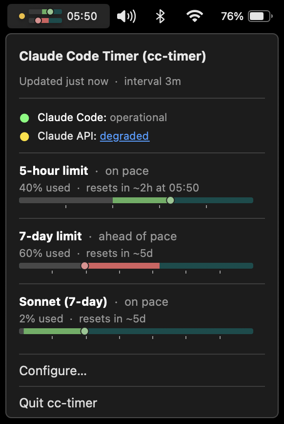

# cc-timer

Мінівіджет для **menu bar macOS**, що показує використання лімітів підписки Claude Code —
**5-годинного** та **7-денного** вікон — з *pacing* (випереджаєш чи відстаєш від норми витрат)
і часом до найближчого ресету. Згодом — віджети iPhone та комплікейшен Apple Watch.

> Документація проєкту — **українською** (рішення проєкту, див.
> [SPEC.md](SPEC.md#%D1%83%D1%85%D0%B2%D0%B0%D0%BB%D0%B5%D0%BD%D1%96-%D1%80%D1%96%D1%88%D0%B5%D0%BD%D0%BD%D1%8F)).

## Що це

Те саме, що показує statusline-плагін у терміналі, але **на один погляд** у menu bar:
дві горизонтальні смужки (5h / 7d) з кольоровим pacing і час до ресету.



Джерело даних — офіційний endpoint Anthropic `GET /api/oauth/usage`, авторизація — OAuth-токен
Claude Code з macOS Keychain. **Токен ніколи не покидає Mac.**

## Статус

🚧 Рання розробка. Фаза 1 — menu bar app для macOS.

## Збірка

**Передумова:** Swift 6.1+ і Command Line Tools. Повний Xcode **не потрібен** у Фазі 1.

```sh
swift build        # збірка
swift test         # unit-тести
swift run          # запуск агента (без вікна; зупинити — Ctrl-C)
```

Зібрати `.app` bundle:

```sh
./scripts/build-app.sh    # → ./build/cc-timer.app
open ./build/cc-timer.app # запуск (іконки в Dock немає — LSUIElement)
```

Скрипт збирає **universal binary** (arm64 + x86_64), тож `.app` запускається нативно і на Apple
Silicon, і на Intel-Mac (SwiftPM не має єдиного `--arch`, тож кожна арка збирається окремо за
`--triple` і зливається через `lipo`).

Застосунок запускається як **accessory-агент** без іконки в Dock (`LSUIElement = true`):
дві pacing-смужки в menu bar, клік відкриває popup із деталями, а внизу — `Configure…` (toggle
автозапуску, версія, GitHub-лінк) і `Quit cc-timer`.

**Підпис і нотаризація.** `build-app.sh` автоматично підписує bundle Developer ID identity (якщо є)
з `--options runtime` і, якщо налаштовано notarytool-профіль `cc-timer-notary`, нотаризує та
прикріплює (staple) квиток. Перевірити: `spctl -a -t exec ./build/cc-timer.app` → `accepted
(Notarized Developer ID)`. Без Developer ID identity збірка лишається непідписаною — Gatekeeper
може заблокувати при першому запуску (`права кнопка → Відкрити`, або
`xattr -dr com.apple.quarantine ./build/cc-timer.app`).

**Launch-at-login.** `SMAppService` реєструє автозапуск надійно лише для **підписаного** `.app`,
**запущеного з `/Applications`** (через Finder/Launchpad). На `swift run` чи прямому запуску
бінарника статус буде `.notFound` і toggle у `Configure…` — неактивний (з поясненням).

**Перегляд логів:**

```sh
log stream --predicate 'subsystem == "com.artem-n.cc-timer"' --info
```

або Console.app з фільтром `com.artem-n.cc-timer`.

## Документація

- [SPEC.md](SPEC.md) — продуктовий спек (проблема, архітектура, UI, фази, монетизація).
- [docs/architecture.md](docs/architecture.md) — архітектура та потік даних.
- [docs/conventions.md](docs/conventions.md) — конвенції розробки.
- [docs/adr/](docs/adr/) — записи архітектурних рішень.

## Ліцензія

**Поки що закрите.** Питання open-source (та можливої ліцензії) — відкрите, з'ясуємо пізніше.
Серед мотивів на користь відкриття коду — довіра до поводження з токеном.
