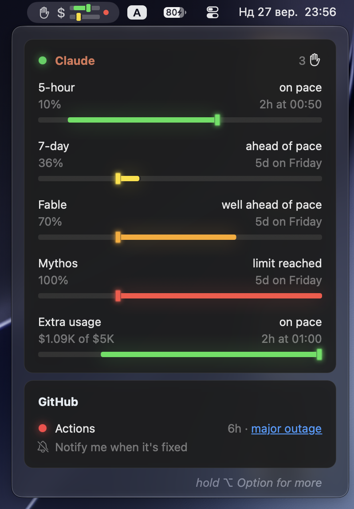
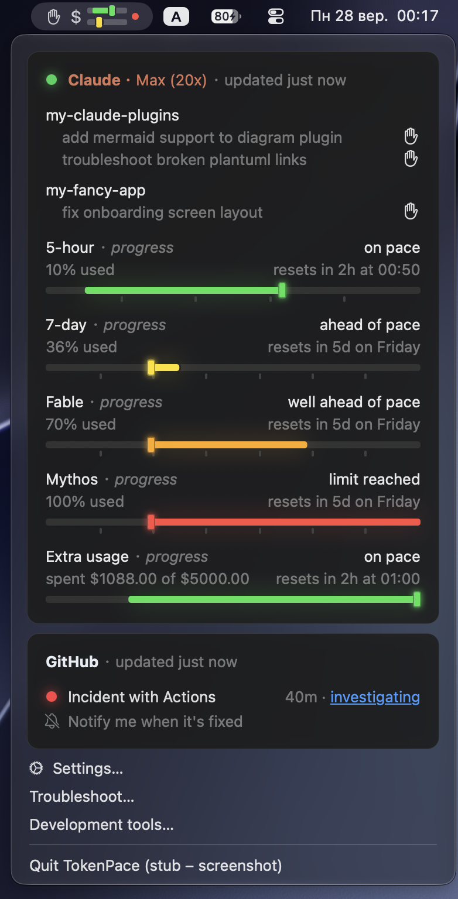
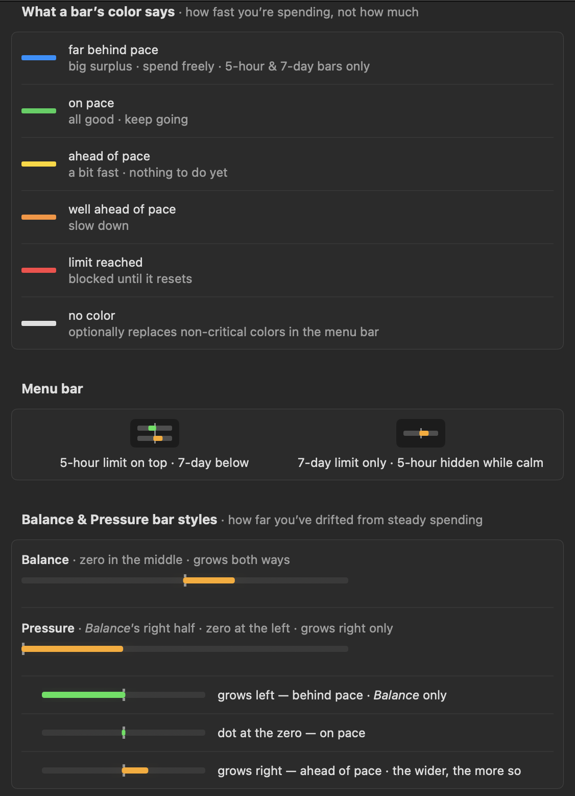
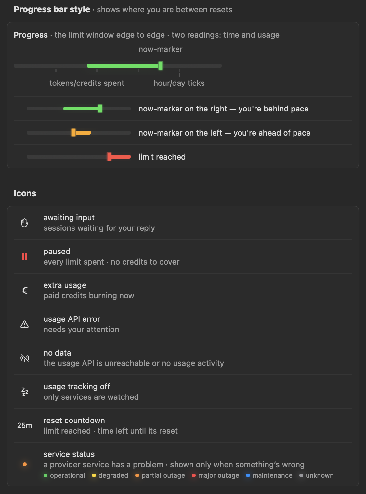

#  TokenPace

> 👀 *The most refined form of procrastination is watching your own limit.*

Your Claude Code subscription limits, concisely, in the macOS menu bar.

The pacing bars show whether you are **ahead of or behind** in the **5-hour** and **7-day** windows,
so you can plan around the next reset instead of hitting "limit exhausted" mid-task.

The aim is an interface that stays out of your way: the most signal in the fewest marks on screen,
and no clutter to read past. A mark earns its place only if you would act differently on seeing it.
What matters depends on how you work and on what your plan gives you, so the readout comes in
several styles — pick what fits in **Settings**.

Screenshots at rest, and with **⌥ Option** held:

 

TokenPace also counts the agentic coding sessions **waiting on you**, so a run that stopped for a
permission prompt or a question does not sit unnoticed.

It watches the **status of Claude's services** from status.claude.com too: a colored dot per
service in the popup, and in the menu bar only when something is wrong — so a slowdown is visibly
Anthropic's, not yours.

Data comes from Anthropic's official `GET /api/oauth/usage`, authorized with the Claude Code OAuth
token in the macOS Keychain. **The token never leaves the Mac.**

## UI Legend

Every mark the app draws, explained in the app itself — **Settings → Legend**. The same page, in full:

 

## Installation

1. Download `TokenPace-X.Y.Z.zip` from the [latest release](https://github.com/artem-from-ua/tokenpace/releases/latest)
   and unpack it (double-click).
2. Drag **TokenPace.app** into the **Applications** folder.
3. Launch it from **Launchpad** or Finder. There will be no Dock icon — the app lives in the menu bar.

## Documentation

- [docs/README.md](docs/README.md) — **the map of all documentation** (start here).
- [SPEC.md](SPEC.md) — the product spec (problem, architecture, UI, phases, monetization).
- [docs/architecture.md](docs/architecture.md) — architecture and data flow.
- [docs/building.md](docs/guides/building.md) — building from source (for contributors).
- [docs/conventions.md](docs/reference/conventions.md) — development conventions.
- [docs/adr/](docs/adr/) — architecture decision records.
