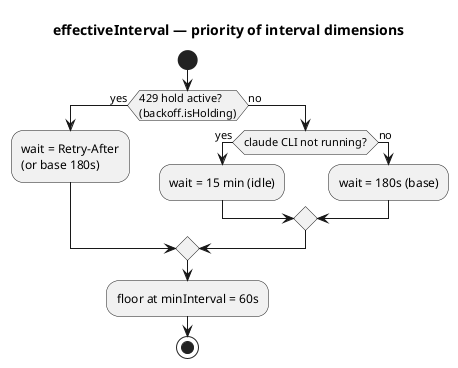
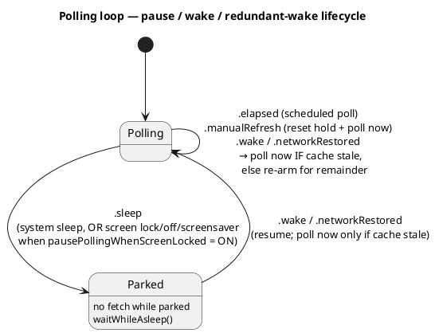

# ADR-0032: Simplified polling cadence — a 3-minute base, honor-only `Retry-After`, pause on lock

> **Partially superseded by [ADR-0123](0123-one-line-per-error-run-and-a-floor-on-signal-driven-polls.md).**
> Only §D4's carve-out is superseded — "there hasn't been a single success yet (cold start / failure
> — a wake is entitled to a fetch)". It had no bound, and a token error never advances `lastSuccess`,
> so on an unreadable Keychain every signal took it: a blinking display drove 16 polls a second for
> two hours. A wake is still entitled to a fetch, now floored at one per `minInterval` against
> `PollState.lastAttempt`. **The decision itself still stands in full**: the 3-minute base, the
> honor-only `Retry-After`, the `minInterval` floor, pausing on screen lock, and the conditional
> re-poll for a wake that arrives while the cache is fresh.

> **Postscript (2026-08-22).** §D3's decision stands unchanged — no Claude Code session still means
> a 15-minute interval. Only the *mechanism* named in it is superseded by
> [ADR-0118](0118-activity-from-session-journals.md): `claudeActive` no longer comes from probing
> the process table for a process named `claude` (the native installer made that match fail
> silently), but from recent writes to Claude Code's session journals. Everything else in this ADR
> is unaffected.

## Context

[ADR-0011](0011-polling-engine-adaptive-cadence-and-signal-seams.md) laid **three** frequency axes on
top of usage API polling: 429 backoff (`PollingBackoff`, escalation `3→6→12→15 min`), a 30-minute
idle override (no `claude` CLI running), and adaptive cadence (`AdaptiveCadence`, `3–15 min`
depending on whether the data is moving). The logic was correct, but "clever" and unpredictable: the
user couldn't tell in advance when the next poll would happen. The user asked for a simpler,
predictable model (#114):

- Base — a flat **3 min**, with no content-based adaptation.
- Idle override — **15 min** (instead of 30) when the `claude` CLI isn't running.
- 429 — wait exactly **`Retry-After`** (or 180 s if the header is absent), **with no escalation**;
  the first success resets to the base.
- An automatic poll the instant a limit resets.
- Pausing polling when the screen is locked / off / a screensaver is running — an **option, on by
  default**.

A key observation during implementation: "an immediate poll at the reset instant" was **already**
implemented in the shell — `AppDelegate.resetTimer`
([ADR-0030](0030-optimistic-reset-and-exact-timer.md)) fires exactly at `resets_at`, draws an
optimistic reset, and forces a `.manualRefresh`. So a separate reset rule in the core would have
duplicated the single source of truth.

## Decision

### D1. `AdaptiveCadence` removed; base is a flat 3 min

The `AdaptiveCadence` type and its footprint in `PollState`/`advance`/`effectiveInterval` are deleted.
`PollingEngine` gets a new constant `baseInterval = 180`. The `.contentChanged`/`.contentUnchanged`
log reasons disappear.

### D2. `PollingBackoff` → an honored hold instead of escalation

`PollingBackoff` now holds a single field, `heldInterval: TimeInterval?`, instead of `level: Int?`.
On 429 — `honoring(retryAfter:)`: `heldInterval = retryAfter ?? 180` (a non-positive or absent hint →
base 180). A repeated 429 simply re-sets the same value — **no** step-up. `reset()` (on 200) clears
the hold. `steps`, `escalated()`, `escalated(retryAfter:)` are removed. The type name is kept so as
not to disturb ADR-0008.

### D3. Idle override 30 → 15 min

`PollingEngine.inactiveInterval = 15 * 60`. Probing the `claude` process
(`ClaudeActivityProbe`, `sysctl(KERN_PROC_ALL)`) is unchanged — only the constant changed.

### D4. The reset trigger stays in the shell (not duplicated in the core)

The automatic poll at the reset instant is `resetTimer` + `fireOptimisticReset()` →
`forceRefresh()` ([ADR-0030](0030-optimistic-reset-and-exact-timer.md)), which already fires exactly
at `resets_at`. The core **deliberately** has no reset cap on the interval: that would duplicate the
`resets_at` the shell already tracks, and would produce two fetches for one reset instant. The single
source is the timer in the shell.

### D6. Suppressing redundant wakes — a pure `wakeRearmInterval` in the core

Previously, any `.wake`/`.networkRestored` triggered an immediate poll. Now (per user request) a poll
only happens if the cache is **stale** — the interval elapsed since the last success is ≥ the current
interval; otherwise the cycle waits out the remainder of the interval with no fetch. This applies to
**all** wake events (screen, system sleep/wake, network recovery), so that a flickering screen or a
flapping network doesn't hammer the API when the data on screen is still current.

The decision is a pure static function, `PollingEngine.wakeRearmInterval(lastSuccess:interval:now:)`:
returns `nil` (poll now) when the cache is stale **or** there hasn't been a single success yet (cold
start / failure — a wake is entitled to a fetch); otherwise — the remaining time (floored at
`minInterval`, so a burst of wakes can't compress the cadence below the floor). `.manualRefresh` (a
deliberate action) and `.sleep` are exceptions, behaving as before.

### D5. Pausing on lock — a new `ScreenLockObserver` in the shell, gated by config

`ScreenLockObserver` (mirroring `WorkspaceSleepWake`) listens for lock/unlock
(`com.apple.screenIsLocked`/`Unlocked`, `DistributedNotificationCenter`), screensaver
(`com.apple.screensaver.didstart`/`willstop`), and display sleep
(`NSWorkspace.screensDidSleep`/`Wake`), emitting the existing `.sleep`/`.wake` into the same park path
(`waitWhileAsleep` → resume with one immediate poll). **Zero changes in the core.**

- **Config-gated, default-on.** Each handler reads `PersistedConfig.pausePollingWhenScreenLocked` *at
  the moment of the event*, so the Settings toggle takes effect without a restart. OFF → no signal
  emitted.
- **System sleep/wake (`WorkspaceSleepWake`) is unconditional**, regardless of the option: a laptop
  that genuinely goes to sleep always parks.
- **A reset during the pause is ignored** (the pause takes priority): a parked cycle doesn't schedule
  an interval and doesn't fire the reset timer; fresh data is picked up by the immediate poll on
  unlock.

### The interval model (priority)

### The pause/sleep/wake cycle

## Consequences

- **A simpler, predictable cadence.** An active session → exactly 3 min; no session → 15 min; 429 →
  exactly `Retry-After`. No hidden transitions triggered by data movement. The core shrank by a whole
  type (`AdaptiveCadence`) and half of `PollingBackoff`.
- **We trust the server on 429.** `Retry-After` is honored verbatim; we no longer invent our own
  back-pressure curve. Risk: if the server returns too short a hint, the `minInterval = 60 s` floor
  still holds the lower bound.
- **The reset trigger isn't duplicated.** One path (the shell timer, ADR-0030) does both the
  optimistic reset and the forced poll — no two fetches for one reset instant.
- **API savings on a locked screen** (default-on). A locked/off screen means "the user isn't looking"
  → no usage-API quota is spent on updates nobody sees. The Settings toggle takes effect instantly
  (the pref is read live).
- The async loop, the seams, the `minInterval` floor, and "log only on change" from
  [ADR-0011](0011-polling-engine-adaptive-cadence-and-signal-seams.md) still stand — only the
  frequency rules were replaced.

## Related

- [ADR-0011](0011-polling-engine-adaptive-cadence-and-signal-seams.md) — superseded by this ADR (the
  frequency model).
- [ADR-0008](0008-usageclient-pure-backoff-and-transport-seam.md) — `PollingBackoff`, `UsageTransport`;
  the hold remains a pure value type.
- [ADR-0030](0030-optimistic-reset-and-exact-timer.md) — the reset timer in the shell, now the single
  source of the reset trigger.
