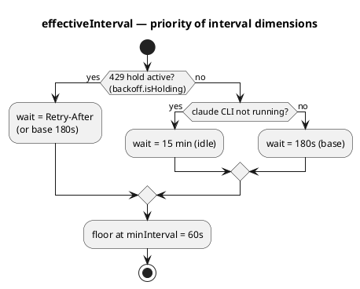
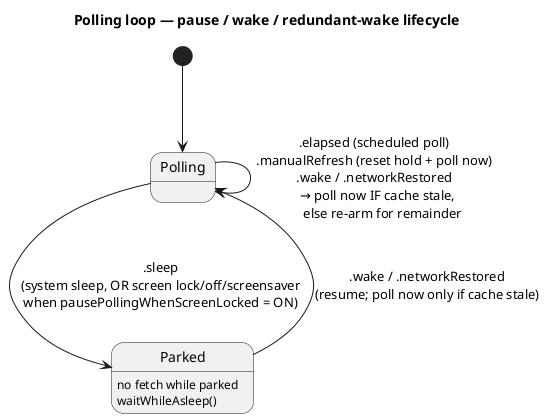

# ADR-0032: Спрощена каденція опитування — 3-хв база, honor-only `Retry-After`, пауза на екрані

## Контекст

[ADR-0011](0011-polling-engine-adaptive-cadence-and-signal-seams.md) наклав **три** осі частоти на
опитування usage API: 429-backoff (`PollingBackoff`, ескалація `3→6→12→15 хв`), 30-хв idle-оверрайд
(немає CLI `claude`), і адаптивну каденцію (`AdaptiveCadence`, `3–15 хв` за тим, чи рухаються дані).
Логіка коректна, але «хитра» й непередбачувана: користувач не може сказати наперед, коли буде
наступний полл. Користувач попросив простішу, передбачувану модель (#114):

- База — пласкі **3 хв**, без адаптації за вмістом.
- Idle-оверрайд — **15 хв** (замість 30), коли `claude` CLI не запущений.
- 429 — чекати рівно **`Retry-After`** (або 180 с, якщо заголовка нема), **без ескалації**; перший
  успіх скидає до бази.
- Автоматичний полл у мить ресету ліміту.
- Пауза опитування, коли екран заблоковано / вимкнено / працює screensaver — **опція, за замовчуванням
  увімкнена**.

Ключове спостереження при реалізації: «негайний полл у мить ресету» **вже** реалізовано в shell —
`AppDelegate.resetTimer` ([ADR-0030](0030-optimistic-reset-and-exact-timer.md)) стріляє точно на
`resets_at`, малює оптимістичний ресет і форсує `.manualRefresh`. Тож окреме reset-правило в ядрі було б
дублюванням єдиного джерела істини.

## Рішення

### D1. `AdaptiveCadence` прибрано; база — пласкі 3 хв

Тип `AdaptiveCadence` і його вимір у `PollState`/`advance`/`effectiveInterval` видалено. `PollingEngine`
має нову константу `baseInterval = 180`. Зникають причини логу `.contentChanged`/`.contentUnchanged`.

### D2. `PollingBackoff` → honored-hold замість ескалації

`PollingBackoff` тримає одне поле `heldInterval: TimeInterval?` замість `level: Int?`. На 429 —
`honoring(retryAfter:)`: `heldInterval = retryAfter ?? 180` (не-додатний або відсутній hint → база 180).
Повторний 429 просто перевстановлює те саме значення — **без** step-up. `reset()` (на 200) чистить hold.
Прибрано `steps`, `escalated()`, `escalated(retryAfter:)`. Назву типу лишено, щоб не зачіпати ADR-0008.

### D3. Idle-оверрайд 30 → 15 хв

`PollingEngine.inactiveInterval = 15 * 60`. Пробу процесу `claude` (`ClaudeActivityProbe`,
`sysctl(KERN_PROC_ALL)`) лишено незмінною — змінено лише константу.

### D4. Reset-тригер лишається в shell (не дублюємо в ядрі)

Автоматичний полл у мить ресету — це `resetTimer` + `fireOptimisticReset()` → `forceRefresh()`
([ADR-0030](0030-optimistic-reset-and-exact-timer.md)), який уже стріляє точно на `resets_at`. У ядрі
**свідомо** немає reset-cap на інтервал: це дублювало б `resets_at`, який shell уже тримає, і давало б
два fetch-и на одну мить ресету. Єдине джерело — таймер у shell.

### D6. Придушення надлишкового wake — чиста `wakeRearmInterval` у ядрі

Раніше будь-який `.wake`/`.networkRestored` робив негайний полл. Тепер (вимога користувача) полл
відбувається лише якщо кеш **застарів** — з останнього успіху минуло ≥ поточний інтервал; інакше цикл
довичікує залишок інтервалу без fetch-у. Це стосується **всіх** wake-подій (екран, системний sleep/wake,
відновлення мережі), щоб блимання екрана чи флапаюча мережа не били API, коли дані на екрані ще актуальні.

Рішення — чиста статична `PollingEngine.wakeRearmInterval(lastSuccess:interval:now:)`: повертає `nil`
(поллити зараз) коли кеш застарів **або** ще не було жодного успіху (cold start / фейл — wake має право
на fetch); інакше — залишок часу (floored at `minInterval`, тож потік wake-ів не стисне каденцію нижче
рубежа). `.manualRefresh` (свідома дія) і `.sleep` — виняток, поводяться як раніше.

### D5. Пауза на екрані — новий `ScreenLockObserver` у shell, gated by config

`ScreenLockObserver` (дзеркалить `WorkspaceSleepWake`) слухає lock/unlock
(`com.apple.screenIsLocked`/`Unlocked`, `DistributedNotificationCenter`), screensaver
(`com.apple.screensaver.didstart`/`willstop`) і display-sleep
(`NSWorkspace.screensDidSleep`/`Wake`), емітячи наявні `.sleep`/`.wake` у той самий park-шлях
(`waitWhileAsleep` → resume одним негайним поллом). **Нуль змін у ядрі.**

- **Config-gated, default-on.** Кожен handler читає `PersistedConfig.pausePollingWhenScreenLocked`
  *у мить події*, тож перемикач у Settings діє без рестарту. OFF → сигнал не емітиться.
- **Системний sleep/wake (`WorkspaceSleepWake`) — безумовний**, незалежно від опції: ноутбук, що
  реально засинає, завжди паркується.
- **Ресет під час паузи ігнорується** (пауза важливіша): парканий цикл не планує інтервал і не стріляє
  reset-таймером; свіжі дані підтягне негайний полл при розблокуванні.

### Модель інтервалу (пріоритет)

### Цикл пауза/сон/wake

## Наслідки

- **Простіша, передбачувана каденція.** Активна сесія → рівно 3 хв; немає сесії → 15 хв; 429 → рівно
  `Retry-After`. Жодних прихованих переходів за рухом даних. Ядро зменшилось на цілий тип
  (`AdaptiveCadence`) і половину `PollingBackoff`.
- **Довіряємо серверу на 429.** `Retry-After` honor'иться дослівно; ми більше не вигадуємо власну
  криву back-pressure. Ризик: якщо сервер повертає надто короткий hint, `minInterval = 60 с` floor усе
  одно тримає нижню межу.
- **Reset-тригер не дублюється.** Один шлях (shell-таймер, ADR-0030) робить і оптимістичний ресет, і
  форсований полл — жодних двох fetch-ів на мить ресету.
- **Економія API на неактивному екрані** (default-on). Заблокований/вимкнений екран = «користувач не
  дивиться» → не витрачаємо квоту usage-API на оновлення, яких ніхто не бачить. Перемикач у Settings
  діє миттєво (pref читається живо).
- Async-цикл, seam'и, `minInterval` floor, «лог лише при зміні» з [ADR-0011](0011-polling-engine-adaptive-cadence-and-signal-seams.md)
  лишаються чинними — заміщено саме правила частоти.

## Пов'язані

- [ADR-0011](0011-polling-engine-adaptive-cadence-and-signal-seams.md) — заміщений цим ADR (модель частоти).
- [ADR-0008](0008-usageclient-pure-backoff-and-transport-seam.md) — `PollingBackoff`, `UsageTransport`; hold лишається чистим value-типом.
- [ADR-0030](0030-optimistic-reset-and-exact-timer.md) — reset-таймер у shell, який тепер є єдиним джерелом reset-тригера.
