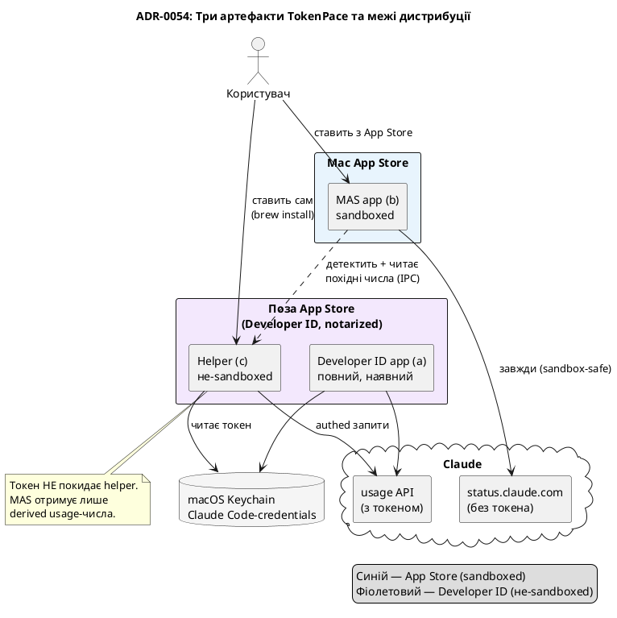

# ADR-0054 (draft): Дистрибуція в Mac App Store через present-if-installed helper

> **Чернетка (draft).** Рішення ще не прийняте — воно за гейтом спайку #E0 (перевірка IPC-каналу)
> і продуктового gut-check (чи standalone-частина самоцінна). Драфт фіксує напрям, не остаточне
> рішення. Стане `accepted` лише після гейту.

## Контекст

Мета — **повноцінний TokenPace у Mac App Store** (MAS). TestFlight і MAS вимагають **App Sandbox**,
з яким поточний застосунок архітектурно несумісний: він читає **чужий** Keychain-айтем
`Claude Code-credentials` (створений Claude Code CLI), спавнить сторонні бінарники
(`security`, `claude`, `zsh`, `gh`, `ditto`, `codesign`, `spctl`), сканує процес-таблицю
(`sysctl(KERN_PROC_ALL)`), читає `~/.claude`/`~/.zshrc`, само-замінює `.app`. Усе це sandbox
забороняє.

Дослідження (Apple DTS / Quinn, живі App Store Review Guidelines) показало:

- **Прямий гібрид «порожня MAS-оболонка + helper» нежиттєздатний**: сильний IPC (XPC/mach) до
  не-вкладеного helper'а потребує `temporary-exception.mach-lookup.global-name`, який App Review
  фактично не пропускає; loopback (`127.0.0.1`) під sandbox дає `EPERM`.
- **Життєздатна модель — «self-sufficient app + present-if-installed helper»**, і вона має **живі
  прецеденти, що пройшли ревʼю**: **iStat Menus** (MAS-застосунок + окремо завантажуваний helper) і
  **Spark** (MAS + окремий CLI у `/usr/local/bin`).

Guideline-опори: **2.1 (completeness)** — застосунок має бути корисним сам по собі; **2.4.5(iv)** —
застосунок не має завантажувати/встановлювати сторонній код (лише детектити наявний).

## Рішення

Розділити TokenPace на **три артефакти**:

- **(a) Developer ID full app** — наявний застосунок, лишається без змін (не MAS).
- **(b) MAS sandboxed app** — App Store; **повноцінний сам по собі** (статус сервісів інференсу
  через `StatusClient` — публічний `status.claude.com`, без токена, sandbox-safe; таймери
  ресет-вікон). Задовольняє 2.1.
- **(c) Helper** — окремий opensource продукт (Developer ID, notarized), який ставить **сам
  користувач** (Homebrew/GitHub). Робить усе, що заборонено пісочниці. MAS-застосунок його лише
  **детектить**, ніколи не завантажує/встановлює (2.4.5(iv)).

Коли helper присутній, **той самий** UI (b) підвищується до повного досвіду з персональним pacing.
**Токен ніколи не покидає helper** — назовні йдуть лише похідні usage-числа (приватність краща за
поточну).

## Наслідки

- **MAS-застосунок корисний без helper'а** — рецензент бачить робочий продукт (задовольняє 2.1).
- **«Detect, never install»** — застосунок лише показує інструкцію (`brew install …`) і детектить
  результат; ніколи не запускає інсталяцію (2.4.5(iv)). Деталі UX — [ADR-0058](0058-helper-distribution-homebrew.md).
- **(a) і (c) — той самий engine-код** ((c) = (a) без UI). Конвергенцію (a) на «UI shell + bundled
  helper» свідомо винесено в окремий пізніший epic.
- **Ризик ревʼю лишається** — present-if-installed має прецеденти, але не гарантію; два ймовірні
  вектори reject: (i) застосунок сприймається як «демо» без helper'а; (ii) копірайт читається як
  «завантаж це, щоб працювало». Обидва — продуктові/політ., не інженерні.
- **Найбільше відкрите питання** — чи standalone-частина (status + таймери) достатньо цінна, щоб
  пройти ревʼю і бути вартою встановлення. Продуктовий gut-check передує MAS-build.
- Розширює [ADR-0004](0004-build-system.md) (система збірки), референс
  [ADR-0003](0003-agent-closed-source-for-now.md) (закритість агента).
- Пов'язані драфти: [ADR-0055](0055-ipc-file-darwin-bookmark.md) (IPC-канал),
  [ADR-0056](0056-thin-helper-thick-app-build-flavors.md) (розкол таргетів),
  [ADR-0057](0057-token-provider-io-into-helper.md) (перенос `TokenProvider`),
  [ADR-0058](0058-helper-distribution-homebrew.md) (дистрибуція helper'а).
