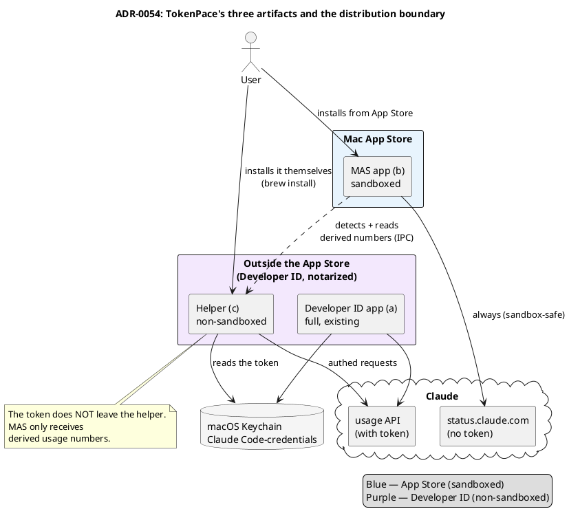

# ADR-0054 (draft): Mac App Store distribution via a present-if-installed helper

> **Draft.** The decision has not been made yet — it's gated on the #E0 spike (verifying the IPC
> channel) and a product gut-check (whether the standalone part is worth anything on its own). The
> draft records a direction, not a final decision. It becomes `accepted` only after the gate.

## Context

The goal is a **full TokenPace in the Mac App Store** (MAS). TestFlight and MAS require **App
Sandbox**, which the current app is architecturally incompatible with: it reads **someone else's**
Keychain item `Claude Code-credentials` (created by the Claude Code CLI), spawns third-party
binaries (`security`, `claude`, `zsh`, `gh`, `ditto`, `codesign`, `spctl`), scans the process table
(`sysctl(KERN_PROC_ALL)`), reads `~/.claude`/`~/.zshrc`, and self-replaces the `.app`. The sandbox
forbids all of this.

Research (Apple DTS / Quinn, live App Store Review Guidelines) showed:

- **A direct hybrid of "empty MAS shell + helper" is not viable**: strong IPC (XPC/mach) to a
  non-embedded helper requires `temporary-exception.mach-lookup.global-name`, which App Review
  effectively rejects; loopback (`127.0.0.1`) under sandbox returns `EPERM`.
- **The viable model is "self-sufficient app + present-if-installed helper"**, and it has **live
  precedents that passed review**: **iStat Menus** (a MAS app + a separately downloadable helper)
  and **Spark** (MAS + a separate CLI in `/usr/local/bin`).

Guideline anchors: **2.1 (completeness)** — the app must be useful on its own; **2.4.5(iv)** — the
app must not download/install third-party code (only detect what's already present).

## Decision

Split TokenPace into **three artifacts**:

- **(a) Developer ID full app** — the existing app, unchanged (not MAS).
- **(b) MAS sandboxed app** — App Store; **fully useful on its own** (inference-service status via
  `StatusClient` — the public `status.claude.com`, no token, sandbox-safe; reset-window timers).
  Satisfies 2.1.
- **(c) Helper** — a separate open-source product (Developer ID, notarized), which **the user**
  installs themselves (Homebrew/GitHub). Does everything the sandbox forbids. The MAS app only
  **detects** it, never downloads/installs it (2.4.5(iv)).

When the helper is present, the **same** UI (b) upgrades to the full experience with personal
pacing. **The token never leaves the helper** — only derived usage numbers go outward (better
privacy than the current setup).

## Consequences

- **The MAS app is useful without the helper** — a reviewer sees a working product (satisfies
  2.1).
- **"Detect, never install"** — the app only shows an instruction (`brew install …`) and detects
  the result; it never runs the installation itself (2.4.5(iv)). UX details in
  [ADR-0058](0058-helper-distribution-homebrew.md).
- **(a) and (c) are the same engine code** ((c) = (a) without the UI). Converging (a) into "UI
  shell + bundled helper" is deliberately deferred to a separate later epic.
- **Review risk remains** — present-if-installed has precedents, but no guarantee; two likely
  rejection vectors: (i) the app is perceived as a "demo" without the helper; (ii) the copy reads
  as "download this to make it work". Both are product/policy, not engineering, concerns.
- **The biggest open question** — whether the standalone part (status + timers) is valuable enough
  to pass review and be worth installing. A product gut-check precedes the MAS build.
- Extends [ADR-0004](0004-build-system.md) (the build system), references
  [ADR-0003](0003-agent-closed-source-for-now.md) (the agent staying closed-source).
- Related drafts: [ADR-0055](0055-ipc-file-darwin-bookmark.md) (the IPC channel),
  [ADR-0056](0056-thin-helper-thick-app-build-flavors.md) (the target split),
  [ADR-0057](0057-token-provider-io-into-helper.md) (moving `TokenProvider`),
  [ADR-0058](0058-helper-distribution-homebrew.md) (helper distribution).
