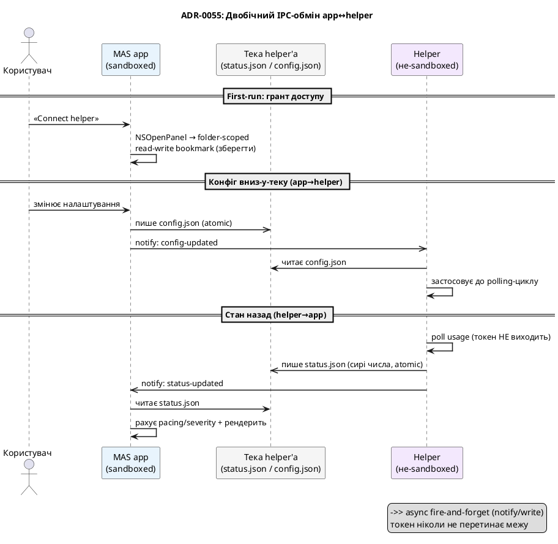
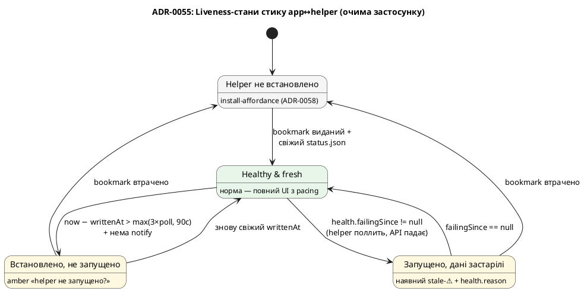

# ADR-0055 (draft): IPC-канал app↔helper — файл + read-write bookmark + Darwin notification

> **Чернетка (draft).** За гейтом спайку #E0, який має наскрізно довести цей канал (насамперед —
> що read-write security-scoped bookmark переживає атомарний `rename()`, і що Darwin-нотифікації
> будять sandboxed-застосунок під App Nap). Драфт — центральне рішення розколу.

## Контекст

MAS-застосунок ([ADR-0054](0054-mas-present-if-installed-helper.md)) sandboxed; helper — ні. Їм
треба обмінюватися: helper віддає похідні usage-числа **вниз**, а застосунок (за вимогою «вся
конфігурація helper'а — з UI») пише конфіг і команди **вгору**. Отже канал **двобічний**.

Обмеження (перевірено проти Apple-доків + DTS):

- **XPC/mach до не-вкладеного helper'а** потребує `temporary-exception.mach-lookup.global-name` —
  App Review до нього ворожий. **Відкинуто.**
- **loopback `127.0.0.1`** під sandbox дає `EPERM`. **Відкинуто.**
- **App Group container** неможливий — сторони мають різні Team ID / provisioning (helper —
  Developer ID, застосунок — MAS). **Відкинуто.**
- Єдиний sandbox-легальний шлях застосунку читати/писати поза контейнером — **user-granted
  security-scoped bookmark** через `NSOpenPanel`.

Модель — **не** синхронний RPC. Це асинхронна файлова «поштова скринька» в обидва боки, і цього
**достатньо**, бо поточний код і так асинхронний push: UI не чекає на engine, а шле `.manualRefresh`
і окремо отримує результат через `apply(_:)`.

## Рішення

Дві JSON-скриньки в одній теці, якою володіє helper (не-sandboxed), а застосунок читає/пише через
**один folder-scoped read-write security-scoped bookmark**:

- `~/Library/Application Support/com.artem-n.tokenpace-helper/status.json` — **helper→app** (сирі
  usage-числа + health + версійність + liveness). **Токен, refresh-secret, вміст `~/.claude` —
  ніколи не серіалізуються.**
- `.../config.json` — **app→helper** (вузький конфіг: 5 полів + опційна разова команда).

Атомарність — `*.tmp` → `rename()`. Свіжість сигналиться **payload-free Darwin notification**
(`notify.h`): `com.artem-n.tokenpace.status-updated` (helper→app),
`com.artem-n.tokenpace.config-updated` (app→helper). Кожна сторона — `notify_register_dispatch` +
slow-timer fallback 30 с (Darwin coalesce'иться, не черга).

Версійність — двобічна: `schemaVersion` у `status.json`, `configSchemaVersion` у `config.json`;
єдине джерело — `IPCSchema.swift` у `TokenPaceKit`, проти якого компілюються **обидва** бінарники.
Команди — не RPC: застосунок пише `command.id`, helper виконує й відображає результат у наступному
`status.json` + квитує `ackedCommandId`.

Liveness — застосунок не бачить процес helper'а через sandbox, тож свіжість файлу (`writtenAt` +
mtime) + наявність Darwin-нотифікацій = єдиний liveness-проксі:

## Наслідки

- **Токен не перетинає межу** — інваріант; назовні лише derived-числа. Приватність краща за поточну.
- **read-write bookmark** (не read-only) — застосунок пише конфіг у теку helper'а. Трейдоф: ширший
  дозвіл + **вищий ризик ревʼю**, ніж read-only Spark/iStat (треба чітко пояснити в submission: це
  конфіг користувача, не віддалене керування кодом).
- **folder-scoped** (не file-scoped) — щоб атомарний `rename()` не інвалідував bookmark. **Це саме
  те, що доводить спайк #E0.**
- **Асинхронність — не регрес**: семантика «команда → застосунок побачить новий стан» ідентична
  поточному async-push; різниця лише лаг (секунда-дві на watch/poll).
- Референси: [ADR-0019](0019-token-read-via-security-cli.md) (чому читання токена лишається на
  `security` CLI, отже helper-side), [ADR-0017](0017-delegated-token-refresh.md) (делегований
  refresh — helper-side). Пов'язано: [ADR-0056](0056-thin-helper-thick-app-build-flavors.md),
  [ADR-0057](0057-token-provider-io-into-helper.md).
