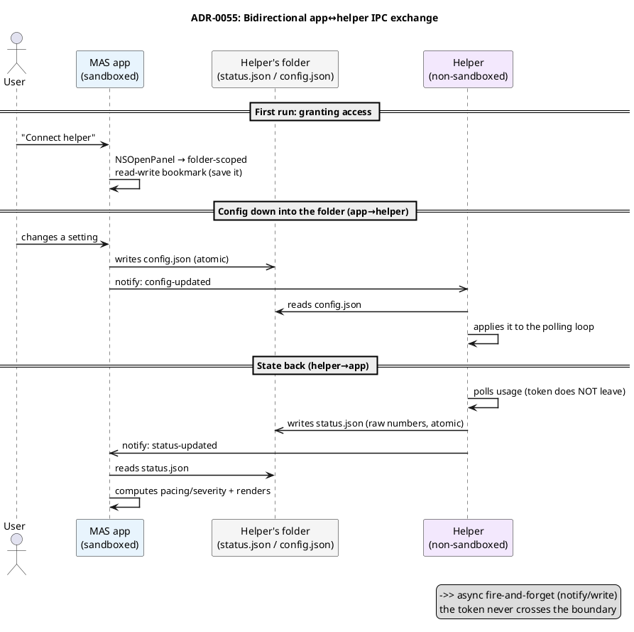
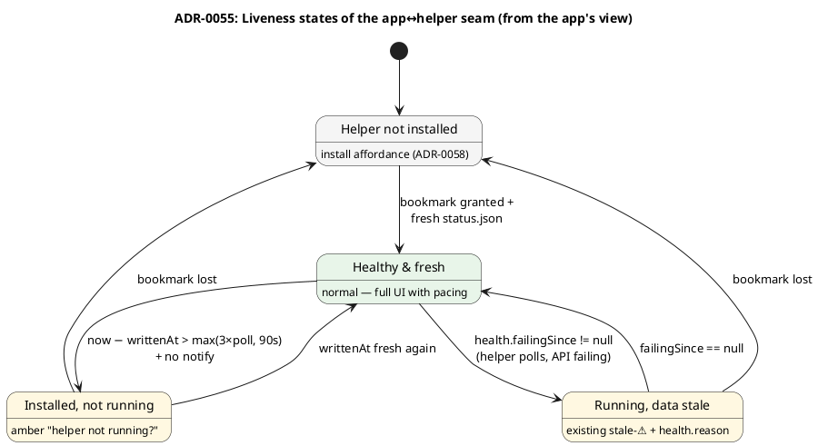

# ADR-0055 (draft): The app↔helper IPC channel — file + read-write bookmark + Darwin notification

> **Draft.** Gated on the #E0 spike, which must prove this channel end to end (chiefly — that a
> read-write security-scoped bookmark survives an atomic `rename()`, and that Darwin notifications
> wake a sandboxed app under App Nap). The draft is the central decision of the split.

## Context

The MAS app ([ADR-0054](0054-mas-present-if-installed-helper.md)) is sandboxed; the helper is not.
They need to exchange data: the helper hands derived usage numbers **down**, and the app (per the
requirement that "all helper configuration comes from the UI") writes config and commands **up**.
So the channel is **bidirectional**.

Constraints (verified against Apple docs + DTS):

- **XPC/mach to a non-embedded helper** requires `temporary-exception.mach-lookup.global-name` —
  App Review is hostile to it. **Rejected.**
- **Loopback `127.0.0.1`** under sandbox returns `EPERM`. **Rejected.**
- **An App Group container** is impossible — the two sides have different Team IDs / provisioning
  (the helper is Developer ID, the app is MAS). **Rejected.**
- The only sandbox-legal way for the app to read/write outside its container is a **user-granted
  security-scoped bookmark** via `NSOpenPanel`.

The model is **not** synchronous RPC. It's an asynchronous file "mailbox" in both directions, and
that is **sufficient**, because the existing code is already an async push: the UI doesn't wait on
the engine, it sends `.manualRefresh` and separately receives the result through `apply(_:)`.

## Decision

Two JSON mailboxes in one folder owned by the helper (non-sandboxed), which the app reads/writes
through **one folder-scoped read-write security-scoped bookmark**:

- `~/Library/Application Support/com.artem-n.tokenpace-helper/status.json` — **helper→app** (raw
  usage numbers + health + version info + liveness). **The token, the refresh secret, and the
  contents of `~/.claude` are never serialized.**
- `.../config.json` — **app→helper** (a narrow config: 5 fields + an optional one-shot command).

Atomicity — `*.tmp` → `rename()`. Freshness is signaled via a **payload-free Darwin notification**
(`notify.h`): `com.artem-n.tokenpace.status-updated` (helper→app),
`com.artem-n.tokenpace.config-updated` (app→helper). Each side uses
`notify_register_dispatch` + a slow-timer fallback of 30 s (Darwin coalesces, it's not a queue).

Versioning is bidirectional: `schemaVersion` in `status.json`, `configSchemaVersion` in
`config.json`; a single source of truth — `IPCSchema.swift` in `TokenPaceKit`, which **both**
binaries compile against. Commands are not RPC: the app writes `command.id`, the helper executes
it and reflects the result in the next `status.json` + acknowledges via `ackedCommandId`.

Liveness — the app can't see the helper's process through the sandbox, so file freshness
(`writtenAt` + mtime) plus the presence of Darwin notifications is the only liveness proxy:

## Consequences

- **The token never crosses the boundary** — an invariant; only derived numbers go out. Better
  privacy than the current setup.
- **A read-write bookmark** (not read-only) — the app writes config into the helper's folder.
  Trade-off: a broader permission + **higher review risk** than read-only Spark/iStat (needs to be
  explained clearly in the submission: this is user config, not remote code control).
- **Folder-scoped** (not file-scoped) — so that an atomic `rename()` doesn't invalidate the
  bookmark. **This is exactly what the #E0 spike proves.**
- **Asynchrony is not a regression**: the semantics of "command → the app will see the new state"
  is identical to the current async push; the only difference is a lag (a second or two on
  watch/poll).
- References: [ADR-0019](0019-token-read-via-security-cli.md) (why reading the token stays on the
  `security` CLI, hence helper-side), [ADR-0017](0017-delegated-token-refresh.md) (delegated
  refresh — helper-side). Related: [ADR-0056](0056-thin-helper-thick-app-build-flavors.md),
  [ADR-0057](0057-token-provider-io-into-helper.md).
