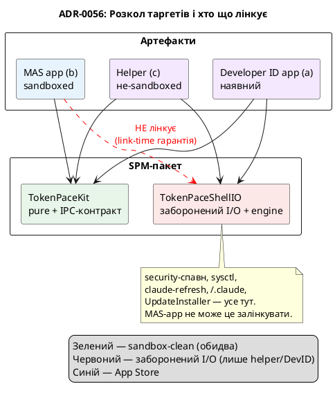

# ADR-0056 (draft): Thin helper / thick app — розкол таргетів і build-флейвори

> **Чернетка (draft).** За гейтом #E0. Фіксує філософію розколу та компіляторну межу sandbox-безпеки.

## Контекст

Директива: **максимум логіки — у застосунку; helper — лише «інтерфейс доступу» + базовий лайфсайкл**
(ретраї опитування, backoff тощо). Helper робить **тільки** те, що фізично заборонено пісочниці, +
мінімальний лайфсайкл цього I/O. Уся *розумна* логіка (pacing, severity, blocked, детекція, рендер)
— у застосунку.

Перевірка кодом підтвердила, що це **майже наявний дизайн**: `PollOutput` уже несе сирий
`UsageSnapshot` (не обчислений pacing); декодування живе в `UsageClient`; pacing/severity/blocked —
у render-шляху застосунку. Тобто застосунок уже отримує сирі числа й рахує «мозок» сам.

Фізично прибите до helper'а (= «базовий лайфсайкл»): **429-backoff** (`Retry-After` у HTTP-хедері,
якого застосунок ніколи не бачить), **адаптивний темп через `sysctl`** (Claude-неактивний
override), **wake-rearm** (рішення поллити на sleep/wake). SPEC-івський content-diff темп ніколи не
був реалізований ([ADR-0032](0032-simplified-polling-cadence.md)), тож темп уже незалежний від
продуктової логіки.

Окремо: MAS забороняє власний auto-updater (2.4.5-vii — оновлення лише через App Store), тож
sandboxed-застосунок мусить **не лінкувати** `UpdateInstaller` взагалі.

## Рішення

Межу sandbox-безпеки зробити **властивістю лінкування**, яку гарантує компілятор, а не дисципліною з
розсипаних `#if`. Винести всю заборонену роботу в окремий таргет, який MAS-app **просто не
залінковує**:

- **`TokenPaceKit`** (наявний) — pure моделі, pacing, clock, layout, `StatusClient`, cadences +
  **нові `HelperPayload`/`IPCSchema`** (IPC-контракт). Лінкують **обидва** — MAS-app і helper.
- **`TokenPaceShellIO`** (новий) — заборонені shell-операції: спавн `security` (I/O-половина
  `TokenProvider`, [ADR-0057](0057-token-provider-io-into-helper.md)), `ClaudeCLIRefresher`,
  `ProcessClaudeActivityProbe`, `ShellEnvironment`, `LogArchiver`, `UpdateInstaller`,
  `GHReleaseFetcher` + `PollingEngine`/`UsageClient`. Лінкують **лише helper і DevID-app**, **НЕ**
  MAS.

Три build-флейвори з одного SPM-пакета, гейтовані `MAS_BUILD`:

`TokenProvider` **не переїжджає цілком**: pure-половина (`decode`, `parseSecretOutput`,
`mapExitStatus`, `OAuthCredentials`) лишається в киті; у `TokenPaceShellIO` їде лише спавн `security`
([ADR-0057](0057-token-provider-io-into-helper.md)). Так само `PollingShell`: pure engine у киті,
`ProcessClaudeActivityProbe` — у ShellIO.

## Наслідки

- **«MAS-app навіть не може залінкувати `security`-спавн» — link-time факт** (не дисципліна). Асерт:
  кит компілюється в sandboxed MAS-app з нуль `Process`/`sysctl`/foreign-Keychain — сильний
  аргумент на ревʼю.
- **Idle-grace / session-idle suppression** (`advance`/`applyIdleGrace`) — єдина продуктова логіка,
  що зараз у циклі poll'а (читає попередній snapshot + `sysctl`, несе крос-poll стан). **Відкрите
  питання (#E3/#E4):** лишити helper-side (helper віддає вже-скоригований `sessionIdle`) чи
  перенести в застосунок (проброс `claudeActive` + стану). Вирішується під час реалізації.
- **Розширює [ADR-0004](0004-build-system.md)** — Xcode-обгортка над SPM для MAS-пакування приходить
  тепер (0004 передбачив Xcode у Фазі 2 для iOS/watchOS; це — MAS-варіант тієї ж ідеї).
- Auto-updater ([ADR-0033](0033-automatic-update-install.md)) — лише в helper/DevID, скомпільований
  геть з MAS. Log archiver ([ADR-0031](0031-session-log-archiver.md)) — helper-side.
- **(a) і (c) лінкують той самий `TokenPaceShellIO`** — нуль дублювання engine-логіки, але окреме
  пакування/реліз → подвійні release-ops до конвергенції.
