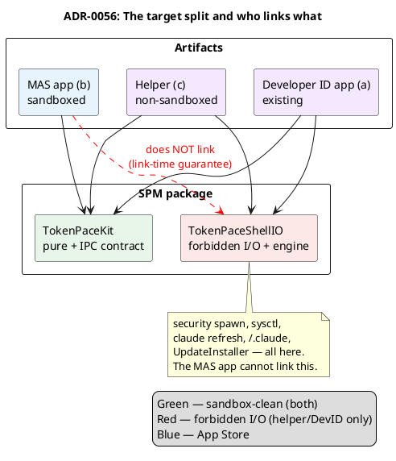

# ADR-0056 (draft): Thin helper / thick app — the target split and build flavors

> **Draft.** Gated on #E0. Records the split's philosophy and the compiler-enforced sandbox-safety
> boundary.

## Context

Directive: **maximum logic in the app; the helper is only an "access interface"** + basic
lifecycle (poll retries, backoff, and so on). The helper does **only** what the sandbox physically
forbids, plus the minimal lifecycle for that I/O. All *intelligent* logic (pacing, severity,
blocked, detection, rendering) stays in the app.

A code check confirmed this is **almost the existing design**: `PollOutput` already carries a raw
`UsageSnapshot` (not a computed pacing); decoding lives in `UsageClient`; pacing/severity/blocked
live in the app's render path. That is, the app already receives raw numbers and does the "brain"
work itself.

Physically nailed to the helper (= "basic lifecycle"): **429 backoff** (`Retry-After` in the HTTP
header, which the app never sees), **adaptive cadence via `sysctl`** (the Claude-inactive
override), **wake-rearm** (the decision to poll on sleep/wake). The SPEC's content-diff cadence was
never implemented ([ADR-0032](0032-simplified-polling-cadence.md)), so cadence is already
independent of product logic.

Separately: MAS forbids a self-hosted auto-updater (2.4.5-vii — updates only through the App
Store), so the sandboxed app must **not link** `UpdateInstaller` at all.

## Decision

Make the sandbox-safety boundary a **property of linking**, guaranteed by the compiler, rather than
a discipline of scattered `#if`s. Factor all forbidden work into a separate target that the MAS app
**simply does not link**:

- **`TokenPaceKit`** (existing) — pure models, pacing, clock, layout, `StatusClient`, cadences +
  **new `HelperPayload`/`IPCSchema`** (the IPC contract). Linked by **both** the MAS app and the
  helper.
- **`TokenPaceShellIO`** (new) — the forbidden shell operations: spawning `security` (the I/O half
  of `TokenProvider`, [ADR-0057](0057-token-provider-io-into-helper.md)), `ClaudeCLIRefresher`,
  `ProcessClaudeActivityProbe`, `ShellEnvironment`, `LogArchiver`, `UpdateInstaller`,
  `GHReleaseFetcher` + `PollingEngine`/`UsageClient`. Linked **only by the helper and the DevID
  app**, **NOT** MAS.

Three build flavors from one SPM package, gated by `MAS_BUILD`:

`TokenProvider` **doesn't move over entirely**: the pure half (`decode`, `parseSecretOutput`,
`mapExitStatus`, `OAuthCredentials`) stays in the kit; only the `security` spawn goes into
`TokenPaceShellIO` ([ADR-0057](0057-token-provider-io-into-helper.md)). Likewise `PollingShell`:
the pure engine stays in the kit, `ProcessClaudeActivityProbe` goes into ShellIO.

## Consequences

- **"The MAS app can't even link the `security` spawn" is a link-time fact** (not a discipline).
  Assertion: the kit compiles into the sandboxed MAS app with zero `Process`/`sysctl`/foreign-
  Keychain — a strong argument for review.
- **Idle-grace / session-idle suppression** (`advance`/`applyIdleGrace`) — the one piece of product
  logic currently living in the poll loop (it reads the previous snapshot + `sysctl`, carries
  cross-poll state). **Open question (#E3/#E4):** keep it helper-side (the helper hands off an
  already-adjusted `sessionIdle`) or move it into the app (threading `claudeActive` + state).
  Decided during implementation.
- **Extends [ADR-0004](0004-build-system.md)** — an Xcode wrapper over SPM for MAS packaging
  arrives now (0004 anticipated Xcode in Phase 2 for iOS/watchOS; this is the MAS variant of the
  same idea).
- Auto-updater ([ADR-0033](0033-automatic-update-install.md)) — helper/DevID only, compiled
  entirely out of MAS. Log archiver ([ADR-0031](0031-session-log-archiver.md)) — helper-side.
- **(a) and (c) link the same `TokenPaceShellIO`** — zero duplication of engine logic, but separate
  packaging/release → double release ops until convergence.
