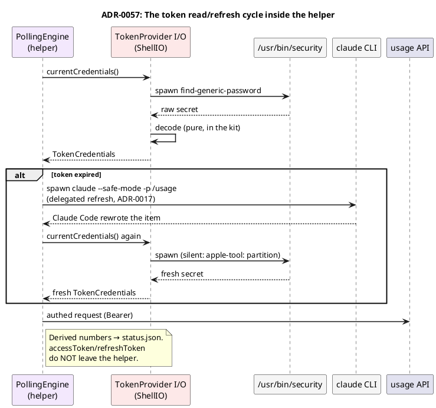

# ADR-0057 (draft): Moving `TokenProvider`'s I/O half into the helper

> **Draft.** Gated on #E0. Clarifies how `TokenProvider` splits at the boundary from
> [ADR-0056](0056-thin-helper-thick-app-build-flavors.md), and that the
> [ADR-0019](0019-token-read-via-security-cli.md) mechanism carries over unchanged.

## Context

`TokenProvider` reads **someone else's** Keychain item `Claude Code-credentials` (created by the
Claude Code CLI). [ADR-0019](0019-token-read-via-security-cli.md) requires doing this by
**spawning `/usr/bin/security`**, not `SecItemCopyMatching`: on every refresh, Claude Code rewrites
the item via `security add-generic-password -U`, which resets the ACL partition list to
`apple-tool:` — a direct API read after that prompts. Spawning `security` (itself in the
`apple-tool:` partition) stays silent.

Both spawning a binary and reading someone else's Keychain item are **forbidden by App Sandbox**.
So this work physically cannot live in the MAS app — it has to live in the non-sandboxed helper
([ADR-0054](0054-mas-present-if-installed-helper.md)).

But `TokenProvider` **already has a purity split** (ADR-0019, ADR-0007): the pure part (`decode`,
`parseSecretOutput`, `mapExitStatus`, `OAuthCredentials`, `TokenCredentials`) is separated from I/O
(`readRawData`, which spawns `security`).

## Decision

Split `TokenProvider` along its existing purity seam:

- **The pure half stays in `TokenPaceKit`** — `decode`, `parseSecretOutput`, `mapExitStatus`,
  `OAuthCredentials`, `TokenCredentials`, `TokenError`. Unit tests don't move.
- **The I/O half (`readRawData` + the `security` spawn) moves into `TokenPaceShellIO`** (linked
  only by the helper/DevID — [ADR-0056](0056-thin-helper-thick-app-build-flavors.md)).

**The ADR-0019 mechanism doesn't change** — the same spawn of
`security find-generic-password -s "Claude Code-credentials" -w`, the same reason (the ACL
partition reset). Only the **host process** changes: from the app to the helper. Likewise,
delegated refresh ([ADR-0017](0017-delegated-token-refresh.md)) — the `claude` spawn — now lives in
the helper.

## Consequences

- **ADR-0019 still stands** — its decision and reasoning carry over unchanged; only which process
  performs the spawn changes. No postscript to ADR-0019 is needed (the mechanism is the same).
- **The token never crosses the boundary** ([ADR-0055](0055-ipc-file-darwin-bookmark.md)) — only
  the decoded `UsageSnapshot` goes upward, never `accessToken`/`refreshToken`.
- **TCC responsibility for spawning `claude --safe-mode`** now sits with the helper's process, not
  the app — behavior should be equivalent, but needs re-verification (part of #E3).
- Related: [ADR-0056](0056-thin-helper-thick-app-build-flavors.md) (exactly where the link boundary
  falls), [ADR-0017](0017-delegated-token-refresh.md) (delegated refresh),
  [ADR-0033](0033-automatic-update-install.md) / [ADR-0025](0025-check-for-updates.md)
  (updater/fetch — also helper-side).
