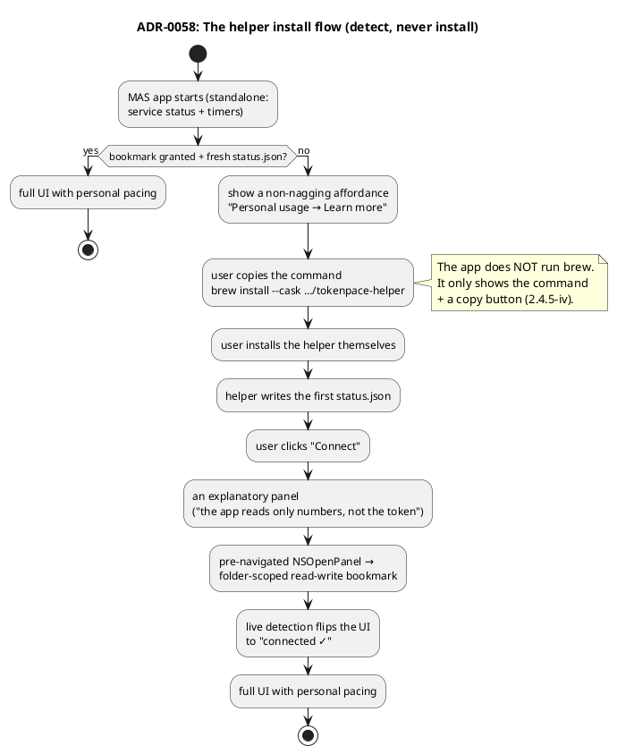

# ADR-0058 (draft): Distributing the helper via a Homebrew tap

> **Draft.** Gated on #E0. Records the helper's install channel and the "detect, never install"
> UX.

## Context

The helper ([ADR-0054](0054-mas-present-if-installed-helper.md)) is a separate open-source product
that **the user** installs themselves; the MAS app only detects it (2.4.5(iv) — it doesn't
download/install it itself). We need to pick the simplest install channel **for our audience**.

The audience is **Claude Code users** — developers who already live in the terminal and have `gh`,
Homebrew, npm. For them, `brew install` is native territory, not a barrier.

## Decision

**The primary channel is a Homebrew cask via our own tap:**
`brew install --cask artem-n/tap/tokenpace-helper`. One command, notarized, updates via
`brew upgrade` for free. **A cask** (not a formula), because the helper is a signed bundle +
LaunchAgent, not a build from source. **Fallback** — a direct notarized download from GitHub
Releases (for non-Homebrew users); this is the same artifact the cask points at.

**npm/npx — rejected as the primary channel**: despite the audience having npm, it's a poor carrier
for a signed macOS LaunchAgent (the package would just be a downloader for the notarized artifact
on GitHub) — extra supply-chain surface with no upside. A thin convenience wrapper later is
possible, not now.

**The MAS app only detects + instructs** (exactly like Spark: "run `spark` to verify"):

The helper (non-sandboxed) **keeps its own auto-updater**
([ADR-0033](0033-automatic-update-install.md) / [ADR-0025](0025-check-for-updates.md)) for
GitHub-download users; for Homebrew-installed ones this is belt-and-suspenders (`brew upgrade`
handles it).

## Consequences

- **One `brew` command** — the install story is solved for the primary audience; helper updates
  via `brew upgrade`.
- **The app never runs `brew`/never installs the helper** (2.4.5(iv)) — it only shows the command
  with a copy button + passively detects presence via IPC. "Learn more" opens GitHub in the
  browser.
- **Passive detection** — the app cannot silently stat the folder before the first bookmark grant
  (sandbox), so the flow must go through an explicit "Connect" + `NSOpenPanel`.
- A separate tap repo + CI is needed, bumping the cask on every helper release.
- References: [ADR-0031](0031-session-log-archiver.md) (log archiver → helper),
  [ADR-0025](0025-check-for-updates.md)/[ADR-0033](0033-automatic-update-install.md)
  (updater → helper), [ADR-0055](0055-ipc-file-darwin-bookmark.md) (the bookmark flow).
