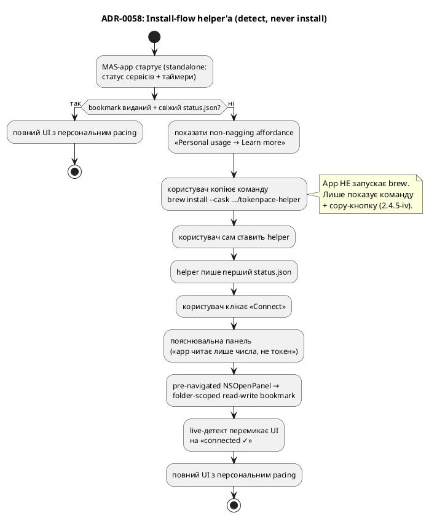

# ADR-0058 (draft): Дистрибуція helper'а через Homebrew tap

> **Чернетка (draft).** За гейтом #E0. Фіксує install-канал helper'а й «detect, never install» UX.

## Контекст

Helper ([ADR-0054](0054-mas-present-if-installed-helper.md)) — окремий opensource продукт, який
ставить **сам користувач**; MAS-застосунок його лише детектить (2.4.5(iv) — не завантажує/встановлює
сам). Треба обрати найпростіший канал встановлення **під нашу аудиторію**.

Аудиторія — **користувачі Claude Code**, тобто розробники, що вже живуть у терміналі й мають `gh`,
Homebrew, npm. Для них `brew install` — рідне середовище, не бар'єр.

## Рішення

**Основний канал — Homebrew cask через власний tap:**
`brew install --cask artem-n/tap/tokenpace-helper`. Одна команда, notarized, оновлення через
`brew upgrade` безкоштовно. **Cask** (не formula), бо helper — підписаний бандл + LaunchAgent, не
збірка з джерел. **Fallback** — пряме notarized-завантаження з GitHub Releases (для не-Homebrew
користувачів); це ж — артефакт, на який вказує cask.

**npm/npx — відкинуто як основний**: попри те, що аудиторія має npm, це поганий носій для підписаного
macOS LaunchAgent (пакет був би лише завантажувачем notarized-артефакту з GitHub) — зайва
supply-chain поверхня без виграшу. Можливий тонкий convenience-wrapper пізніше, не зараз.

**MAS-застосунок лише детектить + інструктує** (рівно як Spark: «run `spark` to verify»):

Helper (не-sandboxed) **зберігає власний auto-updater** ([ADR-0033](0033-automatic-update-install.md)
/ [ADR-0025](0025-check-for-updates.md)) для GitHub-download користувачів; для Homebrew-встановлених
це belt-and-suspenders (оновлює `brew upgrade`).

## Наслідки

- **Одна `brew`-команда** — install-story вирішена для основної аудиторії; оновлення helper'а через
  `brew upgrade`.
- **App ніколи не запускає `brew`/не встановлює helper** (2.4.5(iv)) — лише показує команду з
  copy-кнопкою + пасивно детектить наявність через IPC. «Learn more» відкриває GitHub у браузері.
- **Пасивний детект** — застосунок не може тихо stat'нути теку до першого bookmark-гранту (sandbox),
  тож flow обов'язково проходить через явний «Connect» + `NSOpenPanel`.
- Потрібен окремий tap-репозиторій + CI, що бампить cask на кожен реліз helper'а.
- Референси: [ADR-0031](0031-session-log-archiver.md) (log archiver → helper),
  [ADR-0025](0025-check-for-updates.md)/[ADR-0033](0033-automatic-update-install.md) (updater →
  helper), [ADR-0055](0055-ipc-file-darwin-bookmark.md) (bookmark-flow).
