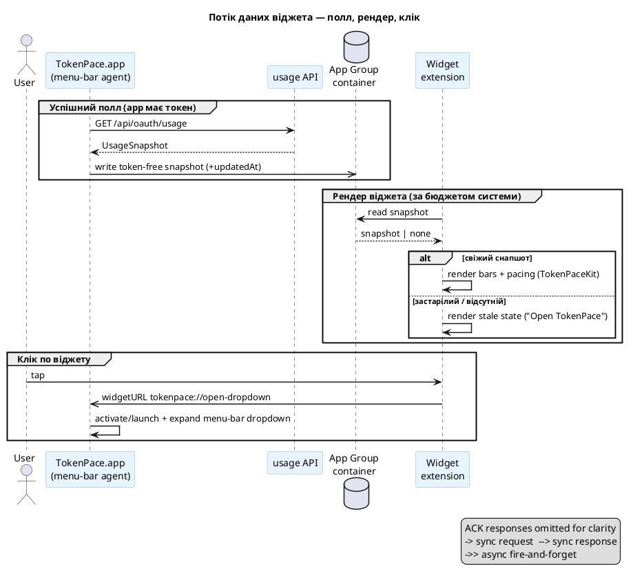

# ADR-0065: Архітектура macOS WidgetKit-віджета — App Group snapshot, спільний рендер, deep-link у dropdown

> **Draft.** Цільова архітектура прийнята продуктовим інтерв'ю, але два ключові рішення за гейтом
> спайків (див. «Відкриті питання»): (1) чи вмикається App Group **без повного sandbox** при збереженні
> читання токена через `security` CLI ([ADR-0019](0019-token-read-via-security-cli.md)); (2) чи можна
> програмно розгорнути menu-bar popover у відповідь на deep-link «з нізвідки». Доки спайки не закриті —
> `draft`. Після підтвердження `draft → accepted`.

## Контекст

Menu-bar-агент TokenPace показує використання лімітів (5h / 7d, pacing, час до ресету) як кастомно
намальовану плашку в menu bar. Хочемо додати **WidgetKit-віджет для macOS** (робочий стіл /
Notification Center), що показує ту саму інформацію більшим форматом, а згодом — переніс на iOS/iPadOS.

Три факти WidgetKit визначають усю архітектуру (перевірено, не з пам'яті):

1. **Віджет — окремий процес.** Розширення віджета не має доступу до in-memory даних застосунку. Дані
   передаються **лише** через спільне сховище (App Group container) або власний мережевий запит віджета.
2. **Оновлення за бюджетом системи**, не безперервне (кілька десятків перемальовувань на добу).
   Точний час до ресету не можна «тикати» перепитуванням — його дає SwiftUI `Text(_:style:)` +
   заздалегідь згенеровані timeline entries.
3. **Клік на macOS-віджеті** може лише **активувати застосунок** через `widgetURL` (deep link). Сам
   віджет не відкриває жодного меню/попапа — це робить застосунок у відповідь на URL.

**Поточний стан коду** (розвідка): usage-снапшот (`UsageSnapshot`) живе **лише в пам'яті** запущеного
процесу (`App.lastOutput`) — **жодного on-disk кешу немає**. App **не сандбоксований**, **не має App
Group** entitlement, токен читає підпроцесом `security` CLI ([ADR-0019](0019-token-read-via-security-cli.md)),
який у sandbox не працює. Уся рендер-логіка вже чиста й AppKit-незалежна в `TokenPaceKit`
(`UsageSnapshot` → `PacingModel` → `MenuBarLayout`), тож перевикористовна віджетом напряму.

**Співвідношення зі SPEC / Фазою 2.** SPEC описує віджети iPhone/Watch Фази 2 як читачів снапшота
через **CloudKit** (дані виносяться за межі Mac). Цей ADR — про **інше**: macOS-віджет живе на тому
самому Mac, що й агент, тож канал — **локальний App Group**, не CloudKit. CloudKit-транспорт Фази 2
залишається окремим рішенням для міжпристрійного sync і цим ADR не витісняється.

## Рішення

**Застосунок пише готовий usage-снапшот (без токена) у спільний App Group container на кожному
успішному поллі; віджет лише читає цей снапшот і рендерить його через спільний `TokenPaceKit`-пайплайн.
Клік по віджету — `widgetURL`, який активує/запускає застосунок і просить його розгорнути menu-bar
dropdown біля іконки.**

### 1. Канал даних — App Group snapshot (app пише, віджет читає)

- Застосунок після кожного успішного `PollOutput` серіалізує **очищений** снапшот (усе потрібне для
  рендеру: `fiveHour`/`sevenDay` utilization + `resetsAt`, опційні per-model і `spend`, severity-входи,
  час запису `updatedAt`) у файл всередині
  `containerURL(forSecurityApplicationGroup:)`. **Токен і будь-які креденшали туди не потрапляють ніколи.**
- Віджет-`TimelineProvider` читає цей файл, декодує в той самий тип, і будує entries. Жодного мережевого
  запиту, жодного доступу до Keychain з віджета — **віджет фізично не має чим авторизуватись**.
- Спільний тип рендер-снапшота живе в `TokenPaceKit` (лінкується обома таргетами). Це фіксує безпечний
  контракт: те, що app вміє записати, — рівно те, що віджет вміє прочитати, і нічого зайвого.

**Чому не варіант «віджет сам робить GET /api/oauth/usage».** Дублює мережу (ризик 429 на тісному
бюджеті віджета), вимагає дотягнути токен у процес віджета (порушує «токен не покидає app»), і не
працює з поточним `security`-CLI шляхом у sandbox. Відкинуто.

### 2. Свіжість і fallback — гібрид (останні дані + деградація при застарінні)

Віджет **завжди** показує останній записаний снапшот з міткою відносного часу («updated 7m ago» через
`Text(date, style: .relative)`), тож він осмислений навіть коли app закритий. **Але** коли снапшот
старший за поріг застарілості (напр. кілька годин — точне число визначається в дочірньому тікеті на
основі порогів `UsageHealth`, [ADR-0010](0010-usage-health-and-error-states.md)), віджет **змінює
вигляд** на явний stale-стан («Open TokenPace to refresh»), щоб не видавати давні цифри за поточні.

**Чому гібрид, а не «порожньо коли app закритий».** Порожній віджет читається користувачем як «зламався»,
хоча app просто не запущений; це суперечить очікуванню від віджета (Apple HIG радить показувати stale-дані
з часовою міткою, а не порожнечу). Свіжість забезпечує запущений app — але його відсутність не має
означати порожній екран, лише чесно позначене застаріння.

### 3. Взаємодія — `widgetURL` активує app і просить розгорнути dropdown

- Клік → `widgetURL` виду `tokenpace://open-dropdown` (custom URL scheme застосунку).
- Застосунок обробляє URL: активується (або **запускається**, якщо не працює, — WidgetKit піднімає його
  через LaunchServices), піднімається в menu bar і **програмно розгортає свій dropdown** біля menu-bar
  іконки — так, ніби користувач клікнув по самій іконці.
- Це стосується і stale-стану: клік по «Open TokenPace» веде тим самим шляхом — запуск + dropdown.

**Ризик (за гейтом спайку).** Програмне відкриття NSMenu/NSPopover menu-bar item «з нізвідки» (тригер —
deep-link, а не клік по status item) може не поводитись як звичайний клік. Якщо емпірично не спрацює —
запасний варіант: активувати app без гарантії popover (нижча цінність, бо menu-bar app інакше невидимий),
або відкривати повноцінне вікно. Вибір фіналізується спайком, не цим ADR.

### 4. Рендер — перевикористання `TokenPaceKit`, свідомий tint-fallback

- Віджет будує вигляд з `MenuBarLayout` / спільних severity-примітивів того самого `TokenPaceKit`, а не
  дублює pacing-логіку. Кольори pacing (`PacingSeverity` → палітра) лишаються єдиним джерелом істини.
- **Tint / accented-режим.** macOS може рендерити віджет монохромно/тінтовано (`\.widgetRenderingMode`
  == `.accented` / `.vibrant`), і тоді різні pacing-кольори (червоний/зелений/синій) зливаються в один
  тон — колірна семантика зникає. Тому семантика **дублюється в не-колірні канали**: заповнення/довжина
  бару, текст `%`, за потреби гліф-індикатор напрямку pacing. Віджет **детектує** режим через
  `\.widgetRenderingMode` і адаптує layout під accented/vibrant (не покладається лише на колір). Бари —
  accented-група (беруть акцентний тон користувача), підписи — базова (біла) група.

**Чому не «завжди повноколір, ігнорувати tint».** WidgetKit не дає застосунку заблокувати accented-режим —
система рендерить трафарет незалежно від застосунку. «Ігнорувати» на практиці = «виглядати зламано, коли
користувач увімкне tint». Тому свідомий fallback, а не спроба відмовитись від режиму.

### 5. Конфігурація — App Intent (поетапно)

- **MVP-віджет конфігу не має** — фіксований контент (5h + 7d, без грошей), розмір **Large**.
- Далі — App Intent configuration: вибір вікон (5h+7d / лише 5h / лише 7d / per-model), тогл показу
  **credits/spend** (за замовчуванням **вимкнено** — фінансові цифри на видноті на робочому столі), стиль
  бару (перевикористання `BarStyle`/`CalmColorMode` з [ADR-0062](0062-configurable-bar-presentation.md)).

### 6. Розміри — Large спершу, поетапно

`systemLarge` (найближчий до поточної плашки) — MVP → `systemMedium` (полегшений layout) → низький
пріоритет `systemSmall`. `systemExtraLarge` / portrait — це **iPadOS**-розміри (на macOS відсутні), тож
природно лягають у майбутню iOS-фазу, не в macOS-MVP.

### 7. iOS/iPadOS — проектувати під майбутнє, реалізовувати macOS

Контракт снапшота, спільний рендер у `TokenPaceKit` і поділ «app пише / віджет читає» закладаються так,
щоб iOS/iPadOS-віджети перевикористали їх. Але **реалізація цього ADR — лише macOS**. iOS має інше
джерело даних (немає Claude Code Keychain на пристрої — див. CloudKit-транспорт Фази 2 у SPEC) і потребує
Xcode-проєкту ([ADR-0004](0004-build-system.md)) — це окрема майбутня фаза.

## Наслідки

- **Перший persistence usage-даних на диск.** Досі снапшот жив лише в пам'яті; App Group snapshot — новий
  записуваний стан. Формат — окремий чистий serializable тип у `TokenPaceKit`, версіонований (сумісність
  app↔widget при апдейтах). Дотичне до маркера версії конфігу ([ADR-0023](0023-persisted-config-version-marker.md)).
- **App Group вимагає entitlement і, ймовірно, змін підпису.** Це головний ризик (див. нижче) — новий
  widget extension target у bundle, App Group entitlement на обох, перегляд `scripts/build-app.sh`
  ([ADR-0004](0004-build-system.md)) під пакування розширення.
- **Токен лишається виключно в app.** Віджет ніколи не бачить креденшалів — сумісно з
  [ADR-0019](0019-token-read-via-security-cli.md) і критичним правилом «токен не покидає Mac».
- **Спільний рендер, без дублювання pacing.** `PacingModel`/`MenuBarLayout` — єдине джерело; віджет не
  форкає логіку зон/кольорів. Зміни pacing автоматично відображаються у віджеті.
- **Верифікація на живому барі/десктопі обов'язкова.** Tint-режим, deep-link→dropdown і stale-fallback
  живуть поза unit-покриттям — потребують ручної UI-верифікації перед PR (правило проєкту).

## Відкриті питання (спайки — блокують `draft → accepted`)

1. **Sandbox vs App Group vs `security` CLI.** Чи можна ввімкнути App Group entitlement **без** повного
   app sandbox (для Developer ID-підписаного застосунку), щоб не зламати читання токена підпроцесом
   `security`? Якщо App Group тягне обов'язковий sandbox — потрібен план Б для токена. **Перевірити
   емпірично** на підписаному локальному `.app`, не стверджувати з пам'яті.
2. **Deep-link → програмний dropdown.** Чи розгортається menu-bar NSMenu/NSPopover програмно у відповідь
   на `widgetURL`-активацію так само, як від кліку по status item? Спайк на реальному віджеті.
3. **Поріг застарілості для stale-fallback.** Конкретне число (узгодити з порогами `UsageHealth`
   [ADR-0010](0010-usage-health-and-error-states.md)).
