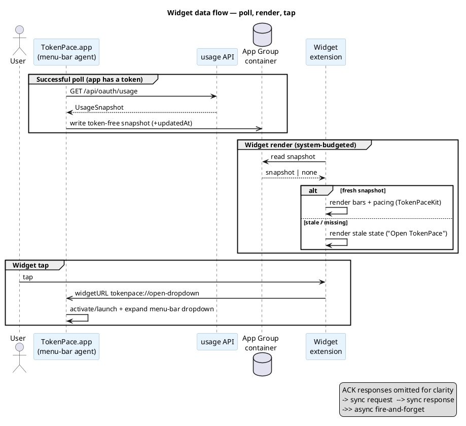

# ADR-0065: macOS WidgetKit widget architecture — App Group snapshot, shared rendering, deep link into the dropdown

> **Draft.** The target architecture was settled by a product interview, but two key decisions are
> behind a spike gate (see "Open questions"): (1) whether App Group can be enabled **without full
> sandboxing** while keeping token reads through the `security` CLI
> ([ADR-0019](0019-token-read-via-security-cli.md)); (2) whether the menu-bar popover can be
> programmatically expanded in response to a deep link "out of nowhere." Until the spikes are
> closed, this stays `draft`. It moves `draft → accepted` once confirmed.

## Context

TokenPace's menu-bar agent shows limit usage (5h / 7d, pacing, time to reset) as a custom-drawn
strip in the menu bar. We want to add a **WidgetKit widget for macOS** (desktop / Notification
Center) that shows the same information in a larger format, with an eventual port to iOS/iPadOS.

Three facts about WidgetKit drive the whole architecture (verified, not from memory):

1. **The widget is a separate process.** A widget extension has no access to the app's in-memory
   data. Data can only be passed via **either** shared storage (an App Group container) **or** the
   widget's own network request.
2. **Updates are budgeted by the system**, not continuous (a few dozen redraws a day). The exact
   time to reset can't be "ticked" by polling — it comes from SwiftUI's `Text(_:style:)` plus
   pre-generated timeline entries.
3. **Tapping a macOS widget** can only **activate the app** via `widgetURL` (a deep link). The
   widget itself never opens a menu/popover — the app does, in response to the URL.

**The current state of the code** (investigation): the usage snapshot (`UsageSnapshot`) lives
**only in memory** of the running process (`App.lastOutput`) — **there is no on-disk cache at
all**. The app is **not sandboxed**, **has no App Group** entitlement, and reads the token via a
`security` CLI subprocess ([ADR-0019](0019-token-read-via-security-cli.md)), which doesn't work
under sandboxing. All the rendering logic is already pure and AppKit-independent in
`TokenPaceKit` (`UsageSnapshot` → `PacingModel` → `MenuBarLayout`), so it's directly reusable by a
widget.

**Relationship to the SPEC / Phase 2.** The SPEC describes the Phase 2 iPhone/Watch widgets as
readers of the snapshot via **CloudKit** (data leaves the Mac). This ADR is about **something
else**: a macOS widget lives on the same Mac as the agent, so the channel is a **local App Group**,
not CloudKit. The Phase 2 CloudKit transport remains a separate decision for cross-device sync and
is not superseded by this ADR.

## Decision

**The app writes a finished usage snapshot (token-free) to a shared App Group container on every
successful poll; the widget only reads that snapshot and renders it through the shared
`TokenPaceKit` pipeline. A tap on the widget is a `widgetURL` that activates/launches the app and
asks it to expand the menu-bar dropdown by the icon.**

### 1. The data channel — an App Group snapshot (app writes, widget reads)

- After every successful `PollOutput`, the app serializes a **sanitized** snapshot (everything
  needed to render: `fiveHour`/`sevenDay` utilization + `resetsAt`, optional per-model and
  `spend`, severity inputs, and the write time `updatedAt`) into a file inside
  `containerURL(forSecurityApplicationGroup:)`. **The token and any credentials never go into it,
  ever.**
- The widget's `TimelineProvider` reads that file, decodes it into the same type, and builds
  entries. No network request, no Keychain access from the widget — **the widget has physically
  nothing to authenticate with.**
- The shared render-snapshot type lives in `TokenPaceKit` (linked by both targets). This pins a
  safe contract: exactly what the app can write is what the widget can read, and nothing more.

**Why not "the widget makes its own GET /api/oauth/usage."** Duplicates the network call (risking
429 on the widget's tight budget), requires getting the token into the widget process (breaking
"the token never leaves the app"), and doesn't work with the current `security` CLI path under
sandboxing. Rejected.

### 2. Freshness and fallback — a hybrid (latest data + degrade when stale)

The widget **always** shows the last recorded snapshot with a relative timestamp ("updated 7m
ago" via `Text(date, style: .relative)`), so it stays meaningful even when the app isn't running.
**But** when the snapshot is older than a staleness threshold (e.g. a few hours — the exact number
is settled in a child ticket, based on `UsageHealth` thresholds,
[ADR-0010](0010-usage-health-and-error-states.md)), the widget **changes its look** to an explicit
stale state ("Open TokenPace to refresh"), so it doesn't pass off old numbers as current.

**Why a hybrid, not "empty when the app is closed."** An empty widget reads to the user as
"broken," even though the app is just not running; that contradicts what people expect from a
widget (Apple's HIG recommends showing stale data with a timestamp rather than emptiness).
Freshness is provided by the running app — but its absence shouldn't mean a blank screen, only an
honestly labeled staleness.

### 3. Interaction — `widgetURL` activates the app and asks it to expand the dropdown

- A tap → a `widgetURL` of the form `tokenpace://open-dropdown` (the app's custom URL scheme).
- The app handles the URL: it activates (or **launches**, if not running — WidgetKit brings it up
  via LaunchServices), rises to the menu bar, and **programmatically expands its own dropdown** by
  the menu-bar icon — as if the user had clicked the icon itself.
- This applies to the stale state too: tapping "Open TokenPace" follows the same path — launch +
  dropdown.

**A risk (behind the spike gate).** Programmatically opening an NSMenu/NSPopover menu-bar item
"out of nowhere" (triggered by a deep link, not a click on the status item) might not behave like
an ordinary click. If it doesn't work empirically — the fallback is to activate the app without a
popover guarantee (lower value, since a menu-bar app is otherwise invisible), or to open a
full-fledged window. The choice is finalized by the spike, not by this ADR.

### 4. Rendering — reusing `TokenPaceKit`, a deliberate tint fallback

- The widget builds its look from `MenuBarLayout` / the shared severity primitives of the same
  `TokenPaceKit`, rather than duplicating pacing logic. Pacing colors (`PacingSeverity` → palette)
  remain the single source of truth.
- **Tint / accented mode.** macOS can render the widget monochromatically/tinted
  (`\.widgetRenderingMode` == `.accented` / `.vibrant`), and in that case different pacing colors
  (red/green/blue) collapse into a single tone — the color semantics disappear. So the semantics
  are **duplicated into non-color channels**: bar fill/length, the `%` text, and, where needed, a
  glyph indicator of pacing direction. The widget **detects** the mode via
  `\.widgetRenderingMode` and adapts the layout for accented/vibrant (rather than relying on color
  alone). Bars are in the accented group (they take on the user's accent tone); labels are in the
  base (white) group.

**Why not "always full color, ignore tint."** WidgetKit gives the app no way to block accented
mode — the system renders the stencil regardless of the app. "Ignoring" it in practice means
"looking broken once the user turns tint on." Hence a deliberate fallback rather than an attempt to
opt out of the mode.

### 5. Configuration — an App Intent (staged)

- **The MVP widget has no configuration** — fixed content (5h + 7d, no money), size **Large**.
- Later — App Intent configuration: choosing windows (5h+7d / 5h only / 7d only / per-model), a
  toggle for showing **credits/spend** (**off** by default — financial figures in plain sight on
  the desktop), bar style (reusing `BarStyle`/`CalmColorMode` from
  [ADR-0062](0062-configurable-bar-presentation.md)).

### 6. Sizes — Large first, staged

`systemLarge` (closest to the current strip) — MVP → `systemMedium` (a lighter layout) → low
priority `systemSmall`. `systemExtraLarge` / portrait are **iPadOS** sizes (absent on macOS), so
they naturally fall into a future iOS phase, not the macOS MVP.

### 7. iOS/iPadOS — design for the future, implement for macOS

The snapshot contract, the shared rendering in `TokenPaceKit`, and the "app writes / widget reads"
split are laid down so that iOS/iPadOS widgets can reuse them. But **the implementation in this
ADR is macOS only.** iOS has a different data source (there's no Claude Code Keychain on the
device — see the Phase 2 CloudKit transport in the SPEC) and needs an Xcode project
([ADR-0004](0004-build-system.md)) — that's a separate future phase.

## Consequences

- **The first persistence of usage data to disk.** Until now the snapshot lived only in memory; the
  App Group snapshot is new persisted state. The format is a separate, pure, serializable type in
  `TokenPaceKit`, versioned (for app↔widget compatibility across updates). Related to the config
  version marker ([ADR-0023](0023-persisted-config-version-marker.md)).
- **App Group requires an entitlement, and probably signing changes.** This is the main risk (see
  below) — a new widget extension target in the bundle, an App Group entitlement on both, and a
  review of `scripts/build-app.sh` ([ADR-0004](0004-build-system.md)) for packaging the extension.
- **The token stays exclusively in the app.** The widget never sees credentials — consistent with
  [ADR-0019](0019-token-read-via-security-cli.md) and the critical rule that the token never leaves
  the Mac.
- **Shared rendering, no pacing duplication.** `PacingModel`/`MenuBarLayout` are the single source;
  the widget doesn't fork the zone/color logic. Pacing changes automatically show up in the widget.
- **Verification on the live bar/desktop is mandatory.** Tint mode, deep-link→dropdown, and the
  stale fallback live outside unit coverage — they need manual UI verification before a PR (project
  rule).

## Open questions (spikes — block `draft → accepted`)

1. **Sandbox vs. App Group vs. the `security` CLI.** Can the App Group entitlement be enabled
   **without** full app sandboxing (for a Developer ID–signed app), so as not to break token
   reads via the `security` subprocess? If App Group forces mandatory sandboxing, a plan B is
   needed for the token. **Verify empirically** on a signed local `.app`, don't assert from
   memory.
2. **Deep link → programmatic dropdown.** Does the menu-bar NSMenu/NSPopover expand
   programmatically in response to a `widgetURL` activation the same way it does from a click on
   the status item? Spike it on a real widget.
3. **The staleness threshold for the stale fallback.** A concrete number (align with the
   `UsageHealth` thresholds, [ADR-0010](0010-usage-health-and-error-states.md)).
