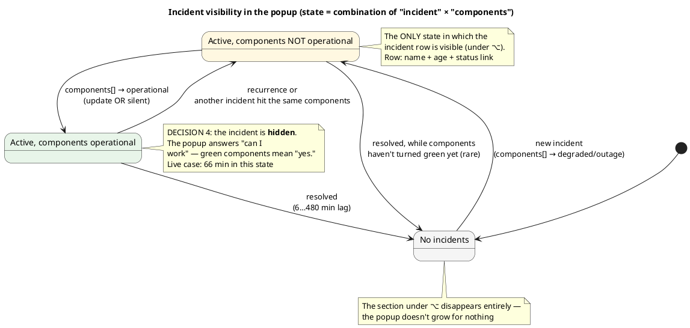
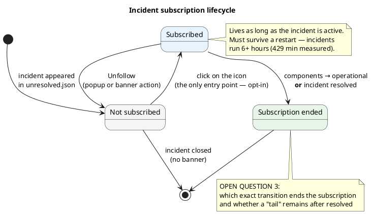
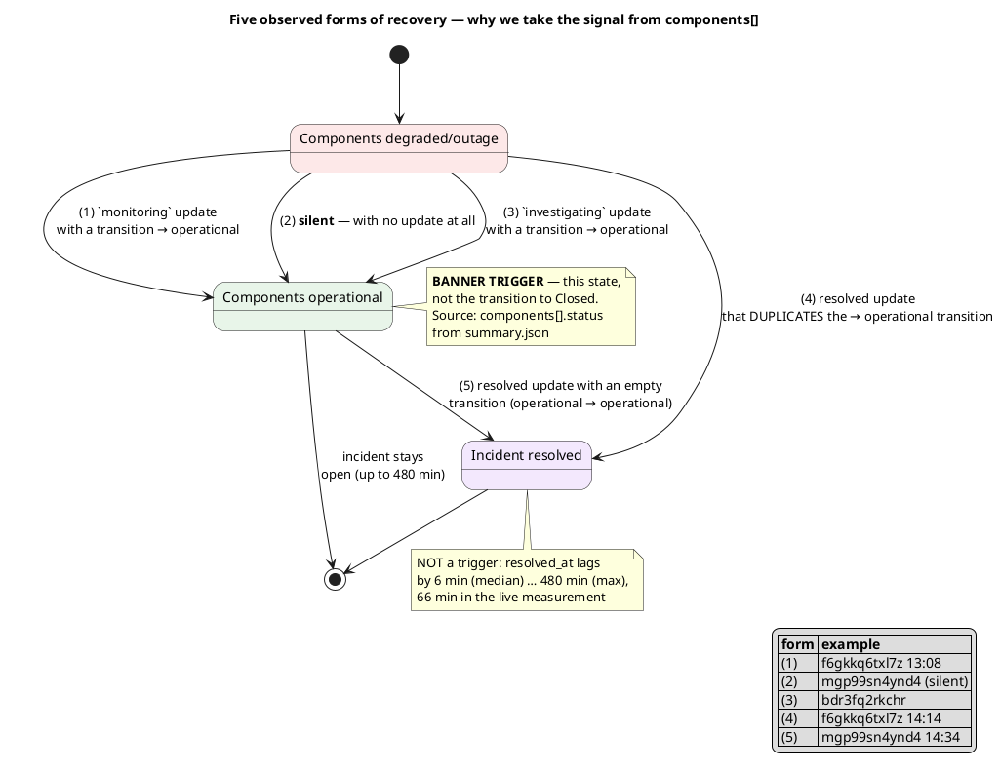

# ADR-0071: status.claude.com incidents in the popup, and subscribing to their updates

> Recorded from the 2026-08-05 product interview; written as a draft with six deliberately open
> questions. All six were closed during implementation
> ([#279](https://github.com/artem-from-ua/tokenpace/issues/279)) — see
> [Open questions](#open-questions); the only thing left tuning is the debounce **value**, which
> is a code parameter, not a decision of this ADR. Full context, empirical tables, and test data
> are in [docs/design/incident-subscriptions.md](../design/incident-subscriptions.md).
>
> **Revised during implementation ([#279](https://github.com/artem-from-ua/tokenpace/issues/279)).**
> The subscription model changed from per-incident to **per-episode** — see
> [Revising decisions 5 and 6](#revising-decisions-5-and-6-subscribing-to-an-episode). This closed
> open questions 1 and 6 without opening new ones. The rest of the decisions still stand.
>
> **Mockups of the agreed UI:** [four popup states](https://claude.ai/code/artifact/c6697546-aad0-43c5-a1e7-cf2ed5f401eb) — with and without ⌥, subscribed and not, plus the state
> after `monitoring`, and the mockup's divergences from the implementation. The icons there are
> real SF Symbols rendered from the system, so the width and weight match what the app draws.

## Context

[ADR-0013](0013-claude-status-line.md) §2 deliberately decided **not to decode `incidents[]` at
all**: service state is determined exclusively by `components[].status`. The reasoning was sound —
a component and an incident can diverge (a real case: a `major` incident about the Mythos/Fable
outage while both components stayed `operational`), and the status line had to match the color on
the Statuspage page itself.

That decision **still stands for determining state**. But it leaves the user without the other
half of the answer: a yellow dot next to `Code` doesn't explain **what exactly** is broken, **how
long** it will last, or **when** work can resume. People read "degraded" as "it'll be slower,"
when in reality part of the functionality doesn't work at all (the case that started this
conversation: Claude Science was down under `degraded_performance` across all components).

A separate layer is needed: incidents as **context** and as a **subscription object** — not as a
source of state.

### Empirical base

The decisions below rest on measured data, not assumptions about Statuspage's behavior: 50
incidents from `GET /api/v2/incidents.json` (2026-07-08 … 2026-08-05), plus two incidents tracked
live from start to `resolved` (`f6gkkq6txl7z`, `mgp99sn4ynd4`). Key facts:

- **`resolved_at` lags by 6 min (median) … 480 min (max)** behind the moment components actually
  returned to `operational`. Live measurement: **66 minutes**.
- **Recovery can be silent** — components turn green **with no `incident_update` at all**
  (`mgp99sn4ynd4`).
- **`monitoring_at`** is populated in only 28 of 49 incidents; **`deliver_notifications`** is
  inconsistent (it's sometimes `false` on exactly the `resolved` update); **`impact`** correlates
  poorly with real pain (both 2026-08-05 incidents were `minor`, despite a 6-hour degradation).
- **Updates are sparse**: 3.3 per incident on average, 8 at most.
- **Updates are edited after the fact** (`updated_at` ≠ `created_at`).
- **Component state doesn't belong to an incident**: with two simultaneous incidents, both show
  the same affected components.

## Decision

### 1. Incidents are decoded — but only as context and a subscription object

This narrows the ADR-0013 §2 ban: `incidents[]` is now decoded. **The source of service state
remains exclusively `components[].status`** — no incident field (`status`, `impact`,
`resolved_at`) influences state.

### 2. ⌥ in the popup toggles the dimension: services ↔ incidents

By default, rows show **components** with a problem status (as today). Under ⌥, the list of
services is **replaced** by a list of incidents with colored dots. Green service statuses are no
longer shown under ⌥. If there are no active incidents, the section under ⌥ disappears entirely.

### 3. Incident row: name + age + status link

Affected services are **not** shown — that's already the Monitored Services filter's job. The
status word (`identified`, `monitoring`, …) is a link to the **specific** incident (`shortlink`).

This incidentally fixes an existing flaw: today the status word in a component's row links to the
general status page, and with several affected services you get several identical links to
nowhere.

### 4. Components green → incident hidden

The popup answers "can I work right now." Green components mean "yes"; a formally open incident
doesn't contradict that.

### 5. Subscription — exclusively opt-in by click

Nothing arrives until the user has clicked. No default state, no global toggle.

This decision removes an entire layer of complexity: it eliminates the task of "guessing whether
this incident is relevant to the user." When the person asks to be woken up, there's nothing to
guess.

### 6. Recovery signal — `components[].status`, not incident fields

Not `resolved_at`, not `monitoring_at`, not `affected_components` in updates. This is the single
source that covers all five observed forms of recovery. Updates remain a source of **text**, not
a trigger.

### 7. Deduplication — by `incident_updates[].id`

Not by the fact of a component transition (the form is inconsistent: `resolved` duplicates a
transition already shown), and not by `updated_at` (retroactive edits would produce a repeat
banner with old content).

### 8. Notifications: colored status dot, click into the incident, "Unfollow," quiet hours

Before the text, a colored status dot (the same visual language as the popup). Clicking opens the
incident's page; there's a separate "Unfollow" action. Quiet hours are the same as
[ADR-0039](0039-back-to-work-notification.md) / [ADR-0050](0050-extra-usage-notification.md).

### 9. Filters in Settings: by affected services and by age

### 10. Dev log of payloads in JSONL, written only on a meaningful change

Fingerprint = component statuses + the set of `incident_updates[].id` + incident status. Enabled
by a checkbox in Development tools ([#185](https://github.com/artem-from-ua/tokenpace/issues/185)).

## Revising decisions 5 and 6: subscribing to an episode

During implementation, the maintainer clarified **how the feature is actually used**, and that
pulled the rug out from under the per-incident model:

- the user subscribes only when something isn't working for them **and** they can see non-green
  services;
- they **don't know** which of several simultaneous incidents is the one affecting their work.

So the subscription is to the state "something's broken for me right now" (an **episode**), not to
a Statuspage ticket.

**What changed.**

1. **One button for all current incidents**, instead of an icon on each row. New incidents opened
   while the episode is ongoing flow into the same subscription — otherwise the user would have to
   resubscribe in the middle of an outage.
2. **The subscription row is visible even without ⌥**, in the same place in both dimensions. It's
   needed exactly when red service rows are visible — which is the popup's default view.
3. **An episode ends via two paths**: all monitored components turn green, **or** all active
   incidents transition to `monitoring`. The second path is a deliberate extension of decision 6:
   the signal still isn't taken from `resolved_at`/`monitoring_at`, but the transition into
   `monitoring` itself means "the fix has shipped," and it arrives before components turn green.
   The banners for these two cases are **worded differently** — "Claude is back" versus "Fix
   deployed — monitoring" — because they're different claims, and overstating the second would
   give a false all-clear.
4. **Icon = state, text = action** (`bell.slash` + "Notify me when it's fixed" → `bell.fill` +
   "Following the incidents"). A bare toggle icon creates Play/Pause ambiguity: a crossed-out bell
   reads equally as "currently off" and as "tap to turn off."

**Consequence for the open questions.** Open questions 1 (several simultaneous incidents) and 6
(where the icon lives) **disappeared along with the per-incident model** — one button in a fixed
location leaves neither of those choices to make.

### Implementation findings that refine the empirical base

- **`summary.json` already carries `incidents[]` in full** — together with their `components[]`
  and `incident_updates[]`. A second endpoint isn't needed. The design note's claim that
  `components[]` is populated only in `unresolved.json` holds for `incidents.json`, but **not**
  for `summary.json`.
- **`incidents[].components[]` is a live mirror** of current state, not a snapshot taken at
  incident time. That's why the "green → hide" gate is local to the incident, and why this field
  **cannot** be read as historical evidence of severity.
- **`components[].updated_at` gives you the state's age for free** — it shifts exactly when the
  status changes and stays put while the status is unchanged. There's no need to persist "when we
  first saw red," and the age survives a restart in the middle of a 6-hour outage.
- **`resolved_at` doesn't even work as a key for a "just recovered" window**: in all three
  snapshots where components were already green, it was `null` — the incident was still formally
  open.
- **An incident has no separate description field** — only `name`. Measured across 50 incidents:
  median 34 characters (one line), max 107 (three lines).

## Alternatives considered

Recorded so these forks don't get revisited.

### A. A global "notify about incidents" toggle instead of opt-in by click

**Rejected.** The argument for it was: subscribing to a specific incident requires the user to
first **notice** it, and the main value is finding out when you're *not* looking at the popup;
plus "what to subscribe to" is already configured in Monitored Services.

Reason for rejection: a toggle means notifications **without explicit consent to a specific
event**. It also drags in the task of "guessing relevance" — a gate on components, handling the
"incident is `major` but components are green" case, and the "incident grew and now affects Claude
Code" case. An explicit click removes all of that machinery along with an entire class of false
positives.

### B. Three noise tiers ("start & end" / "+ status changes" / "all updates")

**Rejected.** Three levels were initially proposed as a scale. Measured evidence shows this isn't
a scale but **two different states of mind** a person switches between during a single incident.
Also, on real data the difference between "all updates" and "recovery only" is roughly **one
banner per incident** (3.3 updates on average; `f6gkkq6txl7z`, over 429 minutes, produced only one
purely textual update).

What's left of this idea is an open question about the event set (see below), which gets resolved
by live observation rather than a scale set in advance.

### C. Always show a first banner, pick the mode inside it

**Rejected.** The proposal: default to one banner, "here's an incident, it affects you," with two
actions inside it ("Follow all updates" / "Only when fixed"). That's still a notification without
consent — it contradicts decision 5.

### D. Recovery signal from `resolved_at`

**Rejected empirically.** Median lag is 6 min, but 19 of 45 cases were ≥10 min, 5 were >60 min, and
the max was 480 min. The `f6gkkq6txl7z` live measurement was 66 minutes of downtime after real
recovery.

### E. Recovery signal from `monitoring` / `monitoring_at`

**Rejected empirically.** The field is populated in only 28 of 49 incidents (`null` in
`mgp99sn4ynd4`), and it doesn't correlate with turning green: in `bdr3fq2rkchr`, components turned
green while the status was still `investigating`.

### F. Recovery signal from `affected_components` in updates

**Rejected empirically** — and this reverses an intermediate conclusion drawn after the first
incident. `mgp99sn4ynd4` recovered **silently**: components turned green with no update at all, so
a listener on updates would have stayed silent for 43 minutes.

### G. `deliver_notifications` as a ready-made noise filter

**Rejected.** The hypothesis was that Anthropic itself flags updates worth notifying about. The
flag is inconsistent: in `bdr3fq2rkchr` it was `false` on exactly the `resolved` update — meaning
it would have filtered out the most valuable one; in our two incidents it was `true` on all six
updates, including a purely textual one.

### H. Incident as a separate block above the service rows

**Rejected** in favor of the ⌥ swap. A block above the rows loses nothing, but it permanently grows
the popup by 2–3 rows; the ⌥ swap leaves the default view untouched.

### I. Incident replacing the service rows **without** ⌥ (permanently)

**Rejected.** During an outage, one human sentence is worth more than per-component dots — but the
granularity fought for in [#89](https://github.com/artem-from-ua/tokenpace/issues/89) /
[ADR-0024](0024-configurable-logical-services.md) disappears for exactly the people who want it.

### J. Incident inside the component row (`degraded: models erroring`)

**Rejected.** The most compact option, but the update text doesn't fit, and with several affected
services the same incident gets duplicated in every row.

### K. Show the incident while components are already green (as "recovering")

**Rejected** in favor of hiding it completely (decision 4). The "recovering · fix deployed 12m ago"
variant gave more context, but it contradicts the popup's central question — "can I work."

### L. Showing affected services in the incident row

**Rejected.** It duplicates the existing Monitored Services filter: if an incident is shown, it
already passed that filter.

### M. Automatically quieting down after N banners

**Rejected as premature.** The idea: after several banners in a row, offer "Only tell me when it's
fixed" right inside the banner. On real data the stream isn't noisy (3.3 updates per incident), so
the problem this would solve hasn't been observed yet.

### N. A "Retry" button / homegrown "it's working again" detection

**Rejected deliberately.** TokenPace doesn't know the state of the user's Claude Code session; a
false "you're good now" is worse than silence.

## Consequences

**Upsides.**

- The popup answers not just "is this Anthropic," but also "what exactly, and for how long."
- The "you can work again" signal arrives **at the moment of real recovery**, not 6–480 minutes
  later.
- The opt-in model removes the relevance-guessing task along with an entire class of false
  positives.
- The link from the status leads to the specific incident, not to the general page.

**Cost.**

- `StatusSummary` stops being a single narrow field — `incidents[]` is added (ADR-0013 §2 is
  partially revisited).
- **Persisted subscription state** appears, and it must survive a restart (incidents run 6+
  hours).
- ⌥ in the popup gains a fourth role; the status section's behavior changes for existing users.
- A debounce against component flapping is needed — otherwise banners would flicker.

**Risk accepted deliberately.** ADR-0013 §2 ignored incidents precisely because an incident ≠ a
break in the user's workflow (the Mythos/Fable case). Since subscription is now explicit, that
class of false positives is shifted onto human judgment: the user sees the incident themselves and
decides whether it's relevant to them.

## Open questions

All six questions this ADR was drafted with are **closed** — five by decisions made during
implementation ([#279](https://github.com/artem-from-ua/tokenpace/issues/279)), one by a
deliberate move into code as a tunable parameter. So the ADR is moved to `accepted`.

| # | Question | How it was closed |
|---|---|---|
| ~~1~~ | ~~Several simultaneous incidents: one button for all, one per incident, or "only those active at click time"~~ | By moving to a per-**episode** subscription: one button for all current incidents |
| ~~2~~ | ~~Final set of events for banners~~ | `EpisodeEvent` has exactly two cases: `.update` (a new `incident_updates[]` entry, with severity) and `.ended`. Degradation and formal closure did **not** become separate events |
| ~~3~~ | ~~How long a subscription lives after an incident closes; whether it survives a restart~~ | Persisted (`PersistedConfig.episodeSubscription`, JSON in `UserDefaults`). The reason cited in the code is our own measurement: an incident ran for 429 minutes, so a subscription that didn't survive a relaunch would be lost routinely |
| 4 | The debounce value before the "recovered" banner | **The mechanism is closed, the value isn't.** `EpisodeSubscription.defaultDebounce` = 90 s, and it is a **parameter** of `EpisodeEvaluator.evaluate`, not a constant — precisely so it can be calibrated from data with a single edit, without a new ADR. Calibration is tracked in [#297](https://github.com/artem-from-ua/tokenpace/issues/297) |
| ~~5~~ | ~~What to do with `impact` and maintenance~~ | `impact` is decoded, but **deliberately unused**: measured to correlate poorly with real pain (both 2026-08-05 incidents were `minor`, while part of the models were down for six hours). `scheduled_maintenances[]` remains undecoded — that's a separate feature, not a question of this ADR |
| ~~6~~ | ~~Where the subscription icon lives~~ | A separate row under the services, visible even without ⌥ — the question only existed under the per-incident model |

> **Why question 4 doesn't keep the ADR in draft.** The decision here is "a debounce is needed, and
> its value is tunable," not the specific 90 seconds. An `accepted` ADR in this project is
> immutable, so tying its status to a parameter's value would mean requiring a new ADR just for one
> constant. Tuning the value is an ordinary code change.

## References

- [docs/design/incident-subscriptions.md](../design/incident-subscriptions.md) — full interview
  summary, empirical tables, test data description
- [ADR-0013](0013-claude-status-line.md) — the service status line; partially revisited (§2)
- [ADR-0024](0024-configurable-logical-services.md) — configurable logical services
- [ADR-0039](0039-back-to-work-notification.md), [ADR-0050](0050-extra-usage-notification.md) —
  existing notifications, quiet hours
- [#297](https://github.com/artem-from-ua/tokenpace/issues/297) — debounce calibration (90 s is
  provisional) from captured data; does not block this ADR
- [Incident f6gkkq6txl7z](https://stspg.io/s2ysk4zxbyy3) — the primary case
