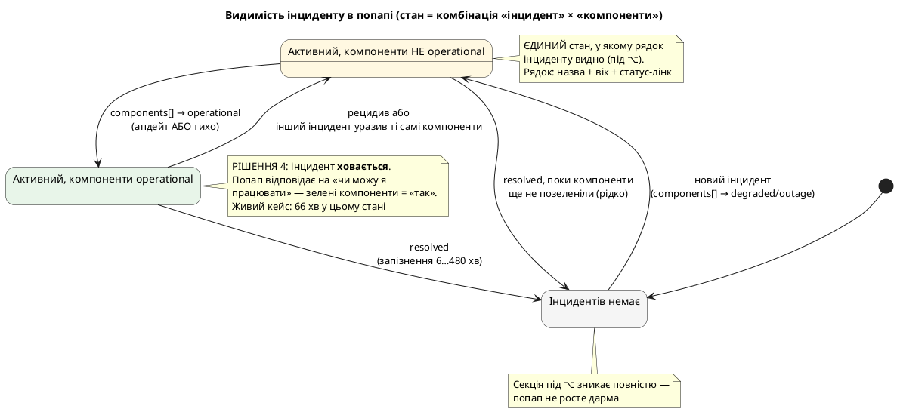
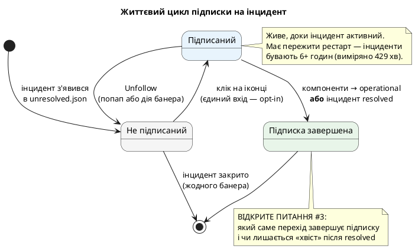
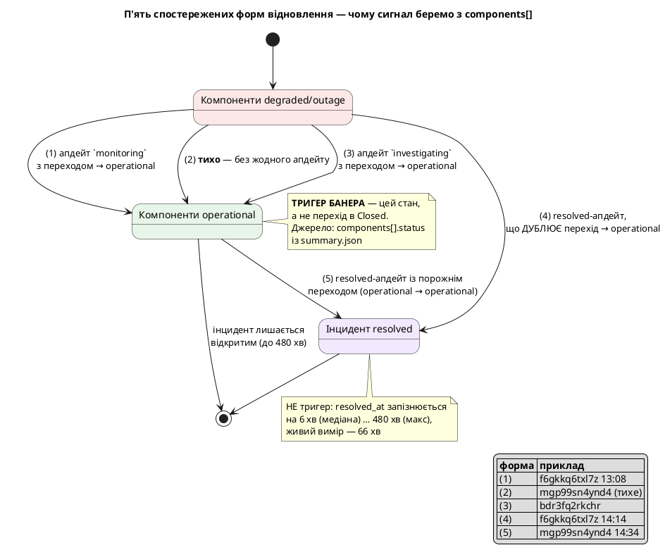

# ADR-0071: Інциденти status.claude.com у попапі та підписка на їхні оновлення

> Зафіксовано за підсумками продуктового інтерв'ю 2026-08-05, писалося як draft із шістьма свідомо
> відкритими питаннями. Усі шість закрито під час реалізації
> ([#279](https://github.com/artem-from-ua/tokenpace/issues/279)) — див.
> [Закриті питання](#закриті-питання); лишилося тюнінгове **значення** дебаунсу, що є параметром
> коду, а не рішенням цього ADR. Повний контекст, емпіричні таблиці й тестові дані — у
> [docs/design/incident-subscriptions.md](../design/incident-subscriptions.md).
>
> **Переглянуто під час реалізації ([#279](https://github.com/artem-from-ua/tokenpace/issues/279)).**
> Модель підписки змінилася з «на інцидент» на **«на
> епізод»** — див. [Перегляд рішень 5 і 6](#перегляд-рішень-5-і-6-підписка-на-епізод). Це закрило
> відкриті питання №1 і №6, не відкривши нових. Решта рішень лишається чинною.
>
> **Мокапи узгодженого UI:** [чотири стани попапу](https://claude.ai/code/artifact/c6697546-aad0-43c5-a1e7-cf2ed5f401eb) — з ⌥ і без, підписаний і ні, плюс стан
> після `monitoring` і розбіжності мокапа з реалізацією. Іконки там — справжні SF Symbols,
> відрендерені з системи, тож ширина й вага ті самі, що малює застосунок.

## Контекст

[ADR-0013](0013-claude-status-line.md) §2 свідомо вирішив **не декодувати `incidents[]` взагалі**:
стан сервісів визначається виключно `components[].status`. Причина була слушна — компонент і інцидент
розходяться (реальний кейс: інцидент `major` про призупинення Mythos/Fable, тоді як обидва компоненти
`operational`), і рядок статусу мав відповідати кольору на самій сторінці Statuspage.

Це рішення **лишається чинним для визначення стану**. Але воно лишає користувача без другої половини
відповіді: жовта крапка біля `Code` не пояснює, **що саме** зламано, **наскільки надовго** і **коли
можна повертатися до роботи**. Людина читає «degraded» як «буде повільніше», хоча насправді частина
функціональності не працює зовсім (кейс, з якого почалася розмова: не працював Claude Science при
`degraded_performance` на всіх компонентах).

Потрібен окремий шар: інциденти як **контекст** і як **об'єкт підписки** — не як джерело стану.

### Емпірична база

Рішення нижче спираються на виміряні дані, а не на припущення про поведінку Statuspage: 50 інцидентів
з `GET /api/v2/incidents.json` (2026-07-08 … 2026-08-05) плюс два інциденти, відстежені наживо від
початку до `resolved` (`f6gkkq6txl7z`, `mgp99sn4ynd4`). Ключові факти:

- **`resolved_at` запізнюється на 6 хв (медіана) … 480 хв (максимум)** відносно моменту, коли
  компоненти реально повернулись в `operational`. Живий вимір: **66 хвилин**.
- **Відновлення буває тихим** — компоненти зеленіють **без жодного `incident_update`**
  (`mgp99sn4ynd4`).
- **`monitoring_at`** заповнене лише в 28 із 49 інцидентів; **`deliver_notifications`**
  непослідовний (буває `false` саме на `resolved`); **`impact`** слабо корелює з реальним болем
  (обидва інциденти 2026-08-05 — `minor`, при 6-годинній деградації).
- **Апдейтів мало**: у середньому 3.3 на інцидент, максимум 8.
- **Апдейти редагують заднім числом** (`updated_at` ≠ `created_at`).
- **Стан компонента не належить інциденту**: при двох одночасних інцидентах обидва показують ті самі
  уражені компоненти.

## Рішення

### 1. Інциденти декодуються — але лише як контекст і об'єкт підписки

Звужується заборона ADR-0013 §2: `incidents[]` тепер декодується. **Джерелом стану сервісів
лишається виключно `components[].status`** — жодне поле інциденту (`status`, `impact`,
`resolved_at`) на стан не впливає.

### 2. ⌥ у попапі перемикає вимір: сервіси ↔ інциденти

За замовчуванням — рядки **компонентів** із проблемним статусом (як зараз). Під ⌥ перелік сервісів
**замінюється** переліком інцидентів із кольоровими крапочками. Зелені статуси сервісів під ⌥ більше
не показуються. Якщо активних інцидентів немає — секція під ⌥ зникає повністю.

### 3. Рядок інциденту: назва + вік + статус-посилання

Уражені сервіси **не** показуються — це і є наявний фільтр Monitored Services. Слово-статус
(`identified`, `monitoring`, …) — посилання на **конкретний** інцидент (`shortlink`).

Побічно розв'язує наявну ваду: сьогодні слово-статус у рядку компонента веде на загальну сторінку, і
при кількох уражених сервісах виходить кілька однакових посилань у нікуди.

### 4. Компоненти зелені → інцидент ховається

Попап відповідає на «чи можу я зараз працювати». Зелені компоненти = «так»; формально відкритий
інцидент цього не заперечує.

![Видимість інциденту в попапі](https://www.plantuml.com/plantuml/svg/bLNRJXDX4BxVfvZW3LJma0Z11WXggF567m2uMBjhsT3ktsmNl30cBMZLX50bKF423nSQ4oyiJP6oBIMfBp3_A_H9d9djYR8tfjdqt_upttpppQ6BET_q_8rCsl0TFsq3xc4TQ_GqTLaNz9RU0Lt6SrsKdq_ejAMt0Qk05zYYfu8NkWpZR4hdSvW73EYYYSViXXLT99mIj7-DehGRyFSZ_TurPxJpy0RhxSQ4OUJM7JThUcO6YA9lmmi3uBwPN4zvQiEr7gYqykRcrXpBijs51RYMcEPFb4rkJJqFJHA9sQNRKIOfpmvHbcOJqqjtZPU6iHnRXQcf1NYi7hb9XuBuH4c8Z65nH90owy7icvJm_XYOkI4t6B3i0xp7WFF4AddLyMmIebG0FC83K5dRCtr7kMPQWEybVMVJXdvQ_uav2lUGCt-IjLtegs0OG-HPWcx8EEVO8dn2lz8KA-vuKcMooYMdtF8gT8fxODafpxHiwwRQyCsKJJNj8Z7e870ShdWEiIHWRZA9SwQtWFByW9-1az6liJLX380kSTLvFEaIh7DvAdYChHLNUB-DJ07qDZbLy5GSkAoW2_HEan2fvQLqXYIBWsVdL7hJjYR3AGcubX40nEOTdaZdX8QdTDEGsp9zrsciydIgiUzedf7nMAlJS2JfM-8GLWbcElaVTsPl0GbMfIguYXh6Sr9hFgXdNSLeAl0LxkCXDTqXVeBUG4-IAg1B8Nq-vkcbnacHH-Hca5Tg51WN7ZNex7oVkC7uNtkkqaaiT1KhS9ryo2wWGnYKSNHX2XkoGGB3TYrWogF4-u88DWtbJpmWzaVu6-x4hrOt5kD-uP1wd_SQ1Il5OaBiIs-LXLHgKepmHCP2bZVO6wvZawx-Y2RiUS4TGpjkLt1bTK4dJov3fOmUn7b6P8c3TaD8b6LskJ79ddkz48UP6QcPrA2eTterwDP6bqUrUQfyNsLOdA6rHTZV233ehk91LK2Qf4xX94j9cb5bx-zo7fBYG1nkL4gu9GIePrcUF2-z0Oz5Ej6_oJy0)

### 5. Підписка — виключно opt-in по кліку

Нічого не приходить, доки користувач сам не натиснув. Жодного дефолтного стану, жодного глобального
тумблера.

Це рішення знімає цілий пласт складності: відпадає задача «вгадати, чи цей інцидент стосується
користувача». Коли будити просить людина — гадати не треба.

### 6. Сигнал відновлення — `components[].status`, не поля інциденту

Не `resolved_at`, не `monitoring_at`, не `affected_components` в апдейтах. Це єдине джерело, що
покриває всі п'ять спостережених форм відновлення. Апдейти лишаються джерелом **тексту**, не
тригером.

![П'ять спостережених форм відновлення](https://www.plantuml.com/plantuml/svg/dLNTJXDH4BxVfvZWXRG115fgQP0G_dm88BAmoxAskwViReae9kLNJOoW8Z4Q8z74IrFBZmNQyWfpNe4dSURijXIeNdXHe6Tclk-RRyuSHln0zuA2azC2EyYPW5_loXsvBb-3NCCBhCirkOx7ieZ7U4AV6bRa5iXD2XIn2bYM-tX4ftKiuxcAr-GEN1RtGBwWmwhSO9mA7bAaXEU0loAmAjO1VyEySFB2DTt0dvhHD3zhktdTqnqWLO49ppI0KNq-QtcYu1fZ8YUyeQ4vJsHDTtWOxaoEJwGdqkroH9RZ4-d9WOd1Td7TSEmG8a59uzfpubQC7VY9PNFdf9ZweUuhO9YMfnkcSKyK0jqoEq3tOLJ9W2iz_qGGUTFJ0rkuUavLF_HCLSn2cuNRbBnDPXs5PU2PliWjcuQg6Ci9tpIWgLtJfk8pqDqz72dHj4WH7uNm6UZiYm7vVg4WJmborX6k7GZFTgtPQPS6G34r4Bb5UezOELnklslLsnQtFmRnE7V6TV6ucZZFbX5F51BVYKCUSWkzt6WBbhWfqdQNJJ-mBLBmVpeZimWx6MlQsDrAqZNjobSiRm-_urlyZ3zniuM4h_KjWb3mTVo1l-038IZLl2XrygH61rLgvNOVdIqSDpbZcXPnCIrDl4K4pp_3FDTl3UrXHRx4ajpZDQRztI7MS4_FYBd2KsDMPeTakXT8IfbuN46NqBEjnG34GZWSMfru7B_X0Nx4z_W13u2isiKl_2VkHcCdSkeOr4DHmbeN5M49-ExVz1FBaN4zdBF73ufw2ywndhds4lJmHXHyob8k-WN7qRsLdiU-S3NJDO2bHeBdH108XnM7q8nC-e1wBwftXoWopH4zqWDwTNXE34nslRboYIlfaOAKCeJygPAq8yehyN6CUltHj4j5I-JdMaprUq9KPVgSWlfLbVkogCn9XMWjgdEcnL-KqLIw-g3vcX8tVIDfBFoCN2cHPwkSe_Pu5HPILZQxb0gUvEu_XRv4fZVT2FTpsB7oWuE-crnnZIHqHijv76la93Xdpl0I2qlzNdP-qMi4ahUnavc-P2CyS0kRmWaEKnzXDze8_Q3_8Ny0)

### 7. Дедуплікація — по `incident_updates[].id`

Не по факту переходу компонентів (форма непослідовна: `resolved` дублює вже показаний перехід) і не
по `updated_at` (редагування заднім числом дало б повторний банер зі старим змістом).

### 8. Нотифікації: кольорова крапочка, клік на інцидент, «Unfollow», quiet hours

Перед текстом — кольорова крапочка статусу (та сама візуальна мова, що й попап). Клік відкриває
сторінку інциденту; окрема дія «Unfollow». Quiet hours — ті самі, що для
[ADR-0039](0039-back-to-work-notification.md) / [ADR-0050](0050-extra-usage-notification.md).

### 9. Фільтри в Settings: за ураженими сервісами і за віком

### 10. Dev-лог payload-ів у JSONL, запис лише на суттєву зміну

Відбиток = статуси компонентів + набір `incident_updates[].id` + статус інциденту. Вмикається
чекбоксом у Development tools ([#185](https://github.com/artem-from-ua/tokenpace/issues/185)).

## Перегляд рішень 5 і 6: підписка на епізод

Під час реалізації мейнтейнер уточнив, **як фічу насправді досягають**, і це зняло основу під
per-incident моделлю:

- користувач підписується лише тоді, коли в нього щось не працює **і** він бачить незелені сервіси;
- він **не знає**, який із кількох одночасних інцидентів зачіпає саме його роботу.

Отже підписка — на стан «у мене зараз зламано» (**епізод**), а не на тікет Statuspage.

**Що змінилося.**

1. **Одна кнопка на всі поточні інциденти**, а не іконка в кожному рядку. Нові інциденти, заведені
   поки епізод триває, вливаються в ту саму підписку — інакше довелось би перепідписуватись посеред
   аварії.
2. **Рядок підписки видно і без ⌥**, на тому самому місці в обох вимірах. Він потрібен саме тоді,
   коли видно червоні рядки сервісів, — а це дефолтний вигляд попапа.
3. **Епізод завершується двома шляхами**: усі моніторені компоненти зелені **або** всі активні
   інциденти перейшли в `monitoring`. Друге — свідоме розширення рішення 6: сигнал і далі не береться
   з `resolved_at`/`monitoring_at`, але сам перехід у `monitoring` означає «фікс викочено» і приходить
   раніше за позеленіння. Банери для цих двох випадків **сформульовані по-різному**: «Claude is back»
   проти «Fix deployed — monitoring», бо це різні твердження, і переоцінити друге означало б дати
   хибний відбій.
4. **Іконка = стан, текст = дія** (`bell.slash` + «Notify me when it's fixed» → `bell.fill` +
   «Following the incidents»). Гола іконка-перемикач дає двозначність Play/Pause: перекреслений
   дзвіночок однаково читається і як «зараз вимкнено», і як «натисни, щоб вимкнути».

**Наслідок для відкритих питань.** №1 (кілька одночасних інцидентів) і №6 (де живе іконка) **зникли
разом із per-incident моделлю** — одна кнопка в фіксованому місці не лишає жодного з цих виборів.

### Знахідки реалізації, що уточнюють емпіричну базу

- **`summary.json` уже несе `incidents[]` цілком** — разом із їхніми `components[]` та
  `incident_updates[]`. Другий ендпоінт не потрібен. Твердження design-нотатки, що `components[]`
  заповнений лише в `unresolved.json`, вірне для `incidents.json`, але **не** для `summary.json`.
- **`incidents[].components[]` — живе дзеркало** поточного стану, а не знімок на момент інциденту.
  Тому гейт «зелені → ховаємо» локальний до інциденту; і тому це поле **не можна** читати як
  історичне свідчення серйозності.
- **`components[].updated_at` дає вік стану безкоштовно** — зсувається рівно на зміні статусу й стоїть
  на місці, поки статус той самий. Персистувати «коли ми вперше побачили червоне» не треба, і вік
  переживає рестарт посеред 6-годинної аварії.
- **`resolved_at` не годиться навіть як ключ вікна «щойно відновлено»**: у всіх трьох знімках, де
  компоненти вже зелені, він `null` — інцидент формально відкритий.
- **В інциденту немає окремого поля опису** — лише `name`. Заміряно на 50 інцидентах: медіана 34
  символи (один рядок), максимум 107 (три).

## Розглянуті й відкинуті альтернативи

Зафіксовано, щоб не переглядати ці розвилки повторно.

### A. Глобальний тумблер «нотифікувати про інциденти» замість opt-in по кліку

**Відкинуто.** Аргумент за нього був: підписка на конкретний інцидент вимагає, щоб користувач спершу
його **помітив**, а головна цінність — дізнатися, коли ти *не* дивишся в попап; плюс «на що
підписуватись» уже сконфігуровано в Monitored Services.

Причина відмови: тумблер означає нотифікації **без явної згоди на конкретну подію**. Він також тягне
за собою задачу «вгадати релевантність» — гейт по компонентах, обробку кейсу «інцидент `major`, а
компоненти зелені», кейсу «інцидент розрісся й тепер зачіпає Claude Code». Явний клік прибирає всю цю
машинерію разом із класом хибних спрацювань.

### B. Три градації шуму («start & end» / «+ status changes» / «all updates»)

**Відкинуто.** Спершу пропонувалися три рівні як шкала. Виміряно, що це не шкала, а **два різні стани
голови**, між якими людина перемикається посеред одного інциденту. Крім того, на реальних даних
різниця між «всі оновлення» і «тільки відновлення» — приблизно **один банер на інцидент** (3.3
апдейти в середньому; `f6gkkq6txl7z` за 429 хв дав лише один суто текстовий апдейт).

Залишок цієї ідеї — відкрите питання про набір подій (див. нижче), яке вирішується живими
спостереженнями, а не наперед заданою шкалою.

### C. Перший банер завжди, режим обирається в ньому

**Відкинуто.** Пропонувалося: дефолт — один банер «ось інцидент, він тебе зачіпає», а в ньому дві дії
(«Follow all updates» / «Only when fixed»). Це все одно нотифікація без згоди — суперечить рішенню 5.

### D. Сигнал відновлення з `resolved_at`

**Відкинуто емпірично.** Медіана запізнення 6 хв, але у 19 із 45 випадків ≥10 хв, у 5 — >60 хв,
максимум 480 хв. Живий вимір `f6gkkq6txl7z` — 66 хв простою після реального відновлення.

### E. Сигнал відновлення з `monitoring` / `monitoring_at`

**Відкинуто емпірично.** Поле заповнене лише в 28 із 49 інцидентів (у `mgp99sn4ynd4` — `null`), і не
корелює з позеленінням: у `bdr3fq2rkchr` компоненти зеленіли під статусом `investigating`.

### F. Сигнал відновлення з `affected_components` в апдейтах

**Відкинуто емпірично** — і це скасування проміжного висновку, зробленого після першого інциденту.
`mgp99sn4ynd4` відновився **тихо**: компоненти позеленіли без жодного апдейту, тож слухач апдейтів
мовчав би 43 хвилини.

### G. `deliver_notifications` як готовий фільтр шуму

**Відкинуто.** Гіпотеза була, що Anthropic сама маркує варті сповіщення апдейти. Прапорець
непослідовний: у `bdr3fq2rkchr` він `false` саме на `resolved` — тобто відсіяв би найцінніше; у наших
двох інцидентів — `true` на всіх шести апдейтах, включно з чисто текстовим.

### H. Інцидент як окремий блок над рядками сервісів

**Відкинуто** на користь ⌥-заміни. Блок над рядками нічого не втрачає, але постійно збільшує попап на
2–3 рядки; ⌥-заміна лишає дефолтний вигляд недоторканим.

### I. Інцидент замість рядків сервісів **без** ⌥ (постійно)

**Відкинуто.** Під час аутейджа одна людська фраза цінніша за per-component крапки — але грануляція,
за яку боролися в [#89](https://github.com/artem-from-ua/tokenpace/issues/89) /
[ADR-0024](0024-configurable-logical-services.md), зникає для тих, хто саме її й хоче.

### J. Інцидент у рядку компонента (`degraded: models erroring`)

**Відкинуто.** Найкомпактніше, але текст апдейту нікуди не влазить, і при кількох уражених сервісах
той самий інцидент дублюється в кожному рядку.

### K. Показувати інцидент, коли компоненти вже зелені (як «recovering»)

**Відкинуто** на користь повного приховування (рішення 4). Варіант «recovering · fix deployed 12m ago»
давав більше контексту, але суперечить головному питанню попапа — «чи можу я працювати».

### L. Показ уражених сервісів у рядку інциденту

**Відкинуто.** Дублює наявний фільтр Monitored Services: якщо інцидент показано, він уже пройшов
цей фільтр.

### M. Автоматичне стишення після N банерів

**Відкинуто як передчасне.** Ідея: після кількох банерів підряд пропонувати в самому банері «Only tell
me when it's fixed». На реальних даних потік не є шумним (3.3 апдейти на інцидент), тож проблема, яку
це розв'язує, поки не спостерігалася.

### N. Кнопка «Retry» / власна детекція «вже працює»

**Відкинуто свідомо.** TokenPace не знає стану сесії Claude Code користувача; фальшиве «вже можна»
гірше за мовчання.

## Наслідки

**Позитивні.**

- Попап відповідає не лише «чи це Anthropic», а й «що саме та наскільки надовго».
- Сигнал «вже можна працювати» приходить **у момент реального відновлення**, а не через 6–480 хв.
- Opt-in-модель знімає задачу вгадування релевантності разом із класом хибних спрацювань.
- Посилання зі статусу веде на конкретний інцидент, а не на загальну сторінку.

**Ціна.**

- `StatusSummary` перестає бути вузьким одним полем — додається `incidents[]` (ADR-0013 §2 частково
  переглядається).
- З'являється **персистований стан підписок**, який має пережити рестарт (інциденти бувають 6+ годин).
- ⌥ у попапі отримує четверту роль; поведінка секції статусу змінюється для наявних користувачів.
- Потрібен дебаунс проти блимання компонентів — інакше банери стрибатимуть.

**Ризик, прийнятий свідомо.** ADR-0013 §2 ігнорував інциденти саме тому, що інцидент ≠ поломка
сценарію користувача (кейс Mythos/Fable). Оскільки підписка тепер явна, цей клас хибних спрацювань
переноситься на рішення людини: користувач сам бачить інцидент і сам вирішує, чи він його стосується.

## Закриті питання

Усі шість питань, з якими цей ADR писався як draft, **закриті** — п'ять рішеннями, ухваленими під час
реалізації ([#279](https://github.com/artem-from-ua/tokenpace/issues/279)), одне свідомим переносом у
код як налаштовуваного параметра. Тому ADR переведено в `accepted`.

| # | Питання | Як закрито |
|---|---|---|
| ~~1~~ | ~~Кілька одночасних інцидентів: одна кнопка на всі, кожен окремо, чи «лише наявні на момент кліку»~~ | Переходом на підписку-на-**епізод**: одна кнопка на всі поточні |
| ~~2~~ | ~~Фінальний набір подій для банерів~~ | `EpisodeEvent` має рівно два випадки: `.update` (новий запис `incident_updates[]`, із severity) і `.ended`. Погіршення та формальне закриття окремими подіями **не** стали |
| ~~3~~ | ~~Скільки живе підписка після закриття інциденту; чи переживає рестарт~~ | Персистується (`PersistedConfig.episodeSubscription`, JSON у `UserDefaults`). Причина в коді цитує наш власний вимір: інцидент тривав 429 хв, тож підписка, що не переживає релонч, губилася б регулярно |
| 4 | Значення дебаунсу перед банером «відновлено» | **Механізм закрито, значення — ні.** `EpisodeSubscription.defaultDebounce` = 90 с, і це **параметр** `EpisodeEvaluator.evaluate`, а не константа — саме щоб відкалібрувати з даних однією правкою, без нового ADR. Калібрування веде [#297](https://github.com/artem-from-ua/tokenpace/issues/297) |
| ~~5~~ | ~~Що робити з `impact` і maintenance~~ | `impact` декодується, але **свідомо не використовується**: виміряно, що він погано корелює з реальним болем (обидва інциденти 2026-08-05 — `minor`, поки частина моделей не працювала шість годин). `scheduled_maintenances[]` лишається не декодованим — це окрема фіча, не питання цього ADR |
| ~~6~~ | ~~Де живе іконка підписки~~ | Окремий рядок під сервісами, видимий і без ⌥ — питання існувало лише за per-incident моделі |

> **Чому 4 не тримає ADR у draft.** Рішення тут — «дебаунс потрібен, і його величина налаштовується»,
> а не конкретні 90 секунд. `accepted` ADR у цьому проєкті незмінний, тож прив'язувати його статус до
> значення параметра означало б вимагати новий ADR заради однієї константи. Підбір значення — звичайна
> зміна коду.

## Посилання

- [docs/design/incident-subscriptions.md](../design/incident-subscriptions.md) — повний підсумок
  інтерв'ю, емпіричні таблиці, опис тестових даних
- [ADR-0013](0013-claude-status-line.md) — рядок статусу сервісів; частково переглядається (§2)
- [ADR-0024](0024-configurable-logical-services.md) — конфігуровані логічні сервіси
- [ADR-0039](0039-back-to-work-notification.md), [ADR-0050](0050-extra-usage-notification.md) —
  наявні нотифікації, quiet hours
- [#297](https://github.com/artem-from-ua/tokenpace/issues/297) — калібрування дебаунсу (90 с
  провізорні) із захоплених даних; не блокує цей ADR
- [Інцидент f6gkkq6txl7z](https://stspg.io/s2ysk4zxbyy3) — основний кейс
