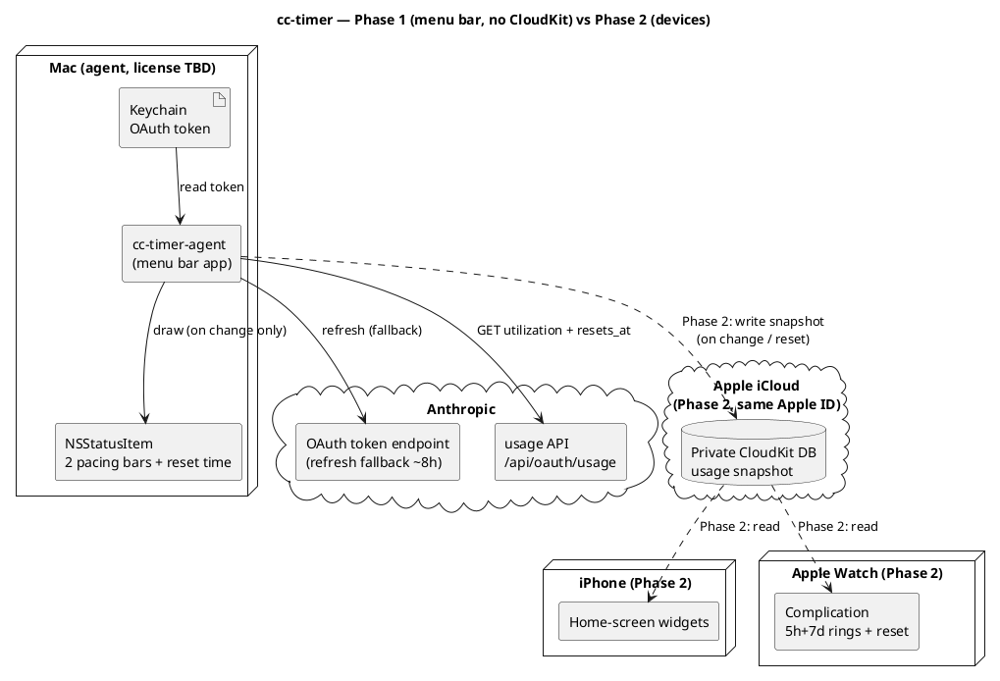

# Архітектура

Деталі продукту — у [SPEC.md](../SPEC.md). Тут — стисла архітектурна картина та потік даних.

## Принципи

- **Без власного бекенду.** Mac — єдиний компонент, що торкається Anthropic API.
- **Токен ніколи не покидає Mac.** Він лежить у macOS Keychain (`Claude Code-credentials`).
- **Перемальовування лише при зміні** даних (use або ресет таймера) — енергоефективність.

## Фаза 1 — menu bar app (без CloudKit)

Усе локально на одному Mac:

```
Keychain (OAuth token)
  → cc-timer-agent (menu bar app)
      → PollingEngine (живий async-цикл, pure ядро + seam'и, CCTimerKit)
        ├ інтервал: 429-backoff > Claude-неактивний 30 хв > AdaptiveCadence (3–15 хв за змінами вмісту)
        ├ sleep/wake (NSWorkspace) → пауза / негайний опит; мережа (NWPathMonitor) → негайний опит при відновленні
        ├ детект сесії Claude Code (sysctl, точне ім'я `claude`) → 30-хв оверрайд
      → GET https://api.anthropic.com/api/oauth/usage
        (headers: Authorization, anthropic-beta, User-Agent: claude-code/<version>)
      → (успіх/помилка опиту) → UsageHealth (lastSuccess/failingSince/reason, pure, CCTimerKit)
      → MenuBarLayout.make(UsageSnapshot?, UsageHealth) → MenuBarMode (idle/expanded/error, pure)
      → StatusItemView малює NSStatusItem (pacing-смужки + час ресету, `*` в idle, або ⚠️ при помилці)
      → клік по іконці → PopupLayout.make(UsageSnapshot?, UsageHealth, serviceStatus) (pure, CCTimerKit)
        → PopupViewController у NSMenu (заголовок + тьмяний рядок "Updated … · interval …" + рядки статусу сервісів + банер помилки + деталі 5h/7d + розбивка по моделях)

  Статус сервісів Claude (#31, другий, незалежний від usage потік):
  cc-timer-agent
    → на кожен PollOutput, коли StatusCadence.isDue (інтервал = max(5 хв, usage-інтервал))
    → GET https://status.claude.com/api/v2/summary.json (User-Agent: claude-code/<version>)
    → StatusClient.decode → StatusSummary (лише components[]; incidents/overall ігноруються)
    → StatusHealth.from → ServiceStatus×2 (Claude Code, Claude API) — pure, CCTimerKit; збій → unknown
    → PopupViewController малює два рядки (кольорова крапка + назва + слово-лінк на status.claude.com, лінк лише за non-operational)
    → StatusHealth.worstProblem → MenuBarLayout.serviceProblem → StatusItemView малює крапку зліва (лише за проблеми)
    → при проблемі StatusCadence.problemFloor (60с) пришвидшує опитування статусу
```

## Фаза 2 — пристрої (додається CloudKit)

```
cc-timer-agent → запис usage-snapshot у приватну CloudKit DB (той самий Apple ID)
CloudKit → віджети iPhone + комплікейшен Apple Watch (читання)
```

## Потік даних (Deployment)




[Двофазний deployment: Фаза 1 — самодостатній menu bar app, що читає Keychain і usage API; пунктирні шляхи Фази 2 додають CloudKit, віджети iPhone та комплікейшен Watch](https://www.plantuml.com/plantuml/svg/PLJ1ZjCm4BtdAqOvDTgcXKe8rCDgoow2QWLKAXANIcZgk8sLnBRiIQk2G7m4NyYNCB7JRhRS4izxRzxCStBd2HsrJPsGebg243cfHZhu-_iFh4hq4bx2g96wXIswCMW3zxLfYqT56Hny3vd1g9079QJF4byfRT5X0y8qrcYfQKqdbdPI4EfzBPD4cq92-X45Z8oLElUcTK82xXayXeL5KSfyDdcHfO0U6iRzI03OgDgX84WVvKcKgFH6VrwqL0APIkg0hGG3BuqXFS-J1-sDlem2Q6sK3vNdh4_hDI6rVacosUWPi26bzntDmmqFuYL19nljiI9Nafz98hhLGBhGL3fZbKY3xu7mm2v8NLYZWYadTonQmWxhUekYWbzlocZE81EUQxIU7SDYjTpeALer3P1fE0sKy3HqOorlNuNOk5UVs1WyDYmJYik7s4r5IcUwGC9jXqnNJXsGv2LtU7YxqT64rsXzQIYGHTKrZT6gLSbkuToiLxVXy6eb7qmZSo-Sv9KSLR6Nv2Cwlh1cb8nEloA9yaht6CwkPE_viLO2IHc-9g_AczS5E0xn4c3qtA4wsvM0FB-DTm7cZC0YnfJ4ewuO5XsACQtHEQvi08gBcSFxTr-W9LMhxy72kQl_XZH0ztU7yON38tyD6lXYQrOmkZvbIG-TJ6vvlOpgvvx3qIbwsZ_7-iISnavPmeoEs2zooEx6EvV32luh9dTyFVcty0y0)

## Компоненти (Фаза 1)

**SPM-розкладка:** `CCTimerKit` (library-таргет — вся логіка, що тестується і реюзується у Фазі 2)
+ `cc-timer` (executable-таргет — AppKit entry point). Збірка `.app` bundle: `scripts/build-app.sh`
→ `./build/cc-timer.app`.

| Компонент | Відповідальність |
|---|---|
| **AppLogger** | Наскрізна обгортка над `os.Logger` (4 категорії: `network`/`keychain`/`lifecycle`/`ui`, subsystem `com.artem-n.cc-timer`). Токен і секрети **ніколи не логуються** — дефолтний `<private>` redaction; лише безпечні діагностичні поля позначаються `.public`. |
| **TokenProvider** | Читання токена з Keychain (`SecItemCopyMatching` за service, декодування обгортки `claudeAiOauth`, перевірка `expiresAt`). Протухлий токен **не йде на API** — `currentAccessToken` кидає `.expired`, а polling-шар чекає на свіжий від Claude Code. Fallback-refresh при протуханні — наступний крок (PR 8b). Свідомий вибір `throws`+enum і розбивка обсягу — див. ADR-0007 |
| **UsageClient** | Запити до usage API (`GET /api/oauth/usage`) з обов'язковим `User-Agent: claude-code/<version>` (guard: без нього не ходити). Чисті seam'и `buildRequest`/`decode` окремо від мережевого `fetch` (інжектований `UsageTransport`, токен передається ззовні — Keychain не торкаємось). Типізований `UsageError`: `.http(status:body:)` несе тіло відповіді (`.public`-safe, обрізане) для рядка деталей у popup, `.transport(message:code:)` несе `URLError.Code` для точного мапінгу помилок (#12). Дати **не парсимо** — `resets_at` зберігаємо сирим рядком для `ResetClock`. Backoff — чистий `PollingBackoff` (180 с дефолт; на 429 `3→6→12→15 хв`, тримати 15 хв; reset на 200); *виконання* таймера — у polling-шарі (#13). Свідома розбивка backoff/seam — див. ADR-0008 |
| **PacingModel** | Порт `calc_time_pct` / `get_limit_indicator` зі statusline. Зони смужки — **безперервні частки [0,1]** (`BarLayout`) для піксельного малювання, не блоки; блокова квантизація — опційна похідна `blockIndex(fraction:cells:)` для popup (div. ADR-0005) |
| **ResetClock** | Парсинг `resets_at` (мікросекунди + `+00:00`, нормалізація як `parse_reset_epoch`) → `Date`; вибір найближчого ресету (5h vs 7d); форматування часу до ресету (`TimeToReset`): абсолютний `hh:mm` за локаллю (12/24-год) і локальним TZ з авто-DST якщо >90 хв, інакше відносний `1h10m`/`45m`/`40s`, або `.resetNow` при ресеті. Свідоме розходження зі statusline — див. ADR-0006 |
| **UsageHealth** | Чистий (без AppKit) value-тип стану опитування — **другий вхід** (поряд зі `UsageSnapshot`) для станів помилок (#12): `lastSuccess`/`failingSince`/`reason`. Пороги меню-бара — **чисті функції** від `failureAge(now:)`: `glyphAfter` = 30 хв (⚠️ біля смужок), `hideBarsAfter` = 60 хв (тільки ⚠️). `FailureReason` мапить `TokenError`/`UsageError` → семантичні причини (`notSignedIn`/`authHTTP(status:body:)`/`timeout`/`cannotResolveHost`/`network`/`serverProblem`/`unknown`) — exhaustive `switch` без `default`; рядок збирає view. Реюз у Фазі 2. Розкол — ADR-0010 |
| **MenuBarLayout** | Чиста (без AppKit), тестована модель «що малювати»: `MenuBarLayout.make(from:now:)` збирає `UsageSnapshot` → `MenuBarMode` (`idle` / `expanded`), переюзовуючи `PacingModel`/`ResetClock` без нової арифметики. Idle ⇔ обидва вікна `utilization < 5%` (строге `<`). Health-обізнана `make(from:health:now:)` (#12) додає `MenuBarMode.error` з **опційними** смужками: ≤30 хв невдач → stale-смужки без ⚠️; 30–60 хв → ⚠️ + останні смужки; >60 хв або cold-start → тільки ⚠️ (строгі межі). Живе в `CCTimerKit` — реюз у Фазі 2. Розкол pure/shell — ADR-0009, ADR-0010 |
| **StatusItemView** | Тонкий AppKit-shell (`NSView` у таргеті `cc-timer`): малює `MenuBarLayout` — дві смужки (5h/7d: used/gap/future + кружечок-індикатор часу в кольорі pacing) + час ресету, жирний `*` в idle, або ⚠️ (`exclamationmark.triangle`, **monochrome у `labelColor`**, опційно зі stale-смужками поряд) у стані помилки (#12). За `layout.serviceProblem != nil` (#31) — маленька кольорова крапка як **найлівіший** елемент (фіксований sRGB за severity), решта зсувається вправо; `itemWidth` додає її ширину. Показ через готовий non-template `NSImage` (`button.image`), не subview; кольори — точна `statusline`-палітра (236/71/167/23, фіксований sRGB). ⚠️ малюється `respectFlipped: true` (view `isFlipped`). Перемальовування лише при зміні `layout`. Розкол — ADR-0009, ADR-0010 |
| **PopupLayout** | Чиста (без AppKit), тестована модель «що показати в popup»: `PopupLayout.make(from:now:lastUpdate:interval:)` збирає `UsageSnapshot` → масив секцій `LimitRow` (5h, 7d, потім `Opus`/`Sonnet` якщо є — `nil`-safe) + сирі секунди службового рядка. Кожен `LimitRow` несе `utilization`/`pacing`/`indicator`/`BarLayout` + розщеплений ресет: `resetRelative` завжди, `resetAbsolute` лише якщо <24 год. Health-обізнана `make(from:health:now:interval:)` (#12) додає поле `warning: FailureReason?` — **одразу** за будь-якої невдачі (без 30-хв порогу), `lastUpdateAge` від `health.lastSuccess`, `rows` зі stale-snapshot (порожні на cold-start). Несе **лише сирі числа, семантичні enum'и й часові рядки ResetClock** — речення збирає view. Реюз у Фазі 2. ADR-0009, ADR-0010 |
| **PopupViewController** | Тонкий AppKit-shell (`NSViewController` у `cc-timer`): малює `PopupLayout` у стилі рідних menu-bar віджетів — заголовок, одразу під ним тьмяний рядок `Updated #m ago  ·  interval #m` (`serviceLineText`, поєднує вік даних і cadence), далі рядки статусу сервісів (#31), *(за помилки)* двозначний банер (жирний рядок із ⚠️ + детальний рядок), далі секції лімітів; між блоками — горизонтальні риски `NSBox` із симетричним відступом (`addSeparatorIfNeeded` не дублює риску, коли проміжний блок відсутній). Хоститься в `NSMenuItem.view` через `statusItem.menu` (**без пипки**, кнопка підсвічена). `PopupBarView` малює `BarLayout` тими ж зонами, що menu bar, але **appearance-aware** палітрою, і додає під баром **шкалу-засічки** — `LimitRow.subdivisions − 1` рисок на межах рівних під-інтервалів вікна (5h → 4 на межах годин, 7d → 6 на межах діб), слабших за точку-індикатор. Форматування рядків (зокрема `warningTitle`/`warningDetail`) — у `static` форматерах тут (точка локалізації). Розмір шрифту іконки — #26. ADR-0009, ADR-0010 |
| **StatusHealth / StatusSummary** | Чисте (без AppKit) ядро статусу сервісів Claude (#31, `CCTimerKit`). `StatusSummary` (Decodable) парсить **лише** `components[]` ендпоінта status.claude.com — `incidents`/`status`/`scheduled_maintenances` навмисно НЕ декодуються (ADR-0013), тож «відомі виключення» типу призупинення Mythos/Fable (інцидент `major`, компонент `operational`) не шумлять. `ServiceStatus` мапить сирий рядок (`operational`/`degraded_performance`/`partial_outage`/`major_outage`/`under_maintenance`→семантика, інше→`unknown`); має `severity`/`isProblem`. `StatusHealth.from` витягує два компоненти за точним іменем (`Claude Code`, `Claude API (api.anthropic.com)`); відсутній → `unknown`. `StatusHealth.unknown` — стан при збої fetch (shell підставляє). `worstProblem` → найсерйозніший non-operational стан двох компонентів (або `nil`), драйвить menu-bar крапку й прискорену cadence. Без локалізованих рядків і кольорів — їх збирає view. ADR-0013 |
| **StatusClient** | HTTP-seam status-ендпоінта (`CCTimerKit`), дзеркало `UsageClient`: чисті `buildRequest()` (обов'язковий `User-Agent: claude-code/<version>`, без auth) / `decode(from:)` окремо від мережевого `fetch(transport:)` (реюз `UsageTransport`). Один запит, без сну/ретраю. Будь-який збій (transport/не-200/decode) → `StatusFetchError`, який shell перетворює на `StatusHealth.unknown` — **не** ескалює usage 429-backoff. ADR-0013 |
| **StatusCadence** | Чистий seam ввічливої частоти статус-поллінгу (`CCTimerKit`): `interval(usageInterval:hasProblem:) = max(floor, usageInterval)` та `isDue(lastSuccess:usageInterval:hasProblem:now:)`. Статус не має власного таймера — хантажиться з usage-tick: слідує за usage-cadence, коли той повільний (простій → 30 хв), але ніколи не частіше за підлогу, навіть коли usage в 429-backoff. **Дві підлоги:** `floor` = 5 хв коли все operational; `problemFloor` = 60 с щойно є проблема (швидко ловити ескалацію/відновлення інциденту). ADR-0013 |
| **AdaptiveCadence** | Чиста (без AppKit) value-стейт-машина частоти **за вмістом** — друга вісь поряд із `PollingBackoff` (429). `unchanged()` подвоює інтервал `3→6→12→15 хв` (та сама прогресія, тримати стелю), `changed()` миттєво скидає до 3 хв. Керує цикл #13: «зміна» = відрізняється `utilization` 5h/7d. Реюз у Фазі 2. ADR-0011 |
| **PollingEngine** | Живий async-цикл опитування (`CCTimerKit`): pure ядро (`advance`/`effectiveInterval`/`intervalDecision`, юніт-тестоване) + seam'и (`PollScheduler`/`TokenProviding`/`ClaudeActivityProbe`/`UsageTransport`/`now`). `run() -> AsyncStream<PollOutput>`. Інтервал — пріоритет `429-backoff > Claude-неактивний 30 хв > AdaptiveCadence`, **ніколи нижче `minInterval` = 60 с** (жорсткий рубіж проти тісного циклу). Sleep → park, wake/networkRestored → негайний опит. Token-помилка не йде в мережу (ADR-0007) і не чіпає інтервали. Кожна зміна інтервалу логується з причиною (лише при зміні). ADR-0011 |
| **LivePollScheduler** | Виробничий `PollScheduler` (`CCTimerKit`, **тестований** — лише `AsyncStream`+`Task.sleep`, без AppKit). `waitForNextPoll` чекає весь інтервал, доки не прийде справжній сигнал; `SignalGate` демультиплексує сигнальний стрім і резюмить очікувача рівно раз (сигнал/дедлайн/finish). Інваріант «порожній стрім не повертає миттєво» — головний запобіжник частоти. ADR-0011 |
| **PollingShell** (`cc-timer`) | Тонкі **платформенні** seam'и: `WorkspaceSleepWake` (`NSWorkspace.shared.notificationCenter`), `NetworkMonitor` (`NWPathMonitor`, edge `.unsatisfied→.satisfied` → `.networkRestored`), `ProcessClaudeActivityProbe` (`sysctl(KERN_PROC_ALL)`, точне ім'я `claude` — CLI, не Desktop), `SignalHub` (фан-ін сигналів, `bufferingNewest(1)`). ADR-0011 |
| **LaunchAtLogin** | Чисте (без AppKit/ServiceManagement), тестоване ядро launch-at-login (#14): `Status` — framework-free дзеркало `SMAppService.Status` (`registered`/`notRegistered`/`requiresApproval`/`notFound`) + предикати `shouldRegisterOnFirstLaunch` (opt-out лише на `.notRegistered`), `toggleState(for:)`, `needsSystemSettings`, `isAvailable` (`false` на `.notFound` → UI дизейблить чекбокс). Реюз у Фазі 2. ADR-0012 |
| **LaunchAtLoginController** (`cc-timer`) | Тонкий `ServiceManagement`-glue над `SMAppService.mainApp`: `currentStatus()` (мапінг у `LaunchAtLogin.Status`), `enable()`/`disable()` (throws), `openLoginItemsSettings()`. Best-effort — `register()` надійний лише на підписаному bundle; на unsigned/`swift run` throw ловиться й логується, не валить застосунок. Manual verification (системний синглтон). ADR-0012 |
| **ConfigureWindowController** (`cc-timer`) | Вікно «Configure…» (#14) внизу popup-меню: single-instance `NSWindowController` (toggle «Launch at login» + версія + GitHub-лінк). Виходить на передній план через `NSApp.activate` + `level=.floating` (без `setActivationPolicy(.regular)`). Toggle ре-синкається з `SMAppService.status` при кожному показі; на `.notFound` (недоступно) — дизейбл + пояснення запустити інстальований `.app`. ADR-0012 |
