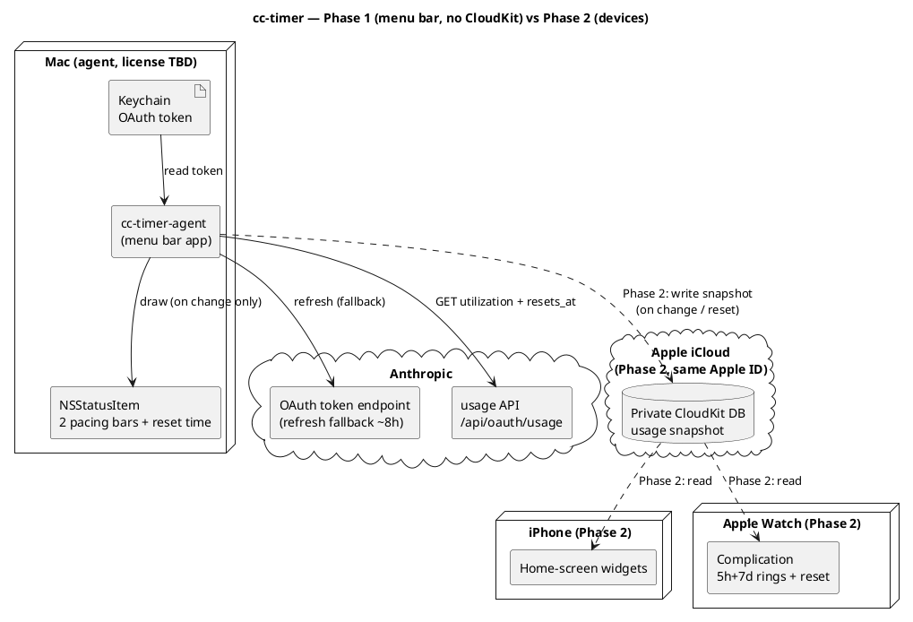

# Архітектура

Деталі продукту — у [SPEC.md](../SPEC.md). Тут — стисла архітектурна картина та потік даних.

## Принципи

- **Без власного бекенду.** Mac — єдиний компонент, що торкається Anthropic API.
- **Токен ніколи не покидає Mac.** Він лежить у macOS Keychain (`Claude Code-credentials`).
- **Перемальовування лише при зміні** даних (use або ресет таймера) — енергоефективність.

## Фаза 1 — menu bar app (без CloudKit)

Усе локально на одному Mac:

```
Keychain (OAuth token)
  → cc-timer-agent (menu bar app)
      → GET https://api.anthropic.com/api/oauth/usage
        (headers: Authorization, anthropic-beta, User-Agent: claude-code/<version>)
      → малювання NSStatusItem (дві pacing-смужки + час ресету)
```

## Фаза 2 — пристрої (додається CloudKit)

```
cc-timer-agent → запис usage-snapshot у приватну CloudKit DB (той самий Apple ID)
CloudKit → віджети iPhone + комплікейшен Apple Watch (читання)
```

## Потік даних (Deployment)




[Двофазний deployment: Фаза 1 — самодостатній menu bar app, що читає Keychain і usage API; пунктирні шляхи Фази 2 додають CloudKit, віджети iPhone та комплікейшен Watch](https://www.plantuml.com/plantuml/svg/PLJ1ZjCm4BtdAqOvDTgcXKe8rCDgoow2QWLKAXANIcZgk8sLnBRiIQk2G7m4NyYNCB7JRhRS4izxRzxCStBd2HsrJPsGebg243cfHZhu-_iFh4hq4bx2g96wXIswCMW3zxLfYqT56Hny3vd1g9079QJF4byfRT5X0y8qrcYfQKqdbdPI4EfzBPD4cq92-X45Z8oLElUcTK82xXayXeL5KSfyDdcHfO0U6iRzI03OgDgX84WVvKcKgFH6VrwqL0APIkg0hGG3BuqXFS-J1-sDlem2Q6sK3vNdh4_hDI6rVacosUWPi26bzntDmmqFuYL19nljiI9Nafz98hhLGBhGL3fZbKY3xu7mm2v8NLYZWYadTonQmWxhUekYWbzlocZE81EUQxIU7SDYjTpeALer3P1fE0sKy3HqOorlNuNOk5UVs1WyDYmJYik7s4r5IcUwGC9jXqnNJXsGv2LtU7YxqT64rsXzQIYGHTKrZT6gLSbkuToiLxVXy6eb7qmZSo-Sv9KSLR6Nv2Cwlh1cb8nEloA9yaht6CwkPE_viLO2IHc-9g_AczS5E0xn4c3qtA4wsvM0FB-DTm7cZC0YnfJ4ewuO5XsACQtHEQvi08gBcSFxTr-W9LMhxy72kQl_XZH0ztU7yON38tyD6lXYQrOmkZvbIG-TJ6vvlOpgvvx3qIbwsZ_7-iISnavPmeoEs2zooEx6EvV32luh9dTyFVcty0y0)

## Компоненти (Фаза 1)

**SPM-розкладка:** `CCTimerKit` (library-таргет — вся логіка, що тестується і реюзується у Фазі 2)
+ `cc-timer` (executable-таргет — AppKit entry point). Збірка `.app` bundle: `scripts/build-app.sh`
→ `./build/cc-timer.app`.

| Компонент | Відповідальність |
|---|---|
| **AppLogger** | Наскрізна обгортка над `os.Logger` (3 категорії: `network`/`keychain`/`lifecycle`, subsystem `com.artem-n.cc-timer`). Токен і секрети **ніколи не логуються** — дефолтний `<private>` redaction; лише безпечні діагностичні поля позначаються `.public`. |
| **TokenProvider** | Читання токена з Keychain; fallback-refresh при протуханні (рідко) |
| **UsageClient** | Запити до usage API з обов'язковим `User-Agent`; backoff при 429 |
| **PacingModel** | Порт `calc_time_pct` / `build_progress_bar` / `get_limit_indicator` зі statusline |
| **StatusItemView** | Кастомна `NSView` (смужки + час); idle-режим; стани помилок |
| **Popup** | Деталі лімітів, розбивка по моделях, службовий рядок (останнє оновлення + інтервал) |
