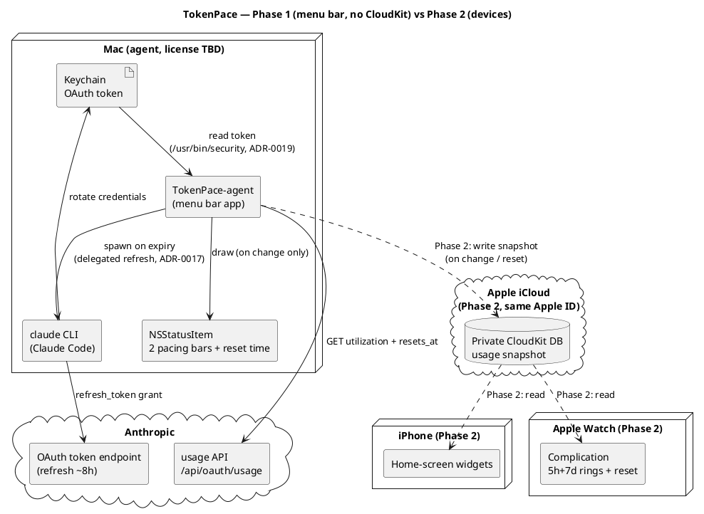
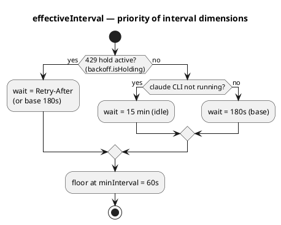
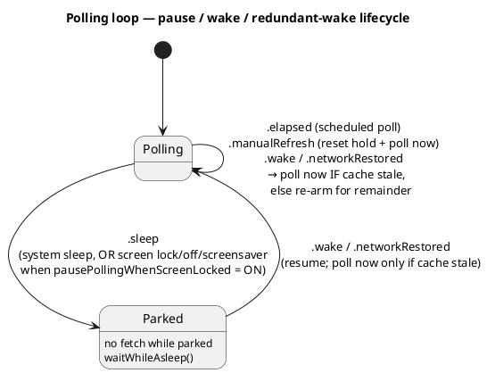

# Архітектура

Деталі продукту — у [SPEC.md](../SPEC.md). Тут — стисла архітектурна картина та потік даних.

## Принципи

- **Без власного бекенду.** Mac — єдиний компонент, що торкається Anthropic API.
- **Токен ніколи не покидає Mac.** Він лежить у macOS Keychain (`Claude Code-credentials`).
- **Перемальовування лише при зміні** даних (use або ресет таймера) — енергоефективність.

## Фаза 1 — menu bar app (без CloudKit)

Усе локально на одному Mac:

```
Keychain (OAuth token)
  → TokenPace-agent (menu bar app)
      → PollingEngine (живий async-цикл, pure ядро + seam'и, TokenPaceKit)
        ├ інтервал (ADR-0032): 429-hold (Retry-After, без ескалації) > Claude-неактивний 15 хв > база 3 хв
        ├ sleep/wake + екран (lock/screensaver/display-off, опція) → пауза; wake → опит лише якщо кеш застарів
        ├ мережа (NWPathMonitor) → опит при відновленні (та сама умова свіжості кешу)
        ├ детект сесії Claude Code (sysctl, точне ім'я `claude`) → 15-хв оверрайд
      → GET https://api.anthropic.com/api/oauth/usage
        (headers: Authorization, anthropic-beta, User-Agent: claude-code/<version>)
      → (успіх/помилка опиту) → UsageHealth (lastSuccess/failingSince/reason, pure, TokenPaceKit)
      → MenuBarLayout.make(UsageSnapshot?, UsageHealth) → MenuBarMode (expanded/error, pure)
      → StatusItemView малює NSStatusItem (pacing-смужки + час ресету, або ⚠️ при помилці/cold-start)
      → клік по іконці → PopupLayout.make(UsageSnapshot?, UsageHealth, serviceStatus) (pure, TokenPaceKit)
        → PopupViewController у NSMenu (перший рядок — болд-заголовок "Claude Code" (бренд-колір, ADR-0021), завжди; тьмяний рядок "Updated … · interval …" + рядки статусу сервісів (умовно, див. нижче) + банер помилки + деталі 5h/7d двоколонковим split-layout (ADR-0021) + розбивка по моделях: top-level Opus/Sonnet + `weekly_scoped` з `limits[]`, напр. Fable; увесь текст дропдауна — один спільний шрифт/кегль, ADR-0021)
      → (кожен PollOutput несе PollDiagnostics: сира FetchDiagnostics + TokenDiagnostics — дати, без секрету)
      → "Settings…" видно завжди; ⌥ Option показує окремий пункт "Troubleshoot…" під ним (isHidden-toggle через modifier-polling таймер, не нативний alternate) → TroubleshootLayout.make(PollOutput?) (pure, TokenPaceKit)
        → TroubleshootWindowController (велике resizable-вікно, .normal-рівень, live-оновлення щополу): Update interval (refresh-каденція як тривалість + next-update timestamp + кнопка "Refresh now" → forceRefresh: .manualRefresh + скид status-cadence) + токен (read/expires) + сира відповідь usage API (претіфікований JSON / payload помилки + HTTP-статус + timestamp)

  Статус сервісів Claude (#31, другий, незалежний від usage потік):
  TokenPace-agent
    → на кожен PollOutput, коли StatusCadence.isDue (інтервал = max(5 хв, usage-інтервал))
    → GET https://status.claude.com/api/v2/summary.json (User-Agent: claude-code/<version>)
    → StatusClient.decode → StatusSummary (лише components[]; incidents/overall ігноруються)
    → StatusHealth.from(summary, config: MonitoredServices) → checks: [ServiceCheck] — увімкнені логічні сервіси (Claude API завжди; Claude Code / Claude WEB·Desktop[+Cowork] за конфігом), кожен worst-of-N по складових — pure, TokenPaceKit; збій → unknown(for: config)
    → PopupViewController малює по рядку на монітований КОМПОНЕНТ (кольорова крапка + коротка назва Code/API/WEB·Desktop/Cowork + слово-лінк на status.claude.com, лінк лише за non-operational) разом з "Updated … · interval …" — **лише** коли worstProblem != nil; WEB/Desktop у Cowork-режимі = два окремі рядки (WEB/Desktop + Cowork), без ⌥-розгортання; болд-заголовок секції "Claude" лишається завжди
    → StatusHealth.worstProblem (worst-of-all увімкнених) → MenuBarLayout.serviceProblem → StatusItemView малює одну крапку справа (лише за проблеми)
    → при проблемі StatusCadence.problemFloor (60с) пришвидшує опитування статусу
```

## Фаза 2 — пристрої (додається CloudKit)

```
TokenPace-agent → запис usage-snapshot у приватну CloudKit DB (той самий Apple ID)
CloudKit → віджети iPhone + комплікейшен Apple Watch (читання)
```

## Потік даних (Deployment)




[Двофазний deployment: Фаза 1 — самодостатній menu bar app, що читає Keychain і usage API; пунктирні шляхи Фази 2 додають CloudKit, віджети iPhone та комплікейшен Watch](https://www.plantuml.com/plantuml/svg/PLJ1ZjCm4BtdAqOvDTgcXKe8rCDgoow2QWLKAXANIcZgk8sLnBRiIQk2G7m4NyYNCB7JRhRS4izxRzxCStBd2HsrJPsGebg243cfHZhu-_iFh4hq4bx2g96wXIswCMW3zxLfYqT56Hny3vd1g9079QJF4byfRT5X0y8qrcYfQKqdbdPI4EfzBPD4cq92-X45Z8oLElUcTK82xXayXeL5KSfyDdcHfO0U6iRzI03OgDgX84WVvKcKgFH6VrwqL0APIkg0hGG3BuqXFS-J1-sDlem2Q6sK3vNdh4_hDI6rVacosUWPi26bzntDmmqFuYL19nljiI9Nafz98hhLGBhGL3fZbKY3xu7mm2v8NLYZWYadTonQmWxhUekYWbzlocZE81EUQxIU7SDYjTpeALer3P1fE0sKy3HqOorlNuNOk5UVs1WyDYmJYik7s4r5IcUwGC9jXqnNJXsGv2LtU7YxqT64rsXzQIYGHTKrZT6gLSbkuToiLxVXy6eb7qmZSo-Sv9KSLR6Nv2Cwlh1cb8nEloA9yaht6CwkPE_viLO2IHc-9g_AczS5E0xn4c3qtA4wsvM0FB-DTm7cZC0YnfJ4ewuO5XsACQtHEQvi08gBcSFxTr-W9LMhxy72kQl_XZH0ztU7yON38tyD6lXYQrOmkZvbIG-TJ6vvlOpgvvx3qIbwsZ_7-iISnavPmeoEs2zooEx6EvV32luh9dTyFVcty0y0)

## Каденція опитування (ADR-0032)

Пласка 3-хв база з двома оверрайдами; reset-тригер лишається в shell-таймері (#36, ADR-0030); пауза на
екрані — опція; надлишковий wake придушується, якщо кеш ще свіжий.

**Пріоритет вибору інтервалу:**




**Цикл пауза / wake / надлишковий wake:**




## Компоненти (Фаза 1)

**SPM-розкладка:** `TokenPaceKit` (library-таргет — вся логіка, що тестується і реюзується у Фазі 2)
+ `TokenPace` (executable-таргет — AppKit entry point). Збірка `.app` bundle: `scripts/build-app.sh`
→ `./build/TokenPace.app`.

| Компонент | Відповідальність |
|---|---|
| **AppLogger** | Наскрізна обгортка над `os.Logger` (4 категорії: `network`/`keychain`/`lifecycle`/`ui`, subsystem `com.artem-n.tokenpace`). Токен і секрети **ніколи не логуються** — дефолтний `<private>` redaction; лише безпечні діагностичні поля позначаються `.public`. Повний каталог меседжів — [`docs/log-messages.md`](log-messages.md). |
| **TokenProvider** | Читання токена з Keychain **сабпроцесом `/usr/bin/security find-generic-password -w`** (матч лише за service; декодування обгортки `claudeAiOauth`, перевірка `expiresAt`). Прямий `SecItemCopyMatching` свідомо не використовується: Claude Code на кожному refresh переписує item через `security add-generic-password -U`, що **скидає ACL partition list** до `apple-tool:` і знову викликає keychain-промпти у GUI-застосунку; `security` — Apple-tool, тож читає тихо за будь-якого підпису збірки (ADR-0019). Pure-обробка виводу — `parseSecretOutput` (trailing newline, захисний hex-декод) та `mapExitStatus` (exit 44 → `.itemNotFound`), обидві юніт-тестовані. Протухлий токен **не йде на API** — але рішення про expiry ухвалює **engine**, не провайдер (ADR-0020): `currentCredentials(now:)` віддає `TokenCredentials {accessToken, expiresAt}` (без `refreshToken` — секрет не тягнеться в engine), а `PollingEngine.pollOnce` перевіряє `isExpired`, короткозамикає мережу і реагує **делегованим refresh** (ADR-0017): спавнить `claude` CLI, щоб Claude Code сам ротував пару, і перечитує Keychain. Одне Keychain-читання на пол; `expiresAt` доступний навіть для протухлого токена (для діагностики). TokenPace ніколи не пише в Keychain і не виконує `refresh_token` grant. Свідомий вибір `throws`+enum і розбивка обсягу — див. ADR-0007, ADR-0020 |
| **DelegatedRefresh / RefreshGate** | Kit-сторона делегованого refresh (ADR-0017): протокол `DelegatedRefresher` (`refresh() async -> DelegatedRefreshOutcome`, fail-safe — не кидає) + чистий `RefreshGate` — anti-flap гейт спроб з ескалацією cooldown `1→5→30→60 хв` після невдач (у стилі `PollingBackoff`, юніт-тестований). Outcome-и: `refreshed`/`unchanged`/`cliNotFound`/`timedOut`/`failed(exitCode:)` |
| **UsageClient** | Запити до usage API (`GET /api/oauth/usage`) з обов'язковим `User-Agent: claude-code/<version>` (guard: без нього не ходити). Чисті seam'и `buildRequest`/`decode` окремо від мережевого `fetch` (інжектований `UsageTransport`, токен передається ззовні — Keychain не торкаємось). Типізований `UsageError`: `.http(status:body:)` несе тіло відповіді (`.public`-safe, обрізане до `maxBodyLength`=500) для рядка деталей у popup, `.transport(message:code:)` несе `URLError.Code` для точного мапінгу помилок (#12). Тіло `fetch` переїхало в `diagnosedFetch -> DiagnosedFetch` (ADR-0020): у кожній гілці (200/429/інші не-2xx/decode-fail/transport/non-HTTP/not-sent) складає `FetchDiagnostics` із **повним** (некапнутим) body для вікна Troubleshoot; `fetch` — тонка обгортка (`result.get()`), сигнатура й `FetchTests` незмінні. Дати **не парсимо** — `resets_at` зберігаємо сирим рядком для `ResetClock`. На межі ресету API присилає в тілі 200 `null`/відсутні core-вікна — `UsageSnapshot.decode` **синтезує** свіже вікно (`utilization=0`, `resets_at` із самого вікна → `limits[]` → локальна оцінка `ResetClock.nextReset`) замість падіння (інакше — хибне «Usage API unavailable»); `now` прокидається через `JSONDecoder.userInfo`. **Виняток для `five_hour` (#100, ADR-0027):** коли `resets_at` немає ані у вікні, ані в `limits[]`, 5h-вікна **не існує** (немає активної сесії) — `window(...)` віддає `sessionIdle: true` і `resets_at: ""` **без** локальної оцінки й без лог-синтезу (та оцінка й давала фантомний `now+5h`); локальна оцінка лишається лише для `seven_day`. `is_active` навмисно не використовується як детектор (ненадійний). Per-model під-вікна (`Opus`/`Sonnet`), коли присутні з `resets_at:null`, успадковують `resets_at` від `seven_day` (ресетяться разом — інакше хибне «resetting…»). `limits[]` тепер декодує й `scope.model.display_name` (`weekly_scoped`) — це єдине джерело per-model лімітів без top-level поля (напр. Fable, #65): computed `UsageSnapshot.scopedModelWindows` мапить `percent → utilization`, позичає `resets_at` від `seven_day` коли порожній і дедуплікує проти присутніх legacy-полів (case-insensitive; legacy виграє — має десяткову `utilization`). При справжньому decode-fail логується обрізане тіло (діагностика змін схеми). Деталі — ADR-0014. Backoff — чистий `PollingBackoff` (180 с дефолт; на 429 **hold** рівно на `Retry-After` (або 180 с), **без ескалації** — ADR-0032; reset на 200); *виконання* таймера — у polling-шарі (#13). Свідома розбивка backoff/seam — див. ADR-0008 |
| **PacingModel** | Порт `calc_time_pct` / `get_limit_indicator` зі statusline. Зони смужки — **безперервні частки [0,1]** (`BarLayout`) для піксельного малювання, не блоки; блокова квантизація — опційна похідна `blockIndex(fraction:cells:)` для popup (div. ADR-0005) |
| **ResetClock** | Парсинг `resets_at` (мікросекунди + `+00:00`, нормалізація як `parse_reset_epoch`) → `Date`; вибір найближчого ресету (5h vs 7d); форматування часу до ресету (`TimeToReset`): абсолютний `hh:mm` за локаллю (12/24-год) і локальним TZ з авто-DST якщо >90 хв, інакше відносний `1h10m`/`45m` (округлення до найближчої хвилини) чи `<1m` під хвилину — без секундної смуги (#36/ADR-0030: menu bar перемальовується на ~30-с каденсі, тож секунди стрибали б рвано), або `.resetNow` при ресеті (view малює нейтральний `«<1m»`, не ⏰ — #36, ADR-0030). `nextReset(now:window:)` — оцінка наступного ресету (`now + durationSeconds`, округлення вгору до 10 хв) як last-resort fallback для синтезу вікна на межі ресету (ADR-0014). `timeToResetCompactDays(...)` — варіант для menu bar в idle-стані (#100, ADR-0027): `≥24 год` → компактний `«4d»` (та сама арифметика, що `relativeRounded` у попапі), `<24 год` → делегує в незмінний `timeToReset`. **Оптимістичний ресет (#36, ADR-0030):** `optimisticReset(_:now:)` — чиста функція, що котить snapshot на межу ресету (кожне вікно з `resets_at ≤ now` → `utilization=0` + наступне вікно; idle-5h лишається idle; активне 5h синтезує `now+5h` — свідомий виняток із #100; 7d → `now+7d`, під-вікна їдуть за ним; `limits` без змін — наступний успішний полл усе перезапише); `nextResetInstant(...)` — найближчий **майбутній** ресет для one-shot таймера координатора. Свідоме розходження зі statusline — див. ADR-0006 |
| **UsageHealth** | Чистий (без AppKit) value-тип стану опитування — **другий вхід** (поряд зі `UsageSnapshot`) для станів помилок (#12): `lastSuccess`/`failingSince`/`reason`. Пороги меню-бара — **чисті функції** від `failureAge(now:)`: `glyphAfter` = 30 хв (⚠️ біля смужок), `hideBarsAfter` = 60 хв (тільки ⚠️). `FailureReason` мапить `TokenError`/`UsageError` → семантичні причини (`notSignedIn`/`authHTTP(status:body:)`/`timeout`/`cannotResolveHost`/`network`/`serverProblem`/`unknown`) — exhaustive `switch` без `default`; рядок збирає view. Реюз у Фазі 2. Розкол — ADR-0010 |
| **MenuBarLayout** | Чиста (без AppKit), тестована модель «що малювати»: `MenuBarLayout.make(from:now:resetMode:)` збирає `UsageSnapshot` → `MenuBarMode.expanded` (завжди дві смужки, за будь-якого `utilization` — компактного/idle-режиму **немає**, ADR-0015), переюзовуючи `PacingModel`/`ResetClock`. **Вибір reset-часу** (#103, ADR-0029) — `selectReset` за таблицею станів 5h × 7d (`BarLayout.severity`: calm/ahead/exhausted) + `ResetCountdownMode`: `.expanded` несе `resetToShow: ResetToShow?` (nil = ховати; `which`+`display`). Правила: 5h шумний → час 5h; lone orange-7d gated режимом+відстанню, red-7d завжди; обидва шумні → наступне полегшення (обидва red → пізніший через `ResetClock.latestReset`, обидва orange → ранній, red+orange → red-бар). За `snapshot.sessionIdle` (#100, ADR-0027) — так само `.expanded`, 5h-`BarView` `idle: true` (severity → `.calm`, view малює суцільний синій), вибір робить лише 7d. Health-обізнана `make(from:health:now:resetMode:)` (#12) додає `MenuBarMode.error` з **опційними** смужками (≤30 хв → stale без ⚠️; 30–60 хв → ⚠️ + смужки + **найближчий** ресет як діагностика; >60 хв/cold → тільки ⚠️). Живе в `TokenPaceKit` — реюз у Фазі 2. Розкол pure/shell — ADR-0009 (idle-частину superseded ADR-0015), ADR-0010 |
| **StatusItemView** | Тонкий AppKit-shell (`NSView` у таргеті `TokenPace`): малює `MenuBarLayout` — дві смужки (5h/7d: used/gap/future + кружечок-індикатор часу в кольорі pacing) + час ресету, або ⚠️ (`exclamationmark.triangle`, **monochrome у `labelColor`**, опційно зі stale-смужками поряд) у стані помилки/cold-start (#12). За `layout.serviceProblem != nil` (#31) — маленька кольорова крапка як **найлівіший** елемент (фіксований sRGB за severity), решта зсувається вправо; `itemWidth` додає її ширину. Показ гейтиться налаштуванням «Show service status dot on issues» (default-on): `App.render` передає `serviceProblem: nil`, коли `PersistedConfig.showServiceStatusDot` вимкнено, тож і крапка, і резерв її ширини зникають (сам view не змінюється). За `BarView.idle` (#100, ADR-0027) 5h-смужка малюється суцільним `Palette.idleBlue` (85/130/180 — приглушений, трохи темніший синій) без зон і кружечка. Показ через готовий non-template `NSImage` (`button.image`), не subview; кольори — точна `statusline`-палітра (236/71/167/23, фіксований sRGB). За `calmColors` (#105, з `PersistedConfig.calmMenuBarColors`) **м'які** pacing-кольори гасяться в білий — idle-синій, on-pace-зелений і **mild** ahead-жовтий; кружечок-індикатор **біліє разом зі своїм gap** (обидва рахують «спокій» через спільний `BarLayout.isCalm` — крапка ніколи не «висить» кольоровою над білою смужкою), а orange/red (strong-ahead/exhausted), service-крапка та ⚠️ лишаються кольоровими (лише menu bar, popup не чіпається). Той самий `BarLayout.severity`/`isCalm` живить і гасіння кольору (#105), і вибір reset-часу (#103, ADR-0029) — рендер лише малює `resetToShow` (nil → без label і без резерву ширини в `itemWidth`/`barsBlockWidth`). ⚠️ малюється `respectFlipped: true` (view `isFlipped`). Перемальовування лише при зміні `layout` (та `calmColors`). Розкол — ADR-0009, ADR-0010 |
| **PopupLayout** | Чиста (без AppKit), тестована модель «що показати в popup»: `PopupLayout.make(from:now:lastUpdate:interval:)` збирає `UsageSnapshot` → масив секцій `LimitRow` (5h, 7d, потім `Opus`/`Sonnet` якщо є — `nil`-safe, потім scoped-моделі з `limits[]`: `<display_name> (7-day)`, напр. Fable, без дублів із legacy-рядками) + сирі секунди службового рядка. Кожен `LimitRow` несе `utilization`/`pacing`/`indicator`/`BarLayout` + розщеплений ресет: `resetRelative` завжди, `resetAbsolute` лише якщо <24 год. За `snapshot.sessionIdle` (#100, ADR-0027) 5h-рядок будується як `idleFiveHourRow` (`sessionIdle: true`, усі reset-поля `nil`, інертний зеровий бар) — view малює суцільний синій бар, статус «ready to start», **без другого рядка**. Health-обізнана `make(from:health:now:interval:)` (#12) додає поле `warning: FailureReason?` — **одразу** за будь-якої невдачі (без 30-хв порогу), `lastUpdateAge` від `health.lastSuccess`, `rows` зі stale-snapshot (порожні на cold-start). Несе **лише сирі числа, семантичні enum'и й часові рядки ResetClock** — речення збирає view. Реюз у Фазі 2. ADR-0009, ADR-0010 |
| **TroubleshootLayout** | Чиста (без AppKit), тестована view-model вікна Troubleshoot (`TokenPaceKit`, ADR-0020): `make(from: PollOutput?, timeZone:)` → рядки трьох секцій (Update interval: `Refresh interval: <тривалість>` + `Next update: ≈ <timestamp>`; токен: read/expires; usage-API: timestamp/HTTP-статус/body) — вичерпний `switch` над `FetchDiagnostics.Outcome` без `default`. Поле `bodyIsJSON` (гейт підсвітки в shell — `true` там, де `bodyText` реально парситься як JSON: success + будь-який outcome із JSON-payload, через `isJSON`; `false` для HTML/plain/плейсхолдерів). `prettyPrinted` (перше `JSONSerialization` у кодовій базі — sorted-keys претіфікація JSON, passthrough для HTML/plain), `timestampText` (фіксований `yyyy-MM-dd HH:mm:ss (<tz>)`, `en_US_POSIX`, для баг-репортів — свідоме відхилення від локалізованого `ResetClock`) і `durationText` (компактна тривалість `Ns`/`Nm`/`Nh Mm`/`Nd Mh` для рядка інтервалу). Реюз у Фазі 2. ADR-0020 |
| **JSONHighlighter** | Чистий (без AppKit) токенайзер JSON для підсвітки body у вікні Troubleshoot (`TokenPaceKit`, ADR-0020): `tokens(in: String) -> [Token]` — однопрохідний сканер по UTF-16 pretty-printed рядка, повертає `NSRange` + `JSONTokenKind` (`key`/`string`/`number`/`bool`/`null`/`punctuation`). **Не `NSRegularExpression`:** сканер пам'ятає контекст — розрізняє ключ від string-value за `:` після нього і не рве рядок на escaped-лапках `\"`. Класифікує синтаксично (не валідує граматику — гейт валідності `TroubleshootLayout.bodyIsJSON`). Кольори (`JSONTokenKind → NSColor`) живуть у shell; тип колір-агностичний → реюз у Фазі 2. ADR-0020 |
| **PopupViewController** | Тонкий AppKit-shell (`NSViewController` у `TokenPace`): малює `PopupLayout` у стилі рідних menu-bar віджетів — болд-заголовок секції **«Claude»** (бренд-колір, ADR-0021), у правій половині якого під ⌥ Option показується вік даних `#m ago` (`addSplitLine` у `rebuild`); далі рядки статусу — **по одному на монітований компонент** (ітерація по `StatusHealth.checks.flatMap(components)`), коротка назва з `displayName(_:)` seam (Code/API/WEB·Desktop/Cowork, без «Claude»-префікса — він у заголовку секції); WEB/Desktop у Cowork = два окремі рядки, без ⌥-розгортання (#31, #89, ADR-0024), *(за помилки)* двозначний банер (жирний рядок із ⚠️ + детальний рядок), далі секції лімітів; між блоками — горизонтальні риски `NSBox` із симетричним відступом (`addSeparatorIfNeeded` не дублює риску, коли проміжний блок відсутній). Хоститься в `NSMenuItem.view` через `statusItem.menu` (**без пипки**, кнопка підсвічена). `PopupBarView` малює `BarLayout` тими ж зонами, що menu bar, але **appearance-aware** палітрою, і додає під баром **шкалу-засічки** — `LimitRow.subdivisions − 1` рисок на межах рівних під-інтервалів вікна (5h → 4 на межах годин, 7d → 6 на межах діб), слабших за точку-індикатор. За `idle` (#100, ADR-0027) бар — суцільний `Palette.idleBlue` (`systemBlue`, злегка десатурований; на світлій темі ще й освітлений) + засічки, без зон і кружечка; статус idle-рядка — константа `idleStatusText = "ready to start"`, другий рядок пропускається. Форматування рядків (зокрема `warningTitle`/`warningDetail`) — у `static` форматерах тут (точка локалізації). Розмір шрифту іконки — #26. ADR-0009, ADR-0010 |
| **StatusHealth / StatusSummary** | Чисте (без AppKit) ядро статусу сервісів Claude (#31, #89; `TokenPaceKit`). `StatusSummary` (Decodable) парсить **лише** `components[]` ендпоінта status.claude.com — `incidents`/`status`/`scheduled_maintenances` навмисно НЕ декодуються (ADR-0013), тож «відомі виключення» типу призупинення Mythos/Fable (інцидент `major`, компонент `operational`) не шумлять. `ServiceStatus` мапить сирий рядок (`operational`/`degraded_performance`/`partial_outage`/`major_outage`/`under_maintenance`→семантика, інше→`unknown`); має `severity`/`isProblem`. `StatusHealth` — колекція **логічних сервісів** `checks: [ServiceCheck]` замість двох фіксованих полів (ADR-0024): кожен `ServiceCheck` = `ServiceID` (`claudeAPI`/`claudeCode`/`webDesktop`) + `coworkEnabled` + `[ResolvedComponent]` (поіменні складові) + computed `status` = worst-of-N по складових через `severity`. `from(_:config:)` будує увімкнені сервіси за `MonitoredServices` (`Claude API` завжди перший, безумовно); `unknown(for:)` — той самий набір, усе `.unknown`, при збої fetch (shell підставляє); спільний приватний хелпер `checks(for:statusOf:)` — одне джерело істини про набір. `worstProblem` → найсерйозніший non-operational стан **усіх складових усіх увімкнених** сервісів (worst-of-all, `nil` якщо все ОК); **сигнатура `ServiceStatus?` збережена**, тож menu-bar/cadence-споживачі не змінилися. Matching-назви компонентів (`Claude Code`, `claude.ai`, `Claude Cowork`, …) — `public`-константи тут; короткі display-назви (Code/API/WEB·Desktop/Cowork) й кольори збирає view per-component. ADR-0013, ADR-0024 |
| **MonitoredServices** | Чистий (без AppKit) Codable value-конфіг «які логічні сервіси моніторити» (#89, `TokenPaceKit`, ADR-0024): `claudeCodeEnabled`/`webDesktopEnabled` (Bool) + `WebDesktopMode` (`chatOnly`/`chatAndCowork`). `Claude API` тут **немає** — він завжди-on, не конфігурується (від нього залежить usage API). `Codable` для персистентності (shell `PersistedConfig` тримає як JSON у `UserDefaults`); `WebDesktopMode` — raw `String` зі стабільними ключами + forward-compat декод (невідомий режим→`.chatOnly`, як `ServiceStatus.unknown`), `init(from:)` через `decodeIfPresent`+дефолти (частковий/старий blob не падає). `static default` = обидва on, `chatOnly`. Реюз у Фазі 2. ADR-0024 |
| **StatusClient** | HTTP-seam status-ендпоінта (`TokenPaceKit`), дзеркало `UsageClient`: чисті `buildRequest()` (обов'язковий `User-Agent: claude-code/<version>`, без auth) / `decode(from:)` окремо від мережевого `fetch(transport:)` (реюз `UsageTransport`). Один запит, без сну/ретраю. Будь-який збій (transport/не-200/decode) → `StatusFetchError`, який shell перетворює на `StatusHealth.unknown` — **не** ескалює usage 429-backoff. ADR-0013 |
| **StatusCadence** | Чистий seam ввічливої частоти статус-поллінгу (`TokenPaceKit`): `interval(usageInterval:hasProblem:) = max(floor, usageInterval)` та `isDue(lastSuccess:usageInterval:hasProblem:now:)`. Статус не має власного таймера — хантажиться з usage-tick: слідує за usage-cadence, коли той повільний (простій → 30 хв), але ніколи не частіше за підлогу, навіть коли usage в 429-backoff. **Дві підлоги:** `floor` = 5 хв коли все operational; `problemFloor` = 60 с щойно є проблема (швидко ловити ескалацію/відновлення інциденту). ADR-0013 |
| **SemanticVersion / UpdateComparison** | Чистий (без AppKit), тестований семвер-парсер (#37, `TokenPaceKit`, ADR-0025) — семверу в проєкті не було. `SemanticVersion(_:)` парсить `vX.Y.Z`/`X.Y.Z` консервативно (рівно 3 числові компоненти після опційного `v`; суфікс `-beta`/`+meta` толерується й відкидається), `Comparable` (major→minor→patch). `UpdateComparison.isNewer(tag:than:)` → `false` на будь-якій помилці парсингу (контракт «ніколи не смикати на смітті» — жоден непарсибельний тег не показує фантомне оновлення). ADR-0025 |
| **GitHubRelease / GitHubReleaseClient** | HTTP-seam GitHub-релізу (#37, `TokenPaceKit`, ADR-0025), дзеркало `StatusClient`. `GitHubRelease` (Decodable) парсить `tag_name`/`html_url` + `assets[]` (`GitHubReleaseAsset`: `name`/`browser_download_url`, #122, forward-compat `decodeIfPresent ?? []`; решта ключів ігнорується). `GitHubReleaseClient`: чистий `buildRequest()` (обов'язковий `User-Agent: TokenPace/<version>` + `Accept: vnd.github+json`, без auth) і `checkForUpdate(using:currentVersion:)` — оркестрація над `UpdateFetcher`: fetch → `GitHubReleaseDecoder.decode` → `isNewer`, повертає реліз лише якщо новіший, будь-яка помилка (в т.ч. 404) → `nil` (graceful). Транспорт абстрагований на рівень вище (`UpdateFetcher`, не `UsageTransport`), бо один шлях — subprocess: `HTTPUpdateFetcher` (у kit, реюз `UsageTransport`, 404→`.notFound`) для анонімного HTTPS; `GHReleaseFetcher` (у shell) для `gh`. ADR-0025 |
| **UpdateAssetSelector / UpdateInstallPlan** | Чисті (без AppKit) seam-и авто-встановлення оновлень (#122, `TokenPaceKit`, ADR-0033). `UpdateAssetSelector.selectZIP(from:)` — вибирає version-named `.zip` asset (`TokenPace-<X.Y.Z>.zip`, ім'я реконструюється з тега через `SemanticVersion`), відкидає не-HTTPS URL; `nil` якщо тег непарсибельний / немає збігу. `UpdateInstallPlan.decide(release:currentVersion:isAppBundle:autoInstallEnabled:)` — один вердикт «ставити зараз?» за впорядкованими гейтами: opt-in → newer (downgrade/replay-guard) → real `.app` → є asset; повертає `.install(asset:targetVersion:)` або типізовану причину `.skip…`. Фаза 1 лише логує вердикт у `handleUpdateFound`; download/replace — у наступних фазах (#123/#124). ADR-0033 |
| **UpdateCheckCadence** | Чистий seam частоти update-чеку (#37, `TokenPaceKit`, ADR-0025), за зразком `StatusCadence`, але фіксований 12-год інтервал — двічі на день (**не** прив'язаний до usage-cadence — реліз змінюється щонайбільше раз на випуск). `isDue(lastCheck:now:)`: `nil`→due, межа `>=`→due. Shell також перевіряє **безумовно при старті** (свіжий білд має показати оновлення одразу), а цей каденс регулює ре-чеки в довгій сесії; маркер `lastUpdateCheck` радиться на **кожній** спробі (навіть 404) — протилежність `StatusCadence` (той лише на успіху). ADR-0025 |
| **ArchiveCadence** | Чистий seam добової частоти синку логів сесій (#110, `TokenPaceKit`, ADR-0031), за зразком `UpdateCheckCadence`, але фіксований **24-год** інтервал (синк логів рідший за update-чек), `isDue(lastSync:now:)` — `nil`→due, межа `>=`→due. На відміну від update-чеку, маркер `lastArchiveSync` радиться **лише на успіху** (нема стороннього API; невдалий синк лишається due й ретраїться) — як `StatusCadence`. ADR-0031 |
| **ArchiveSyncPlan** | Чиста (без AppKit) серцевина архіватора (#110, `TokenPaceKit`, ADR-0031): `filesToCopy(source:dest:)` за двома знімками дерев (`[ArchiveEntry]` = relativePath/mtime/size, інжектить shell) вирішує, **які файли копіювати** — новий (нема в призначенні) або змінений (джерело новіше за mtime **або** інший розмір: дописаний `.jsonl` росте без зміни грубого mtime). **Ніколи не повертає видалень** — файл, прибраний CC-cleanup'ом, просто відсутній у `source`, тож копія в архіві лишається (accumulate-only, за побудовою). Юнітиться на фейкових деревах. ADR-0031 |
| **PollingEngine** | Живий async-цикл опитування (`TokenPaceKit`): pure ядро (`advance`/`effectiveInterval`/`intervalDecision`/`wakeRearmInterval`, юніт-тестоване) + seam'и (`PollScheduler`/`TokenProviding`/`DelegatedRefresher`/`ClaudeActivityProbe`/`UsageTransport`/`now`). `run() -> AsyncStream<PollOutput>`. Інтервал (ADR-0032) — пріоритет `429-hold (Retry-After, без ескалації) > Claude-неактивний 15 хв > база 3 хв`, **ніколи нижче `minInterval` = 60 с** (жорсткий рубіж проти тісного циклу). Sleep → park; `.wake`/`.networkRestored` → опит **лише якщо кеш застарів** (з останнього успіху ≥ інтервал; інакше `wakeRearmInterval` довичікує залишок — блимання екрана/флап мережі не б'ють API); `.manualRefresh` (кнопка Troubleshoot, ADR-0020) → **завжди** негайний опит **і** скид активного 429-hold до базового 180 с перед полом. Token-помилка не йде в мережу (ADR-0007) і не чіпає інтервали; **рішення про expiry — тут** (провайдер віддає `currentCredentials`, engine перевіряє `isExpired`, ADR-0020), на прострочення `pollOnce` робить делегований refresh і перечитує токен **у тому ж циклі**, `advance` фолдить результат у `RefreshGate` (ADR-0017). Кожен `PollOutput` несе `diagnostics: PollDiagnostics?` (сира `FetchDiagnostics` + `TokenDiagnostics` дати) для вікна Troubleshoot — той самий чистий пайплайн, що health/snapshot (ADR-0020). Кожна зміна інтервалу логується з причиною (лише при зміні). Так само раз-на-перехід логується idle↔active-флип 5h-вікна — чиста `sessionIdleTransition(previous:current:)` (#100, ADR-0027). ADR-0032 (superseded ADR-0011) |
| **LivePollScheduler** | Виробничий `PollScheduler` (`TokenPaceKit`, **тестований** — лише `AsyncStream`+`Task.sleep`, без AppKit). `waitForNextPoll` чекає весь інтервал, доки не прийде справжній сигнал; `SignalGate` демультиплексує сигнальний стрім і резюмить очікувача рівно раз (сигнал/дедлайн/finish). Інваріант «порожній стрім не повертає миттєво» — головний запобіжник частоти. ADR-0011 |
| **PollingShell** (`TokenPace`) | Тонкі **платформенні** seam'и: `WorkspaceSleepWake` (`NSWorkspace.shared.notificationCenter`, безумовний — системний sleep/wake), `ScreenLockObserver` (#114, ADR-0032: lock/unlock через `DistributedNotificationCenter`, screensaver `didstart`/`willstop`, display `screensDidSleep`/`Wake`; емітить `.sleep`/`.wake` у той самий park-шлях, **gated** by `PersistedConfig.pausePollingWhenScreenLocked`, читаної живо в мить події — default-on), `NetworkMonitor` (`NWPathMonitor`, edge `.unsatisfied→.satisfied` → `.networkRestored`), `ProcessClaudeActivityProbe` (`sysctl(KERN_PROC_ALL)`, точне ім'я `claude` — CLI, не Desktop), `SignalHub` (фан-ін сигналів, `bufferingNewest(1)`; `AppDelegate.forceRefresh` шле в нього `.manualRefresh` з кнопки Troubleshoot). Обидва park-джерела (`WorkspaceSleepWake`, `ScreenLockObserver`) ходять через спільний `AppDelegate.handleParkSignal` (інвалідація/переплан reset-таймера на sleep/wake). **Оптимістичний-ресет таймер (#36, ADR-0030):** `AppDelegate.resetTimer` — one-shot `Timer` на найближчий `resets_at` (`ResetClock.nextResetInstant`), переплановується на кожному `apply(_:)` і на wake, інвалідовується на sleep; спрацювання → `fireOptimisticReset` (`ResetClock.optimisticReset` overlay + миттєвий render без ⏰ → `forceRefresh`), тож при переході через межу ресету menu bar ніколи не показує застарілий ⏰. ADR-0011 |
| **ClaudeCLIRefresher** (`TokenPace`) | Виробничий `DelegatedRefresher` (ADR-0017) — єдиний спавн **`claude`** у кодовій базі (другий сабпроцес — `security` у `TokenProvider`, ADR-0019): пробує відомі шляхи бінарника `claude` (launchd має мінімальний PATH), запускає `claude --model haiku -p '/usage'` у порожній tmp-теці (без проєктного контексту/хуків), stdin/stdout/stderr → `/dev/null`, жорсткий таймаут 30 с (SIGTERM → SIGKILL через 5 с). Критерій успіху — `expiresAt` у Keychain посунувся вперед. Токен ніколи не потрапляє в аргументи/env/логи. `--bare` свідомо НЕ використовується (вимикає OAuth/Keychain). Спайк-верифікація команди — issue #8 |
| **GHReleaseFetcher** (`TokenPace`) | `gh`-subprocess-конформер `UpdateFetcher` (#37, ADR-0025), майже дослівно за `ClaudeCLIRefresher`: пробує відомі шляхи бінарника `gh` (launchd має мінімальний PATH), запускає `gh api repos/…/releases/latest`, жорсткий таймаут 20 с (SIGTERM→SIGKILL). Відмінності: stdout **захоплюється** (це JSON payload, читається до EOF у `terminationHandler`), середовище **успадковується** (`gh` потребує `HOME`/keyring), нейтральний cwd. Обирається рантаймом коли встановлено `TOKENPACE_GH_AUTH` — для мейнтейнерів, поки репо приватне. Токен ніколи не в аргументах/env/логах (`gh` бере з keyring сам). Поруч — `StubUpdateFetcher` (верифікація, `TOKENPACE_FAKE_LATEST`). ADR-0025 |
| **ShellEnvironment** (`TokenPace`) | Читає env-змінну з rc-файлів **login-шелла** (#37, ADR-0025). `SMAppService` стартує `.app` через launchd **без шелла**, тож `export TOKENPACE_GH_AUTH=1` у `~/.zshrc` не видно через `ProcessInfo`. `value(for:)` спавнить `zsh -l -i -c 'printf …$VAR…'` (`-l`→`.zprofile`, `-i`→`.zshrc`) і читає stdout. Значення обгорнуте в унікальні маркери, бо interactive-rc друкує escape-коди shell-integration (iTerm2/oh-my-zsh); `extractValue` бере лише між маркерами. Ім'я змінної валідується `[A-Za-z0-9_]` (без shell-injection), таймаут 5 с. Той самий subprocess-патерн, що `GHReleaseFetcher`; fallback — спершу `ProcessInfo`, потім сюди. ADR-0025 |
| **UpdateNotifier** (`TokenPace`) | Перший ужиток `UserNotifications` (#37, ADR-0025), `@MainActor`. Постить macOS-банер про новий реліз + володіє одноразовим запитом дозволу. Банер — **бонусний** канал (первинні — пункт меню + рядок Settings, працюють завжди); `UNUserNotificationCenter` функціонує лише в підписаному `.app`, тож усі точки входу гейтяться на `LaunchAtLoginController.isAppBundle` і толерують відмову. Делегат виставляється до кінця запуску: `willPresent → [.banner,.sound]` (accessory-застосунок ніколи не «frontmost», інакше банер придушується), `didReceive → open` сторінки релізу. Де-дуп на версію (`identifier: tag`). Manual verification. ADR-0025 |
| **LaunchAtLogin** | Чисте (без AppKit/ServiceManagement), тестоване ядро launch-at-login (#14): `Status` — framework-free дзеркало `SMAppService.Status` (`registered`/`notRegistered`/`requiresApproval`/`notFound`) + предикати `shouldAttemptRegister` (opt-out на `.notRegistered` **і** `.notFound` — `register()` сам вирішує, #69), `toggleState(for:)`, `needsSystemSettings`. Реюз у Фазі 2. ADR-0012, ADR-0018 |
| **MigrationPlan** | Чистий (без AppKit/Foundation-I/O), тестований предикат on-launch міграції конфігу (#71, ADR-0023): `transition(stored:current:)` класифікує старт у `firstRun`/`unchanged`/`upgraded(from:to:)`, `needsMigration(_:)` вирішує, чи є що виконувати. Порівняння — рядкова нерівність (каркас); повний SemVer-compare відкладено. Аналог `LaunchAtLogin` (рішення в kit) для migration-домену; реюз у Фазі 2. ADR-0023 |
| **LaunchAtLoginController** (`TokenPace`) | Тонкий `ServiceManagement`-glue над `SMAppService.mainApp`: `currentStatus()` (мапінг у `LaunchAtLogin.Status`), `enable()`/`disable()` (throws), `openLoginItemsSettings()`, `isAppBundle` (гейт opt-out auto-register лише на `.app`-бандл — ad-hoc `swift run` бінар реєстровний, тож без гейта засмічував би Login Items, #69). Best-effort — throw ловиться й логується, не валить застосунок. Manual verification (системний синглтон). ADR-0012, ADR-0018 |
| **PersistedConfig** (`TokenPace`) | Перший persistence-шар у проєкті (#71, ADR-0023) — тонка `@MainActor`-обгортка над `UserDefaults.standard`. Фаза 1: один ключ `lastRunVersion` (String, `get`/`set`), який читає/переписує хук міграції `AppDelegate.runConfigMigrationsIfNeeded()` (найперша дія `applicationDidFinishLaunching`, до UI/полінгу — щоб майбутня міграція встигла підчистити стан). Рішення про міграцію — у чистому `MigrationPlan`; `UserDefaults` — системний синглтон, тож обгортка живе в shell і верифікується вручну (як `LaunchAtLoginController`). Шов, який майбутні тікети розширять іншими ключами (напр. monitored services, #89; `automaticUpdateChecks`, #37; `calmMenuBarColors` — default-off `Bool` для «спокійних» кольорів menu bar, #105; `resetCountdownModeMenuBar` — raw-`String` `ResetCountdownMode`, default `.showDistant7d`, режим показу reset-часу, #103; архіватор логів, #110: `archiveEnabled` default-off `Bool`, `archiveDestination` шлях-`String?`, `lastArchiveSync` `Date?`-маркер каденції). ADR-0023 |
| **SettingsWindowController** (`TokenPace`) | Вікно «Settings…» (#14) внизу popup-меню: single-instance `NSWindowController`, кілька секцій з болд-заголовками. **General**: toggle «Launch at login» + хінт. **Menu bar widget** (#105, #103, #31): toggle «Calm MenuBar Widget colors» (default-off) → `PersistedConfig.calmMenuBarColors` → `onCalmColorsChange` → `AppDelegate` виставляє `statusView.calmColors` + `refreshStatusImage()`; **радіогрупа «Reset countdown»** (4 режими `ResetCountdownMode`, default `showDistant7d`, tag = `allCases` index) → `PersistedConfig.resetCountdownModeMenuBar` → `onResetCountdownModeMenuBarChange` → `reRenderForCurrentTime` (режим міняє layout, тож повний re-render; `render` читає режим із `PersistedConfig`); наприкінці секції — toggle «Show service status dot on issues» (default-on, opt-out) → `PersistedConfig.showServiceStatusDot` → `onServiceDotChange` → `reRenderForCurrentTime` (крапка міняє і малювання, і ширину item — повний re-render; `render` гейтить `serviceProblem` за цим прапорцем; **лише menu bar** — popup-рядки статусу не зачіпає). **Monitored services** (#89, ADR-0024): `Claude API` (on+disabled, завжди-моніториться, з хінтом), `Claude Code` (чекбокс), `Claude WEB/Desktop` (чекбокс) + вкладена indent-група радіо `Chat only`/`Chat and Cowork` (enable разом із батьківським чекбоксом). Зміни збираються в `MonitoredServices`, персистяться через `PersistedConfig` і йдуть у `onMonitoredServicesChange` → `AppDelegate.monitoredServicesChanged` (негайний re-poll). Нижче — версія + GitHub-лінк. Виходить на передній план через `NSApp.activate` + `level=.floating`. Launch-toggle ре-синкається з `SMAppService.status` при кожному показі; доступність гейтиться по `LaunchAtLoginController.isAppBundle` (dev `swift run` → сірий, як ADR-0012 §4; `.app` → завжди enabled, зокрема на `.notFound` для відновлення після оновлення — клік `register()` вирішує, #69). Хінт launch має три стани (`hintText(inAppBundle:)`). **Session logs** (#110, ADR-0031): toggle «Archive session logs to a folder» (default-off) → `PersistedConfig.archiveEnabled`; кнопка «Choose…» (`NSOpenPanel`, directories) пише `archiveDestination` (звичайний шлях — app не сендбоксований, bookmark не потрібен); кнопка «Archive now» → `onArchiveNow` → `AppDelegate.performArchiveSync(userInitiated:)`; рядок стану «Last archived: <time> · N updated · M files · <size>» — час/updated із `lastArchiveSync`+`archiveSummaryProvider`, а M files/`<size>` завжди зі свіжого `LogArchiver.archiveStats(at:)` (скан теки, незалежно від синку в цій сесії; `ByteSize.humanReadable`). Увесь вміст вікна — у `NSScrollView` (`resizeToFit()` кепить висоту ~85% екрана → надлишок скролиться, а не тікає за екран). ADR-0012, ADR-0018, ADR-0024, ADR-0031 |
| **LogArchiver** (`TokenPace`) | Тонкий I/O-shell архіватора логів сесій (#110, ADR-0031): дзеркалить allow-list кореневих тек `~/.claude/` — `projects/` (транскрипти + `subagents/` + `tool-results/`), `file-history/`, `plans/` — у теку користувача. `sync(to:)` обходить кожне джерело (`FileManager.enumerator`), будує `[ArchiveEntry]` для source і для дзеркала, кличе чистий `ArchiveSyncPlan.filesToCopy`, копіює відібране зі збереженням структури (`copyReplacing`: create-dirs + атомарна заміна, тож дописаний `.jsonl` перезаписує коротшу копію). Allow-list (а не «все мінус exclude») гарантує, що `.credentials.json`/токени фізично не потраплять в архів. Одна нечитабельна копія логується й не валить весь синк. Повертає `Summary(copied:bytes:totalInArchive:totalBytesInArchive:)` — окрім скопійованого цього разу, ще й **загальну** кількість і об'єм файлів в архіві (union source ∪ dest, тож pruned-в-джерелі файли враховуються); `archiveStats(at:)` — read-only скан теки для рядка стану. Логування — категорія `archive`, шляхи лише на `.debug`. Виконання off-main через `Task.detached`. ADR-0031 |
| **ByteSize** | Чистий (без AppKit) форматер розміру в байтах (#110, `TokenPaceKit`): `humanReadable(_:)` → ціле число + бінарна одиниця (`"0 B"`/`"512 B"`/`"3 KB"`/`"159 MB"`/`"1 GB"`), **без десяткових** і **без локалі** — навмисно не `ByteCountFormatter` (той локалізує → «1 ГБ» під укр. локаллю, і дає десяткові). Для рядка стану архіву в Settings. Юнітиться. |
| **TroubleshootWindowController** (`TokenPace`) | Прихований діагностичний shell (`NSWindowController`, ADR-0020) — велике resizable-вікно з fullscreen (`.fullScreenPrimary`), **звичайного `.normal`-рівня** (не `.floating`, як Settings — свідоме відхилення від ADR-0012 §6: floating конфліктує з fullscreen Space). «Settings…» видно завжди; ⌥ Option показує окремий пункт «Troubleshoot…» під ним (toggle `isHidden` через modifier-polling таймер у `menuWillOpen`/`menuDidClose` — нативний `isAlternate` інертний у меню статус-айтема, `menuNeedsUpdate` спрацьовує лише раз при відкритті). Single-instance (`isReleasedWhenClosed = false`, `setFrameAutosaveName`); мапить `TroubleshootLayout.make(from:)` на в'ю. Body — скролабельний monospace `ReadOnlyTextView`, **editable-but-edit-vetoed** (delegate `shouldChangeTextIn → false`): editable дає миготливий курсор + навігацію стрілками, veto тримає read-only; smart-quotes/dashes вимкнено. Три секції: токен, Update interval (з кнопкою "Refresh now" → `onForceRefresh` → `AppDelegate.forceRefresh`), usage-API (заголовок секції несе праворуч borderless icon-кнопку `doc.on.doc` → `copyBodyClicked` → `NSPasteboard` з `bodyTextView.string`, перше `NSPasteboard` у кодовій базі). `⌘C`/`⌘A`/`⌘X` (X == copy) обробляє `ReadOnlyTextView.performKeyEquivalent(_:)` за `keyCode` (layout-independent) — accessory-застосунок без Edit-меню інакше не резолвить ці key equivalents (пас падає в `noResponderFor:` → `NSBeep`, і копіювання не відбувається); перехоплення тієї ж фази й повернення `true` і копіює, і глушить beep. JSON-body (`bodyIsJSON`) підсвічується синтаксично: `JSONHighlighter.tokens` → `NSAttributedString` з системними semantic-кольорами (`.systemBlue`/`.systemGreen`/`.systemOrange`/`.systemPurple`/`.tertiaryLabelColor` — адаптуються під light/dark); не-JSON body лишається монолітним monospace. `render(_:)` кличеться з `AppDelegate.apply(_:)` **щополу** → усі секції оновлюються наживо (body присвоюється лише при зміні — щоб не злітали виділення/скрол). ADR-0020 |
