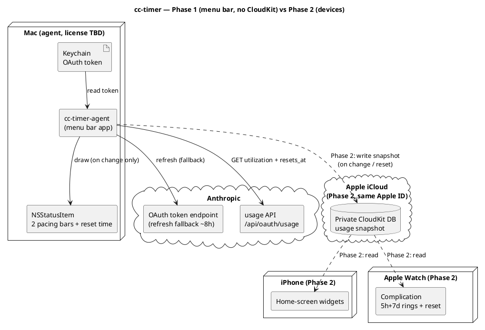

# Архітектура

Деталі продукту — у [SPEC.md](../SPEC.md). Тут — стисла архітектурна картина та потік даних.

## Принципи

- **Без власного бекенду.** Mac — єдиний компонент, що торкається Anthropic API.
- **Токен ніколи не покидає Mac.** Він лежить у macOS Keychain (`Claude Code-credentials`).
- **Перемальовування лише при зміні** даних (use або ресет таймера) — енергоефективність.

## Фаза 1 — menu bar app (без CloudKit)

Усе локально на одному Mac:

```
Keychain (OAuth token)
  → cc-timer-agent (menu bar app)
      → GET https://api.anthropic.com/api/oauth/usage
        (headers: Authorization, anthropic-beta, User-Agent: claude-code/<version>)
      → MenuBarLayout.make(UsageSnapshot) → MenuBarMode (pure, CCTimerKit)
      → StatusItemView малює NSStatusItem (дві pacing-смужки + час ресету, або `*` в idle)
```

## Фаза 2 — пристрої (додається CloudKit)

```
cc-timer-agent → запис usage-snapshot у приватну CloudKit DB (той самий Apple ID)
CloudKit → віджети iPhone + комплікейшен Apple Watch (читання)
```

## Потік даних (Deployment)




[Двофазний deployment: Фаза 1 — самодостатній menu bar app, що читає Keychain і usage API; пунктирні шляхи Фази 2 додають CloudKit, віджети iPhone та комплікейшен Watch](https://www.plantuml.com/plantuml/svg/PLJ1ZjCm4BtdAqOvDTgcXKe8rCDgoow2QWLKAXANIcZgk8sLnBRiIQk2G7m4NyYNCB7JRhRS4izxRzxCStBd2HsrJPsGebg243cfHZhu-_iFh4hq4bx2g96wXIswCMW3zxLfYqT56Hny3vd1g9079QJF4byfRT5X0y8qrcYfQKqdbdPI4EfzBPD4cq92-X45Z8oLElUcTK82xXayXeL5KSfyDdcHfO0U6iRzI03OgDgX84WVvKcKgFH6VrwqL0APIkg0hGG3BuqXFS-J1-sDlem2Q6sK3vNdh4_hDI6rVacosUWPi26bzntDmmqFuYL19nljiI9Nafz98hhLGBhGL3fZbKY3xu7mm2v8NLYZWYadTonQmWxhUekYWbzlocZE81EUQxIU7SDYjTpeALer3P1fE0sKy3HqOorlNuNOk5UVs1WyDYmJYik7s4r5IcUwGC9jXqnNJXsGv2LtU7YxqT64rsXzQIYGHTKrZT6gLSbkuToiLxVXy6eb7qmZSo-Sv9KSLR6Nv2Cwlh1cb8nEloA9yaht6CwkPE_viLO2IHc-9g_AczS5E0xn4c3qtA4wsvM0FB-DTm7cZC0YnfJ4ewuO5XsACQtHEQvi08gBcSFxTr-W9LMhxy72kQl_XZH0ztU7yON38tyD6lXYQrOmkZvbIG-TJ6vvlOpgvvx3qIbwsZ_7-iISnavPmeoEs2zooEx6EvV32luh9dTyFVcty0y0)

## Компоненти (Фаза 1)

**SPM-розкладка:** `CCTimerKit` (library-таргет — вся логіка, що тестується і реюзується у Фазі 2)
+ `cc-timer` (executable-таргет — AppKit entry point). Збірка `.app` bundle: `scripts/build-app.sh`
→ `./build/cc-timer.app`.

| Компонент | Відповідальність |
|---|---|
| **AppLogger** | Наскрізна обгортка над `os.Logger` (4 категорії: `network`/`keychain`/`lifecycle`/`ui`, subsystem `com.artem-n.cc-timer`). Токен і секрети **ніколи не логуються** — дефолтний `<private>` redaction; лише безпечні діагностичні поля позначаються `.public`. |
| **TokenProvider** | Читання токена з Keychain (`SecItemCopyMatching` за service, декодування обгортки `claudeAiOauth`, перевірка `expiresAt`). Протухлий токен **не йде на API** — `currentAccessToken` кидає `.expired`, а polling-шар чекає на свіжий від Claude Code. Fallback-refresh при протуханні — наступний крок (PR 8b). Свідомий вибір `throws`+enum і розбивка обсягу — див. ADR-0007 |
| **UsageClient** | Запити до usage API (`GET /api/oauth/usage`) з обов'язковим `User-Agent: claude-code/<version>` (guard: без нього не ходити). Чисті seam'и `buildRequest`/`decode` окремо від мережевого `fetch` (інжектований `UsageTransport`, токен передається ззовні — Keychain не торкаємось). Типізований `UsageError`. Дати **не парсимо** — `resets_at` зберігаємо сирим рядком для `ResetClock`. Backoff — чистий `PollingBackoff` (180 с дефолт; на 429 `3→6→12→15 хв`, тримати 15 хв; reset на 200); *виконання* таймера — у polling-шарі (#13). Свідома розбивка backoff/seam — див. ADR-0008 |
| **PacingModel** | Порт `calc_time_pct` / `get_limit_indicator` зі statusline. Зони смужки — **безперервні частки [0,1]** (`BarLayout`) для піксельного малювання, не блоки; блокова квантизація — опційна похідна `blockIndex(fraction:cells:)` для popup (div. ADR-0005) |
| **ResetClock** | Парсинг `resets_at` (мікросекунди + `+00:00`, нормалізація як `parse_reset_epoch`) → `Date`; вибір найближчого ресету (5h vs 7d); форматування часу до ресету (`TimeToReset`): абсолютний `hh:mm` за локаллю (12/24-год) і локальним TZ з авто-DST якщо >90 хв, інакше відносний `1h10m`/`45m`/`40s`, або `.resetNow` при ресеті. Свідоме розходження зі statusline — див. ADR-0006 |
| **MenuBarLayout** | Чиста (без AppKit), тестована модель «що малювати»: `MenuBarLayout.make(from:now:)` збирає `UsageSnapshot` → `MenuBarMode` (`idle` / `expanded`), переюзовуючи `PacingModel`/`ResetClock` без нової арифметики. Idle ⇔ обидва вікна `utilization < 5%` (строге `<`; warning неможливий нижче 5%, бо вимагає >90%). Живе в `CCTimerKit` — реюз у Фазі 2. Розкол pure/shell — ADR-0009 |
| **StatusItemView** | Тонкий AppKit-shell (`NSView` у таргеті `cc-timer`): малює `MenuBarLayout` — дві смужки (5h/7d: used/gap/future + кружечок-індикатор часу в кольорі pacing) + час ресету, або жирний `*` в idle. Показ через готовий non-template `NSImage` (`button.image`), не subview; кольори — точна `statusline`-палітра (236/71/167/23, фіксований sRGB). Перемальовування лише при зміні `layout` (енергоефективність). Стани помилок — #12. Розкол — ADR-0009 |
| **Popup** | Деталі лімітів, розбивка по моделях, службовий рядок (останнє оновлення + інтервал) |
