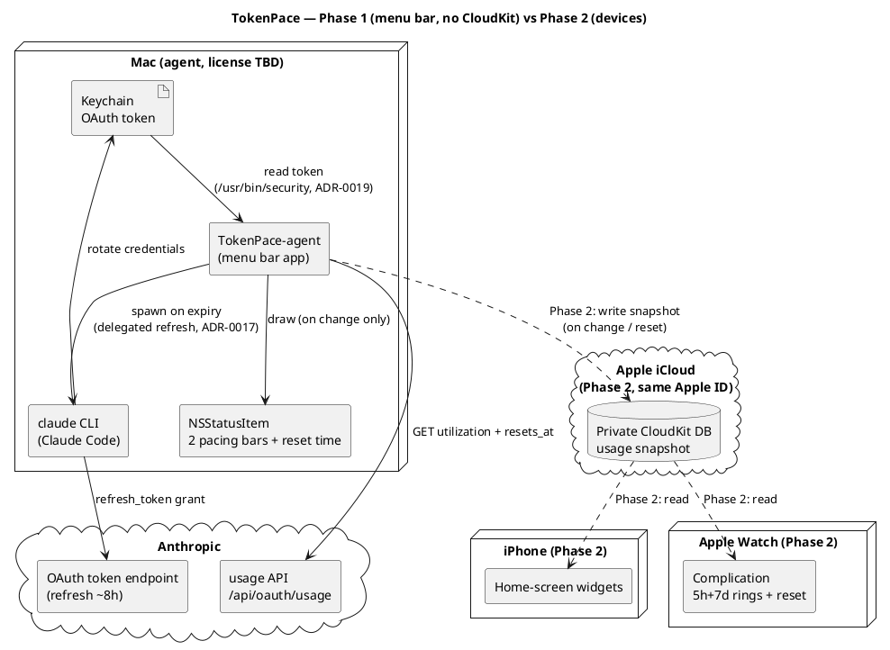

# Архітектура

Деталі продукту — у [SPEC.md](../SPEC.md). Тут — стисла архітектурна картина та потік даних.

## Принципи

- **Без власного бекенду.** Mac — єдиний компонент, що торкається Anthropic API.
- **Токен ніколи не покидає Mac.** Він лежить у macOS Keychain (`Claude Code-credentials`).
- **Перемальовування лише при зміні** даних (use або ресет таймера) — енергоефективність.

## Фаза 1 — menu bar app (без CloudKit)

Усе локально на одному Mac:

```
Keychain (OAuth token)
  → TokenPace-agent (menu bar app)
      → PollingEngine (живий async-цикл, pure ядро + seam'и, TokenPaceKit)
        ├ інтервал: 429-backoff > Claude-неактивний 30 хв > AdaptiveCadence (3–15 хв за змінами вмісту)
        ├ sleep/wake (NSWorkspace) → пауза / негайний опит; мережа (NWPathMonitor) → негайний опит при відновленні
        ├ детект сесії Claude Code (sysctl, точне ім'я `claude`) → 30-хв оверрайд
      → GET https://api.anthropic.com/api/oauth/usage
        (headers: Authorization, anthropic-beta, User-Agent: claude-code/<version>)
      → (успіх/помилка опиту) → UsageHealth (lastSuccess/failingSince/reason, pure, TokenPaceKit)
      → MenuBarLayout.make(UsageSnapshot?, UsageHealth) → MenuBarMode (expanded/error, pure)
      → StatusItemView малює NSStatusItem (pacing-смужки + час ресету, або ⚠️ при помилці/cold-start)
      → клік по іконці → PopupLayout.make(UsageSnapshot?, UsageHealth, serviceStatus) (pure, TokenPaceKit)
        → PopupViewController у NSMenu (перший рядок — болд-заголовок "Claude Code" (бренд-колір, ADR-0021), завжди; тьмяний рядок "Updated … · interval …" + рядки статусу сервісів (умовно, див. нижче) + банер помилки + деталі 5h/7d двоколонковим split-layout (ADR-0021) + розбивка по моделях: top-level Opus/Sonnet + `weekly_scoped` з `limits[]`, напр. Fable; увесь текст дропдауна — один спільний шрифт/кегль, ADR-0021)
      → (кожен PollOutput несе PollDiagnostics: сира FetchDiagnostics + TokenDiagnostics — дати, без секрету)
      → "Settings…" видно завжди; ⌥ Option показує окремий пункт "Troubleshoot…" під ним (isHidden-toggle через modifier-polling таймер, не нативний alternate) → TroubleshootLayout.make(PollOutput?) (pure, TokenPaceKit)
        → TroubleshootWindowController (велике resizable-вікно, .normal-рівень, live-оновлення щополу): Update interval (refresh-каденція як тривалість + next-update timestamp + кнопка "Refresh now" → forceRefresh: .manualRefresh + скид status-cadence) + токен (read/expires) + сира відповідь usage API (претіфікований JSON / payload помилки + HTTP-статус + timestamp)

  Статус сервісів Claude (#31, другий, незалежний від usage потік):
  TokenPace-agent
    → на кожен PollOutput, коли StatusCadence.isDue (інтервал = max(5 хв, usage-інтервал))
    → GET https://status.claude.com/api/v2/summary.json (User-Agent: claude-code/<version>)
    → StatusClient.decode → StatusSummary (лише components[]; incidents/overall ігноруються)
    → StatusHealth.from → ServiceStatus×2 (Claude Code, Claude API) — pure, TokenPaceKit; збій → unknown
    → PopupViewController малює два рядки (кольорова крапка + назва + слово-лінк на status.claude.com, лінк лише за non-operational) разом з "Updated … · interval …" — **лише** коли worstProblem != nil або тримається ⌥ Option; обидва operational без ⌥ не займають місце в попапі (болд-заголовок секції "Claude Code" лишається завжди)
    → StatusHealth.worstProblem → MenuBarLayout.serviceProblem → StatusItemView малює крапку справа (лише за проблеми)
    → при проблемі StatusCadence.problemFloor (60с) пришвидшує опитування статусу
```

## Фаза 2 — пристрої (додається CloudKit)

```
TokenPace-agent → запис usage-snapshot у приватну CloudKit DB (той самий Apple ID)
CloudKit → віджети iPhone + комплікейшен Apple Watch (читання)
```

## Потік даних (Deployment)




[Двофазний deployment: Фаза 1 — самодостатній menu bar app, що читає Keychain і usage API; пунктирні шляхи Фази 2 додають CloudKit, віджети iPhone та комплікейшен Watch](https://www.plantuml.com/plantuml/svg/PLJ1ZjCm4BtdAqOvDTgcXKe8rCDgoow2QWLKAXANIcZgk8sLnBRiIQk2G7m4NyYNCB7JRhRS4izxRzxCStBd2HsrJPsGebg243cfHZhu-_iFh4hq4bx2g96wXIswCMW3zxLfYqT56Hny3vd1g9079QJF4byfRT5X0y8qrcYfQKqdbdPI4EfzBPD4cq92-X45Z8oLElUcTK82xXayXeL5KSfyDdcHfO0U6iRzI03OgDgX84WVvKcKgFH6VrwqL0APIkg0hGG3BuqXFS-J1-sDlem2Q6sK3vNdh4_hDI6rVacosUWPi26bzntDmmqFuYL19nljiI9Nafz98hhLGBhGL3fZbKY3xu7mm2v8NLYZWYadTonQmWxhUekYWbzlocZE81EUQxIU7SDYjTpeALer3P1fE0sKy3HqOorlNuNOk5UVs1WyDYmJYik7s4r5IcUwGC9jXqnNJXsGv2LtU7YxqT64rsXzQIYGHTKrZT6gLSbkuToiLxVXy6eb7qmZSo-Sv9KSLR6Nv2Cwlh1cb8nEloA9yaht6CwkPE_viLO2IHc-9g_AczS5E0xn4c3qtA4wsvM0FB-DTm7cZC0YnfJ4ewuO5XsACQtHEQvi08gBcSFxTr-W9LMhxy72kQl_XZH0ztU7yON38tyD6lXYQrOmkZvbIG-TJ6vvlOpgvvx3qIbwsZ_7-iISnavPmeoEs2zooEx6EvV32luh9dTyFVcty0y0)

## Компоненти (Фаза 1)

**SPM-розкладка:** `TokenPaceKit` (library-таргет — вся логіка, що тестується і реюзується у Фазі 2)
+ `TokenPace` (executable-таргет — AppKit entry point). Збірка `.app` bundle: `scripts/build-app.sh`
→ `./build/TokenPace.app`.

| Компонент | Відповідальність |
|---|---|
| **AppLogger** | Наскрізна обгортка над `os.Logger` (4 категорії: `network`/`keychain`/`lifecycle`/`ui`, subsystem `com.artem-n.tokenpace`). Токен і секрети **ніколи не логуються** — дефолтний `<private>` redaction; лише безпечні діагностичні поля позначаються `.public`. Повний каталог меседжів — [`docs/log-messages.md`](log-messages.md). |
| **TokenProvider** | Читання токена з Keychain **сабпроцесом `/usr/bin/security find-generic-password -w`** (матч лише за service; декодування обгортки `claudeAiOauth`, перевірка `expiresAt`). Прямий `SecItemCopyMatching` свідомо не використовується: Claude Code на кожному refresh переписує item через `security add-generic-password -U`, що **скидає ACL partition list** до `apple-tool:` і знову викликає keychain-промпти у GUI-застосунку; `security` — Apple-tool, тож читає тихо за будь-якого підпису збірки (ADR-0019). Pure-обробка виводу — `parseSecretOutput` (trailing newline, захисний hex-декод) та `mapExitStatus` (exit 44 → `.itemNotFound`), обидві юніт-тестовані. Протухлий токен **не йде на API** — але рішення про expiry ухвалює **engine**, не провайдер (ADR-0020): `currentCredentials(now:)` віддає `TokenCredentials {accessToken, expiresAt}` (без `refreshToken` — секрет не тягнеться в engine), а `PollingEngine.pollOnce` перевіряє `isExpired`, короткозамикає мережу і реагує **делегованим refresh** (ADR-0017): спавнить `claude` CLI, щоб Claude Code сам ротував пару, і перечитує Keychain. Одне Keychain-читання на пол; `expiresAt` доступний навіть для протухлого токена (для діагностики). TokenPace ніколи не пише в Keychain і не виконує `refresh_token` grant. Свідомий вибір `throws`+enum і розбивка обсягу — див. ADR-0007, ADR-0020 |
| **DelegatedRefresh / RefreshGate** | Kit-сторона делегованого refresh (ADR-0017): протокол `DelegatedRefresher` (`refresh() async -> DelegatedRefreshOutcome`, fail-safe — не кидає) + чистий `RefreshGate` — anti-flap гейт спроб з ескалацією cooldown `1→5→30→60 хв` після невдач (у стилі `PollingBackoff`, юніт-тестований). Outcome-и: `refreshed`/`unchanged`/`cliNotFound`/`timedOut`/`failed(exitCode:)` |
| **UsageClient** | Запити до usage API (`GET /api/oauth/usage`) з обов'язковим `User-Agent: claude-code/<version>` (guard: без нього не ходити). Чисті seam'и `buildRequest`/`decode` окремо від мережевого `fetch` (інжектований `UsageTransport`, токен передається ззовні — Keychain не торкаємось). Типізований `UsageError`: `.http(status:body:)` несе тіло відповіді (`.public`-safe, обрізане до `maxBodyLength`=500) для рядка деталей у popup, `.transport(message:code:)` несе `URLError.Code` для точного мапінгу помилок (#12). Тіло `fetch` переїхало в `diagnosedFetch -> DiagnosedFetch` (ADR-0020): у кожній гілці (200/429/інші не-2xx/decode-fail/transport/non-HTTP/not-sent) складає `FetchDiagnostics` із **повним** (некапнутим) body для вікна Troubleshoot; `fetch` — тонка обгортка (`result.get()`), сигнатура й `FetchTests` незмінні. Дати **не парсимо** — `resets_at` зберігаємо сирим рядком для `ResetClock`. На межі ресету API присилає в тілі 200 `null`/відсутні core-вікна — `UsageSnapshot.decode` **синтезує** свіже вікно (`utilization=0`, `resets_at` із самого вікна → `limits[]` → локальна оцінка `ResetClock.nextReset`) замість падіння (інакше — хибне «Usage API unavailable»); `now` прокидається через `JSONDecoder.userInfo`. Per-model під-вікна (`Opus`/`Sonnet`), коли присутні з `resets_at:null`, успадковують `resets_at` від `seven_day` (ресетяться разом — інакше хибне «resetting…»). `limits[]` тепер декодує й `scope.model.display_name` (`weekly_scoped`) — це єдине джерело per-model лімітів без top-level поля (напр. Fable, #65): computed `UsageSnapshot.scopedModelWindows` мапить `percent → utilization`, позичає `resets_at` від `seven_day` коли порожній і дедуплікує проти присутніх legacy-полів (case-insensitive; legacy виграє — має десяткову `utilization`). При справжньому decode-fail логується обрізане тіло (діагностика змін схеми). Деталі — ADR-0014. Backoff — чистий `PollingBackoff` (180 с дефолт; на 429 `3→6→12→15 хв`, тримати 15 хв; reset на 200); *виконання* таймера — у polling-шарі (#13). Свідома розбивка backoff/seam — див. ADR-0008 |
| **PacingModel** | Порт `calc_time_pct` / `get_limit_indicator` зі statusline. Зони смужки — **безперервні частки [0,1]** (`BarLayout`) для піксельного малювання, не блоки; блокова квантизація — опційна похідна `blockIndex(fraction:cells:)` для popup (div. ADR-0005) |
| **ResetClock** | Парсинг `resets_at` (мікросекунди + `+00:00`, нормалізація як `parse_reset_epoch`) → `Date`; вибір найближчого ресету (5h vs 7d); форматування часу до ресету (`TimeToReset`): абсолютний `hh:mm` за локаллю (12/24-год) і локальним TZ з авто-DST якщо >90 хв, інакше відносний `1h10m`/`45m`/`40s`, або `.resetNow` при ресеті. `nextReset(now:window:)` — оцінка наступного ресету (`now + durationSeconds`, округлення вгору до 10 хв) як last-resort fallback для синтезу вікна на межі ресету (ADR-0014). Свідоме розходження зі statusline — див. ADR-0006 |
| **UsageHealth** | Чистий (без AppKit) value-тип стану опитування — **другий вхід** (поряд зі `UsageSnapshot`) для станів помилок (#12): `lastSuccess`/`failingSince`/`reason`. Пороги меню-бара — **чисті функції** від `failureAge(now:)`: `glyphAfter` = 30 хв (⚠️ біля смужок), `hideBarsAfter` = 60 хв (тільки ⚠️). `FailureReason` мапить `TokenError`/`UsageError` → семантичні причини (`notSignedIn`/`authHTTP(status:body:)`/`timeout`/`cannotResolveHost`/`network`/`serverProblem`/`unknown`) — exhaustive `switch` без `default`; рядок збирає view. Реюз у Фазі 2. Розкол — ADR-0010 |
| **MenuBarLayout** | Чиста (без AppKit), тестована модель «що малювати»: `MenuBarLayout.make(from:now:)` збирає `UsageSnapshot` → `MenuBarMode.expanded` (завжди дві смужки, за будь-якого `utilization` — компактного/idle-режиму **немає**, ADR-0015), переюзовуючи `PacingModel`/`ResetClock` без нової арифметики. Health-обізнана `make(from:health:now:)` (#12) додає `MenuBarMode.error` з **опційними** смужками: ≤30 хв невдач → stale-смужки без ⚠️; 30–60 хв → ⚠️ + останні смужки; >60 хв або cold-start → тільки ⚠️ (строгі межі). Живе в `TokenPaceKit` — реюз у Фазі 2. Розкол pure/shell — ADR-0009 (idle-частину superseded ADR-0015), ADR-0010 |
| **StatusItemView** | Тонкий AppKit-shell (`NSView` у таргеті `TokenPace`): малює `MenuBarLayout` — дві смужки (5h/7d: used/gap/future + кружечок-індикатор часу в кольорі pacing) + час ресету, або ⚠️ (`exclamationmark.triangle`, **monochrome у `labelColor`**, опційно зі stale-смужками поряд) у стані помилки/cold-start (#12). За `layout.serviceProblem != nil` (#31) — маленька кольорова крапка як **найлівіший** елемент (фіксований sRGB за severity), решта зсувається вправо; `itemWidth` додає її ширину. Показ через готовий non-template `NSImage` (`button.image`), не subview; кольори — точна `statusline`-палітра (236/71/167/23, фіксований sRGB). ⚠️ малюється `respectFlipped: true` (view `isFlipped`). Перемальовування лише при зміні `layout`. Розкол — ADR-0009, ADR-0010 |
| **PopupLayout** | Чиста (без AppKit), тестована модель «що показати в popup»: `PopupLayout.make(from:now:lastUpdate:interval:)` збирає `UsageSnapshot` → масив секцій `LimitRow` (5h, 7d, потім `Opus`/`Sonnet` якщо є — `nil`-safe, потім scoped-моделі з `limits[]`: `<display_name> (7-day)`, напр. Fable, без дублів із legacy-рядками) + сирі секунди службового рядка. Кожен `LimitRow` несе `utilization`/`pacing`/`indicator`/`BarLayout` + розщеплений ресет: `resetRelative` завжди, `resetAbsolute` лише якщо <24 год. Health-обізнана `make(from:health:now:interval:)` (#12) додає поле `warning: FailureReason?` — **одразу** за будь-якої невдачі (без 30-хв порогу), `lastUpdateAge` від `health.lastSuccess`, `rows` зі stale-snapshot (порожні на cold-start). Несе **лише сирі числа, семантичні enum'и й часові рядки ResetClock** — речення збирає view. Реюз у Фазі 2. ADR-0009, ADR-0010 |
| **TroubleshootLayout** | Чиста (без AppKit), тестована view-model вікна Troubleshoot (`TokenPaceKit`, ADR-0020): `make(from: PollOutput?, timeZone:)` → рядки трьох секцій (Update interval: `Refresh interval: <тривалість>` + `Next update: ≈ <timestamp>`; токен: read/expires; usage-API: timestamp/HTTP-статус/body) — вичерпний `switch` над `FetchDiagnostics.Outcome` без `default`. `prettyPrinted` (перше `JSONSerialization` у кодовій базі — sorted-keys претіфікація JSON, passthrough для HTML/plain), `timestampText` (фіксований `yyyy-MM-dd HH:mm:ss (<tz>)`, `en_US_POSIX`, для баг-репортів — свідоме відхилення від локалізованого `ResetClock`) і `durationText` (компактна тривалість `Ns`/`Nm`/`Nh Mm`/`Nd Mh` для рядка інтервалу). Реюз у Фазі 2. ADR-0020 |
| **PopupViewController** | Тонкий AppKit-shell (`NSViewController` у `TokenPace`): малює `PopupLayout` у стилі рідних menu-bar віджетів — заголовок (`TokenPace`, або `TokenPace (dev build)` на `swift run`-бінарі за `LaunchAtLoginController.isAppBundle`, #69), одразу під ним тьмяний рядок `Updated #m ago  ·  interval #m` (`serviceLineText`, поєднує вік даних і cadence), далі рядки статусу сервісів (#31), *(за помилки)* двозначний банер (жирний рядок із ⚠️ + детальний рядок), далі секції лімітів; між блоками — горизонтальні риски `NSBox` із симетричним відступом (`addSeparatorIfNeeded` не дублює риску, коли проміжний блок відсутній). Хоститься в `NSMenuItem.view` через `statusItem.menu` (**без пипки**, кнопка підсвічена). `PopupBarView` малює `BarLayout` тими ж зонами, що menu bar, але **appearance-aware** палітрою, і додає під баром **шкалу-засічки** — `LimitRow.subdivisions − 1` рисок на межах рівних під-інтервалів вікна (5h → 4 на межах годин, 7d → 6 на межах діб), слабших за точку-індикатор. Форматування рядків (зокрема `warningTitle`/`warningDetail`) — у `static` форматерах тут (точка локалізації). Розмір шрифту іконки — #26. ADR-0009, ADR-0010 |
| **StatusHealth / StatusSummary** | Чисте (без AppKit) ядро статусу сервісів Claude (#31, `TokenPaceKit`). `StatusSummary` (Decodable) парсить **лише** `components[]` ендпоінта status.claude.com — `incidents`/`status`/`scheduled_maintenances` навмисно НЕ декодуються (ADR-0013), тож «відомі виключення» типу призупинення Mythos/Fable (інцидент `major`, компонент `operational`) не шумлять. `ServiceStatus` мапить сирий рядок (`operational`/`degraded_performance`/`partial_outage`/`major_outage`/`under_maintenance`→семантика, інше→`unknown`); має `severity`/`isProblem`. `StatusHealth.from` витягує два компоненти за точним іменем (`Claude Code`, `Claude API (api.anthropic.com)`); відсутній → `unknown`. `StatusHealth.unknown` — стан при збої fetch (shell підставляє). `worstProblem` → найсерйозніший non-operational стан двох компонентів (або `nil`), драйвить menu-bar крапку й прискорену cadence. Без локалізованих рядків і кольорів — їх збирає view. ADR-0013 |
| **StatusClient** | HTTP-seam status-ендпоінта (`TokenPaceKit`), дзеркало `UsageClient`: чисті `buildRequest()` (обов'язковий `User-Agent: claude-code/<version>`, без auth) / `decode(from:)` окремо від мережевого `fetch(transport:)` (реюз `UsageTransport`). Один запит, без сну/ретраю. Будь-який збій (transport/не-200/decode) → `StatusFetchError`, який shell перетворює на `StatusHealth.unknown` — **не** ескалює usage 429-backoff. ADR-0013 |
| **StatusCadence** | Чистий seam ввічливої частоти статус-поллінгу (`TokenPaceKit`): `interval(usageInterval:hasProblem:) = max(floor, usageInterval)` та `isDue(lastSuccess:usageInterval:hasProblem:now:)`. Статус не має власного таймера — хантажиться з usage-tick: слідує за usage-cadence, коли той повільний (простій → 30 хв), але ніколи не частіше за підлогу, навіть коли usage в 429-backoff. **Дві підлоги:** `floor` = 5 хв коли все operational; `problemFloor` = 60 с щойно є проблема (швидко ловити ескалацію/відновлення інциденту). ADR-0013 |
| **AdaptiveCadence** | Чиста (без AppKit) value-стейт-машина частоти **за вмістом** — друга вісь поряд із `PollingBackoff` (429). `unchanged()` подвоює інтервал `3→6→12→15 хв` (та сама прогресія, тримати стелю), `changed()` миттєво скидає до 3 хв. Керує цикл #13: «зміна» = відрізняється `utilization` 5h/7d. Реюз у Фазі 2. ADR-0011 |
| **PollingEngine** | Живий async-цикл опитування (`TokenPaceKit`): pure ядро (`advance`/`effectiveInterval`/`intervalDecision`, юніт-тестоване) + seam'и (`PollScheduler`/`TokenProviding`/`DelegatedRefresher`/`ClaudeActivityProbe`/`UsageTransport`/`now`). `run() -> AsyncStream<PollOutput>`. Інтервал — пріоритет `429-backoff > Claude-неактивний 30 хв > AdaptiveCadence`, **ніколи нижче `minInterval` = 60 с** (жорсткий рубіж проти тісного циклу). Sleep → park, wake/networkRestored → негайний опит; `.manualRefresh` (кнопка Troubleshoot, ADR-0020) → негайний опит **і** скид активного 429-backoff до базового 180 с перед полом. Token-помилка не йде в мережу (ADR-0007) і не чіпає інтервали; **рішення про expiry — тут** (провайдер віддає `currentCredentials`, engine перевіряє `isExpired`, ADR-0020), на прострочення `pollOnce` робить делегований refresh і перечитує токен **у тому ж циклі**, `advance` фолдить результат у `RefreshGate` (ADR-0017). Кожен `PollOutput` несе `diagnostics: PollDiagnostics?` (сира `FetchDiagnostics` + `TokenDiagnostics` дати) для вікна Troubleshoot — той самий чистий пайплайн, що health/snapshot (ADR-0020). Кожна зміна інтервалу логується з причиною (лише при зміні). ADR-0011 |
| **LivePollScheduler** | Виробничий `PollScheduler` (`TokenPaceKit`, **тестований** — лише `AsyncStream`+`Task.sleep`, без AppKit). `waitForNextPoll` чекає весь інтервал, доки не прийде справжній сигнал; `SignalGate` демультиплексує сигнальний стрім і резюмить очікувача рівно раз (сигнал/дедлайн/finish). Інваріант «порожній стрім не повертає миттєво» — головний запобіжник частоти. ADR-0011 |
| **PollingShell** (`TokenPace`) | Тонкі **платформенні** seam'и: `WorkspaceSleepWake` (`NSWorkspace.shared.notificationCenter`), `NetworkMonitor` (`NWPathMonitor`, edge `.unsatisfied→.satisfied` → `.networkRestored`), `ProcessClaudeActivityProbe` (`sysctl(KERN_PROC_ALL)`, точне ім'я `claude` — CLI, не Desktop), `SignalHub` (фан-ін сигналів, `bufferingNewest(1)`; `AppDelegate.forceRefresh` шле в нього `.manualRefresh` з кнопки Troubleshoot). ADR-0011 |
| **ClaudeCLIRefresher** (`TokenPace`) | Виробничий `DelegatedRefresher` (ADR-0017) — єдиний спавн **`claude`** у кодовій базі (другий сабпроцес — `security` у `TokenProvider`, ADR-0019): пробує відомі шляхи бінарника `claude` (launchd має мінімальний PATH), запускає `claude --model haiku -p '/usage'` у порожній tmp-теці (без проєктного контексту/хуків), stdin/stdout/stderr → `/dev/null`, жорсткий таймаут 30 с (SIGTERM → SIGKILL через 5 с). Критерій успіху — `expiresAt` у Keychain посунувся вперед. Токен ніколи не потрапляє в аргументи/env/логи. `--bare` свідомо НЕ використовується (вимикає OAuth/Keychain). Спайк-верифікація команди — issue #8 |
| **LaunchAtLogin** | Чисте (без AppKit/ServiceManagement), тестоване ядро launch-at-login (#14): `Status` — framework-free дзеркало `SMAppService.Status` (`registered`/`notRegistered`/`requiresApproval`/`notFound`) + предикати `shouldAttemptRegister` (opt-out на `.notRegistered` **і** `.notFound` — `register()` сам вирішує, #69), `toggleState(for:)`, `needsSystemSettings`. Реюз у Фазі 2. ADR-0012, ADR-0018 |
| **MigrationPlan** | Чистий (без AppKit/Foundation-I/O), тестований предикат on-launch міграції конфігу (#71, ADR-0023): `transition(stored:current:)` класифікує старт у `firstRun`/`unchanged`/`upgraded(from:to:)`, `needsMigration(_:)` вирішує, чи є що виконувати. Порівняння — рядкова нерівність (каркас); повний SemVer-compare відкладено. Аналог `LaunchAtLogin` (рішення в kit) для migration-домену; реюз у Фазі 2. ADR-0023 |
| **LaunchAtLoginController** (`TokenPace`) | Тонкий `ServiceManagement`-glue над `SMAppService.mainApp`: `currentStatus()` (мапінг у `LaunchAtLogin.Status`), `enable()`/`disable()` (throws), `openLoginItemsSettings()`, `isAppBundle` (гейт opt-out auto-register лише на `.app`-бандл — ad-hoc `swift run` бінар реєстровний, тож без гейта засмічував би Login Items, #69). Best-effort — throw ловиться й логується, не валить застосунок. Manual verification (системний синглтон). ADR-0012, ADR-0018 |
| **PersistedConfig** (`TokenPace`) | Перший persistence-шар у проєкті (#71, ADR-0023) — тонка `@MainActor`-обгортка над `UserDefaults.standard`. Фаза 1: один ключ `lastRunVersion` (String, `get`/`set`), який читає/переписує хук міграції `AppDelegate.runConfigMigrationsIfNeeded()` (найперша дія `applicationDidFinishLaunching`, до UI/полінгу — щоб майбутня міграція встигла підчистити стан). Рішення про міграцію — у чистому `MigrationPlan`; `UserDefaults` — системний синглтон, тож обгортка живе в shell і верифікується вручну (як `LaunchAtLoginController`). Шов, який майбутні тікети розширять іншими ключами (напр. monitored services, #89). ADR-0023 |
| **SettingsWindowController** (`TokenPace`) | Вікно «Settings…» (#14) внизу popup-меню: single-instance `NSWindowController` (toggle «Launch at login» + версія + GitHub-лінк). Виходить на передній план через `NSApp.activate` + `level=.floating` (без `setActivationPolicy(.regular)`). Toggle ре-синкається з `SMAppService.status` при кожному показі; доступність чекбокса гейтиться по `LaunchAtLoginController.isAppBundle` (dev `swift run` → сірий, як ADR-0012 §4; `.app` → завжди enabled, зокрема на `.notFound` для відновлення після оновлення — клік `register()` вирішує, #69). Хінт має три стани (`hintText(inAppBundle:)`): dev-недоступно / `.app`-фейл-кліку / нейтральний. ADR-0012, ADR-0018 |
| **TroubleshootWindowController** (`TokenPace`) | Прихований діагностичний shell (`NSWindowController`, ADR-0020) — велике resizable-вікно з fullscreen (`.fullScreenPrimary`), **звичайного `.normal`-рівня** (не `.floating`, як Settings — свідоме відхилення від ADR-0012 §6: floating конфліктує з fullscreen Space). «Settings…» видно завжди; ⌥ Option показує окремий пункт «Troubleshoot…» під ним (toggle `isHidden` через modifier-polling таймер у `menuWillOpen`/`menuDidClose` — нативний `isAlternate` інертний у меню статус-айтема, `menuNeedsUpdate` спрацьовує лише раз при відкритті). Single-instance (`isReleasedWhenClosed = false`, `setFrameAutosaveName`); мапить `TroubleshootLayout.make(from:)` на в'ю (скролабельний monospace `NSTextView` для body, з вимкненими smart-quotes/dashes). Три секції: токен, Update interval (з кнопкою "Refresh now" → `onForceRefresh` → `AppDelegate.forceRefresh`), usage-API. `render(_:)` кличеться з `AppDelegate.apply(_:)` **щополу** → усі секції оновлюються наживо (body присвоюється лише при зміні — щоб не злітали виділення/скрол). ADR-0020 |
