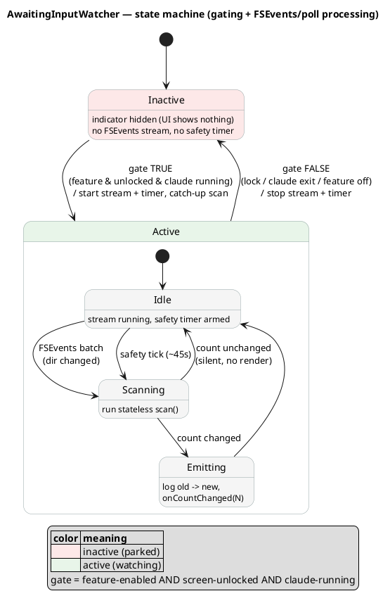

# Design: awaiting-input refresh pipeline (FSEvents + safety poll)

> Companion to [ADR-0066](../adr/0066-detect-sessions-awaiting-input.md). ADR-0066 fixes *what* we
> read and *why*; this note fixes *how* the count stays fresh — the interaction of FSEvents and a
> rare safety poll over a stateless scanner — plus the indicator's icon choice.

## Goal

Keep the "N sessions awaiting input" count fresh with **near-zero idle cost** and **no missed
transitions**, honoring two gates: update **only while Claude Code is running and the screen is
unlocked**.

## Three moving parts

```
 ┌─────────────────────────────────────────────────────────────────────┐
 │ shell (TokenPace, AppKit/CoreServices — platform glue, not tested)   │
 │                                                                       │
 │  ┌───────────────┐   file-change    ┌──────────────────────────┐     │
 │  │ FSEvents      │  paths (coalesced │ RefreshCoordinator       │     │
 │  │ stream on     │──by `latency`)───▶│  · debounce/merge        │     │
 │  │ sessions/,jobs│                   │  · gate (lock + claude)  │     │
 │  └───────────────┘                   │  · calls scan()          │     │
 │        ▲  start/stop                 └───────────┬──────────────┘     │
 │        │                                         │ Int                │
 │  ┌─────┴─────────┐   every 30–60 s               ▼                    │
 │  │ safety Timer  │──────────────────▶ ┌──────────────────────────┐    │
 │  └───────────────┘                    │ AwaitingInputScanner     │◀───┼── pure core
 │        ▲                               │  (TokenPaceKit)          │    │  (unit-tested)
 │        │ gate signals                  │  · stateless, no cache   │    │
 │  ┌─────┴──────────────┐                │  · scan() → Int          │    │
 │  │ NSWorkspace lock/   │                └──────────────────────────┘    │
 │  │ unlock, Claude probe│                         │                     │
 │  └─────────────────────┘                         ▼ count changed?      │
 │                                          render() → MenuBar/Popup      │
 └─────────────────────────────────────────────────────────────────────┘
```

1. **`AwaitingInputScanner`** (pure, `TokenPaceKit`, already built). **Stateless** — `scan()` reads
   the handful of `sessions/*.json` (+ the matching `jobs/<id>/state.json`) and returns the count,
   every time. A full scan is ~0.18 ms, so it is the single source of the number and every trigger
   funnels through it.
2. **FSEvents stream** (shell). The primary trigger. Watches `~/.claude/sessions` and `~/.claude/jobs`
   recursively; the OS wakes us with a coalesced list of changed paths.
3. **Safety poll** (shell). A rare (30–60 s) timer that also calls `scan()`, to catch anything
   FSEvents coalesced away or dropped across sleep/logout.

### Why no cache

An earlier draft cached `path → (mtime, awaiting)` and re-read only files whose mtime advanced.
**Dropped** — with FSEvents as the trigger we already scan *only when the watched trees changed*
(plus a rare safety tick), so a cache would skip re-reading a handful of sub-KB files to save
microseconds, at the cost of a stateful `class`, mtime edge cases (coarse fs granularity, atomic
`rename` bumping mtime), and heavier tests.

> **A cache is only worth it in a poll-*without*-FSEvents design** — i.e. re-scanning on a fixed
> short timer while, most ticks, nothing changed. There the cache earns its keep by turning "read
> every file every 5 s" into "`stat()` every file, read only the changed ones". If we ever revert to
> pure polling, reintroduce the per-session mtime cache in `AwaitingInputScanner`. As long as
> FSEvents drives refresh, keep the scanner a pure value.

### FSEvents watches paths, not inodes

FSEvents is **path/directory-based**, not inode- or fd-based. We register the two **directory
paths** `~/.claude/sessions` and `~/.claude/jobs` (recursive); with `kFSEventStreamCreateFlagFileEvents`
the callback reports individual changed **paths** (e.g. `sessions/91763.json`) — never an inode.

**Watch the directories, never individual `.json` files.** The set of session files is not fixed —
every new session creates a fresh `sessions/<pid>.json` (and a `jobs/<jobId>/` dir), and finished
ones are pruned. Subscribing to specific files would miss exactly the sessions that appear *after*
we start watching. A directory watch fires on create / modify / delete of anything inside the tree,
so new sessions are picked up for free. The watcher therefore does **not** inspect the event's path
list at all — any batch just means "the tree changed", and we re-run the full stateless `scan()`
(which re-enumerates the directory, so it naturally includes newly created files).

Directory-watching is also why atomic rewrites are a non-issue: Claude Code writes these state files
**atomically** (write temp + `rename` over the name), which changes a file's inode but keeps its
path and its parent directory, so the directory watch still fires and a subsequent read-by-path sees
the new content. (An inode/fd watch — `kqueue`/`EVFILT_VNODE` on an open file — would follow the
*old* unlinked inode across an atomic rename, miss the update, and see nothing for files that didn't
exist when it started; that's why it's the wrong tool for this directory-of-churning-files case.)

## FSEvents specifics

- `FSEventStreamCreate(paths: [sessions, jobs], latency: ~0.75s, flags: kFSEventStreamCreateFlagFileEvents | kFSEventStreamCreateFlagNoDefer)`.
  - `FileEvents` → per-file granularity (path list, not just the parent dir).
  - `latency 0.75s` **is** the "інтервал на обробку вхідних івентів" — the OS batches a burst of
    writes into one callback, so a chatty session doesn't spin us. `NoDefer` delivers the first
    event of an idle→busy burst promptly, then coalesces the tail.
- The callback is dispatched on the main queue; it does not inspect the changed paths (see above) —
  it just coalesces into one `scan()` on the next runloop turn.
- On every **start** (unlock, or Claude reappearing) we create the stream `sinceNow` and always run
  one explicit catch-up `scan()`. We deliberately do **not** replay from a saved `lastEventId`: the
  scan is stateless and reads current disk state, so a single catch-up read fully reconciles whatever
  changed while parked — simpler than persisting an event id, same result.

## State machine

The watcher is a two-level state machine: an outer **Inactive ↔ Active** gate, and, while Active,
an inner Idle → Scanning → (Emitting | Idle) loop that processes every FSEvents batch and safety
tick. The gate = *feature-enabled AND screen-unlocked AND claude-running*.




## Gating (the two conditions)

The gate maps directly onto **stream lifecycle**, not a filter inside a hot loop:

| Transition | Action |
| --- | --- |
| screen unlocked **and** `claude` running | start FSEvents stream (from `lastEventId`), arm safety timer, run one catch-up `scan()` |
| screen locked **or** `claude` exited | stop FSEvents stream, disarm safety timer (no work while parked) |

Signals already exist in the shell: `NSWorkspace` lock/unlock notifications feed the existing poll
`SignalGate`, and `ProcessClaudeActivityProbe` (sysctl `KERN_PROC`, `PollingShell.swift:237`) reports
whether `claude` is running. The Claude-running edge is polled on the existing heartbeat (no new
timer): when it flips, toggle the stream.

> Rationale for stop-on-lock: no point watching files the user can't act on, and it lets a laptop
> sleep undisturbed. Restart cost is one stream create + one `scan()` — milliseconds.

## Debounce / merge in `RefreshCoordinator`

Even with FSEvents `latency`, two independent bursts (a `sessions/` write and a `jobs/` write ~100 ms
apart) can produce back-to-back callbacks. The coordinator coalesces: on any trigger it schedules a
single `scan()` on the next main-actor turn (dropping a scan already scheduled for this turn), so at
most one `scan()` per UI frame regardless of trigger fan-in. `scan()` itself is idempotent, so an
extra call is only a few `stat()`s.

Only when the returned `Int` **differs** from the last rendered count do we re-render the menu bar /
popup (the count feeds `MenuBarLayout.make` / `PopupLayout.make`, gated by the feature toggle).

## Why hybrid, not one channel (trade-offs)

| | Poll 5 s only | FSEvents only | **Hybrid (chosen)** |
| --- | --- | --- | --- |
| Idle CPU | wakes every 5 s (cheap w/ cache) | ~0 | ~0 (rare safety poll) |
| Latency | up to 5 s | ~`latency`, near-instant | near-instant |
| Missed event risk | low (always re-checks disk) | real (sleep/logout/coalesce) | low (poll backstops) |
| Complexity | low | medium (catch-up after sleep) | higher (both) |

FSEvents alone is tempting for pure zero-cost, but the private, undocumented source (ADR-0066)
already forces a defensive posture; the safety poll is the same "don't trust one fragile channel"
philosophy, and it costs almost nothing thanks to the cache.

## What lives where (mirrors ADR-0009/0023 core/shell split)

- **`TokenPaceKit`** (pure, tested): `AwaitingInputScanner` (done). Optionally a small pure
  `AwaitingRefreshPolicy` for the debounce/should-render decision, if it grows enough to warrant a
  test — kept out of the shell for the same reason `LivePollScheduler` is.
- **`TokenPace`** (shell, platform): the `FSEventStream` wrapper, the `RefreshCoordinator`, the
  safety `Timer`, and the lock/Claude gate wiring. No parsing logic here — it only *drives* the core.

## Logging discipline (quiet by default)

This pipeline is **high-frequency** (an FSEvents callback per file burst, a safety tick every
30–60 s), so verbose logging here would flood a user's log store. Rule: **no per-tick / per-event
logging on the steady-state path in shipping builds.**

- **Steady state** (a scan ran, the count is unchanged, an FSEvents batch arrived): **silent.**
  No `.notice`/`.info` per tick or per event.
- **Log only real state changes**, at most: the count actually changed (`old → new`), the stream
  started/stopped (unlock/lock, Claude appeared/exited), or an error the user could act on
  (FSEvents failed to start, `~/.claude` unreadable). These are rare and worth a `.notice`.
- **Development-time detail** (each batch, each path re-read, cache hit/miss) goes behind a
  `.debug` level **and/or** the existing `TOKENPACE_DEVTOOLS` gate, so it exists while wiring the
  feature but is off for users by default. Per CLAUDE.md, `.debug`/`.info`/`.notice` are not
  written to the persistent store anyway — but we still keep the steady-state path silent so a
  live `log stream --level debug` during unrelated debugging isn't drowned out.
- Any new/changed log line updates `docs/reference/log-messages.md` in the same commit (repo rule).

Net: after the feature is debugged, a user running normally sees essentially **nothing** from it in
the logs unless the awaiting count changes or something breaks.

## Test seams

- Core stateless `scan()`: covered (`AwaitingInputScannerTests`, fixture tree, re-scan reflects
  rewrite / vanished session, idle-rescue via `state.json`, missing-`state.json` fallback).
- The FSEvents wrapper and gate are shell glue → verified live via the stub (`TOKENPACE_AWAITING`)
  and by driving a real Claude session, per `docs/guides/ui-verification.md`.

## Icon choice

The indicator uses the SF Symbol **`hand.raised`** — a session "raising its hand" to ask for your
attention/reply, which maps cleanly onto the awaiting-input meaning and stays legible at menu-bar
size. Chosen from these candidates (rejected ones kept for the record):

| Symbol | Reading | Verdict |
| --- | --- | --- |
| **`hand.raised`** | raised hand — wants your attention | **chosen** — precise, clean shape, scales well |
| `questionmark.bubble` | a question posed to you (permission/approve ≈ a question) | strong runner-up |
| `ellipsis.bubble` | a conversation paused, waiting on you | good, a touch generic |
| `bell.badge` | a notification waiting | familiar, but the badge dot muddies at small sizes |
| `exclamationmark.bubble` | a message needing reply | reads more like "error/alert" than "waiting" |
| `person.badge.clock` | someone waiting on a timer | too detailed, doesn't scale to ~14 px |
| `hourglass` / `pause.circle` | waiting / paused | reads as "busy/paused", not "waiting for *you*" |
| `figure.wave` | waving for attention | playful; detail lost when small |
| `cursorarrow.rays` | needs your click | noisy at small sizes |
