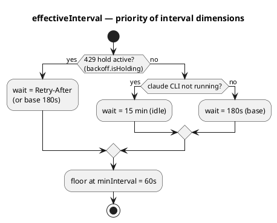
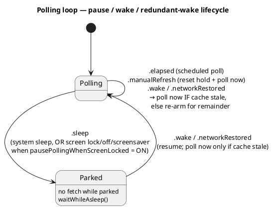
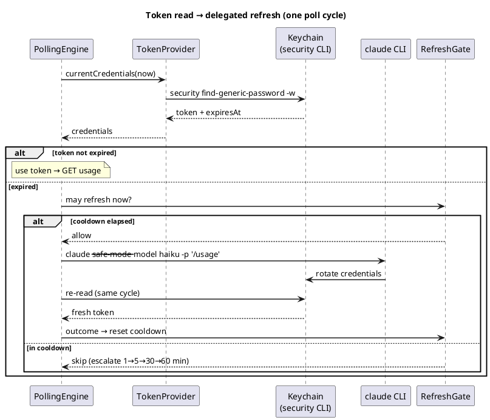
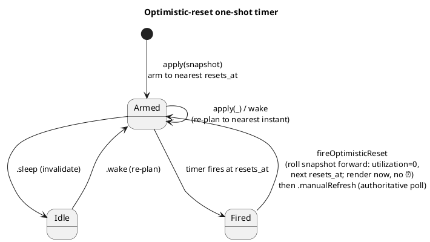
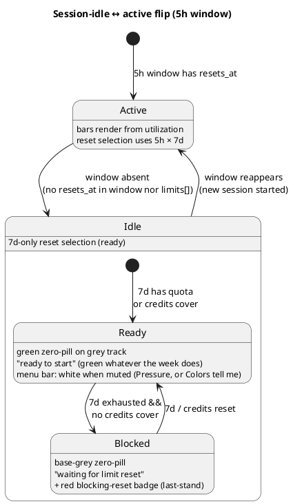
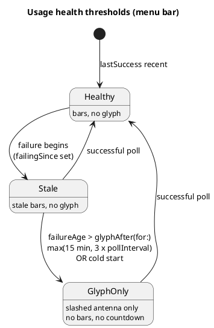

# Архітектура — потік даних (Фаза 1)

Наскрізна картина й розгортання — в [overview.md](overview.md). Тут — як дані течуть від Keychain до
menu bar: полінг, читання/оновлення токена, pacing-модель, рендер menu bar і popup, стани помилок.

## Потік опитування

```
Keychain (OAuth token)
  → PollingEngine (живий async-цикл, pure ядро + seam'и, TokenPaceKit)
  → GET https://api.anthropic.com/api/oauth/usage
    (headers: Authorization, anthropic-beta, User-Agent: claude-code/<version>)
  → (успіх/помилка опиту) → UsageHealth (lastSuccess/failingSince/reason)
  → MenuBarLayout.make(UsageSnapshot?, UsageHealth)
      → MenuBarMode (expanded/iconOnlyReset/error/usagePollingOff/nothingMonitored)
  → StatusItemView малює NSStatusItem (pacing-смужки + час ресету, або ⚠️)
  → клік → PopupLayout.make(...) → PopupViewController у NSMenu
  → кожен PollOutput несе PollDiagnostics (сира FetchDiagnostics + TokenDiagnostics)
```

## Каденція опитування (ADR-0032)

Пласка 3-хв база з двома оверрайдами; reset-тригер лишається в shell-таймері (#36, ADR-0030); пауза
на екрані — опція; надлишковий wake придушується, якщо кеш ще свіжий.

**Пріоритет вибору інтервалу:**




**Цикл пауза / wake / надлишковий wake:**




## Токен: читання та делегований refresh (ADR-0017 / 0019 / 0020)

Токен читається сабпроцесом `/usr/bin/security` (ADR-0019). Рішення про expiry ухвалює **engine**,
не провайдер (ADR-0020): провайдер віддає `currentCredentials`, engine перевіряє `isExpired`, і на
прострочення робить **делегований refresh** — спавнить `claude` CLI, щоб Claude Code сам ротував
пару, і перечитує Keychain у тому ж циклі. Результат фолдиться в `RefreshGate` з ескалацією cooldown
`1→5→30→60 хв` (ADR-0017).




## Оптимістичний ресет (#36, ADR-0030)

На межі ресету menu bar не має показувати застарілий ⏰. One-shot `Timer` (`AppDelegate.resetTimer`)
зведений на найближчий `resets_at` (`ResetClock.nextResetInstant`), переплановується на кожному
`apply(_:)` і на wake, інвалідовується на sleep. Спрацювання котить snapshot уперед і малює миттєво,
далі — авторитетний полл.




## Session-idle 5h-вікно (#100, ADR-0027; blocked — #158, ADR-0038)

Коли активної сесії немає, 5h-вікно не існує — жодного фантомного `now+5h`. Чиста
`sessionIdleTransition(previous:current:)` логує перехід раз, і рендер малює idle-бар.

Форма idle-бару **однакова в усіх трьох `BarStyle`** ([ADR-0078](../../adr/0078-idle-drawn-as-zero-in-both-styles.md)):
сірий трек + мінімальна пігулка на нулі, а Progress додає зверху маркер часу на нулі. Від варіанта
залежить лише **колір** пігулки:

- **Ready** — працювати можна: **зелена** пігулка, «ready to start». Із
  [#381](https://github.com/artem-from-ua/cc-timer/issues/381) вона зелена **завжди** й на обох
  поверхнях — стан тижня на неї не впливає, полів `LimitRow.weeklyHeadroom` /
  `BarView.weeklyHeadroom` більше немає. (Раніше вона була синьою при тижневому запасі й зеленою без
  нього.) `weeklyHasHeadroom` лишається й далі гейтить `blueAllowed` **активних** барів
  ([ADR-0081](../../adr/0081-weekly-capacity-gate-for-blue.md) — §4 про тризначну пігулку витіснив
  [ADR-0105](../../adr/0105-color-advice-governs-pacing-bars-only.md)). У menu bar під гасінням
  (`barStyle == .pressure || colorsTell.mutesCalm`) пігулка біла.
- **Blocked** — немає квоти 5h (idle або 5h≥100), 7d вичерпано (`≥100`) **і** credits не покривають (`CreditsPacing.isBlocked`:
  вимкнені / capped / відсутні): **сіра** пігулка (той самий тон, що трек — бар читається порожнім),
  статус «waiting for limit reset». На попапі
  рівно один ресет-час — **червоний**: обраний правилом «останнього рубежу» `BlockingReset` (credits-ресет
  виграє, коли не найпізніший, інакше `max(5h,7d)`); menu-bar-countdown бере той самий вибір
  (`BarView.blocked` / `LimitRow.sessionBlocked` / `PopupLayout.blockingReset`).

Окремо (ADR-0048, #193): коли підписковий ліміт вичерпано, **але credits активно покривають**
(`CreditsPacing.subscriptionExhaustedWhileCovered` — доповнювач `isBlocked`), стан **не** blocked
(рядок не сіріє, статус звичайний), проте попап усе одно фарбує ресет **токенного** ліміта червоним —
момент, коли квота повернеться й credits перестануть списуватися. Тут `BlockingReset.forSubscriptionExhausted`
(`creditsReset: nil` → найпізніший вичерпаний токен, ніколи не кредитний ресет). Лише попап; menu bar не чіпаємо.




## Стани помилок / health (#12, ADR-0010)

`UsageHealth` — **другий вхід** (поряд зі `UsageSnapshot`) для станів помилок. Пороги menu bar —
чисті функції від `failureAge(now:)`. Popup попереджає **одразу**; menu bar показує застарілі дані,
потім — **перекреслену антену** замість них.

**Фаз рівно дві** ([ADR-0091](../../adr/0091-countdown-only-where-work-is-not-running.md)):
проміжну («гліф **поряд зі** старими смужками», 30–60 хв) скасовано разом із `hideBarsAfter`, бо
смужки такої давнини провокують прочитання, якого не витримують, а попап уже пояснює збій словами.
Поріг рахується **у спробах, а не у хвилинах** — `UsageHealth.glyphAfter(for:)` =
`max(15 хв, 3 × pollInterval)`, тобто 15 хв під час активної сесії й 45 хв, поки жодної немає
(`PollingEngine.inactiveInterval` сам дорівнює 15 хв, тож пласкі 15 хв підняли б гліф після **однієї**
невдалої спроби). 429 у цю серію не входить: `failingSince` він не пише. Гліф тут —
`antenna.radiowaves.left.and.right.slash`; ⚠️ лишилося виключно за
`MenuBarMode.exhaustedUnknownReset` («дані суперечать собі»).




## Sessions awaiting input (#233, ADR-0066)

Окреме джерело даних, **незалежне від usage-полу**: лічильник локальних сесій Claude Code, що
очікують вводу користувача («Needs input» у FleetView). Читається не з API, а з файлів стану, які
Claude Code пише сам:

```
awaiting = ~/.claude/sessions/<pid>.json  .status == "waiting"
        OR (state.json свіжий AND ~/.claude/jobs/<jobId>/state.json .needs != null / .tempo == "blocked")
```

**Freshness-guard.** `needs`/`tempo` оновлює власний сканер Claude Code, який для worktree-сесій
розсинхронюється і **заморожує** `state.json` на минулій фазі (`needs:"approve plan"`) → фантомна
рука, що не гасне. Тому ці дві гілки враховуємо лише коли `state.json.updatedAt` (ISO) не старший за
`session.statusUpdatedAt` (ms) більш ніж на 60 с; `status == "waiting"` безумовний; недоступний
timestamp → fail-open. Деталі — ADR-0066 (постскриптум).

- **`AwaitingInputScanner`** (`TokenPaceKit`, pure, stateless) — читає файли (без `JSONDecoder`,
  таргетовані regex), джойнить лише по живих сесіях, повертає **`AwaitingSessions`** (кожна сесія:
  проєкт = `originCwd`/repo-root + `daysUntilDeletion` = `cleanupPeriodDays` − вік_за_updatedAt).
  `cleanupPeriodDays` з `~/.claude/settings.json` (дефолт 30, ADR-0031). ~0.18 ms/скан.
  **«Живі» — перевіряються, не припускаються** (#275): файл сесії переживає свій процес, тож `claude`,
  вбитий на промпті, лишав би `status:"waiting"` назавжди (до 30-денного клінапу). Кожен pid
  звіряється з таблицею процесів через `ProcessLiveness`; `procStart` захищає від перевикористання
  pid. Fail-open: якщо pid або `procStart` не читаються — сесія рахується.
- **`AwaitingSessions`** — агрегат: `count`, `urgency` (найтерміновіша сесія: <7d→червона, <15d→
  помаранч, інакше нейтр.), `perProject` (розбивка по бакетах). Керує тоном індикатора.
- **`AwaitingInputWatcher`** (shell) — event-driven через **FSEvents** на каталогах `sessions/` +
  `jobs/` (не на файлах — набір сесій змінний), + рідкий safety-poll (~45 с). Кличе `scan(now:)` лише
  на реальні зміни; колбек спрацьовує тільки коли результат змінився (count/urgency/розбивка).
  **Гейт** (#275): активний, поки ввімкнена фіча, сценарій — реальна мережа, **і екран доступний**
  (не замкнений, без скрінсейвера, дисплей і система не сплять). На парку стрім і таймер знімаються,
  на відновленні — примусовий catch-up скан. Стан екрана приходить окремим **негейтованим** колбеком
  `ScreenLockObserver`, тож пауза не залежить від опції `pausePollingWhenScreenLocked`.
- **Рендер** — результат графтиться на layout'и (`withAwaitingInput`) у `render()`, поза usage-`make`.
  Індикатор = `N✋` (число **перед** долонею), долоня тонована за `urgency`. Menu bar: лише долоня
  (без числа), **перший leading** елемент, за Appearance-опцією «Show awaiting-input icon in the menu
  bar». Popup (без ⌥): `Claude [age]` зліва, `N✋` flush-right (1 → лише долоня). Popup з **⌥**: `N✋`
  зникає, нижче inline-розбивка по проєктах (`project … 2✋ 1✋ 6✋`, долоня на бакет, tooltip бакета).
  Opt-in (Settings → General, дефолт OFF); menu-bar-показ — Settings → Appearance (у пресетах:
  chill=OFF, workHarder/controlFreak=ON).

Повний дизайн каденції/кешу/логування — [awaiting-input-refresh.md](../../design/awaiting-input-refresh.md).

## Plan label у заголовку «Claude»

Праворуч від слова **Claude** (першого рядка попапа) виводиться назва плану підписки — `Claude ･ Max (5x)`
— **фірмовим теракотовим кольором** (`claudeBrand`, `#d97757`; той самий, що й «Claude»). «Claude» і
роздільник `･` — жирні; сама назва плану — **не** жирна (відрізняється вагою, не кольором).

- **Джерело.** Не з usage-API, а з OAuth-payload у Keychain: поле `rateLimitTier`
  (напр. `default_claude_max_5x`) на `TokenCredentials` → `TokenDiagnostics` →
  `output.diagnostics?.token?.rateLimitTier`. Не секрет — лише плановий маркер. `subscriptionType`
  (`"max"`) **не використовується**: він надлишковий — назва сім'ї плану й множник уже є в `rateLimitTier`.
- **Мапінг** — `claudePlanLabel(rateLimitTier:)` (`TokenPaceKit`, pure). Це **whitelist, не best-effort**:
  публічної таблиці tier'ів немає, а сторонні клієнти суперечать одне одному (`default_claude_ai` →
  «Pro» в одних, «Free» в інших), тож ми розпізнаємо **лише** впевнені форми, а на решту повертаємо
  `nil` — інакше в бренд-кольорі відрендериться здогад, що читається як баг. Розпізнаємо:
  - `default_claude_max_<N>x` → `Max (<N>x)` (патерн: `5x`/`20x`/майбутній `50x`; множник у дужках і з малою `x` — так ці плани називає Anthropic);
  - `default_claude_pro` → `Pro`;
  - будь-що інше (`default`, `default_claude_ai`, невідоме, відсутнє) → `nil`.
- **Рендер.** `nil` → лише «Claude», **без** роздільника `･`. Непорожня мітка графтиться на layout через
  `PopupLayout.withPlanLabel(_:)` у `render()` — поза usage-`make`, тим самим патерном, що й
  `withAwaitingInput` (джерело поза usage-снапшотом). `PopupViewController.brandTitleLabel(plan:)` збирає
  єдиний attributed-лейбл (спільна базова лінія). Обидві гілки заголовка (звичайна / з awaiting-індикатором)
  використовують той самий лейбл.

## Insights pipeline (#238)

Окремий від живого рендера **read-back**-потік: історія використання, яку колектор пише на диск,
згодом читається для аналітики. Три ланки, кожна — окрема сесія/PR проти `main`:

1. **Collector + storage (#242, ADR-0067)** — append-only JSONL, один рядок на успішний полл
   (`JournalRecord`), плюс resume-маркери на розривах семплування. Пише `UsageJournal` (actor,
   non-blocking); читає назад `JournalReader.parse(_:)`. Деталі типів — рядок «JournalRecord …» у
   [services-and-config.md](services-and-config.md).
2. **Aggregator (#244)** — чистий `UsageGridAggregator.grid(...)`: `[JournalRecord]` → сітка
   **днів × годин** для однієї метрики під одним фільтром (5h/7d). Пілотна метрика `sampleDensity`
   рахує щільність семплів; комірки-розриви (`GridCell.gap`) тримаються окремо від «0 семплів», щоб
   візуалізація не інтерполювала крізь діри (та сама чесність, що `ServiceStatus.unknown`/ADR-0027).
   AppKit-free, в `TokenPaceKit` — одне місце, яке пілотний чарт і будь-яка пізніша метрика реюзають.
3. **Window + pilot chart (#245)** — вікно Insights (`InsightsWindowController`, стиль Settings)
   рендерить сітку агрегатора першим чартом; відкривається з першого dropdown-пункту «Insights…» —
   але сам пункт (і роздільник під ним) наразі закоментований в `App.swift`, доки вікно порожнє;
   контролер і дія `openInsights` лишаються на місці, повернення = розкоментувати блок.

Кінцеві consumer-фічі поверх журналу — окремі: unexplained relief (#239), personal service-status
history (#240), burn-rate vs baseline (#241). Вони читають той самий журнал через `JournalReader`.

## Компоненти потоку даних

| Компонент | Відповідальність |
|---|---|
| **TokenProvider** | Читання токена з Keychain **сабпроцесом `/usr/bin/security find-generic-password -w`** (матч лише за service; декодування обгортки `claudeAiOauth`, перевірка `expiresAt`). Прямий `SecItemCopyMatching` свідомо не використовується: Claude Code на кожному refresh переписує item через `security add-generic-password -U`, що **скидає ACL partition list** і знову викликає keychain-промпти у GUI-застосунку; `security` — Apple-tool, тож читає тихо (ADR-0019). Pure-обробка виводу — `parseSecretOutput`/`mapExitStatus`, юніт-тестовані. Протухлий токен **не йде на API** — але рішення про expiry ухвалює **engine**, не провайдер (ADR-0020): `currentCredentials(now:)` віддає `TokenCredentials {accessToken, expiresAt}` (без `refreshToken`), а engine реагує делегованим refresh (ADR-0017). TokenPace ніколи не пише в Keychain. Свідомий вибір `throws`+enum — ADR-0007, ADR-0020 |
| **DelegatedRefresh / RefreshGate** | Kit-сторона делегованого refresh (ADR-0017): протокол `DelegatedRefresher` (fail-safe — не кидає) + чистий `RefreshGate` — anti-flap гейт спроб з ескалацією cooldown `1→5→30→60 хв`. Outcome-и: `refreshed`/`unchanged`/`cliNotFound`/`timedOut`/`failed(exitCode:)` |
| **UsageClient** | Запити до usage API з обов'язковим `User-Agent: claude-code/<version>` (guard: без нього не ходити). Чисті seam'и `buildRequest`/`decode` окремо від мережевого `fetch` (інжектований `UsageTransport`). Типізований `UsageError`. `diagnosedFetch -> DiagnosedFetch` складає `FetchDiagnostics` з повним body для Troubleshoot (ADR-0020). Дати **не парсимо** — `resets_at` зберігаємо сирим для `ResetClock`. На межі ресету `UsageSnapshot.decode` **синтезує** свіже вікно замість падіння; виняток для `five_hour` (#100, ADR-0027): без `resets_at` вікна не існує (`sessionIdle: true`). Для `seven_day` вичерпаний ланцюг більше **не оцінює** `now + 7d` — та оцінка перераховувалась щопола й повзла вперед, тримаючи `elapsedFraction` на нулі всі 4–6 год щотижневого затемнення API; замість неї `ResetClock.rollForward` котить останній **серверний** ресет на ціле число тижнів (±0.25 с на живих даних), а без якоря нічого не вигадується — `resets_at` лишається порожнім і обидві поверхні кажуть, що час ресету невідомий ([ADR-0107](../../adr/0107-weekly-reset-reconstructed-from-the-last-known-one.md)). Якір приходить у декодер через `userInfo` (як і `now`), пишеться лише зі знімка, чий `ResetSource.isUnrolledServerFact`, і персистується в `PersistedConfig.lastSevenDayReset`. Per-model під-вікна успадковують `resets_at` від `seven_day`; `weekly_scoped` (напр. Fable, #65) — через `scopedModelWindows`. Грошові кредити (#143): блоки `spend` + `extra_usage` мерджаться в опційний `SpendInfo` (`nil` до появи кредитів; гроші — цілий `Money {amount_minor, currency, exponent}`, не float; серверний `spend.severity` та `balance`/`auto_reload` **ігноруємо** — spike #142). Backoff — чистий `PollingBackoff` (180 с; 429 → hold на `Retry-After`, без ескалації, ADR-0032). Деталі — ADR-0008, ADR-0014 |
| **PacingModel** | Порт `calc_time_pct`/`get_limit_indicator` зі statusline. Зони смужки — **безперервні частки [0,1]** (`BarLayout`), не блоки; блокова квантизація — опційна похідна (ADR-0005). Far-behind (green→blue) поріг **фіксований** (ADR-0081): `behindThreshold(windowDurationSeconds:)` домножає базову ширину (1h/5h, 1d/7d) на константу ×2 → 0.40 / 0.286. Чи взагалі малювати синій, вирішує `BarLayout.blueAllowed`, який несе **weekly-capacity gate** (`PacingModel.weeklyHasHeadroom`: 5-годинний і per-model бари синіють лише поки 7-денне вікно саме не попереду темпу) — одне поле читають і Kit-severity, і render-колір, і журнальний `PacingBucket`, тож розійтися вони не можуть. Геометрія барів без маркера теж тут: `BarLayout.pressureLength` (шкала залишку, ADR-0076/0101) і `BarLayout.balanceOffset` (знакове зміщення від центру, `clamp(r, ±1)`, ADR-0079/0101) — обидві з того самого `r = (u − t)/(1 − t)`, і від ADR-0101 перша **виводиться з другої** (`max(0, balanceOffset)`), без жодного коефіцієнта; спільні крайні випадки — у приватному `signedLead`. Обидві render-only: severity й колір від них не залежать |
| **WeeklyRatio / WeeklyInterpolator / WeeklyUtilization** | Реконструкція тижневого `utilization` із п'ятигодинного лічильника ([ADR-0103](../../adr/0103-weekly-utilization-reconstructed-from-the-five-hour-counter.md), формальний опис — [design/weekly-interpolation](../../design/weekly-interpolation.md)). API квантує `seven_day.utilization` до цілого, і один пункт — 1 год 40 хв роботи; `five_hour` квантований так само, але його пункт 3 хв, тож тижнева шкала читається через п'ятигодинну з коефіцієнтом `N`. **`WeeklyRatio`** — ковзна медіана `N` по 15 сегментах (сегмент = проміжок між стрибками `d7`), сід `10.0`; медіана, бо окремі `localN` розкидані 3–24 через квантування **обох** рядів. **`WeeklyInterpolator`** — стан між полами: якір (точна нижня межа кошика, коли бамп засічено; центр, коли успадковано), накопичення додатних приростів `h5`, кліп на стелі кошика, адаптивний поріг діри від *фактичного* кадансу. Живе в `PollState`, персистується як Codable-блоб. **`WeeklyUtilization`** — носій `raw`/`effective`/`source`, і єдиний шлях до бару — `applied(to:)`, що переписує вікно снапшота за зразком `ResetClock.optimisticReset` (і **до** нього). Інваріанти: `raw = 100` і `raw = 0` проходять наскрізь, тож детектори `>= 100` і `> 0` недоторкані; монотонність — за побудовою, бо стеля кошика й підлога наступного це та сама точка |
| **CreditsPacing** | Чиста AppKit-free логіка для `SpendInfo` (#143): тригер іконки (`enabled` **OR** `spend_limit_reached`, І хоч один базовий ліміт вичерпаний) і `barLayout(for:now:timeZone:)` — колір рахується **так само, як бари токенів** (`usage` vs `time`, той самий `BarLayout`/`aheadColor`: зелений→жовтий→оранжевий→**червоний лише при досягнутому ліміті**), а не окремою формулою. `usageFraction = used/limit`; `timeFraction = monthElapsedFraction` — частка календарного місяця, що минула, від **00:00 UTC 1-го числа** (`resetTimeZone`; API не дає reset-часу грошей, рахуємо локально — джерело: Anthropic Spend Limits API docs). Без ліміту (unlimited) → `nil` (без бару, лише сума). База — лише ліміт (balance недоступний, поза обсягом). blocked (#158/ADR-0038): `creditsCanCover(spend)` (enabled І не capped — платний «останній рубіж») та `isBlocked(in:)` (`(sessionIdle OR 5h≥100) AND 7d≥100 AND NOT creditsCanCover`). Доповнювач (#193/ADR-0048): `subscriptionExhaustedWhileCovered(in:)` = `mainWindowExhausted AND creditsCanCover` — вичерпано підписку, але credits покривають (взаємно виключний з `isBlocked`) |
| **ResetClock** | Парсинг `resets_at` → `Date`; вибір найближчого ресету (5h vs 7d); `relativeRounded` — **спільне числове ядро обох поверхонь** (`45m`/`5h`/`4d`/`<1m`), звідки `timeToReset` бере лейбл меню-бару (ADR-0074: один формат на будь-якій відстані, поріг 90 хв і `TimeToReset` прибрано, `timeToResetCompactDays` злилася сюди ж), а `resetLine` — рядок дропдауна, додаючи кваліфікатор `at 03:00` / `on Friday` (ADR-0043) і, за `verbose: true`, префікс `resets in` (⌥-форма попапа); `nextReset`/`nextResetInstant` для синтезу вікна й one-shot таймера; `optimisticReset(_:now:)` котить snapshot на межу ресету (ADR-0030), застосовується на **кожному** рендері (`AppDelegate.render`, ADR-0043). Свідоме розходження зі statusline — ADR-0006 (скасовано ADR-0074) |
| **UsageHealth** | Чистий value-тип стану опитування — **другий вхід** для станів помилок (#12): `lastSuccess`/`failingSince`/`reason`/`notPolling`/`pollInterval`. Поріг — чиста функція від `failureAge(now:)`, і він **один**: `glyphAfter(for:)` = `max(glyphAfterFloor 15 хв, glyphAfterAttempts 3 × health.pollInterval)` — 15 хв під час активної сесії, 45 хв поки жодної немає ([ADR-0091](../../adr/0091-countdown-only-where-work-is-not-running.md)). `hideBarsAfter` видалено разом із середньою фазою: смужок біля гліфа більше не буває. Поріг рахується **у спробах, а не у хвилинах**, бо `PollingEngine.inactiveInterval` сам дорівнює 15 хв — пласка константа підняла б гліф після однієї невдалої спроби на неактивній машині. 429 у серію збоїв не входить (`failingSince` не пишеться). `FailureReason` мапить `TokenError`/`UsageError` → семантичні причини (exhaustive `switch`). Розкол — ADR-0010 |
| **MenuBarLayout** | Чиста модель «що малювати»: `make(...)` → `MenuBarMode.expanded` (завжди дві смужки, ADR-0015) чи безсмужковий стан. **Відлік живе лише там, де немає смужок** ([ADR-0091](../../adr/0091-countdown-only-where-work-is-not-running.md), витісняє ADR-0029): `.expanded` **не має поля** для числа, тож пара «смужки + число» нерепрезентовна — інваріант тримає тип, а не домовленість. Разом із полем пішли `selectReset`, `ResetSelection` і `ResetToShow` (обидва виклики жили всередині `expandedBars`, тобто рівно на шляху, що більше не несе відліку); `BlockingReset` не зачеплено — саме він будує відлік безсмужкових станів, і в заблокованому idle (#158/ADR-0038) це той самий вибір, що й у попапа, а `BarView.blocked` фарбує idle-бар сірим. **Ховання спокійної 5h** (#94, ADR-0034 → ADR-0086 → ADR-0090) — `fiveHour` стає опційним; ховається лише верхня смужка, 7d лишається завжди. **«Чи можемо ми працювати?» — три взаємовиключні стани** (ADR-0090, витісняє ADR-0063): можемо на підписці → `.expanded` зі смужками; можемо, але за гроші (`CreditsPacing.subscriptionExhaustedWhileCovered`) → `.iconOnlyReset` зі знаком валюти + countdown (`BlockingReset.forSubscriptionExhausted`), **без смужок**; не можемо (`isBlocked`) → `.iconOnlyReset` з pause-гліфом, **без смужок і без валюти** (маркер кредитів занулюється при `blockedPause`, інакше при `spend_limit_reached` малювались обидві іконки). Гейта `pauseHidesBars` більше немає — ховання безумовне. **Вичерпане вікно ніколи не малюється смужкою** (ADR-0091): при нерозв'язному `resets_at` обидві гілки дають не fallback до смужок, а окремий кейс `.exhaustedUnknownReset(which:)` — **самотній ⚠️**, без паузи й валюти (`blockedPause` і `credits` там занулюються навмисно: гліф, що стверджує стан, поруч зі знаком, що від даних відмовляється, читається як зламаний віджет). `which` дає предикат `exhaustedWindowWithoutReset`, а не `hasBrokenActiveReset` — той каже лише «десь зламано» й однаково істинний для 5h-вікна на 12 %. Побудову смужок виділено в `expandedBars`, і stale-шлях у неї **більше не ходить**: після порога лишається голий гліф без смужок. Червоний `pause.fill` — провідний елемент під `isBlocked` (прапорець `blockedPause: Bool` на health-обізнаному `make`-шві: `true` коли `isBlocked` **І** `mode ∈ {.expanded, .iconOnlyReset}`; ніколи для `.error` — застарілі дані не стверджують блокування — і ніколи для `.exhaustedUnknownReset`). Форсувати відлік у `.iconOnlyReset` більше нема попри що: опція `ResetCountdownMode` («Show reset countdown») видалена цілком, ключ `resetCountdownModeMenuBar` ретировано й підмітається, як `pauseHidesBars`. Малювання — leading-гліф ліворуч від барів (`.expanded`) або ліворуч від countdown (`.iconOnlyReset`); колір — уніфікована роль `.red` (accessor `Palette.pauseRed`), спільна з вичерпаними барами й пігулкою блокуючого ресету. Health-обізнана гілка (#12) додає `.error` з опційними смужками. **Іконка грошових кредитів** (#144) — `credits: CreditsMarker?` (без користувацького гейта з ADR-0090 — вирішують дані): `creditsMarker(for:now:)` містить `CreditsPacing.shouldShowIcon` (показ) + `CreditsPacing.barLayout` (`bar: BarLayout?` для кольору; `nil` → нейтрально при unlimited). У `.expanded`/`.iconOnlyReset` іконка малюється у **провідній** позиції — між pause-гліфом і барами (#227); лише у діагностичному `.error` лишається трейлінг. Ортогональна до `mode`/`serviceProblem`. Живе в `TokenPaceKit`. Розкол pure/shell — ADR-0009, ADR-0010 |
| **StatusItemView** | Тонкий AppKit-shell (`NSView` у `TokenPace`): малює `MenuBarLayout` — смужки **без числа** (`.expanded`), `.iconOnlyReset` (pause- або валютна іконка + центрований countdown-лейбл, без барів — #194/ADR-0063, ADR-0090), самотній **⚠️** `exclamationmark.triangle` за `.exhaustedUnknownReset` (ADR-0091), або **перекреслену антену** `antenna.radiowaves.left.and.right.slash` за `.error` — усі гліфи monochrome `labelColor`. Два трикутники навмисно розведено: «не дістаємось API» — подія регулярна, «вікно вичерпане, а дата зламана» — рідкісний баг сервера, і спільний гліф робив рідкісний стан схожим на частий. Порядок зліва направо у режимах барів (`.expanded`/`.iconOnlyReset`): **червоний pause-гліф** (#199/#227) → **іконка грошових кредитів** (#144/#227, провідна позиція між pause і барами) → бари/countdown → час ресету; **service-крапка** (#31) лишається найправішою. У діагностичному `.error` іконка кредитів лишається трейлінг (ліворуч від service-крапки). Гліф кредитів — за валютою (`creditsSymbolName`: EUR→`eurosign` €, USD→`dollarsign` $, GBP→`sterlingsign` £, JPY/CNY→`yensign` ¥, INR→`indianrupeesign`, невідома→generic `coloncurrencysign` ¤), колір із `CreditsMarker.bar` через той самий `aheadColor`, що й бари (`bar == nil` → нейтральний foreground). Ширина резервується під конкретний гліф (`creditsIconWidth(for:)`). idle-5h — форма **однакова в обох стилях** (ADR-0078): сірий трек + мінімальна пігулка на нулі, і лише Progress додає зверху маркер часу на нулі (він накриває пігулку); суцільної заливки на всю ширину немає ніде. Колір пігулки з [#381](https://github.com/artem-from-ua/cc-timer/issues/381) — **`Palette.gapGreen`** (синього idle більше немає ніде, і тижневий стан на неї не впливає), під гасінням → спільний `Palette.calmWhite`, або `Palette.unusedGrey`, коли idle заблоковано (`BarView.blocked`, #158/ADR-0038: 7d вичерпано і credits не покривають) — той самий сірий, що зони бару, в усіх colour-режимах. Гасіння спокійного боку — `barStyle == .pressure || colorsTell.mutesCalm`: під **Pressure безумовне** (там спокійна стрічка має нульову довжину, тож рядок «Colors tell me» під цим стилем із панелі й ховається), інакше за [`ColorAdvice`](../../../Sources/TokenPaceKit/ColorAdvice.swift) (#105). **Не** читають це налаштування, кожен зі своєї причини: **service-крапка** (`degraded` у menu bar завжди `calmWhite`, безумовно — у попапі лишається жовтою, бо там поруч текст) і **гліф кредитів** (його власна шкала біла→помаранчева→червона самодостатня, ADR-0068). Кольори — **системні semantic** (ADR-0059): track = `labelColor@0.22` (дихає+фліпає як місяць), яскраве (текст/⚠️/tick) = `labelColor` at fixed alpha через `bright()`, акценти = `.system*`; рендер — eager у `button.effectiveAppearance`. Перемальовування лише при зміні `layout` — **єдиний виняток**: поки колір *змінюється* або долоня їде, `ColorAnimator` жене 0.8 с кадрів (30 fps), щоб перехід між пейсинг-зонами був плавним, а не блимав ([#270](https://github.com/artem-from-ua/cc-timer/pull/270)/ADR-0070); таймер живе тільки в межах переходу й гасне, коли **обидва** реєстри (кольори + скаляри) спокійні. **Awaiting-долоня** ([#233](https://github.com/artem-from-ua/cc-timer/issues/233)) — найлівіша leading-декорація (перед pause/credits/барами); її слот резервується з Appearance-опції, **не** з живого лічильника ([#283](https://github.com/artem-from-ua/cc-timer/issues/283)/ADR-0073), тож ширина віджета не стрибає, коли сесії починають і перестають чекати; сам гліф виїжджає знизу й ховається вниз усередині цього слоту (`ScalarTween`, обрізання по слоту, Reduce Motion → миттєво). **Подача бару конфігурована** (#224, ADR-0062; per-surface з #329, ADR-0080): `menuBarStyle` — власний ключ цієї поверхні (`.progress`/`.pressure`/`.balance` — Progress: gap+маркер у шкалі вікна; Pressure: стрічка від лівого краю в шкалі залишку, `BarLayout.pressureLength` = `max(0, balanceOffset)`, ADR-0076/0101; Balance: стрічка від центру зі знаком, `BarLayout.balanceOffset` = `clamp(r, ±1)` + риска нуля 1.5 pt під треком, ADR-0079/0096/0101 — обидві шкали з одного `r`, без коефіцієнта). Шкалу названо явно — `BarScale { window, remaining, centred }`, прапорець маркера виводиться з неї (`showsTimeMarker == (scale == .window)`; per-surface пари властивостей більше немає — стиль описує одну поверхню) і `colorsTell` ([`ColorAdvice`](../../../Sources/TokenPaceKit/ColorAdvice.swift) — перейменований у [#381](https://github.com/artem-from-ua/cc-timer/issues/381) із `CalmColorMode`, який свого часу замінив пару `calmColors`+`workHarder`; кейси `.slowDown`/`.slowDownOrSpeedUp`/`.howItsGoing`, render читає derived `mutesCalm`/`mutesBlue`). Розкол — ADR-0009, ADR-0010 |
| **PopupLayout** | Чиста модель «що показати в popup»: `make(...)` → секції `LimitRow` (5h, 7d, Opus/Sonnet, scoped-моделі з `limits[]`). idle-5h → `idleFiveHourRow` (#100), з `sessionBlocked` коли заблоковано (#158/ADR-0038 → «waiting for limit reset» + сірий бар). Поле `blockingReset: BlockingReset.Choice?` вказує рядок/секцію, чий ресет фарбується червоним; виставляється у **двох** випадках: `isBlocked` → `forBlocked` (правило «останнього рубежу», спільне з menu bar, може дати кредитний ресет); інакше `subscriptionExhaustedWhileCovered` (#193/ADR-0048) → `forSubscriptionExhausted` (лише токенний ресет — coли credits покривають, підсвічуємо, коли підписка розблокує). Health-обізнана гілка (#12) додає `warning: FailureReason?` одразу. **Секція «Extra usage»** (#145) — окреме поле `credits: CreditsRow?` (НЕ в `rows`): `creditsRow(from:now:)` за м'якшим гейтом `CreditsPacing.isActive` (лише `enabled`/`spend_limit_reached`, без вимоги вичерпаного базового ліміту — це умова menu-bar-**іконки**, а не деталі). Несе сирі `spent`/`limit` (`Money`), `bar: BarLayout?` (nil = unlimited → без бару/ресету) з `CreditsPacing.barLayout`, `resetLine` — єдиний рядок часу до кінця місяця через `CreditsPacing.monthEnd → ResetClock.resetLine` (той самий формат, що й токен-рядки: `15d`/`5d on Friday`/`20h at 03:00`, ADR-0043), плюс `resetLineVerbose` — та сама лінія з префіксом `resets in` (обидві форми пре-обчислені, бо вибір між ними — живий стан ⌥, який міняється при відкритому меню без ре-полу), і `inUse: Bool` (#146) — чи кредити **реально витрачаються зараз** (`CreditsPacing.shouldShowIcon`, той самий суворий гейт, що й menu-bar-іконка: enabled І вичерпаний базовий ліміт), для показу маркера «in use» (#254/ADR-0068 — плашка з вирізаним гліфом валюти). Несе лише сирі числа/прапорці й enum'и — речення збирає view. Реюз у Фазі 2. ADR-0009, ADR-0010 |
| **PopupViewController** | Тонкий AppKit-shell: малює `PopupLayout` у стилі рідних віджетів — болд-заголовок «Claude» (ADR-0021), рядки статусу сервісів, банер помилки, секції лімітів двоколонковим split-layout. **Попап завжди напівпрозорий** (#188/ADR-0064): уся Claude-секція сидить на заокругленій **плашці** `CardBackdropView` (Control-Center-стиль, layer-backed `updateLayer`, м'яка тінь, fill `controlBackgroundColor@0.85`, inset від країв — навколо просвічує рідний menu-матеріал; сепаратора перед Settings немає). `SolidBackdropView`/opaque-режим видалено. `PopupBarView` перебудовано (#188/ADR-0064): суцільний сірий track → кольоровий **стріп із капсульними торцями** + ambient-**glow** → **повзунок** із filled-frame сірим бордером і сильнішим glow; idle-бар несе той самий glow (ті самі параметри), що й pacing-стріп. Лінійка **ділиться надвоє**, тумблера `showTicks` більше немає (ADR-0098 витіснив §4 ADR-0062): **завжди** видно риску нуля, прокреслену **крізь** бар (малюється під треком, тож видно лише кінці) на нулі кожної безмаркерної шкали — вона й ідентифікує стиль з першого погляду; **під ⌥** до неї додаються зубці шкали (частки вікна в `.progress`) і **слово стилю** в заголовку рядка (курсивом, після роздільника `･`); підписи країв місяця й підпис `0` прибрано (ADR-0108) — кожен називав те, що його ж позначка вже показує, і додавав пів рядка тексту під баром. Роль кольору риски — `centreTick`, той самий, що й у меню-барної (ADR-0096), висота під вищий бар попапа (12 pt на 6-pt барі проти 10 на 5), ширина — 5/7 ширини нульової пігулки (трек — тьмяніший popup-only тон між tertiary/quaternary label). Подача бару — **власний** ключ `dropdownStyle`, незалежний від меню-барного (#329, ADR-0080): `.pressure` малює стрічку від лівого краю за `pressureLength` замість gap+маркера, а її риска нуля стоїть на 0 (тіка на 20 % більше немає — його прибрано; ADR-0076). `.balance` малює стрічку від центру за `balanceOffset`, риска нуля — на 0.5, ADR-0079. `.progress` риски нуля не має взагалі: позицію там несе маркер часу (ADR-0098). **`PopupBarView` тепер ще й джерело плиток Settings** (#374, [ADR-0100](../../adr/0100-dropdown-style-tiles-and-retired-option-segment.md)): `draw(_:)` розколото на спільний кресляр `render(in:)` + `snapshotImage(width:)`, а `trackHeight`/`markerOverhang`/`liveWidth` виставлені назовні, щоб `DropdownBarStylePreviewRenderer` розставляв бари за **треком**, а не за кадром в'ю (кадр резервує місце під ⌥-лінійку, якої на плитці немає). Заразом полагоджено **обводку повзунка**: `monochromeGrey.blended(withFraction:of:)` рахувалася поза `performAsCurrentDrawingAppearance`, тож резолвилася під поточну появу й запікала один тон в **обидві** теми (заміряно: `13,96,26` і в світлій, і в темній); тепер це динамічний `NSColor(name:)`, що дає `185,239,190` у темній проти `13,96,26` у світлій — виправлення стосується **живого попапа**, не лише прев'ю. **Status-крапки** сервісів — `GlowDotView` (layer-backed, glow, re-resolve кольору в `updateLayer` → переживають зміну теми, не запечений image). **Секція «Extra usage»** (#145, `addCreditsSection`) під лімітами: усі стани мають **одну анатомію** (ADR-0108): «Extra usage ･ *progress* ⟷ [бейдж] статус-слово» (`creditsStatusText` із `bar`), «spent €X of €Y ⟷ `resetLine`» (той самий уніфікований формат, що й токен-рядки — `5d on Friday`/`20h at 03:00`; ADR-0043), під ⌥ — `resetLineVerbose` із префіксом `resets in`, і бар (той самий `PopupBarView`, `subdivisions: 0`); безлімітний рядок має **той самий** другий рядок («spent €X», без правої половини), а в слоті статусу — `no limit set`. Бейдж стану сидить у **правій** половині й кваліфікує статус (ADR-0108): за `credits.inUse` (#146) — маркер «кредити задіяні» (#254/ADR-0068): та сама `PillView`, що й у blocking-reset бейджа, з символом валюти як **текстовим вкладенням** (`NSTextAttachment`, `bounds` по `capHeight`), під ⌥ — слово `active`. Чорнило — `cardPlateFillOpaque` (колір картки без альфи, динамічний → сам перемикається light/dark), тож знак читається як вирізаний, лишаючись звичайним текстом; заливка — нейтральний `barTrack`, а не колір мітки (ADR-0108: «гроші рухаються» не має звучати як «ти заблокований»). Коли стеля вичерпана і cap **є** — бейджа немає взагалі: червоне належить бейджу ресету нижче; коли cap **немає** — заголовок несе червоний `out of credits`, бо ресету не існує. Раніше це був окремий `KnockoutGlyphBadge` із layer-маскою; його видалено — три бейджі мали три різні висоти (18.0 / 17.5–20.5 / 14.0 pt, валютний ще й змінював висоту з валютою), тепер усі беруть `PillView.sharedHeight`. Той самий SF Symbol, що й у menu bar (`StatusItemView.creditsSymbolName(for:)`), тож обидві поверхні позначають фічу одним знаком; tooltip `inUseHint` наголошує, що витрачання триває **саме зараз**. Свідомо **без статусного кольору**: раніше це була залита червона капсула `active` (#146 синя → #224 червона), яка ділила токен `gapRed` із blocking-reset бейджем і спрацьовувала на повну вже при €0.00 витрат — тепер заливка в попапі означає рівно одне («ти заблокований»), а `PillView` лишається тільки для blocking-reset. Сам `PillView` — це `NSTextField` із власним `PillCell` (`NSTextFieldCell`), який звужує `drawingRect(forBounds:)`: відступи всередині капсули застосовує сам AppKit, одна текстова сутність замість вкладеної мітки чи ручного малювання (обидва пробувалися й давали «плаваючі» відступи — поле округлює власну ширину до backing-піксела, а залишок ділиться центруванням). Бейдж **не** зсувається за колонку (`badgeColumnOvershoot = 0`): split-row притискає праву половину до краю, тож капсула закінчується там само, де текст сусідніх рядків, а її власний текст стоїть трохи всередині — це й є вигляд відступів на заливці. Пробували навпаки (текст бейджа в колонці, капсула звисає) — виглядає як помилка верстки, бо заливка найширша на рядку; кожні 2 pt зсуву виносять капсулу на 4 px за колонку. Відступи всередині — це **власні ~4.5 pt `NSTextFieldCell`** (`PillView.hInset = 0` понад них): константа в коді ≠ те, що на екрані, `hInset = 6` рендерився як 10.5 pt. Перевірка — `scripts/check-badge-column.swift` (міряє **відрендерені пікселі**: математика давала нулі там, де око бачило зсув). Форматер грошей `moneyText` — major-unit з цілого + `exponent`; для **відомих** валют `NumberFormatter(.currency)` ставить символ у **стандартну для валюти позицію** (`€10.77`/`$10.77` перед, `10,77 kr` після), для **невідомих** — `сума КОД` (`12.00 UAH`). Набір відомих валют дзеркалить `StatusItemView.creditsSymbolName`. НЕ хардкод $. Форматування рядків — тут (точка локалізації). ADR-0009, ADR-0010, ADR-0021. Від #279 — рядки інцидентів під ⌥ (там ⌥ перемикає **вимір**, не деталізацію), вік стану поруч зі словом-статусом; ⌥ також розгортає рядок деталей у речення — `usedText`/`resetText` додають слова «used» і «resets in» до тих самих чисел (у спокої — голі `20%` і `2h at 02:50`), і рядок підписки на епізод: власний `NSView` з `mouseDown`, бо нативні `NSControl` у `NSMenuItem.view` ненадійні (ADR-0013 §4, ADR-0020 §3). ADR-0071 |
| **DevToolsWindowController** (#187, #279) | Dev-only вікно «Development tools» — два інструменти, що ганяють застосунок по станах, до яких живий трафік доходить рідко або ніколи. **Живий селектор стубів** (#187, ADR-0047): `NSPopUpButton` («Preview data source (stub)») перемикає `TOKENPACE_STUB`-сценарій **без рестарту** — вибір іде через closure `onStubChange` у `AppDelegate.switchScenario`, під випадайкою — `summary` поточного сценарію; «Real network (no stub)» повертає застосунок на живий API. **Чекбокс логування status-payload JSONL** (#279, ADR-0071 §10) плюс «Reveal in Finder»: пише сирі відповіді `status.claude.com` при кожній матеріальній зміні, щоб відкриті питання ADR закривалися з реального трафіку, а не з припущень; прапорець читається на кожному полі, тож діє одразу. Layout — один вертикальний `NSStackView`, пришпилений по чотирьох краях. Вікно **always-on-top** (`.floating`), `isReleasedWhenClosed = false`. **Гейт — `defaults`-ключ `devToolsEnabled` `І` ⌥ Option** (ADR-0053); для скриптингу авто-відкриття — `TOKENPACE_OPEN_DEVTOOLS=1`. До ADR-0107 те саме вікно несло **колор-тюнер** (#185) із каталогом ролей, inline-пікером і **власним вікном прев'ю попапа** — звідси й попередження «прев'ю тепер два, і їх легко сплутати»; тепер прев'ю одне (`SettingsPreviewWindowController`, ADR-0083), а палітра живе в `ColorRole` (`Sources/TokenPace/Palette.swift`) — плоский каталог **18** іменованих ролей, який обидві `Palette` (menu bar + popup) і Settings читають напряму через `defaultColor`, без проміжного шару. ADR-0047, ADR-0071, ADR-0107 |
| **PollingEngine** | Живий async-цикл (`TokenPaceKit`): pure ядро (`advance`/`effectiveInterval`/`intervalDecision`/`wakeRearmInterval`) + seam'и. `run() -> AsyncStream<PollOutput>`. Інтервал (ADR-0032) — `429-hold > claude-idle 15 хв > база 3 хв`, ніколи нижче `minInterval` = 60 с. Park на sleep; wake → опит лише якщо кеш застарів; `.manualRefresh` → завжди негайний опит + скид 429-hold. Рішення про expiry — тут (ADR-0020); делегований refresh + перечит токена в тому ж циклі (ADR-0017). Кожна зміна інтервалу й idle↔active-флип логуються раз. ADR-0032 (superseded ADR-0011) |
| **LivePollScheduler / PollingShell** | Виробничий scheduler (`AsyncStream`+`Task.sleep`) і платформенні seam'и: `WorkspaceSleepWake`, `ScreenLockObserver` (#114, gated `pausePollingWhenScreenLocked` — плюс окремий **негейтований** колбек стану екрана для awaiting-вотчера, #275), `NetworkMonitor` (`NWPathMonitor`), `ProcessClaudeActivityProbe` (`sysctl`, точне ім'я `claude`), `SignalHub`. `SignalHub.newStream()` видає **свіжий** single-consumer `AsyncStream` на кожну побудову engine (`send` під `NSLock`) — щоб live-swap стуба (#187, ADR-0047) не лишав новий engine на завершеному стрімі. Джерело істини стуб-сценаріїв — `StubScenario` (`CaseIterable`; rawValue=env-id, `makeTransport()`), спільне для launch-шляху й dev-випадайки. Оптимістичний-ресет таймер — тут (ADR-0030). ADR-0011, ADR-0032, ADR-0047 |
| **ClaudeCLIRefresher** | Виробничий `DelegatedRefresher` (ADR-0017) — спавн `claude --safe-mode --model haiku -p '/usage'` у порожній tmp-теці, таймаут 30 с. `--safe-mode` вимикає користувацькі hooks/plugins/MCP/CLAUDE.md (лишає auth+Keychain), щоб чужий хук не спричинив TCC-промпт від імені TokenPace (#183). Критерій успіху — `expiresAt` посунувся вперед. Токен ніколи не в аргументах/env/логах |
