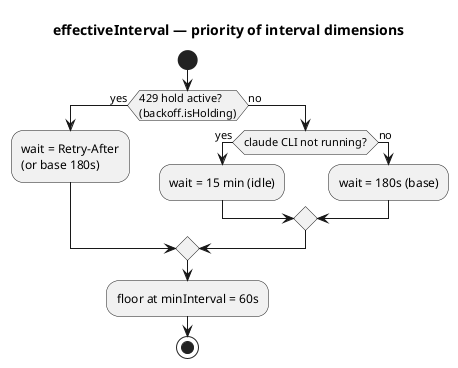
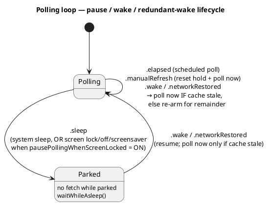
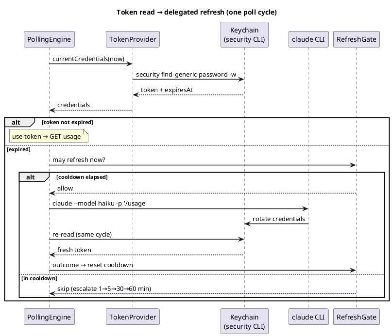
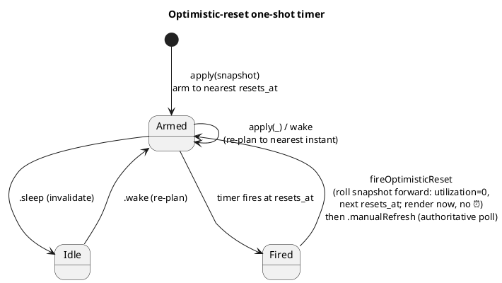
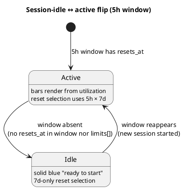
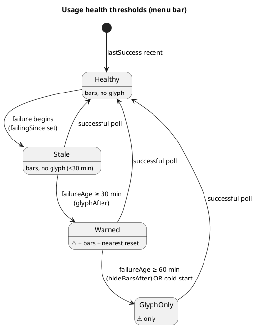

# Архітектура — потік даних (Фаза 1)

Наскрізна картина й розгортання — в [overview.md](overview.md). Тут — як дані течуть від Keychain до
menu bar: полінг, читання/оновлення токена, pacing-модель, рендер menu bar і popup, стани помилок.

## Потік опитування

```
Keychain (OAuth token)
  → PollingEngine (живий async-цикл, pure ядро + seam'и, TokenPaceKit)
  → GET https://api.anthropic.com/api/oauth/usage
    (headers: Authorization, anthropic-beta, User-Agent: claude-code/<version>)
  → (успіх/помилка опиту) → UsageHealth (lastSuccess/failingSince/reason)
  → MenuBarLayout.make(UsageSnapshot?, UsageHealth) → MenuBarMode (expanded/error)
  → StatusItemView малює NSStatusItem (pacing-смужки + час ресету, або ⚠️)
  → клік → PopupLayout.make(...) → PopupViewController у NSMenu
  → кожен PollOutput несе PollDiagnostics (сира FetchDiagnostics + TokenDiagnostics)
```

## Каденція опитування (ADR-0032)

Пласка 3-хв база з двома оверрайдами; reset-тригер лишається в shell-таймері (#36, ADR-0030); пауза
на екрані — опція; надлишковий wake придушується, якщо кеш ще свіжий.

**Пріоритет вибору інтервалу:**




**Цикл пауза / wake / надлишковий wake:**




## Токен: читання та делегований refresh (ADR-0017 / 0019 / 0020)

Токен читається сабпроцесом `/usr/bin/security` (ADR-0019). Рішення про expiry ухвалює **engine**,
не провайдер (ADR-0020): провайдер віддає `currentCredentials`, engine перевіряє `isExpired`, і на
прострочення робить **делегований refresh** — спавнить `claude` CLI, щоб Claude Code сам ротував
пару, і перечитує Keychain у тому ж циклі. Результат фолдиться в `RefreshGate` з ескалацією cooldown
`1→5→30→60 хв` (ADR-0017).




## Оптимістичний ресет (#36, ADR-0030)

На межі ресету menu bar не має показувати застарілий ⏰. One-shot `Timer` (`AppDelegate.resetTimer`)
зведений на найближчий `resets_at` (`ResetClock.nextResetInstant`), переплановується на кожному
`apply(_:)` і на wake, інвалідовується на sleep. Спрацювання котить snapshot уперед і малює миттєво,
далі — авторитетний полл.




## Session-idle 5h-вікно (#100, ADR-0027)

Коли активної сесії немає, 5h-вікно не існує — жодного фантомного `now+5h`. Чиста
`sessionIdleTransition(previous:current:)` логує перехід раз, і рендер малює idle-бар (суцільний
синій, «ready to start»).




## Стани помилок / health (#12, ADR-0010)

`UsageHealth` — **другий вхід** (поряд зі `UsageSnapshot`) для станів помилок. Пороги menu bar —
чисті функції від `failureAge(now:)`. Popup попереджає **одразу**; menu bar показує застарілі дані,
потім ⚠️.




## Компоненти потоку даних

| Компонент | Відповідальність |
|---|---|
| **TokenProvider** | Читання токена з Keychain **сабпроцесом `/usr/bin/security find-generic-password -w`** (матч лише за service; декодування обгортки `claudeAiOauth`, перевірка `expiresAt`). Прямий `SecItemCopyMatching` свідомо не використовується: Claude Code на кожному refresh переписує item через `security add-generic-password -U`, що **скидає ACL partition list** і знову викликає keychain-промпти у GUI-застосунку; `security` — Apple-tool, тож читає тихо (ADR-0019). Pure-обробка виводу — `parseSecretOutput`/`mapExitStatus`, юніт-тестовані. Протухлий токен **не йде на API** — але рішення про expiry ухвалює **engine**, не провайдер (ADR-0020): `currentCredentials(now:)` віддає `TokenCredentials {accessToken, expiresAt}` (без `refreshToken`), а engine реагує делегованим refresh (ADR-0017). TokenPace ніколи не пише в Keychain. Свідомий вибір `throws`+enum — ADR-0007, ADR-0020 |
| **DelegatedRefresh / RefreshGate** | Kit-сторона делегованого refresh (ADR-0017): протокол `DelegatedRefresher` (fail-safe — не кидає) + чистий `RefreshGate` — anti-flap гейт спроб з ескалацією cooldown `1→5→30→60 хв`. Outcome-и: `refreshed`/`unchanged`/`cliNotFound`/`timedOut`/`failed(exitCode:)` |
| **UsageClient** | Запити до usage API з обов'язковим `User-Agent: claude-code/<version>` (guard: без нього не ходити). Чисті seam'и `buildRequest`/`decode` окремо від мережевого `fetch` (інжектований `UsageTransport`). Типізований `UsageError`. `diagnosedFetch -> DiagnosedFetch` складає `FetchDiagnostics` з повним body для Troubleshoot (ADR-0020). Дати **не парсимо** — `resets_at` зберігаємо сирим для `ResetClock`. На межі ресету `UsageSnapshot.decode` **синтезує** свіже вікно замість падіння; виняток для `five_hour` (#100, ADR-0027): без `resets_at` вікна не існує (`sessionIdle: true`). Per-model під-вікна успадковують `resets_at` від `seven_day`; `weekly_scoped` (напр. Fable, #65) — через `scopedModelWindows`. Грошові кредити (#143): блоки `spend` + `extra_usage` мерджаться в опційний `SpendInfo` (`nil` до появи кредитів; гроші — цілий `Money {amount_minor, currency, exponent}`, не float; серверний `spend.severity` та `balance`/`auto_reload` **ігноруємо** — spike #142). Backoff — чистий `PollingBackoff` (180 с; 429 → hold на `Retry-After`, без ескалації, ADR-0032). Деталі — ADR-0008, ADR-0014 |
| **PacingModel** | Порт `calc_time_pct`/`get_limit_indicator` зі statusline. Зони смужки — **безперервні частки [0,1]** (`BarLayout`), не блоки; блокова квантизація — опційна похідна (ADR-0005) |
| **CreditsPacing** | Чиста AppKit-free логіка для `SpendInfo` (#143): тригер іконки (`enabled` **OR** `spend_limit_reached`, І хоч один базовий ліміт вичерпаний) і `barLayout(for:now:timeZone:)` — колір рахується **так само, як бари токенів** (`usage` vs `time`, той самий `BarLayout`/`aheadColor`: зелений→жовтий→оранжевий→**червоний лише при досягнутому ліміті**), а не окремою формулою. `usageFraction = used/limit`; `timeFraction = monthElapsedFraction` — частка календарного місяця, що минула, від **00:00 UTC 1-го числа** (`resetTimeZone`; API не дає reset-часу грошей, рахуємо локально — джерело: Anthropic Spend Limits API docs). Без ліміту (unlimited) → `nil` (без бару, лише сума). База — лише ліміт (balance недоступний, поза обсягом) |
| **ResetClock** | Парсинг `resets_at` → `Date`; вибір найближчого ресету (5h vs 7d); форматування `TimeToReset` (абсолютний `hh:mm` >90 хв, інакше `1h10m`/`45m`/`<1m`); `timeToResetCompactDays` («4d») для idle menu bar; `nextReset`/`nextResetInstant` для синтезу вікна й one-shot таймера; `optimisticReset(_:now:)` котить snapshot на межу ресету (ADR-0030). Свідоме розходження зі statusline — ADR-0006 |
| **UsageHealth** | Чистий value-тип стану опитування — **другий вхід** для станів помилок (#12): `lastSuccess`/`failingSince`/`reason`. Пороги — чисті функції від `failureAge(now:)`: `glyphAfter` = 30 хв, `hideBarsAfter` = 60 хв. `FailureReason` мапить `TokenError`/`UsageError` → семантичні причини (exhaustive `switch`). Розкол — ADR-0010 |
| **MenuBarLayout** | Чиста модель «що малювати»: `make(...)` → `MenuBarMode.expanded` (завжди дві смужки, ADR-0015) чи `.error`. **Вибір reset-часу** (#103, ADR-0029) — `selectReset` за таблицею 5h × 7d severity. **Ховання спокійної 7d** (#94, ADR-0034) — `sevenDay` стає опційним. Health-обізнана гілка (#12) додає `.error` з опційними смужками. **Іконка грошових кредитів** (#144) — `credits: CreditsMarker?` (за гейтом `showExtraUsage`): `creditsMarker(for:now:)` містить `CreditsPacing.shouldShowIcon` (показ) + `CreditsPacing.barLayout` (`bar: BarLayout?` для кольору; `nil` → нейтрально при unlimited). Ортогональна до `mode`/`serviceProblem`. Живе в `TokenPaceKit`. Розкол pure/shell — ADR-0009, ADR-0010 |
| **StatusItemView** | Тонкий AppKit-shell (`NSView` у `TokenPace`): малює `MenuBarLayout` — дві смужки + час ресету, або ⚠️ (monochrome `labelColor`). Трейлінг-елементи (справа наліво): service-крапка (#31) найправіша, іконка грошових кредитів (`coloncurrencysign` ¤, #144) ліворуч від неї — колір із `CreditsMarker.bar` через той самий `aheadColor`, що й бари (`bar == nil` → нейтральний foreground). idle-5h — суцільний `Palette.idleBlue` (#100). `calmColors` (#105) гасить м'які pacing-кольори в білий (разом із degraded service-крапкою й calm-іконкою кредитів). Кольори — точна `statusline`-палітра (фіксований sRGB). Перемальовування лише при зміні `layout`. Розкол — ADR-0009, ADR-0010 |
| **PopupLayout** | Чиста модель «що показати в popup»: `make(...)` → секції `LimitRow` (5h, 7d, Opus/Sonnet, scoped-моделі з `limits[]`). idle-5h → `idleFiveHourRow` (#100). Health-обізнана гілка (#12) додає `warning: FailureReason?` одразу. Несе лише сирі числа й enum'и — речення збирає view. Реюз у Фазі 2. ADR-0009, ADR-0010 |
| **PopupViewController** | Тонкий AppKit-shell: малює `PopupLayout` у стилі рідних віджетів — болд-заголовок «Claude» (ADR-0021), рядки статусу сервісів, банер помилки, секції лімітів двоколонковим split-layout. `PopupBarView` — ті ж зони, що menu bar, appearance-aware палітрою + шкала-засічки. Форматування рядків — тут (точка локалізації). ADR-0009, ADR-0010, ADR-0021 |
| **PollingEngine** | Живий async-цикл (`TokenPaceKit`): pure ядро (`advance`/`effectiveInterval`/`intervalDecision`/`wakeRearmInterval`) + seam'и. `run() -> AsyncStream<PollOutput>`. Інтервал (ADR-0032) — `429-hold > claude-idle 15 хв > база 3 хв`, ніколи нижче `minInterval` = 60 с. Park на sleep; wake → опит лише якщо кеш застарів; `.manualRefresh` → завжди негайний опит + скид 429-hold. Рішення про expiry — тут (ADR-0020); делегований refresh + перечит токена в тому ж циклі (ADR-0017). Кожна зміна інтервалу й idle↔active-флип логуються раз. ADR-0032 (superseded ADR-0011) |
| **LivePollScheduler / PollingShell** | Виробничий scheduler (`AsyncStream`+`Task.sleep`) і платформенні seam'и: `WorkspaceSleepWake`, `ScreenLockObserver` (#114, gated `pausePollingWhenScreenLocked`), `NetworkMonitor` (`NWPathMonitor`), `ProcessClaudeActivityProbe` (`sysctl`, точне ім'я `claude`), `SignalHub`. Оптимістичний-ресет таймер — тут (ADR-0030). ADR-0011, ADR-0032 |
| **ClaudeCLIRefresher** | Виробничий `DelegatedRefresher` (ADR-0017) — спавн `claude --model haiku -p '/usage'` у порожній tmp-теці, таймаут 30 с. Критерій успіху — `expiresAt` посунувся вперед. Токен ніколи не в аргументах/env/логах |
