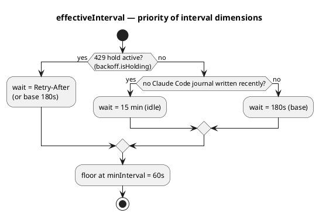
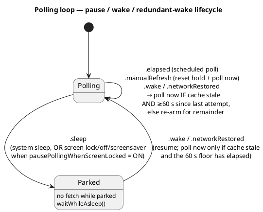
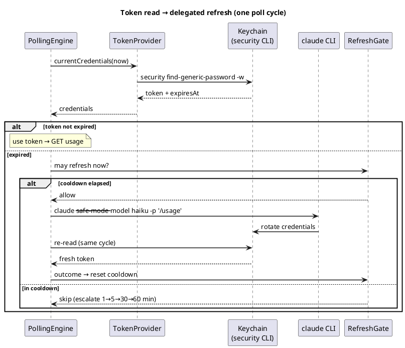
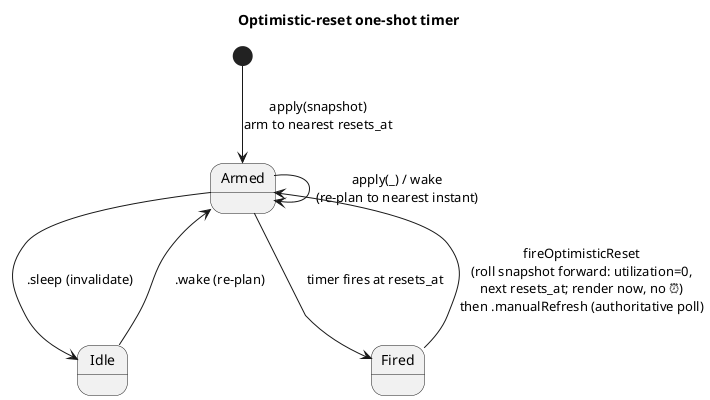
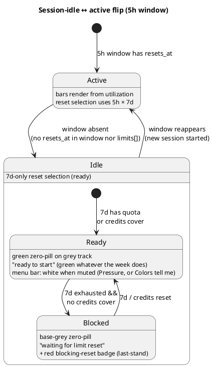
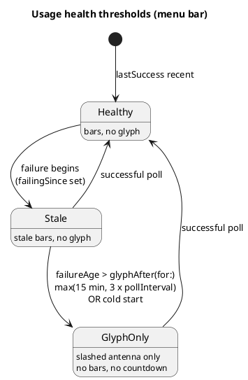

# Architecture — data flow (Phase 1)

The cross-cutting picture and deployment are in [overview.md](overview.md). Here — how data flows
from the Keychain to the menu bar: polling, reading/refreshing the token, the pacing model,
rendering the menu bar and popup, error states.

## Polling flow

```
Keychain (OAuth token)
  → PollingEngine (a live async loop, a pure core + seams, TokenPaceKit)
  → GET https://api.anthropic.com/api/oauth/usage
    (headers: Authorization, anthropic-beta, User-Agent: claude-code/<version>)
  → (poll success/failure) → UsageHealth (lastSuccess/failingSince/reason)
  → MenuBarLayout.make(UsageSnapshot?, UsageHealth)
      → MenuBarMode (expanded(blocks:)/iconOnlyReset/error/usagePollingOff/nothingMonitored)
  → StatusItemView draws the NSStatusItem (pacing bars + reset time, or ⚠️)
  → click → PopupLayout.make(...) → PopupViewController in an NSMenu
  → each PollOutput carries PollDiagnostics (raw FetchDiagnostics + TokenDiagnostics)
```

## Polling cadence (ADR-0032)

A flat 3-minute base with two overrides; the reset trigger lives in a shell timer (#36, ADR-0030);
pausing on screen lock is an option; a redundant wake is suppressed if the cache is still fresh, and
a signal-driven poll is refused outright within `minInterval` of the last **attempt** — the rail that
holds when `lastSuccess` cannot, because a token error never advances it
([ADR-0123](../../adr/0123-one-line-per-error-run-and-a-floor-on-signal-driven-polls.md)).

**Interval-selection priority:**




**Pause / wake / redundant-wake cycle:**




## Token: reading and delegated refresh (ADR-0017 / 0019 / 0020)

The token is read by the `/usr/bin/security` subprocess (ADR-0019). The expiry decision is made by
the **engine**, not the provider (ADR-0020): the provider hands back `currentCredentials`, the
engine checks `isExpired`, and on expiry it performs a **delegated refresh** — it spawns the
`claude` CLI so Claude Code rotates the pair itself, then re-reads the Keychain in the same cycle.
The result folds into `RefreshGate` with a cooldown escalation of `1→5→30→60 min` (ADR-0017).




## Optimistic reset (#36, ADR-0030)

At the reset boundary, the menu bar must not show a stale ⏰. A one-shot `Timer`
(`AppDelegate.resetTimer`) is armed for the nearest `resets_at` (`ResetClock.nextResetInstant`),
re-planned on every `apply(_:)` and on wake, invalidated on sleep. Firing rolls the snapshot
forward and draws instantly, followed by the authoritative poll.




## Session-idle 5h window (#100, ADR-0027; blocked — #158, ADR-0038)

When there's no active session, the 5h window doesn't exist — no phantom `now+5h`. A pure
`sessionIdleTransition(previous:current:)` logs the transition once, and the render draws an idle
bar.

The idle-bar shape is **the same across all three `BarStyle`s**
([ADR-0078](../../adr/0078-idle-drawn-as-zero-in-both-styles.md)): a gray track + a minimal pill
at zero, with Progress adding a time marker on top at zero. Only the pill's **color** depends on
the variant:

- **Ready** — work is possible: a **green** pill, "ready to start", **always**, on both surfaces —
  the week's state doesn't affect it, and the `LimitRow.weeklyHeadroom` / `BarView.weeklyHeadroom`
  fields don't exist. `weeklyHasHeadroom` still gates `blueAllowed`, but only for the **5-hour** bar
  ([ADR-0081](../../adr/0081-weekly-capacity-gate-for-blue.md),
  [ADR-0105](../../adr/0105-color-advice-governs-pacing-bars-only.md),
  [ADR-0115](../../adr/0115-no-blue-on-per-model-windows.md)). In the menu bar under muting
  (`barStyle == .pressure || colorsTell.mutesCalm`) the pill is white.
- **Blocked** — no 5h quota (idle or 5h≥100), 7d exhausted (`≥100`) **and** credits don't cover it
  (`CreditsPacing.isBlocked`: disabled / capped / absent): a **gray** pill (the same tone as the
  track — the bar reads as empty), status "waiting for limit reset". In the popup exactly one
  reset time is **red**: chosen by the "last stand" rule `BlockingReset` (the credits reset wins
  when it isn't the latest one, otherwise `max(5h,7d)`); the menu-bar countdown uses the same
  choice (`BarView.blocked` / `LimitRow.sessionBlocked` / `PopupLayout.blockingReset`).

Separately (ADR-0048, #193): when the subscription limit is exhausted **but credits are actively
covering it** (`CreditsPacing.subscriptionExhaustedWhileCovered` — the complement of `isBlocked`),
the state is **not** blocked (the row doesn't gray out, the status is normal), but the popup still
colors the **token** limit's reset red — the moment quota returns and credits stop being spent.
Here it's `BlockingReset.forSubscriptionExhausted` (`creditsReset: nil` → the latest exhausted
token limit, never the credits reset). Popup only; the menu bar is left untouched.




## Error / health states (#12, ADR-0010)

`UsageHealth` is a **second input** (alongside `UsageSnapshot`) for error states. The menu-bar
thresholds are pure functions of `failureAge(now:)`. The popup warns **immediately**; the menu bar
shows stale data, then a **slashed antenna** in its place.

**There are exactly two phases**
([ADR-0091](../../adr/0091-countdown-only-where-work-is-not-running.md)): the intermediate one (a
glyph **next to** stale bars, 30–60 min) was dropped along with `hideBarsAfter`, because bars that
stale invite a reading they can't support, and the popup already explains the failure in words.
The threshold is counted **in attempts, not minutes** — `UsageHealth.glyphAfter(for:)` =
`max(15 min, 3 × pollInterval)`, i.e. 15 min during an active session and 45 min while there's
none (`PollingEngine.inactiveInterval` is itself 15 min, so a flat 15 min would raise the glyph
after a **single** failed attempt). A 429 doesn't count toward this streak: it doesn't write
`failingSince`. The glyph here is `antenna.radiowaves.left.and.right.slash`; ⚠️ is now reserved
exclusively for `MenuBarMode.exhaustedUnknownReset` ("the data contradicts itself").




## Sessions awaiting input (#233, ADR-0066)

A separate data source, **independent of the usage poll**: a count of local Claude Code sessions
waiting for user input ("Needs input" in FleetView). Read not from the API but from state files
Claude Code writes itself:

```
awaiting = ~/.claude/sessions/<pid>.json  .status == "waiting"
        OR (state.json fresh AND ~/.claude/jobs/<jobId>/state.json .needs != null / .tempo == "blocked")
```

**Freshness guard.** `needs`/`tempo` is updated by Claude Code's own scanner, which for worktree
sessions gets out of sync and **freezes** `state.json` on a past phase (`needs:"approve plan"`) →
a phantom raised hand that never clears. So these two branches are only honored when
`state.json.updatedAt` (ISO) is no more than 60 s older than `session.statusUpdatedAt` (ms);
`status == "waiting"` is unconditional; an unavailable timestamp → fail-open. Details — ADR-0066
(postscript).

- **`AwaitingInputScanner`** (`TokenPaceKit`, pure, stateless) — reads files (no `JSONDecoder`,
  targeted regex), joins only against live sessions, returns **`AwaitingSessions`** (each session:
  project = `originCwd`/repo-root + `daysUntilDeletion` = `cleanupPeriodDays` − age-by-updatedAt +
  `name` — the session title, the same one shown in the agentic view, or `nil` for an unnamed one,
  #438). `cleanupPeriodDays` comes from `~/.claude/settings.json` (default 30, ADR-0031). ~0.18
  ms/scan. **"Live" is verified, not assumed** (#275): a session file outlives its process, so a
  `claude` killed mid-prompt would leave `status:"waiting"` forever (until the 30-day cleanup).
  Each pid is checked against the process table via `ProcessLiveness`; `procStart` guards against
  pid reuse. Fail-open: if the pid or `procStart` can't be read, the session counts.
  **Unnamed-ness is normalized here** (#438): Claude Code writes `name` not as an empty field but
  as a placeholder — the session's own `jobId` (= `sessionId.prefix(8)`) — and the forms differ
  between `sessions/` and `jobs/`. The scanner folds every such form into `nil`, checking equality
  against the session's **own** id (not the string's shape), so the UI only ever has to ask "is it
  `nil`".
- **`AwaitingSessions`** — the aggregate: `count`, `urgency` (the most urgent session: <7d→red,
  <15d→orange, otherwise neutral), `perProject` — grouped by project: **projects by name**,
  sessions within each **newest on top** (descending `daysUntilDeletion` is equivalent to
  descending `updatedAt`), with a total tiebreak by name/project so the watcher's `Equatable`
  dedup doesn't see a change when only the directory-scan order got shuffled. Drives the
  indicator's tone.
- **`AwaitingInputWatcher`** (shell) — event-driven via **FSEvents** on the `sessions/` + `jobs/`
  directories (not on files — the set of sessions is dynamic), plus an infrequent safety poll
  (~45 s). Calls `scan(now:)` only on real changes; the callback fires only when the result
  changed (count/urgency/breakdown). **Gate** (#275): active while the feature is enabled, the
  scenario is real network, **and the screen is available** (not locked, no screensaver, display
  and system not asleep). On park, the stream and timer are torn down; on resume, a forced
  catch-up scan runs. Screen state arrives via a separate, **ungated** `ScreenLockObserver`
  callback, so this pause doesn't depend on the `pausePollingWhenScreenLocked` option.
- **Render** — the result is grafted onto the layouts (`withAwaitingInput`) in `render()`, outside
  the usage `make`. The indicator is `N✋` (the number **before** the hand), the hand tinted by
  `urgency`. Menu bar: hand only (no number), the **first leading** element, gated by the
  Appearance option "Show awaiting-input icon in the menu bar". Popup (without ⌥): `Claude [age]`
  on the left, `N✋` flush-right (1 → hand only). Popup with **⌥**: `N✋` disappears, and below it a
  session list grouped by project (#438): the project heading stands alone (nothing on the right),
  under it indented session rows — the name in dim ink (`<unnamed>` in italics for an unnamed
  one) + **one** hand, tinted by that specific session's urgency; a long name is truncated at the
  tail, the row's tooltip carries the full name and bucket. There's no row limit — deliberately.
  Opt-in (Settings → General, default OFF); the menu-bar display is Settings → Appearance (in the
  presets: chill=OFF, workHarder/controlFreak=ON).

The full cadence/cache/logging design is in
[awaiting-input-refresh.md](../../design/awaiting-input-refresh.md).

## The plan label in the "Claude" header

To the right of the word **Claude** (the popup's first line) sits the subscription plan name —
`Claude ･ Max (5x)` — in the **brand terracotta color** (`claudeBrand`, `#d97757`; the same one
"Claude" uses). "Claude" and the `･` separator are bold; the plan name itself is **not** bold (it's
distinguished by weight, not color).

- **Source.** Not the usage API, but the OAuth payload in the Keychain: the `rateLimitTier` field
  (e.g. `default_claude_max_5x`) on `TokenCredentials` → `TokenDiagnostics` →
  `output.diagnostics?.token?.rateLimitTier`. Not a secret — just a plan marker.
  `subscriptionType` (`"max"`) **is not used**: it's redundant — the plan family's name and its
  multiplier are already in `rateLimitTier`.
- **Mapping** — `claudePlanLabel(rateLimitTier:)` (`TokenPaceKit`, pure). This is a **whitelist,
  not best-effort**: there's no public tier table, and third-party clients contradict each other
  (`default_claude_ai` → "Pro" in some, "Free" in others), so we recognize **only** confident
  forms and return `nil` for everything else — otherwise a guess would render in the brand color,
  reading as a bug. Recognized:
  - `default_claude_max_<N>x` → `Max (<N>x)` (pattern: `5x`/`20x`/a future `50x`; the multiplier in
    parentheses with a lowercase `x` — that's how Anthropic names these plans);
  - `default_claude_pro` → `Pro`;
  - anything else (`default`, `default_claude_ai`, unknown, absent) → `nil`.
- **Render.** `nil` → just "Claude", **without** the `･` separator. A non-empty label is grafted
  onto the layout via `PopupLayout.withPlanLabel(_:)` in `render()` — outside the usage `make`,
  the same pattern as `withAwaitingInput` (a source outside the usage snapshot).
  `PopupViewController.brandTitleLabel(plan:)` assembles a single attributed label (a shared
  baseline). Both header branches (plain / with the awaiting indicator) use the same label.

## Insights pipeline (#238)

A **read-back** stream separate from the live render: the usage history the collector writes to
disk is later read back for analytics. Three links, each its own session/PR against `main`:

1. **Collector + storage (#242, ADR-0067)** — append-only JSONL, one row per successful poll
   (`JournalRecord`), plus resume markers on sampling gaps. Written by `UsageJournal` (an actor,
   non-blocking); read back by `JournalReader.parse(_:)`. Type details are in the "JournalRecord
   …" row of [services-and-config.md](services-and-config.md).

   A failed poll is **not** one row per attempt: consecutive identical failures are folded by the
   pure `ErrorRunCollapse` into one record carrying `n`/`t`/`tEnd`, bounded at 3 minutes wide, and
   the launch migration folds runs already on disk the same way
   ([ADR-0123](../../adr/0123-one-line-per-error-run-and-a-floor-on-signal-driven-polls.md)). The
   actor's gap clock (`lastPollInstant`) advances on every attempt, written or not — the resume
   marker answers "were we polling", and inside a run we were. Both the clock and the open run are
   **per provider**, and every row of every kind carries `provider`
   ([ADR-0124](../../adr/0124-journal-records-carry-their-provider.md)): one shared clock would let
   one provider's polling suppress another's resume marker, so an outage would leave no hole in the
   record and read as continuous observation.
2. **Aggregator (#244)** — the pure `UsageGridAggregator.grid(...)`: `[JournalRecord]` → a
   **days × hours** grid for one metric under one filter (5h/7d), for one provider (default
   `.claude` — an unfiltered count over a mixed file sums two series and looks plausible). The pilot metric
   `sampleDensity` counts sample density; gap cells (`GridCell.gap`) are kept separate from "0
   samples" so the visualization doesn't interpolate across a gap (the same honesty as
   `ServiceStatus.unknown`/ADR-0027). AppKit-free, in `TokenPaceKit` — one place the pilot chart
   and any later metric can reuse.
3. **Window + pilot chart (#245)** — the Insights window (`InsightsWindowController`,
   Settings-styled) renders the aggregator's grid as the first chart; opened from the first
   dropdown item "Insights…" — but the item itself (and the divider below it) is currently
   commented out in `App.swift` while the window is empty; the controller and the `openInsights`
   action stay in place, bringing it back means uncommenting the block.

The end consumer features built on top of the journal are separate: unexplained relief (#239),
personal service-status history (#240), burn-rate vs baseline (#241). They read the same journal
through `JournalReader`.

## Data-flow components

| Component | Responsibility |
|---|---|
| **TokenProvider** | Reads the token from the Keychain via **the `/usr/bin/security find-generic-password -w` subprocess** (matched by service only; decodes the `claudeAiOauth` wrapper, checks `expiresAt`). A direct `SecItemCopyMatching` is deliberately not used: on every refresh Claude Code rewrites the item via `security add-generic-password -U`, which **resets the ACL partition list** and re-triggers Keychain prompts in a GUI app; `security` is an Apple tool, so it reads quietly (ADR-0019). Pure output processing — `parseSecretOutput`/`mapExitStatus`, unit tested. A stale token **never goes out to the API** — but the expiry decision is made by the **engine**, not the provider (ADR-0020): `currentCredentials(now:)` returns `TokenCredentials {accessToken, expiresAt}` (no `refreshToken`), and the engine reacts with a delegated refresh (ADR-0017). TokenPace never writes to the Keychain. The `throws`+enum choice is deliberate — ADR-0007, ADR-0020 |
| **DelegatedRefresh / RefreshGate** | The Kit-side half of the delegated refresh (ADR-0017): the `DelegatedRefresher` protocol (fail-safe — never throws) + the pure `RefreshGate` — an anti-flap gate on attempts with a `1→5→30→60 min` cooldown escalation. Outcomes: `refreshed`/`unchanged`/`cliNotFound`/`timedOut`/`failed(exitCode:)` |
| **UsageClient** | Requests to the usage API with a mandatory `User-Agent: claude-code/<version>` (guarded: never called without it). Pure `buildRequest`/`decode` seams kept separate from the networked `fetch` (an injected `UsageTransport`). A typed `UsageError`. `diagnosedFetch -> DiagnosedFetch` assembles `FetchDiagnostics` with the full body for Troubleshoot (ADR-0020). Dates are **not parsed** — `resets_at` is kept raw for `ResetClock`. At the reset boundary, `UsageSnapshot.decode` **synthesizes** a fresh window instead of failing; the exception is `five_hour` (#100, ADR-0027): without `resets_at` the window doesn't exist (`sessionIdle: true`). For `seven_day`, `ResetClock.rollForward` rolls the last **server-reported** reset forward by a whole number of weeks (±0.25 s on live data), and without an anchor nothing is invented — `resets_at` stays empty and both surfaces report the reset time as unknown ([ADR-0107](../../adr/0107-weekly-reset-reconstructed-from-the-last-known-one.md)). The anchor arrives in the decoder via `userInfo` (like `now`), is written only from a snapshot whose `ResetSource.isUnrolledServerFact`, and persists in `PersistedConfig.lastSevenDayReset`. Per-model sub-windows inherit `resets_at` from `seven_day`; `weekly_scoped` (e.g. Fable, #65) via `scopedModelWindows`. Money credits (#143): the `spend` + `extra_usage` blocks merge into an optional `SpendInfo` (`nil` until credits appear; money is a whole `Money {amount_minor, currency, exponent}`, not a float; the server's `spend.severity` and `balance`/`auto_reload` are **ignored** — spike #142). Backoff is the pure `PollingBackoff` (180 s; 429 → hold on `Retry-After`, no escalation, ADR-0032). Details — ADR-0008, ADR-0014 |
| **PacingModel** | Bar zones are **continuous fractions [0,1]** (`BarLayout`), not blocks; block quantization is an optional derivative (ADR-0005). The far-behind (green→blue) threshold is **fixed** (ADR-0081): `behindThreshold(windowDurationSeconds:)` multiplies the base width (1h/5h, 1d/7d) by a constant ×2 → 0.40 / 0.286. Whether to draw blue at all is decided by `BarLayout.blueAllowed` — and there are **three** reasons for `false` ([ADR-0115](../../adr/0115-no-blue-on-per-model-windows.md)): the **weekly-capacity gate** (`PacingModel.weeklyHasHeadroom` — the 5-hour bar turns blue only while the 7-day window isn't itself behind pace), **the window is a slice of the same week** (per-model / scoped — unconditional `false`, because the advice would be addressed to itself), and **the bar gives no pacing advice at all** (credits, idle). One field is read by both the Kit severity and the render color, and by the journal's `PacingBucket`, so they can never drift apart. Marker-free bar geometry lives here too: `BarLayout.pressureLength` (the remaining-quota scale, ADR-0076/0101) and `BarLayout.balanceOffset` (the signed offset from center, `clamp(r, ±1)`, ADR-0079/0101) — both from the same `r = (u − t)/(1 − t)`, and the first **is derived from the second** (`max(0, balanceOffset)`), with no coefficient at all; shared edge cases live in the private `signedLead`. Both are render-only: severity and color don't depend on them |
| **WeeklyRatio / WeeklyInterpolator / WeeklyUtilization** | Reconstructing the weekly `utilization` from the five-hour counter ([ADR-0103](../../adr/0103-weekly-utilization-reconstructed-from-the-five-hour-counter.md), formal description — [design/weekly-interpolation](../../design/weekly-interpolation.md)). The API quantizes `seven_day.utilization` to an integer, and one point is 1 h 40 min of work; `five_hour` is quantized the same way, but its point is 3 min, so the weekly scale is read through the five-hour one via a coefficient `N`. **`WeeklyRatio`** — a rolling median of `N` over 15 segments (a segment = the span between `d7` jumps), seeded at `10.0`; a median because individual `localN` values scatter 3–24 due to quantization in **both** series. **`WeeklyInterpolator`** — state between polls: an anchor (the bucket's exact lower bound when a bump is detected; the center when inherited), accumulation of positive `h5` increments, clipping at the bucket ceiling, an adaptive gap threshold from the *actual* cadence. Lives in `PollState`, persisted as a Codable blob. **`WeeklyUtilization`** — a carrier of `raw`/`effective`/`source`, and the only path to the bar is `applied(to:)`, which rewrites the snapshot's window following the same pattern as `ResetClock.optimisticReset` (and **before** it). Invariants: `raw = 100` and `raw = 0` pass straight through, so the `>= 100` and `> 0` detectors stay untouched; monotonicity holds by construction, since a bucket's ceiling and the next one's floor are the same point |
| **CreditsPacing** | Pure, AppKit-free logic for `SpendInfo` (#143): the icon trigger (`enabled` **OR** `spend_limit_reached`, AND at least one base limit exhausted) and `barLayout(for:now:timeZone:)` — color is computed **exactly like the token bars** (`usage` vs `time`, the same `BarLayout`/`aheadColor`: green→yellow→orange→**red only once the limit is reached**), not by a separate formula. `usageFraction = used/limit`; `timeFraction = monthElapsedFraction` — the fraction of the calendar month elapsed, from **00:00 UTC on the 1st** (`resetTimeZone`; the API gives no reset time for money, so it's computed locally — source: the Anthropic Spend Limits API docs). No limit (unlimited) → `nil` (no bar, just the total). The base is limit-only (balance isn't available, out of scope). Blocked (#158/ADR-0038): `creditsCanCover(spend)` (enabled AND not capped — the paid "last stand") and `isBlocked(in:)` (`(sessionIdle OR 5h≥100) AND 7d≥100 AND NOT creditsCanCover`). The complement (#193/ADR-0048): `subscriptionExhaustedWhileCovered(in:)` = `mainWindowExhausted AND creditsCanCover` — the subscription is exhausted but credits cover it (mutually exclusive with `isBlocked`) |
| **ResetClock** | Parses `resets_at` → `Date`; picks the nearest reset (5h vs 7d); `relativeRounded` — **the shared numeric core for both surfaces** (`45m`/`5h`/`4d`/`<1m`), from which `timeToReset` takes the menu-bar label (ADR-0074: one format at any distance), while `resetLine` is the dropdown row, adding a qualifier — `at 03:00` / `on Friday` (ADR-0043) — and, under `verbose: true`, a `resets in` prefix (the popup's ⌥ form); `nextReset`/`nextResetInstant` for window synthesis and the one-shot timer; `optimisticReset(_:now:)` rolls the snapshot to the reset boundary (ADR-0030), applied on **every** render (`AppDelegate.render`, ADR-0043) |
| **UsageHealth** | A pure value type for the polling state — the **second input** for error states (#12): `lastSuccess`/`failingSince`/`reason`/`notPolling`/`pollInterval`. The threshold is a pure function of `failureAge(now:)`, and there's **one** of it: `glyphAfter(for:)` = `max(glyphAfterFloor 15 min, glyphAfterAttempts 3 × health.pollInterval)` — 15 min during an active session, 45 min while there's none ([ADR-0091](../../adr/0091-countdown-only-where-work-is-not-running.md)). Bars next to the glyph never happen. The threshold is counted **in attempts, not minutes**, because `PollingEngine.inactiveInterval` is itself 15 min — a flat constant would raise the glyph after a single failed attempt on an idle machine. A 429 doesn't count toward the failure streak (`failingSince` isn't written). `FailureReason` maps `TokenError`/`UsageError` → semantic causes (an exhaustive `switch`). The split is ADR-0010 |
| **MenuBarLayout** | The pure "what to draw" model: `make(...)` → `MenuBarMode.expanded(blocks:)` — **one `ProviderBlock` per provider**, each carrying the bars that provider actually reports (two for Claude, one for Codex today), its own pause glyph and its own money marker ([ADR-0128](../../adr/0128-menu-bar-repeats-a-block-per-provider.md)) — or a bar-less state. Blocks are ordered by `ProviderID.displayIndex`; `blocks` is never empty and no block has empty bars. Satellite blocks are merged in by `withProviderBlocks(_:)` from the same `LimitRow`s the popup plate draws, and `hidingMenuBarProviders(_:)` drops the ones unticked under Appearance → Menu bar (the last block always survives). **The countdown lives only where there are no bars** ([ADR-0091](../../adr/0091-countdown-only-where-work-is-not-running.md)): `.expanded(blocks:)` **has no field** for a number, so the "bars + number" pairing is unrepresentable — the invariant is held by the type, not by convention. `BlockingReset` builds the countdown for bar-less states, and in blocked idle (#158/ADR-0038) it's the same choice the popup makes, with `BarView.blocked` coloring the idle bar gray. **Hiding a calm 5h** (ADR-0090) — Claude's block then carries one bar; only the top bar is hidden, 7d always stays. **"Can we work?" — three mutually exclusive states** (ADR-0090): yes, on the subscription → `.expanded` with bars; yes, but paid for → `.iconOnlyReset` with a currency sign + countdown (`CreditsPacing.subscriptionExhaustedWhileCovered` → `BlockingReset.forSubscriptionExhausted`), **no bars**; no (`isBlocked`) → `.iconOnlyReset` with a pause glyph, **no bars and no currency sign** (the credits marker is zeroed under `blockedPause`, otherwise both icons would draw under `spend_limit_reached`). The hiding is unconditional. **An exhausted window is never drawn with a bar** (ADR-0091): with an unresolvable `resets_at`, neither branch falls back to bars — instead a separate case, `.exhaustedUnknownReset(provider:)`, produces a **lone ⚠️**, with no pause and no currency sign (`blockedPause` and `credits` are deliberately zeroed there: a glyph asserting a state next to a sign that refuses to speak from the data reads as a broken widget). Every case that used to name a *window* (`which: LimitWindow`) now names the **provider** whose quota it is about, and `.error` carries no payload at all — `drawError` had ignored its four values since ADR-0091. Bar construction is factored into `expandedBars`, and the stale path **doesn't reach it**: past the threshold, a bare glyph remains with no bars. A red `pause.fill` is the leading element under `isBlocked` (the `blockedPause: Bool` flag on the health-aware `make` seam: `true` when `isBlocked` **and** `mode ∈ {.expanded, .iconOnlyReset}`; never for `.error` — stale data doesn't assert a block — and never for `.exhaustedUnknownReset`). There's no way to force a countdown in `.iconOnlyReset` regardless. Drawing — a leading glyph to the left of the bars (`.expanded`) or to the left of the countdown (`.iconOnlyReset`); color — a unified `.red` role (accessor `Palette.pauseRed`), shared with exhausted bars and the blocking-reset pill. The health-aware branch (#12) adds `.error` with optional bars. **The money-credits icon** (#144) — `credits: CreditsMarker?` (no user-facing gate — the data decides): `creditsMarker(for:now:)` composes `CreditsPacing.shouldShowIcon` (whether to show) + `CreditsPacing.barLayout` (`bar: BarLayout?` for color; `nil` → neutral when unlimited). In `.iconOnlyReset` the icon is drawn in the **leading** position — between the pause glyph and the countdown (#227); only in diagnostic `.error` does it stay trailing. In `.expanded` the pause glyph and the marker ride **Claude's own block** instead of the layout, because with two blocks a widget-level glyph would not say whose money or whose block it is; `moneyMarker` reads whichever place holds it. **`spokenDescription`** builds the VoiceOver label — every block named by its provider, every bar with its percentage and its pacing verdict in words, the service dot last — because the widget is a flat bitmap and identity in it is otherwise positional only. Lives in `TokenPaceKit`. The pure/shell split is ADR-0009, ADR-0010 |
| **StatusItemView** | A thin AppKit shell (`NSView` in `TokenPace`): draws `MenuBarLayout` — a `drawBlock` per provider, **with no number** (`.expanded(blocks:)`), separated by `Metrics.blockGap` (wider than the gap *inside* a block; no rule and no brand tint — the bar's colour is the pacing verdict), `.iconOnlyReset` (a pause or currency icon + a centered countdown label, no bars — ADR-0063, ADR-0090), a lone **⚠️** `exclamationmark.triangle` for `.exhaustedUnknownReset` (ADR-0091), or a **slashed antenna** `antenna.radiowaves.left.and.right.slash` for `.error` — all glyphs monochrome `labelColor`. The two triangles are deliberately kept apart: "can't reach the API" is a regular event, "the window is exhausted and the date is broken" is a rare server bug, and a shared glyph made the rare state look as common as the frequent one. Left-to-right order: **the awaiting hand** (once, outside every block) → per block, **its red pause glyph** → **its money-credits icon** → its bar column; the **service dot** stays rightmost, after every block. In `.iconOnlyReset` the pause and the icon lead the countdown as before. The bar column's geometry depends on the bar **count**, never on which provider owns it, so two bars land where the 5h/7d pair always did and one bar where a lone bar did (`halfPointAligned` on the centred top edge — the status button sits at a half-point y, `(33 − 22) / 2 = 5.5`, measured on macOS 15). `itemWidth` sums the blocks and has **no ceiling**: width is controlled by the "Providers to display" checkboxes, not by a heuristic that drops a block. In diagnostic `.error` the credits icon stays trailing (left of the service dot). The credits glyph is currency-specific (`creditsSymbolName`: EUR→`eurosign` €, USD→`dollarsign` $, GBP→`sterlingsign` £, JPY/CNY→`yensign` ¥, INR→`indianrupeesign`, unknown→generic `coloncurrencysign` ¤), colored from `CreditsMarker.bar` via the same `aheadColor` as the bars (`bar == nil` → neutral foreground). Width is reserved for the specific glyph (`creditsIconWidth(for:)`). idle-5h — the shape is **the same across both styles** (ADR-0078): a gray track + a minimal pill at zero, with only Progress adding a time marker on top at zero (it covers the pill); there's no full-width solid fill anywhere. The pill color is **`Palette.gapGreen`**, under muting → the shared `Palette.calmWhite`, or `Palette.unusedGrey` when idle is blocked (`BarView.blocked`, #158/ADR-0038: 7d exhausted and credits don't cover it) — the same gray as the bar's zones, in every color mode. Muting the calm side is `barStyle == .pressure || colorsTell.mutesCalm`: **unconditional under Pressure** (there the calm strip has zero length, so the "Colors tell me" row is also hidden from the panel under this style), otherwise gated by [`ColorAdvice`](../../../Sources/TokenPaceKit/ColorAdvice.swift) (#105). **Do not** read this setting, each for its own reason: the **service dot** (`degraded` is yellow on all three surfaces, [ADR-0111](../../adr/0111-degraded-dot-is-yellow-on-every-surface.md) — the dot doesn't read the setting) and the **credits glyph** (its own white→orange→red scale is self-sufficient, ADR-0068). Colors are **system semantic** (ADR-0059): track = `labelColor@0.22` (breathes and flips like the system does), bright ink (text/⚠️/tick) = `labelColor` at a fixed alpha via `bright()`, accents = `.system*`; the render is eager on `button.effectiveAppearance`. Redraws happen only on a `layout` change — with **one exception**: while a color is *changing* or the hand is moving, `ColorAnimator` drives 0.8 s of frames (30 fps) so the transition between pacing zones is smooth instead of a jump cut (ADR-0070); the timer lives only for the duration of the transition and stops once **both** registers (colors + scalars) are settled. The **awaiting hand** — the leftmost leading decoration (before pause/credits/bars); its slot is reserved by the Appearance option, **not** by the live count (ADR-0073), so the widget's width doesn't jump as sessions start and stop waiting; the glyph itself slides up from below and retreats down within that slot (`ScalarTween`, clipped to the slot, Reduce Motion → instant). **Bar presentation is configurable** (ADR-0062, per-surface — ADR-0080): `menuBarStyle` — this surface's own key (`.progress`/`.pressure`/`.balance` — Progress: gap+marker on the window scale; Pressure: a strip from the left edge on the remaining-quota scale, `BarLayout.pressureLength` = `max(0, balanceOffset)`, ADR-0076/0101; Balance: a strip from the center with a sign, `BarLayout.balanceOffset` = `clamp(r, ±1)` + a 1.5 pt zero tick under the track, ADR-0079/0096/0101 — both scales from the same `r`, no coefficient). The scale is named explicitly — `BarScale { window, remaining, centred }`, and the marker flag is derived from it (`showsTimeMarker == (scale == .window)`) and `colorsTell` ([`ColorAdvice`](../../../Sources/TokenPaceKit/ColorAdvice.swift), cases `.slowDown`/`.slowDownOrSpeedUp`/`.howItsGoing`, the render reads the derived `mutesCalm`/`mutesBlue`). The split is ADR-0009, ADR-0010 |
| **PopupLayout** | The pure "what to show in the popup" model: `make(...)` → `LimitRow` sections (5h, 7d, Opus/Sonnet, scoped models from `limits[]`). idle-5h → `idleFiveHourRow` (#100), with `sessionBlocked` when blocked (#158/ADR-0038 → "waiting for limit reset" + a gray bar). The `blockingReset: BlockingReset.Choice?` field points at the row/section whose reset is colored red; it's set in **two** cases: `isBlocked` → `forBlocked` (the "last stand" rule, shared with the menu bar, can produce a credits reset); otherwise `subscriptionExhaustedWhileCovered` (#193/ADR-0048) → `forSubscriptionExhausted` (the token reset only — when credits are covering, we highlight the moment the subscription unblocks). The health-aware branch (#12) adds `warning: FailureReason?` right alongside. **The "Extra usage" section** (#145) — a separate `credits: CreditsRow?` field (NOT in `rows`): `creditsRow(from:now:)` behind the softer `CreditsPacing.isActive` gate (only `enabled`/`spend_limit_reached`, with no requirement that a base limit be exhausted — that's the condition for the menu-bar **icon**, not for the detail row). Carries raw `spent`/`limit` (`Money`), `bar: BarLayout?` (nil = unlimited → no bar/reset) from `CreditsPacing.barLayout`, `resetLine` — the single time-to-month-end line via `CreditsPacing.monthEnd → ResetClock.resetLine` (the same format as the token rows: `15d`/`5d on Friday`/`20h at 03:00`, ADR-0043), plus `resetLineVerbose` — the same line with a `resets in` prefix (both forms are pre-computed, because the choice between them is the live ⌥ state, which can change while the menu is open with no re-poll), and `inUse: Bool` (#146) — whether credits are **actually being spent right now** (`CreditsPacing.shouldShowIcon`, the same strict gate as the menu-bar icon: enabled AND a base limit exhausted), used to show the "in use" marker (#254/ADR-0068 — a pill with a knocked-out currency glyph). Carries only raw numbers/flags/enums — the sentence is assembled by the view. Reused in Phase 2. ADR-0009, ADR-0010 |
| **PopupViewController** | A thin AppKit shell: draws `PopupLayout` in the style of native widgets — a bold "Claude" header (ADR-0021), service-status rows, an error banner, limit sections in a two-column split layout. **The popup is always translucent** (ADR-0064): the entire Claude section sits on a rounded **plate**, `CardBackdropView` (Control Center style, layer-backed `updateLayer`, a soft shadow, fill `controlBackgroundColor@0.85`, inset from the edges — the native menu material shows through around it; there's no separator before Settings). `PopupBarView`: a solid gray track → a colored **strip with capsule ends** + ambient **glow** → a **slider knob** with a filled-frame gray border and a stronger glow; the idle bar carries the same glow (same parameters) as the pacing strip. The ruler **splits in two**: the zero tick is **always** visible, drawn **through** the bar (rendered under the track, so only its ends show) at zero on every marker-less scale — it's what identifies the style at a glance; **under ⌥** it gains scale ticks (window fractions in `.progress`) and the **style name** in the row header (in italics, after the `･` separator). The tick's color role is `centreTick`, the same as the menu bar's (ADR-0096), its height keyed to the popup's taller bar (12 pt on a 6-pt bar vs. 10 on a 5), its width 5/7 of the zero pill's width (the track is a dimmer, popup-only tone between tertiary/quaternary label). Bar presentation uses its **own** `dropdownStyle` key, independent of the menu-bar one (ADR-0080): `.pressure` draws a strip from the left edge per `pressureLength` instead of gap+marker, its zero tick sitting at 0 (ADR-0076). `.balance` draws a strip from the center per `balanceOffset`, the zero tick at 0.5, ADR-0079. `.progress` has no zero tick at all: position there is carried by the time marker (ADR-0098). **`PopupBarView` is also the source of the Settings tiles** ([ADR-0100](../../adr/0100-dropdown-style-tiles-and-retired-option-segment.md)): a shared renderer `render(in:)` + `snapshotImage(width:)`, with `trackHeight`/`markerOverhang`/`liveWidth` exposed externally so `DropdownBarStylePreviewRenderer` lays bars out against the **track**, not the view's frame (the frame reserves space for the ⌥ ruler, which the tile doesn't have). The slider-knob outline uses a dynamic `NSColor(name:)` so it resolves per-appearance instead of baking one tone into both themes (`185,239,190` in dark vs. `13,96,26` in light). The service **status dots** are `GlowDotView` (layer-backed, glow, color re-resolved in `updateLayer` → they survive a theme change instead of being a baked image). **The "Extra usage" section** (`addCreditsSection`) below the limits: every state shares **one anatomy** (ADR-0108): "Extra usage ･ *progress* ⟷ [badge] status word" (`creditsStatusText` from `bar`), "spent €X of €Y ⟷ `resetLine`" (the same unified format as the token rows — `5d on Friday`/`20h at 03:00`; ADR-0043), under ⌥ — `resetLineVerbose` with a `resets in` prefix, and a bar (the same `PopupBarView`, `subdivisions: 0`); the unlimited row has **the same** second line ("spent €X", with no right half), and the status slot reads `no limit set`. The status badge sits in the **right** half and qualifies the status (ADR-0108): on `credits.inUse` — a "credits engaged" marker (ADR-0068): the same `PillView` used for the blocking-reset badge, with the currency symbol as a **text attachment** (`NSTextAttachment`, `bounds` set to `capHeight`), under ⌥ the word `active`. The ink is `cardPlateFillOpaque` (the card's color with no alpha, dynamic → it switches light/dark on its own), so the sign reads as knocked out while remaining plain text; the fill is neutral `barTrack`, not the label's color (ADR-0108: "money is moving" shouldn't read as "you're blocked"). When the ceiling is exhausted and a cap **exists** — there's no badge at all: red belongs to the reset badge below; when there's **no** cap — the header carries a red `out of credits`, since there's no reset to speak of. All three badges take `PillView.sharedHeight`. It's the same SF Symbol as the menu bar (`StatusItemView.creditsSymbolName(for:)`), so both surfaces mark the feature with one sign; the `inUseHint` tooltip stresses that spending is happening **right now**. Deliberately **without a status color**: a fill in the popup means exactly one thing ("you're blocked"), and `PillView` is reserved for blocking-reset alone. `PillView` itself is an `NSTextField` with its own `PillCell` (`NSTextFieldCell`) that narrows `drawingRect(forBounds:)`: AppKit itself applies the padding inside the capsule, one text entity instead of a nested label or manual drawing. The badge does **not** overshoot the column (`badgeColumnOvershoot = 0`): the split row pins the right half to the edge, so the capsule ends exactly where neighboring rows' text ends, with its own text sitting slightly inward — that's what reads as padding on the fill. The internal padding is the `NSTextFieldCell`'s **own ~4.5 pt** (`PillView.hInset = 0` on top of that): the constant in code ≠ what's on screen — `hInset = 6` renders as 10.5 pt, verified by `scripts/check-badge-column.swift` (it measures **rendered pixels**). The money formatter, `moneyText`, is a major-unit value from the integer + `exponent`; for **known** currencies, `NumberFormatter(.currency)` places the symbol in its **currency-standard position** (`€10.77`/`$10.77` before, `10,77 kr` after), for **unknown** ones — `amount CODE` (`12.00 UAH`). The set of known currencies mirrors `StatusItemView.creditsSymbolName`. NOT a hardcoded $. String formatting lives here (the localization point). ADR-0009, ADR-0010, ADR-0021. Incident rows under ⌥ (there ⌥ switches the **dimension**, not the detail level), the state's age next to the status word; ⌥ also expands the detail row into a sentence — `usedText`/`resetText` add the words "used" and "resets in" to the same numbers (at rest — bare `20%` and `2h at 02:50`), and the episode-subscription row: its own `NSView` with `mouseDown`, because native `NSControl`s inside `NSMenuItem.view` are unreliable (ADR-0013 §4, ADR-0020 §3). ADR-0071. **Four members exist for the sake of Settings, not the popup** ([ADR-0110](../../adr/0110-legend-is-a-static-page-rendered-by-the-live-code.md)): `rulerDepth` and `tickGap` — ruler arithmetic for whoever draws the bar **together with** its ticks (their depth isn't included in `viewHeight`, so a canvas of that height would clip them by 2 of their 5 pt), while `trackTint` and `markerGlowScale` give the Legend page a slightly lighter track and a muted marker halo — on Settings' flat form both read differently than on the popup's vibrant card. `trackTint` is a **dynamic** `NSColor(name:)`, not a computed blend: otherwise the tone would freeze at whatever theme was active when the view was configured. **The popup also owns the dropdown's ⌥ caption** ([ADR-0117](../../adr/0117-dropdown-actions-behind-option.md)): `Troubleshoot…` and `Development tools…` are hidden unless ⌥ is held, while `Settings…`, `Quit` and `Quit`'s separator follow the default-on `alwaysShowActionItems` switch instead ([ADR-0127](../../adr/0126-settings-and-quit-stay-visible-by-default.md)); with ⌥ up and nothing pinned the popup draws `hold ⌥ Option for more` — dim italic, right-aligned under the status column. The caption is a **sibling of the card, not a row in `stack`**: inside the stack it would inherit `hPadding` on top of `cardInset` and sit 30 pt from the popup's edge, and `rebuild()` — which owns the gap after the last bar — would have to treat it as the last row. It is inert (non-editable, `refusesFirstResponder`, `setAccessibilityElement(false)`) and uses `secondaryLabelColor`, not the card-tuned `dimmedLabelColor`, which is illegible on the menu's material; both are dynamic, so light/dark needs no rule. Visibility is `optionHintEnabled && !optionHeld`, the switch being `PersistedConfig.showOptionHint` (Appearance › Dropdown, default on, deliberately **not** an `AppearancePresetValues` member) re-read by `menuWillOpen` on every open. The caption is **independent of** `alwaysShowActionItems` and unaffected by it: what ⌥ mostly reveals is on the widgets — data ages, the detail rows' wording, the ruler's ticks, incidents — not in the menu, so the line stays true with `Settings…` on screen (ADR-0127). Two constraint sets swap the container's bottom anchor between the card and the caption, and the card's own bottom constant is **state-dependent**: the trimmed `cardBottomInset` (4) whenever something follows it — the caption, the action items (under ⌥ or pinned by `alwaysShowActionItems`), or the update line — and `cardBottomInsetAlone` (**8.5, not `cardInset`'s 14**, because `NSMenu` pads below the hosted view: a literal 14 measured 18.5 pt against the sides' 13) when nothing does. `SettingsPreviewWindowController` opts out of both via `hostedInMenu = false` and `optionHintEnabled = false` — it has no menu items to announce, and its window already tops the trimmed inset up to an even margin itself. |
| **DevToolsWindowController** | The dev-only "Development tools" window — two tools that drive the app through states live traffic rarely or never reaches. **The live stub selector** (ADR-0047): an `NSPopUpButton` ("Preview data source (stub)") switches the `TOKENPACE_STUB` scenario **without a restart** — the choice flows through the `onStubChange` closure into `AppDelegate.switchScenario`, with the current scenario's `summary` shown under the dropdown; "Real network (no stub)" returns the app to the live API. **The status-payload JSONL logging checkbox** (ADR-0071 §10) plus "Reveal in Finder": writes raw `status.claude.com` responses on every material change, so ADR open questions get closed with real traffic instead of assumptions; the flag is read on every poll, so it takes effect immediately. Layout — a single vertical `NSStackView`, pinned to all four edges. The window is **always-on-top** (`.floating`), `isReleasedWhenClosed = false`. **The gate is the `defaults` key `devToolsEnabled` `AND` the ⌥ Option key** (ADR-0053); for scripted auto-open — `TOKENPACE_OPEN_DEVTOOLS=1`. The preview window is `SettingsPreviewWindowController` (ADR-0083); the palette lives in `ColorRole` (`Sources/TokenPace/Palette.swift`) — a flat catalog of **18** named roles that both `Palette`s (menu bar + popup) and Settings read directly via `defaultColor`, with no intermediate layer. ADR-0047, ADR-0071, ADR-0107 |
| **PollingEngine** | The live async loop (`TokenPaceKit`): a pure core (`advance`/`effectiveInterval`/`intervalDecision`/`wakeRearmInterval`) + seams. `run() -> AsyncStream<PollOutput>`. Interval (ADR-0032) — `429-hold > claude-idle 15 min > base 3 min`, never below `minInterval` = 60 s. Parks on sleep; wake → polls only if the cache is stale; `.manualRefresh` → always an immediate poll + a 429-hold reset. The expiry decision lives here (ADR-0020); delegated refresh + re-reading the token happen in the same cycle (ADR-0017). Every interval change and every idle↔active flip is logged once. ADR-0032 (superseded ADR-0011) |
| **LivePollScheduler / PollingShell** | The production scheduler (`AsyncStream`+`Task.sleep`) and platform seams: `WorkspaceSleepWake`, `ScreenLockObserver` (#114, gated by `pausePollingWhenScreenLocked` — plus a separate **ungated** screen-state callback for the awaiting watcher, #275), `NetworkMonitor` (`NWPathMonitor`), `TranscriptActivityProbe` + `FileSystemActivityIndex` (recent writes under the Claude Code home, ADR-0118), `SignalHub`. `SignalHub.newStream()` hands out a **fresh** single-consumer `AsyncStream` on every engine build (`send` under an `NSLock`) — so a live stub swap (#187, ADR-0047) doesn't leave the new engine stuck on a finished stream. The source of truth for stub scenarios is `StubScenario` (`CaseIterable`; rawValue=env-id, `makeTransport()`), shared between the launch path and the dev dropdown. The optimistic-reset timer lives here (ADR-0030). ADR-0011, ADR-0032, ADR-0047 |
| **ClaudeCLIRefresher** | The production `DelegatedRefresher` (ADR-0017) — spawns `claude --safe-mode --model haiku -p '/usage'` in an empty tmp directory, 30 s timeout. `--safe-mode` disables user hooks/plugins/MCP/CLAUDE.md (keeps auth+Keychain), so a stranger's hook can't trigger a TCC prompt on TokenPace's behalf (#183). The success criterion is `expiresAt` having moved forward. The token is never in arguments/env/logs |
