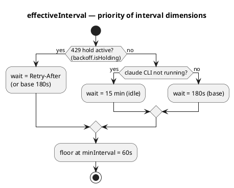
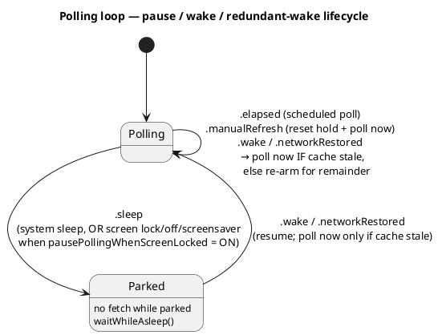
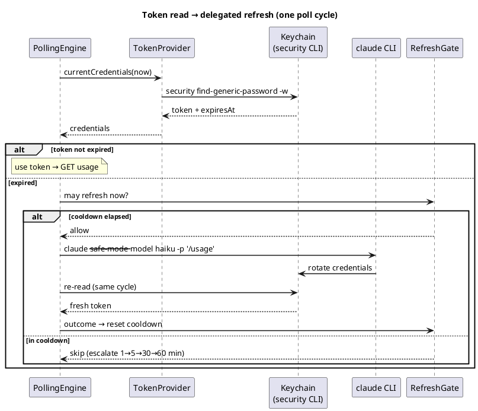
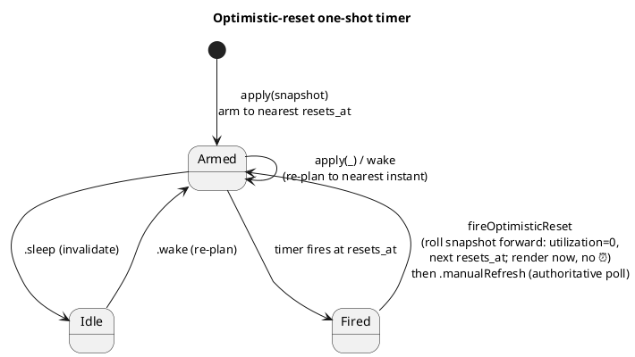
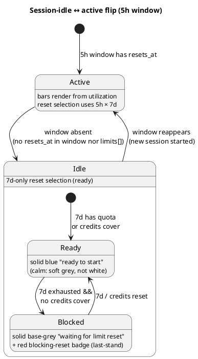
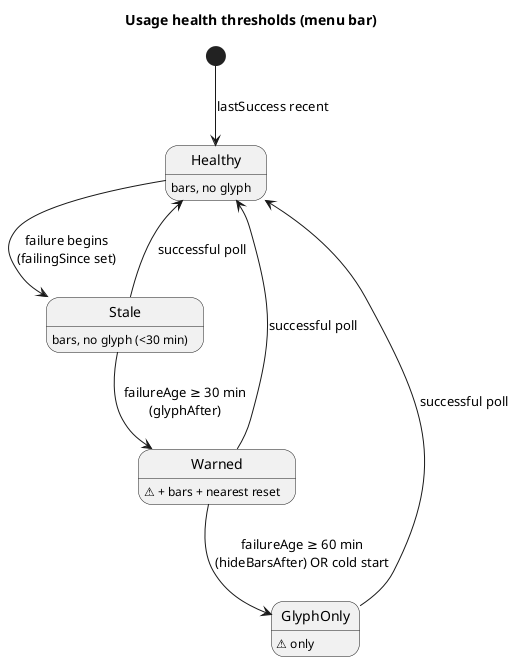

# Архітектура — потік даних (Фаза 1)

Наскрізна картина й розгортання — в [overview.md](overview.md). Тут — як дані течуть від Keychain до
menu bar: полінг, читання/оновлення токена, pacing-модель, рендер menu bar і popup, стани помилок.

## Потік опитування

```
Keychain (OAuth token)
  → PollingEngine (живий async-цикл, pure ядро + seam'и, TokenPaceKit)
  → GET https://api.anthropic.com/api/oauth/usage
    (headers: Authorization, anthropic-beta, User-Agent: claude-code/<version>)
  → (успіх/помилка опиту) → UsageHealth (lastSuccess/failingSince/reason)
  → MenuBarLayout.make(UsageSnapshot?, UsageHealth) → MenuBarMode (expanded/blockedReset/error)
  → StatusItemView малює NSStatusItem (pacing-смужки + час ресету, або ⚠️)
  → клік → PopupLayout.make(...) → PopupViewController у NSMenu
  → кожен PollOutput несе PollDiagnostics (сира FetchDiagnostics + TokenDiagnostics)
```

## Каденція опитування (ADR-0032)

Пласка 3-хв база з двома оверрайдами; reset-тригер лишається в shell-таймері (#36, ADR-0030); пауза
на екрані — опція; надлишковий wake придушується, якщо кеш ще свіжий.

**Пріоритет вибору інтервалу:**




**Цикл пауза / wake / надлишковий wake:**




## Токен: читання та делегований refresh (ADR-0017 / 0019 / 0020)

Токен читається сабпроцесом `/usr/bin/security` (ADR-0019). Рішення про expiry ухвалює **engine**,
не провайдер (ADR-0020): провайдер віддає `currentCredentials`, engine перевіряє `isExpired`, і на
прострочення робить **делегований refresh** — спавнить `claude` CLI, щоб Claude Code сам ротував
пару, і перечитує Keychain у тому ж циклі. Результат фолдиться в `RefreshGate` з ескалацією cooldown
`1→5→30→60 хв` (ADR-0017).




## Оптимістичний ресет (#36, ADR-0030)

На межі ресету menu bar не має показувати застарілий ⏰. One-shot `Timer` (`AppDelegate.resetTimer`)
зведений на найближчий `resets_at` (`ResetClock.nextResetInstant`), переплановується на кожному
`apply(_:)` і на wake, інвалідовується на sleep. Спрацювання котить snapshot уперед і малює миттєво,
далі — авторитетний полл.




## Session-idle 5h-вікно (#100, ADR-0027; blocked — #158, ADR-0038)

Коли активної сесії немає, 5h-вікно не існує — жодного фантомного `now+5h`. Чиста
`sessionIdleTransition(previous:current:)` логує перехід раз, і рендер малює idle-бар.

idle має **два варіанти** (ADR-0038):

- **Ready** — 7d має квоту (або credits покривають): суцільний **синій** бар, «ready to start».
- **Blocked** — немає квоти 5h (idle або 5h≥100), 7d вичерпано (`≥100`) **і** credits не покривають (`CreditsPacing.isBlocked`:
  вимкнені / capped / відсутні): суцільний **сірий** бар, статус «waiting for limit reset». На попапі
  рівно один ресет-час — **червоний**: обраний правилом «останнього рубежу» `BlockingReset` (credits-ресет
  виграє, коли не найпізніший, інакше `max(5h,7d)`); menu-bar-countdown бере той самий вибір
  (`BarView.blocked` / `LimitRow.sessionBlocked` / `PopupLayout.blockingReset`).

Окремо (ADR-0048, #193): коли підписковий ліміт вичерпано, **але credits активно покривають**
(`CreditsPacing.subscriptionExhaustedWhileCovered` — доповнювач `isBlocked`), стан **не** blocked
(рядок не сіріє, статус звичайний), проте попап усе одно фарбує ресет **токенного** ліміта червоним —
момент, коли квота повернеться й credits перестануть списуватися. Тут `BlockingReset.forSubscriptionExhausted`
(`creditsReset: nil` → найпізніший вичерпаний токен, ніколи не кредитний ресет). Лише попап; menu bar не чіпаємо.




## Стани помилок / health (#12, ADR-0010)

`UsageHealth` — **другий вхід** (поряд зі `UsageSnapshot`) для станів помилок. Пороги menu bar —
чисті функції від `failureAge(now:)`. Popup попереджає **одразу**; menu bar показує застарілі дані,
потім ⚠️.




## Sessions awaiting input (#233, ADR-0066)

Окреме джерело даних, **незалежне від usage-полу**: лічильник локальних сесій Claude Code, що
очікують вводу користувача («Needs input» у FleetView). Читається не з API, а з файлів стану, які
Claude Code пише сам:

```
awaiting = ~/.claude/sessions/<pid>.json  .status == "waiting"
        OR ~/.claude/jobs/<jobId>/state.json .needs != null / .tempo == "blocked"
```

- **`AwaitingInputScanner`** (`TokenPaceKit`, pure, stateless) — читає ці файли (без `JSONDecoder`,
  таргетовані regex), джойнить лише по живих сесіях, повертає `Int`. ~0.18 ms/скан.
- **`AwaitingInputWatcher`** (shell) — event-driven через **FSEvents** на каталогах `sessions/` +
  `jobs/` (не на файлах — набір сесій змінний), + рідкий safety-poll (~45 с). Викликає `scan()` лише
  на реальні зміни; колбек у shell спрацьовує тільки коли лічильник змінився.
- **Рендер** — count графтиться на готові layout'и (`MenuBarLayout.withAwaitingInput`,
  `PopupLayout.withAwaitingInput`) у `render()`, поза usage-`make`. Menu bar: іконка `hand.raised`
  (trailing, без `×N`); popup: `Claude ✋ ×N` праворуч від бренду (`×N` лише при N≥2). Opt-in
  (Settings → General, дефолт OFF); розміщення — Settings → Appearance.

Повний дизайн каденції/кешу/логування — [awaiting-input-refresh.md](../../design/awaiting-input-refresh.md).

## Компоненти потоку даних

| Компонент | Відповідальність |
|---|---|
| **TokenProvider** | Читання токена з Keychain **сабпроцесом `/usr/bin/security find-generic-password -w`** (матч лише за service; декодування обгортки `claudeAiOauth`, перевірка `expiresAt`). Прямий `SecItemCopyMatching` свідомо не використовується: Claude Code на кожному refresh переписує item через `security add-generic-password -U`, що **скидає ACL partition list** і знову викликає keychain-промпти у GUI-застосунку; `security` — Apple-tool, тож читає тихо (ADR-0019). Pure-обробка виводу — `parseSecretOutput`/`mapExitStatus`, юніт-тестовані. Протухлий токен **не йде на API** — але рішення про expiry ухвалює **engine**, не провайдер (ADR-0020): `currentCredentials(now:)` віддає `TokenCredentials {accessToken, expiresAt}` (без `refreshToken`), а engine реагує делегованим refresh (ADR-0017). TokenPace ніколи не пише в Keychain. Свідомий вибір `throws`+enum — ADR-0007, ADR-0020 |
| **DelegatedRefresh / RefreshGate** | Kit-сторона делегованого refresh (ADR-0017): протокол `DelegatedRefresher` (fail-safe — не кидає) + чистий `RefreshGate` — anti-flap гейт спроб з ескалацією cooldown `1→5→30→60 хв`. Outcome-и: `refreshed`/`unchanged`/`cliNotFound`/`timedOut`/`failed(exitCode:)` |
| **UsageClient** | Запити до usage API з обов'язковим `User-Agent: claude-code/<version>` (guard: без нього не ходити). Чисті seam'и `buildRequest`/`decode` окремо від мережевого `fetch` (інжектований `UsageTransport`). Типізований `UsageError`. `diagnosedFetch -> DiagnosedFetch` складає `FetchDiagnostics` з повним body для Troubleshoot (ADR-0020). Дати **не парсимо** — `resets_at` зберігаємо сирим для `ResetClock`. На межі ресету `UsageSnapshot.decode` **синтезує** свіже вікно замість падіння; виняток для `five_hour` (#100, ADR-0027): без `resets_at` вікна не існує (`sessionIdle: true`). Per-model під-вікна успадковують `resets_at` від `seven_day`; `weekly_scoped` (напр. Fable, #65) — через `scopedModelWindows`. Грошові кредити (#143): блоки `spend` + `extra_usage` мерджаться в опційний `SpendInfo` (`nil` до появи кредитів; гроші — цілий `Money {amount_minor, currency, exponent}`, не float; серверний `spend.severity` та `balance`/`auto_reload` **ігноруємо** — spike #142). Backoff — чистий `PollingBackoff` (180 с; 429 → hold на `Retry-After`, без ескалації, ADR-0032). Деталі — ADR-0008, ADR-0014 |
| **PacingModel** | Порт `calc_time_pct`/`get_limit_indicator` зі statusline. Зони смужки — **безперервні частки [0,1]** (`BarLayout`), не блоки; блокова квантизація — опційна похідна (ADR-0005). Far-behind (green→blue) поріг **конфігурований** (#224, ADR-0062): `behindThreshold(windowDurationSeconds:multiplier:)` домножає базову ширину (1h/5h, 1d/7d) на множник; `BarLayout.behindMultiplier` (0 = ніколи синій) несе його з AppKit, тож Kit-severity й render-колір не розходяться |
| **CreditsPacing** | Чиста AppKit-free логіка для `SpendInfo` (#143): тригер іконки (`enabled` **OR** `spend_limit_reached`, І хоч один базовий ліміт вичерпаний) і `barLayout(for:now:timeZone:)` — колір рахується **так само, як бари токенів** (`usage` vs `time`, той самий `BarLayout`/`aheadColor`: зелений→жовтий→оранжевий→**червоний лише при досягнутому ліміті**), а не окремою формулою. `usageFraction = used/limit`; `timeFraction = monthElapsedFraction` — частка календарного місяця, що минула, від **00:00 UTC 1-го числа** (`resetTimeZone`; API не дає reset-часу грошей, рахуємо локально — джерело: Anthropic Spend Limits API docs). Без ліміту (unlimited) → `nil` (без бару, лише сума). База — лише ліміт (balance недоступний, поза обсягом). blocked (#158/ADR-0038): `creditsCanCover(spend)` (enabled І не capped — платний «останній рубіж») та `isBlocked(in:)` (`(sessionIdle OR 5h≥100) AND 7d≥100 AND NOT creditsCanCover`). Доповнювач (#193/ADR-0048): `subscriptionExhaustedWhileCovered(in:)` = `mainWindowExhausted AND creditsCanCover` — вичерпано підписку, але credits покривають (взаємно виключний з `isBlocked`) |
| **ResetClock** | Парсинг `resets_at` → `Date`; вибір найближчого ресету (5h vs 7d); форматування `TimeToReset` (абсолютний `hh:mm` >90 хв, інакше `1h10m`/`45m`/`<1m`); `timeToResetCompactDays` («4d») для idle menu bar; `nextReset`/`nextResetInstant` для синтезу вікна й one-shot таймера; `optimisticReset(_:now:)` котить snapshot на межу ресету (ADR-0030), тепер застосовується на **кожному** рендері (`AppDelegate.render`, ADR-0043) — не лише за таймером; `resetLine(_:)` — єдиний рядок «часу до ресету» дропдауна для всіх лімітів (ADR-0043). Свідоме розходження зі statusline — ADR-0006 |
| **UsageHealth** | Чистий value-тип стану опитування — **другий вхід** для станів помилок (#12): `lastSuccess`/`failingSince`/`reason`. Пороги — чисті функції від `failureAge(now:)`: `glyphAfter` = 30 хв, `hideBarsAfter` = 60 хв. `FailureReason` мапить `TokenError`/`UsageError` → семантичні причини (exhaustive `switch`). Розкол — ADR-0010 |
| **MenuBarLayout** | Чиста модель «що малювати»: `make(...)` → `MenuBarMode.expanded` (завжди дві смужки, ADR-0015) чи `.error`. **Вибір reset-часу** (#103, ADR-0029) — `selectReset` за таблицею 5h × 7d severity; у заблокованому idle (#158/ADR-0038) countdown бере блокуючий ресет (`BlockingReset`, той самий вибір, що й попап), а `BarView.blocked` фарбує idle-бар сірим. **Ховання спокійної 7d** (#94, ADR-0034) — `sevenDay` стає опційним. **Червоний pause-гліф + ховання барів у повній зупинці** (#194, #199, #227, ADR-0063, гейт `pauseHidesBars`) — об'єднана поведінка. Коли `CreditsPacing.isBlocked` (5h/7d вичерпано **І** credits не покривають — повна зупинка), у віджеті **завжди** з'являється **червоний** `pause.fill` як провідний елемент (прапорець `blockedPause: Bool` на health-обізнаному `make`-шві: `true` коли `isBlocked` **І** `mode ∈ {.expanded, .blockedReset}`; ніколи для `.error`). Тумблер `pauseHidesBars` (за пресетами: Chill=on, Work harder!/Control freak=off) вирішує лише **чи ховаються бари** поряд: `true` → `make` повертає `MenuBarMode.blockedReset(reset:which:)` (лише pause-іконка + countdown, без барів, ресет форсується попри `resetMode` через `BlockingReset.forBlocked`); `false` → `.expanded` (pause-іконка + бари). Предикат ховання барів звужено з `mainWindowExhausted` до `isBlocked` (ADR-0063): поки credits ще покривають вичерпане вікно, бари **не** ховаються. Fallback до звичайного шляху при broken `resets_at`; error/stale-гілка прапорець **не** пробрасує (діагностичні бари збережено). Малювання — leading-гліф ліворуч від барів (`.expanded`) або ліворуч від countdown (`.blockedReset`), як ⚠️; колір — уніфікована роль `.red` (accessor `Palette.pauseRed`), спільна з вичерпаними барами й пігулкою блокуючого ресету. Health-обізнана гілка (#12) додає `.error` з опційними смужками. **Іконка грошових кредитів** (#144) — `credits: CreditsMarker?` (за гейтом `showExtraUsage`): `creditsMarker(for:now:)` містить `CreditsPacing.shouldShowIcon` (показ) + `CreditsPacing.barLayout` (`bar: BarLayout?` для кольору; `nil` → нейтрально при unlimited). У `.expanded`/`.blockedReset` іконка малюється у **провідній** позиції — між pause-гліфом і барами (#227); лише у діагностичному `.error` лишається трейлінг. Ортогональна до `mode`/`serviceProblem`. Живе в `TokenPaceKit`. Розкол pure/shell — ADR-0009, ADR-0010 |
| **StatusItemView** | Тонкий AppKit-shell (`NSView` у `TokenPace`): малює `MenuBarLayout` — дві смужки + час ресету, `.blockedReset` (pause-іконка + центрований countdown-лейбл, без барів — #194/ADR-0063), або ⚠️ (monochrome `labelColor`). Порядок зліва направо у режимах барів (`.expanded`/`.blockedReset`): **червоний pause-гліф** (#199/#227) → **іконка грошових кредитів** (#144/#227, провідна позиція між pause і барами) → бари/countdown → час ресету; **service-крапка** (#31) лишається найправішою. У діагностичному `.error` іконка кредитів лишається трейлінг (ліворуч від service-крапки). Гліф кредитів — за валютою (`creditsSymbolName`: EUR→`eurosign` €, USD→`dollarsign` $, GBP→`sterlingsign` £, JPY/CNY→`yensign` ¥, INR→`indianrupeesign`, невідома→generic `coloncurrencysign` ¤), колір із `CreditsMarker.bar` через той самий `aheadColor`, що й бари (`bar == nil` → нейтральний foreground). Ширина резервується під конкретний гліф (`creditsIconWidth(for:)`). idle-5h — суцільний `Palette.idleBlue` (#100; під `calmColors` → м'який `Palette.idleCalmGrey`, не білий), або **базовий сірий** `PopupBarView.monochromeGrey`, коли idle заблоковано (`BarView.blocked`, #158/ADR-0038: 7d вичерпано і credits не покривають) — той самий сірий, що зони бару, в обох colour-режимах. `calmColors` (#105) гасить решту м'яких pacing-кольорів у білий (разом із degraded service-крапкою й calm-іконкою кредитів). Кольори — **системні semantic** (ADR-0059): track = `labelColor@0.22` (дихає+фліпає як місяць), яскраве (текст/⚠️/tick) = `labelColor` at fixed alpha через `bright()`, акценти = `.system*`; рендер — eager у `button.effectiveAppearance`. Перемальовування лише при зміні `layout`. **Подача бару конфігурована** (#224, ADR-0062): `barStyle` (`.pacing`/`.mixed`/`.simple` — gap+маркер vs стрічка від лівого краю) і `calmColorMode` (`CalmColorMode` — **замінює** старі `calmColors`+`workHarder`; render читає derived `mutesCalm`/`mutesBlue`). Розкол — ADR-0009, ADR-0010 |
| **PopupLayout** | Чиста модель «що показати в popup»: `make(...)` → секції `LimitRow` (5h, 7d, Opus/Sonnet, scoped-моделі з `limits[]`). idle-5h → `idleFiveHourRow` (#100), з `sessionBlocked` коли заблоковано (#158/ADR-0038 → «waiting for limit reset» + сірий бар). Поле `blockingReset: BlockingReset.Choice?` вказує рядок/секцію, чий ресет фарбується червоним; виставляється у **двох** випадках: `isBlocked` → `forBlocked` (правило «останнього рубежу», спільне з menu bar, може дати кредитний ресет); інакше `subscriptionExhaustedWhileCovered` (#193/ADR-0048) → `forSubscriptionExhausted` (лише токенний ресет — coли credits покривають, підсвічуємо, коли підписка розблокує). Health-обізнана гілка (#12) додає `warning: FailureReason?` одразу. **Секція «Extra usage»** (#145) — окреме поле `credits: CreditsRow?` (НЕ в `rows`): `creditsRow(from:now:)` за м'якшим гейтом `CreditsPacing.isActive` (лише `enabled`/`spend_limit_reached`, без вимоги вичерпаного базового ліміту — це умова menu-bar-**іконки**, а не деталі). Несе сирі `spent`/`limit` (`Money`), `bar: BarLayout?` (nil = unlimited → без бару/ресету) з `CreditsPacing.barLayout`, `resetLine` — єдиний рядок часу до кінця місяця через `CreditsPacing.monthEnd → ResetClock.resetLine` (той самий формат, що й токен-рядки: `15d`/`5d on Friday`/`20h at 03:00`, ADR-0043), і `inUse: Bool` (#146) — чи кредити **реально витрачаються зараз** (`CreditsPacing.shouldShowIcon`, той самий суворий гейт, що й menu-bar-іконка: enabled І вичерпаний базовий ліміт), для показу плашки «in use». Несе лише сирі числа/прапорці й enum'и — речення збирає view. Реюз у Фазі 2. ADR-0009, ADR-0010 |
| **PopupViewController** | Тонкий AppKit-shell: малює `PopupLayout` у стилі рідних віджетів — болд-заголовок «Claude» (ADR-0021), рядки статусу сервісів, банер помилки, секції лімітів двоколонковим split-layout. **Попап завжди напівпрозорий** (#188/ADR-0064): уся Claude-секція сидить на заокругленій **плашці** `CardBackdropView` (Control-Center-стиль, layer-backed `updateLayer`, м'яка тінь, fill `controlBackgroundColor@0.85`, inset від країв — навколо просвічує рідний menu-матеріал; сепаратора перед Settings немає). `SolidBackdropView`/opaque-режим видалено. `PopupBarView` перебудовано (#188/ADR-0064): суцільний сірий track → кольоровий **стріп із капсульними торцями** + ambient-**glow** → **повзунок** із filled-frame сірим бордером і сильнішим glow; idle-бар має власний glow. Шкала-засічки (opt-out `showTicks`, #224/ADR-0062; трек — тьмяніший popup-only тон між tertiary/quaternary label). Подача бару — той самий `barStyle` (`.mixed`/`.simple` малюють стрічку від лівого краю замість gap+маркера). **Status-крапки** сервісів — `GlowDotView` (layer-backed, glow, re-resolve кольору в `updateLayer` → переживають зміну теми, не запечений image). **Секція «Extra usage»** (#145, `addCreditsSection`) під лімітами: якщо ліміт встановлений — рядок «Extra usage [active] ⟷ статус-слово» (`creditsStatusText` із `bar`), «€spent / €limit ⟷ `resetLine`» (той самий уніфікований формат, що й токен-рядки — `5d on Friday`/`20h at 03:00`, без префікса; ADR-0043), і бар (той самий `PopupBarView`, `subdivisions: 0`); якщо unlimited — лише «Extra usage ⟷ €spent spent». За `credits.inUse` (#146) біля заголовка — синя плашка **«active»** (`PillView` — layer-backed капсула в `controlAccentColor`, radius = ½ висоти, CGColor у `updateLayer()`), показується лише коли кредити реально витрачаються. Форматер грошей `moneyText` — major-unit з цілого + `exponent`; для **відомих** валют `NumberFormatter(.currency)` ставить символ у **стандартну для валюти позицію** (`€10.77`/`$10.77` перед, `10,77 kr` після), для **невідомих** — `сума КОД` (`12.00 UAH`). Набір відомих валют дзеркалить `StatusItemView.creditsSymbolName`. НЕ хардкод $. Форматування рядків — тут (точка локалізації). ADR-0009, ADR-0010, ADR-0021 |
| **DevColorTuner** (`ColorRole`/`ColorStore`/`GradientSlider`/`DevToolsWindowController`, #185) | Dev-інструмент живого підбору кольорів. `ColorRole` — плоский каталог **усіх ~38** іменованих кольорових ролей (menu-bar + popup палітри + popup extras: service-доти, warning red, «in use» pill, **pill text**, link, label; `displayName`/`group`/`usageDescription`/`distortion`/`defaultColor`). Menu-bar та popup ahead-of-pace **розділені** (окремі `menuGapRed/Yellow/Orange` vs `popupGap*`) — `PopupBarView.aheadColor` параметризовано `PacingSurface { popup, menuBar }`. `ColorStore` (`@MainActor` singleton) — **єдине джерело**, через яке обидва `Palette` читають кожен колір: `color(role)` віддає override ?? default. **Гейт — `defaults`-ключ `devToolsEnabled` `І` ⌥ Option** (ADR-0053): коли вимкнено — завжди default, словник override не чіпається (нульовий вплив на hot draw-path). `set/reset/resetAll` смикають `onChange` → `AppDelegate.reRenderForCurrentTime()`, що ре-снапшотить menu-bar (`refreshStatusImage`) і перебудовує popup за один прохід. `DevToolsWindowController` — вікно (шаблон Troubleshoot): список ролей із сортуванням alphabetical↔by-group і ● для недефолтних, **вбудований inline-пікер** — канали згруповано з заголовками: **RGB**, **HSB**, **Perceptual** (LAB **L\*** + LCH **C**, через `ColorSpaces` sRGB↔LAB↔LCH D65). Над кожним повзунком динамічна градієнт-стрічка (`GradientSlider`) з кольоровим knob позиції; редаговані 16-бітні поля; **редаговані** RGB(0–255)+HEX readout-и; чекбокс **Lock hue+saturation**; блок **WCAG contrast** (проти світлого/темного menu-bar і popup-фону, AA/AAA). Reset / Reset all, підпис `usageDescription` + виділений `distortion`. Alpha прибрано (ролі непрозорі). Вікно **always-on-top** (`.floating`). Поруч — **окреме borderless preview-вікно** (child window, приліплене до тюнера, скруглене під форму menu-bar попапа) із власним `PopupViewController`, що рендерить popup тим самим виглядом (не модальний `NSMenu`); годується тим самим `PopupLayout` через `AppDelegate.setPopupLayout → updatePreview`, перемальовується наживо; має title-плашку «Popup Preview» і два mock update-рядки (синя/червона крапка) для підбору `popupServiceBlue`/`popupWarningRed`. Preview chrome (`ThemedFillView`/`TitlePlaqueView`) — layer-backed через `updateLayer`, тож адаптується до light/dark. Тло картки — `NSColor.popupMenuMatchedBackground`: у **dark** суцільний **#212121** (виміряний Digital Color Meter колір реального `NSMenu`-попапа, який `windowBackgroundColor` тут малює помітно світлішим), у **light** — просто `windowBackgroundColor` (там уже точний збіг). Плюс тонка hairline-рамка `NSColor.popupMenuBorder` по краю картки — як у системних menu-вікон. **Вікно превью форсує Vibrant-appearance** (`vibrantDark`/`vibrantLight`) поточної теми (#188/ADR-0064): системні label-кольори (напр. напівпрозорий track попапа) резолвляться під vibrancy інакше, ніж під `darkAqua` — реальне menu-вікно є `NSAppearanceNameVibrantDark`, тож без форсу нейтралі превью читалися світлішими за живе меню. Превью також реагує на зміну **Bar style**/**Show ticks** (`updatePreview` перечитує `PersistedConfig.barStyle`/`showTicks`; `onBarStyleChange`/`onShowTicksChange` викликають `reRenderForCurrentTime`). Закривається разом із вікном тюнера. **Свідомо БЕЗ ролі** (аудит #206): фон реального попапа малює vibrancy-матеріал самого `NSMenu` (система, не наш піксель), а `popupMenuBorder` — суто preview-chrome; обидва задокументовано коментарем, тюнер їх не перефарбовує. Override-и **ephemeral**. Пункт меню «Development tools…» видно лише за `devToolsEnabled` **І** ⌥ Option. Те саме вікно несе **живий селектор стубів** (#187, ADR-0047): `NSPopUpButton` («Preview data source (stub)») угорі лівої колонки перемикає `TOKENPACE_STUB`-сценарій без рестарту — вибір іде через closure `onStubChange` у `AppDelegate.switchScenario`, під випадайкою `summary` поточного сценарію. ADR-0046, ADR-0047 |
| **PollingEngine** | Живий async-цикл (`TokenPaceKit`): pure ядро (`advance`/`effectiveInterval`/`intervalDecision`/`wakeRearmInterval`) + seam'и. `run() -> AsyncStream<PollOutput>`. Інтервал (ADR-0032) — `429-hold > claude-idle 15 хв > база 3 хв`, ніколи нижче `minInterval` = 60 с. Park на sleep; wake → опит лише якщо кеш застарів; `.manualRefresh` → завжди негайний опит + скид 429-hold. Рішення про expiry — тут (ADR-0020); делегований refresh + перечит токена в тому ж циклі (ADR-0017). Кожна зміна інтервалу й idle↔active-флип логуються раз. ADR-0032 (superseded ADR-0011) |
| **LivePollScheduler / PollingShell** | Виробничий scheduler (`AsyncStream`+`Task.sleep`) і платформенні seam'и: `WorkspaceSleepWake`, `ScreenLockObserver` (#114, gated `pausePollingWhenScreenLocked`), `NetworkMonitor` (`NWPathMonitor`), `ProcessClaudeActivityProbe` (`sysctl`, точне ім'я `claude`), `SignalHub`. `SignalHub.newStream()` видає **свіжий** single-consumer `AsyncStream` на кожну побудову engine (`send` під `NSLock`) — щоб live-swap стуба (#187, ADR-0047) не лишав новий engine на завершеному стрімі. Джерело істини стуб-сценаріїв — `StubScenario` (`CaseIterable`; rawValue=env-id, `makeTransport()`), спільне для launch-шляху й dev-випадайки. Оптимістичний-ресет таймер — тут (ADR-0030). ADR-0011, ADR-0032, ADR-0047 |
| **ClaudeCLIRefresher** | Виробничий `DelegatedRefresher` (ADR-0017) — спавн `claude --safe-mode --model haiku -p '/usage'` у порожній tmp-теці, таймаут 30 с. `--safe-mode` вимикає користувацькі hooks/plugins/MCP/CLAUDE.md (лишає auth+Keychain), щоб чужий хук не спричинив TCC-промпт від імені TokenPace (#183). Критерій успіху — `expiresAt` посунувся вперед. Токен ніколи не в аргументах/env/логах |
