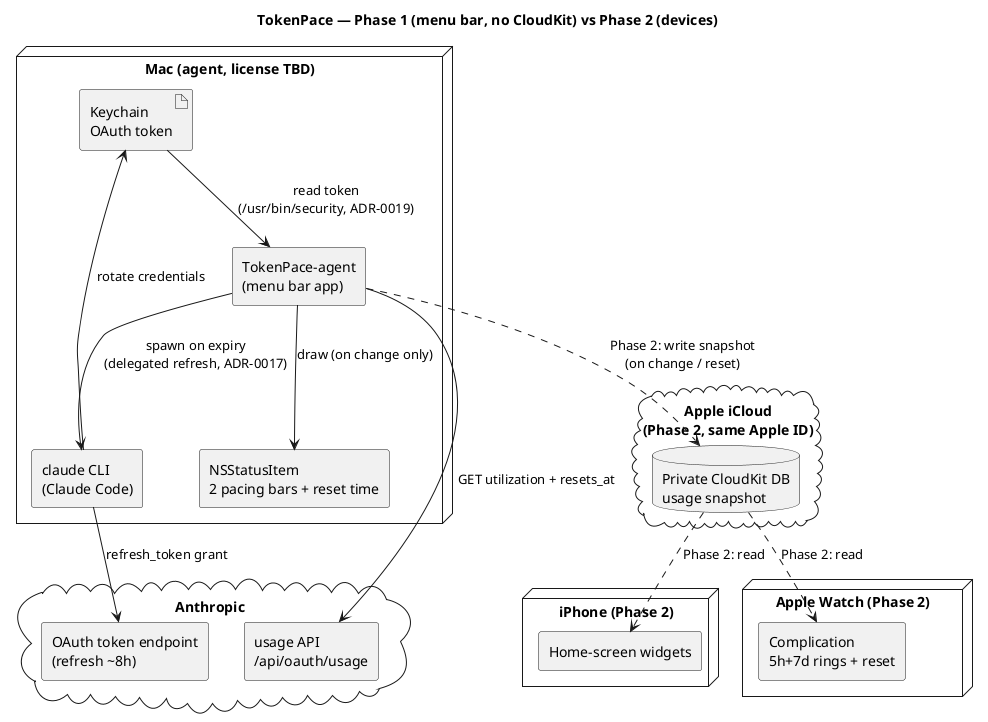
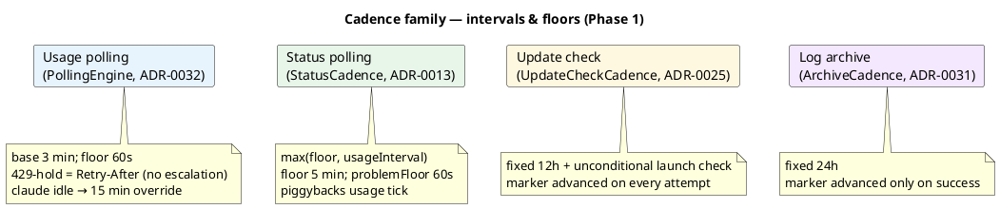

# Architecture — overview

Product details are in [SPEC.md](../../../SPEC.md). Here — the compact architectural picture,
deployment topology, and cross-cutting principles. The data flow within Phase 1 is in
[data-flow.md](data-flow.md); the update system is in [update-system.md](update-system.md); service
status, config, and Settings are in [services-and-config.md](services-and-config.md).

## Principles

- **No backend of our own.** The Mac is the only component that touches the Anthropic API.
- **The token never leaves the Mac.** It lives in the macOS Keychain (`Claude Code-credentials`).
- **Redraw only on a data change** (use or a timer reset) — for energy efficiency.

## Phase 1 — menu bar app (no CloudKit)

Everything runs locally on one Mac: `PollingEngine` (a live async loop, a pure core + seams in
`TokenPaceKit`) reads the token from the Keychain, calls the usage API, and draws the
`NSStatusItem` only on change. A second, independent stream monitors Claude service status. The
detailed data flow is in [data-flow.md](data-flow.md).

## Phase 2 — devices (adds CloudKit)

The same Mac agent writes a usage snapshot to a private CloudKit DB (the same Apple ID); the
iPhone widgets and the Apple Watch complication read from there. This is planned, not implemented
(see SPEC.md, Phase 2).

## Deployment topology

## The cadence family

Each background stream has its own frequency. All of them are pure `*Cadence` seams in
`TokenPaceKit`; most piggyback on the usage tick rather than running their own timer.

## SPM layout

`TokenPaceKit` (library target — all the logic that's tested and reused in Phase 2) +
`TokenPace` (executable target — the AppKit entry point). Building the `.app` bundle:
`scripts/build-app.sh` → `./build/TokenPace.app`.

The cross-cutting logging wrapper is **AppLogger** (`os.Logger`, 4 categories —
`network`/`keychain`/`lifecycle`/`ui`, subsystem `com.artem-n.tokenpace`). The token and secrets
**are never logged** (default `<private>` redaction; only safe diagnostic fields use `.public`).
The full message catalog is in [log-messages.md](../log-messages.md).

## Component map

| Area | Page |
|---|---|
| Polling, token, pacing, menu bar render, popup | [data-flow.md](data-flow.md) |
| Update checking and auto-install | [update-system.md](update-system.md) |
| Service status, monitored services, persist/migrate, Settings, archiver | [services-and-config.md](services-and-config.md) |
