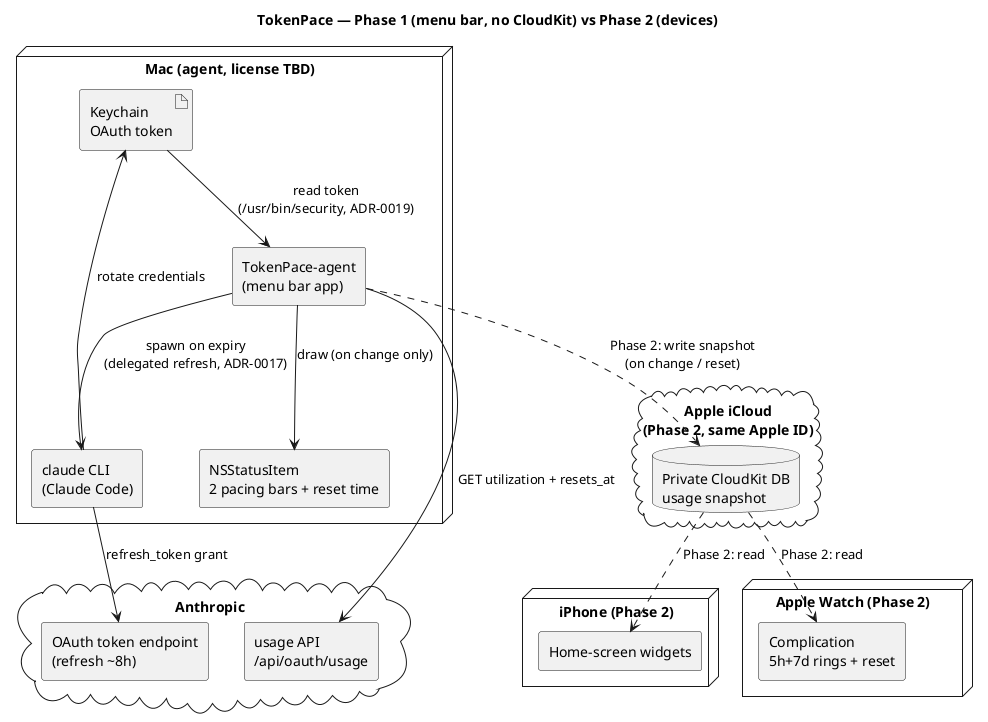
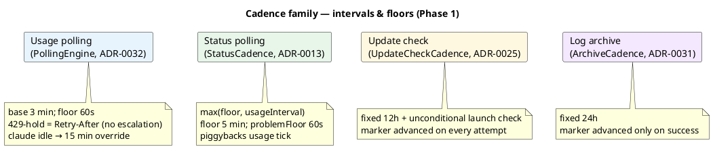

# Архітектура — огляд

Деталі продукту — у [SPEC.md](../../../SPEC.md). Тут — стисла архітектурна картина, топологія
розгортання та наскрізні принципи. Потік даних усередині Фази 1 — у
[data-flow.md](data-flow.md); система оновлень — у [update-system.md](update-system.md); статус
сервісів, конфіг і Settings — у [services-and-config.md](services-and-config.md).

## Принципи

- **Без власного бекенду.** Mac — єдиний компонент, що торкається Anthropic API.
- **Токен ніколи не покидає Mac.** Він лежить у macOS Keychain (`Claude Code-credentials`).
- **Перемальовування лише при зміні** даних (use або ресет таймера) — енергоефективність.

## Фаза 1 — menu bar app (без CloudKit)

Усе локально на одному Mac: `PollingEngine` (живий async-цикл, pure ядро + seam'и в
`TokenPaceKit`) читає токен із Keychain, ходить у usage API, і малює `NSStatusItem` лише при зміні.
Другий незалежний потік моніторить статус сервісів Claude. Детальний потік даних —
у [data-flow.md](data-flow.md).

## Фаза 2 — пристрої (додається CloudKit)

Той самий Mac-агент пише usage-snapshot у приватну CloudKit DB (той самий Apple ID); віджети iPhone
та комплікейшен Apple Watch читають звідти. Це заплановано, не реалізовано (див. SPEC.md, Фаза 2).

## Топологія розгортання

## Родина каденцій

Кожен фоновий потік має власну частоту. Усі — чисті `*Cadence` seam-и в `TokenPaceKit`; більшість
хантажиться з usage-tick, а не має власного таймера.

## SPM-розкладка

`TokenPaceKit` (library-таргет — вся логіка, що тестується і реюзується у Фазі 2) +
`TokenPace` (executable-таргет — AppKit entry point). Збірка `.app` bundle:
`scripts/build-app.sh` → `./build/TokenPace.app`.

Наскрізна обгортка логування — **AppLogger** (`os.Logger`, 4 категорії
`network`/`keychain`/`lifecycle`/`ui`, subsystem `com.artem-n.tokenpace`). Токен і секрети
**ніколи не логуються** (дефолтний `<private>` redaction; лише безпечні діагностичні поля —
`.public`). Повний каталог меседжів — [log-messages.md](../log-messages.md).

## Мапа компонентів

| Область | Сторінка |
|---|---|
| Полінг, токен, pacing, рендер menu bar, popup | [data-flow.md](data-flow.md) |
| Перевірка й авто-встановлення оновлень | [update-system.md](update-system.md) |
| Статус сервісів, monitored services, persist/migrate, Settings, архіватор | [services-and-config.md](services-and-config.md) |
