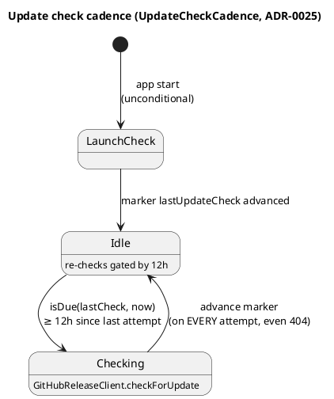
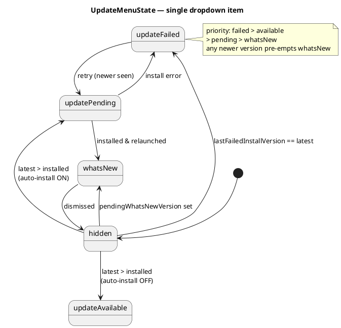

# Архітектура — система оновлень

Наскрізна картина — в [overview.md](overview.md). Тут — перевірка релізів, авто-встановлення й
єдиний update-пункт дропдауна. Ланцюг рішень: ADR-0025 (перевірка) → ADR-0033 (встановлення) →
ADR-0036 (сигнальний UX). Перші два частково витіснені 0036 — див.
[../../adr/README.md](../../adr/README.md).

## Перевірка оновлень (ADR-0025)

Чек іде через GitHub releases: анонімний HTTPS (`HTTPUpdateFetcher`) або `gh`-subprocess
(`GHReleaseFetcher`, поки репо приватне — гейт `TOKENPACE_GH_AUTH`). Семвер-порівняння —
`SemanticVersion`; будь-яка помилка парсингу → жодного фантомного оновлення.

**Каденція чеку** — фіксовані 12 год плюс безумовний чек при старті:




## Єдиний update-пункт дропдауна (ADR-0036)

`UpdateMenuState` — чиста машина станів **єдиного** пункту меню (#130), що замінила банер
`UpdateNotifier` (жодних `UserNotifications`). `evaluate(...)` → семантичний `Item`-enum за
пріоритетною таблицею; будь-яка версія, новіша за встановлену, витісняє «what's new».




Колір і текст — у view (`AppDelegate`, переюзує `PopupViewController.dotColor`: 🔴 `.majorOutage`
для failed / 🔵 `.underMaintenance` для pending).

## Рішення про авто-встановлення (ADR-0033)

`UpdateInstallPlan.decide(...)` — один вердикт «ставити зараз?» за впорядкованими гейтами.
Environment-гейти (місце / живлення / metered) — **лише для встановлення**, не для check-шляху;
`.defer…` переоцінюється наступним heartbeat, `.skip…` — settled.

**Явний запит користувача — «Update Now» у Settings → About** (#221, `AppDelegate.installUpdateNow`)
проходить ті самі гейти, але з `onACPower: true, networkIsMetered: false`: гейти живлення й мережі —
це *ввічливість* фонового процесу (не палити metered-трафік, не ризикувати розрядом посеред заміни),
і явний клік цю ввічливість знімає. Клік також рахується за opt-in для **цієї** інсталяції
(`autoInstallEnabled: true`), інакше кнопка була б мертвою рівно там, де потрібна найбільше —
коли авто-встановлення вимкнене. Free-space-гейт **не** обходиться: жоден намір не робить безпечним
заповнення диска. Чому не через `TOKENPACE_UPDATE_DRYRUN` — той прапорець зліплює «обійти гейти» з
«не встановлювати насправді»; тут потрібна лише перша половина, тож `startInstall(…,
forceRealInstall: true)` явно передає `dryRunForced: false`.

```plantuml
@startuml
title Auto-install decision gates (UpdateInstallPlan.decide)
start
if (auto-install enabled?) then (no)
  :skip — auto-install-off; <<#FDE8E8>>
  stop
else (yes)
endif
if (newer than installed?) then (no)
  :skip — not-newer; <<#FDE8E8>>
  stop
else (yes)
endif
if (running as .app in /Applications?) then (no)
  :skip — not-app-bundle; <<#FDE8E8>>
  stop
else (yes)
endif
if (matching version-named .zip asset?) then (no)
  :skip — no-asset; <<#FDE8E8>>
  stop
else (yes)
endif
if (free space >= 5 GB after download?) then (no)
  :defer — insufficient-space; <<#FFF8E1>>
  stop
else (yes)
endif
if (on AC power?) then (no)
  :defer — on-battery; <<#FFF8E1>>
  stop
else (yes)
endif
if (network un-metered?) then (no)
  :defer — metered-network; <<#FFF8E1>>
  stop
else (yes)
endif
:install —\ndownload -> unzip -> verify\n-> replace -> relaunch; <<#E8F5E9>>
stop
@enduml
```


## Компоненти системи оновлень

| Компонент | Відповідальність |
|---|---|
| **SemanticVersion / UpdateComparison** | Чистий семвер-парсер (#37, `TokenPaceKit`, ADR-0025). `SemanticVersion(_:)` парсить `vX.Y.Z`/`X.Y.Z` консервативно (рівно 3 числові компоненти; суфікс `-beta`/`+meta` відкидається), `Comparable`. `UpdateComparison.isNewer(tag:than:)` → `false` на будь-якій помилці парсингу (контракт «ніколи не смикати на смітті») |
| **GitHubRelease / GitHubReleaseClient** | HTTP-seam GitHub-релізу (#37, ADR-0025). `GitHubRelease` (Decodable) парсить `tag_name`/`html_url` + `assets[]` (forward-compat). `checkForUpdate(using:currentVersion:)` — fetch → decode → `isNewer`, повертає реліз лише якщо новіший, будь-яка помилка (в т.ч. 404) → `nil`. Транспорт абстрагований на `UpdateFetcher` (не `UsageTransport`), бо один шлях — subprocess |
| **UpdateAssetSelector / UpdateInstallPlan** | Чисті seam-и авто-встановлення (#122, `TokenPaceKit`, ADR-0033). `selectZIP(from:)` вибирає version-named `.zip` (`TokenPace-<X.Y.Z>.zip`), відкидає не-HTTPS. `decide(...)` — впорядковані гейти (opt-in → newer → real `.app` → asset → free space ≥5 GB → AC power → unmetered) → `.install` / `.skip…` / `.defer…`. Факти інжектяться з shell |
| **UpdateDeferralReason** | Пояснювальний двійник `decide` (#221, `TokenPaceKit`). `UpdateInstallPlan.deferralReasons(...)` повертає **всі** активні environment-блокери (`onBattery` / `meteredNetwork` / `insufficientSpace`) у сталому порядку `allCases`, тоді як `decide` спиняється на першому — тож UI не жене користувача чинити одну умову, щоб потім відкрити наступну. Settled-no випадки (auto off / not newer / dev / no asset) → `[]`: там немає відкладеного install, який треба пояснювати. `pendingExplanation(for:)` складає з них одне речення («a», «a and b», «a, b and c») для About-рядка ⚠ |
| **UpdateCheckCadence** | Чистий seam частоти update-чеку (#37, ADR-0025) — фіксований 12-год інтервал (не прив'язаний до usage-cadence). Shell також перевіряє **безумовно при старті**; маркер `lastUpdateCheck` радиться на **кожній** спробі (навіть 404) |
| **UpdateMenuState** | Чиста машина станів **єдиного** update-пункту (#130, `TokenPaceKit`, ADR-0036). `evaluate(...)` → `Item`-enum (`hidden`/`updateFailed`/`updateAvailable`/`updatePending`/`whatsNew`) за пріоритетною таблицею. Колір/текст — у view. **Замінив `UpdateNotifier`** (банер видалено). ADR-0036 |
| **GHReleaseFetcher / ShellEnvironment** | `gh`-subprocess-конформер `UpdateFetcher` (#37, ADR-0025) — `gh api repos/…/releases/latest`, таймаут 20 с, stdout захоплюється, середовище успадковується (`gh` потребує keyring). Обирається коли встановлено `TOKENPACE_GH_AUTH`, який резолвиться власним `AppDelegate.resolveGHAuth`: `ProcessInfo` → login-shell fallback через `ShellEnvironment` (`zsh -l -i`; `SMAppService` стартує без шелла). `StubUpdateFetcher` — `TOKENPACE_FAKE_LATEST` |
| **UpdateInstaller** | Тонкий I/O-shell авто-інсталятора (#123, ADR-0033) за seam-ом `AppUpdateInstalling`. Пайплайн off-main: **download** (двошляховий: `gh release download` за `TOKENPACE_GH_AUTH` / анонімний `URLSession`) → **unzip** (`ditto -x -k`) → **verify** (`codesign --verify` + звірка Team ID через `codesign -dv` + Gatekeeper `spctl`) → **replace** (атомарний `replaceItemAt` з backup) → **relaunch**. Fail-safe (не кидає). `TOKENPACE_UPDATE_DRYRUN` зупиняє після verify; `TOKENPACE_UPDATE_TARGET` перенаправляє заміну на тестову копію |
| **PowerSource / DiskSpace / NetworkMonitor.isMetered** | Shell-факти середовища для defer-гейтів (#123/#124, ADR-0033). `isOnACPower` — IOKit-read (fail-open → `true`). `availableBytes` — `volumeAvailableCapacityForImportantUsage`. `isMetered` — `path.isExpensive \|\| path.isConstrained`. Гейтять **лише встановлення**, ніколи не check-шлях |
