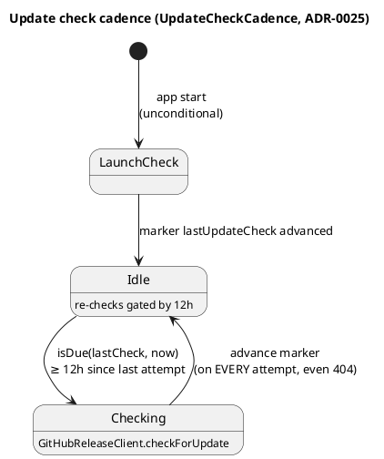
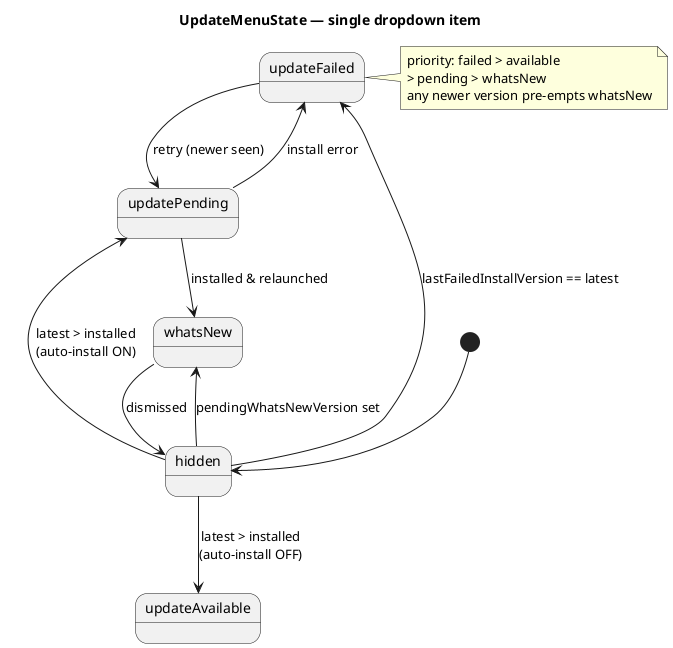

# Architecture — update system

The cross-cutting picture is in [overview.md](overview.md). Here — release checking,
auto-install, and the single update item in the dropdown. Decision chain: ADR-0025 (checking) →
ADR-0033 (installing) → ADR-0036 (signal UX). The first two are partially superseded by 0036 —
see [../../adr/README.md](../../adr/README.md).

## Update checking (ADR-0025)

The check goes through GitHub releases: anonymous HTTPS (`HTTPUpdateFetcher`) or a `gh` subprocess
(`GHReleaseFetcher`, while the repo is private — gated by `TOKENPACE_GH_AUTH`). SemVer comparison
is `SemanticVersion`; any parse error → no phantom update.

**Check cadence** — a fixed 12 hours plus an unconditional check at launch:




## The single dropdown update item (ADR-0036)

`UpdateMenuState` is a pure state machine for the **single** menu item (#130) that replaced the
`UpdateNotifier` banner (no `UserNotifications` at all). `evaluate(...)` → a semantic `Item` enum
per a priority table; any version newer than the installed one supersedes "what's new".




Color and text live in the view (`AppDelegate`, which reuses `PopupViewController.dotColor`: 🔴
`.majorOutage` for failed / 🔵 `.underMaintenance` for pending).

## The auto-install decision (ADR-0033)

`UpdateInstallPlan.decide(...)` is a single "install now?" verdict over an ordered set of gates.
Environment gates (space / power / metered) apply **only to installing**, not to the check path;
`.defer…` is re-evaluated on the next heartbeat, `.skip…` is settled.

**An explicit user request — "Update now" in Settings → About** (#221,
`AppDelegate.installUpdateNow`) goes through the same gates, but with `onACPower: true,
networkIsMetered: false`: the power and network gates are *courtesy* of a background process (not
burning metered traffic, not risking a mid-swap power loss), and an explicit click waives that
courtesy. The click also counts as opt-in for **this** installation (`autoInstallEnabled: true`),
otherwise the button would be dead exactly where it's needed most — when auto-install is off. The
free-space gate is **not** bypassed: no intent makes filling the disk safe. Why not through
`TOKENPACE_UPDATE_DRYRUN` — that flag conflates "bypass the gates" with "don't actually install";
only the first half is needed here, so `startInstall(…, forceRealInstall: true)` explicitly passes
`dryRunForced: false`.

```plantuml
@startuml
title Auto-install decision gates (UpdateInstallPlan.decide)
start
if (auto-install enabled?) then (no)
  :skip — auto-install-off; <<#FDE8E8>>
  stop
else (yes)
endif
if (newer than installed?) then (no)
  :skip — not-newer; <<#FDE8E8>>
  stop
else (yes)
endif
if (running as .app in /Applications?) then (no)
  :skip — not-app-bundle; <<#FDE8E8>>
  stop
else (yes)
endif
if (matching version-named .zip asset?) then (no)
  :skip — no-asset; <<#FDE8E8>>
  stop
else (yes)
endif
if (free space >= 5 GB after download?) then (no)
  :defer — insufficient-space; <<#FFF8E1>>
  stop
else (yes)
endif
if (on AC power?) then (no)
  :defer — on-battery; <<#FFF8E1>>
  stop
else (yes)
endif
if (network un-metered?) then (no)
  :defer — metered-network; <<#FFF8E1>>
  stop
else (yes)
endif
:install —\ndownload -> unzip -> verify\n-> replace -> relaunch; <<#E8F5E9>>
stop
@enduml
```


## Update system components

| Component | Responsibility |
|---|---|
| **SemanticVersion / UpdateComparison** | Pure SemVer parser (#37, `TokenPaceKit`, ADR-0025). `SemanticVersion(_:)` parses `vX.Y.Z`/`X.Y.Z` conservatively (exactly 3 numeric components; a `-beta`/`+meta` suffix is dropped), `Comparable`. `UpdateComparison.isNewer(tag:than:)` → `false` on any parse error (the contract is "never act on garbage") |
| **GitHubRelease / GitHubReleaseClient** | HTTP seam for the GitHub release (#37, ADR-0025). `GitHubRelease` (Decodable) parses `tag_name`/`html_url` + `assets[]` (forward-compat). `checkForUpdate(using:currentVersion:)` — fetch → decode → `isNewer`, returns a release only if newer, any error (including 404) → `nil`. Transport is abstracted as `UpdateFetcher` (not `UsageTransport`) because one path is a subprocess |
| **UpdateAssetSelector / UpdateInstallPlan** | Pure auto-install seams (#122, `TokenPaceKit`, ADR-0033). `selectZIP(from:)` picks the version-named `.zip` (`TokenPace-<X.Y.Z>.zip`), rejects non-HTTPS. `decide(...)` — ordered gates (opt-in → newer → real `.app` → asset → free space ≥5 GB → AC power → unmetered) → `.install` / `.skip…` / `.defer…`. Facts are injected from the shell |
| **UpdateDeferralReason** | The explanatory counterpart to `decide` (#221, `TokenPaceKit`). `UpdateInstallPlan.deferralReasons(...)` returns **all** active environment blockers (`onBattery` / `meteredNetwork` / `insufficientSpace`) in the stable `allCases` order, whereas `decide` stops at the first one — so the UI doesn't chase the user to fix one condition only to reveal the next. Settled-no cases (auto off / not newer / dev / no asset) → `[]`: there's no deferred install to explain there. `pendingExplanation(for:)` composes them into one sentence ("a", "a and b", "a, b and c") for the About-page ⚠ line |
| **UpdateCheckCadence** | Pure seam for the update-check frequency (#37, ADR-0025) — a fixed 12-hour interval (not tied to the usage cadence). The shell also checks **unconditionally at launch**; the `lastUpdateCheck` marker advances on **every** attempt (even a 404) |
| **UpdateMenuState** | Pure state machine for the **single** update item (#130, `TokenPaceKit`, ADR-0036). `evaluate(...)` → an `Item` enum (`hidden`/`updateFailed`/`updateAvailable`/`updatePending`/`whatsNew`) per a priority table. Color/text live in the view. **Replaced `UpdateNotifier`** (the banner was removed). ADR-0036 |
| **GHReleaseFetcher / ShellEnvironment** | The `gh`-subprocess conformer to `UpdateFetcher` (#37, ADR-0025) — `gh api repos/…/releases/latest`, 20 s timeout, stdout captured, environment inherited (`gh` needs the keyring). Selected when `TOKENPACE_GH_AUTH` is set, which is resolved by its own `AppDelegate.resolveGHAuth`: `ProcessInfo` → login-shell fallback via `ShellEnvironment` (`zsh -l -i`; `SMAppService` starts without a shell). `StubUpdateFetcher` — `TOKENPACE_FAKE_LATEST` |
| **UpdateInstaller** | A thin I/O shell for the auto-installer (#123, ADR-0033) behind the `AppUpdateInstalling` seam. Off-main pipeline: **download** (two paths: `gh release download` under `TOKENPACE_GH_AUTH` / anonymous `URLSession`) → **unzip** (`ditto -x -k`) → **verify** (`codesign --verify` + Team ID check via `codesign -dv` + Gatekeeper `spctl`) → **replace** (atomic `replaceItemAt` with backup) → **relaunch**. Fail-safe (never throws). `TOKENPACE_UPDATE_DRYRUN` stops after verify; `TOKENPACE_UPDATE_TARGET` redirects the replace to a test copy |
| **PowerSource / DiskSpace / NetworkMonitor.isMetered** | Shell facts about the environment for the defer gates (#123/#124, ADR-0033). `isOnACPower` — an IOKit read (fail-open → `true`). `availableBytes` — `volumeAvailableCapacityForImportantUsage`. `isMetered` — `path.isExpensive || path.isConstrained`. These gate **only installing**, never the check path |
