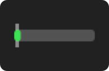
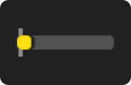
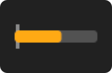
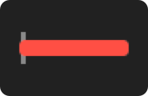
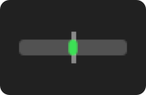
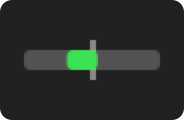
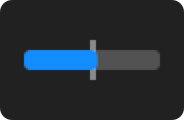
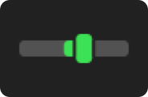

# Три стилі бару: що кожен каже і кому підходить

Ліміт підписки можна змарнувати двома протилежними способами: **спалити його зарано** — і стати
посеред задачі до ресету — або **не витратити вчасно** — і дати сплаченому вікну закритися з
невикористаним залишком. Смужка в menu bar існує, щоб жоден із цих двох не стався непомітно.

Різниця між стилями саме тут: **скільки з цих двох ризиків бар показує**. Pressure стежить лише за
першим, Gauge — за обома, Progress віддає сирі числа й лишає висновок тобі. **Колір при цьому
однаковий у всіх трьох** — стиль змінює тільки те, що ти зчитуєш із **довжини** смужки.

Стиль вибирається в **Settings → Appearance**, окремо для menu bar і для дропдауна: у барі можна
лишити найтихіший варіант, а в попапі, куди заглядаєш свідомо, — найдетальніший.

> Ілюстрації нижче — **знімки самого віджета**, а не його перемальовка: їх рендерить той самий
> `StatusItemView`, що малює бар у меню-барі, тим самим кодом, що й прев'ю в Settings. Стан кожної
> задано числами (скільки вікна минуло, скільки витрачено), а колір і геометрію обчислює модель —
> тож картинка не може показати того, чого застосунок не намалював би. Перегенерувати:
> `TOKENPACE_EXPORT_DOC_IMAGES=docs/assets/bar-styles swift run TokenPace`.

---

## Pressure — «чи час гальмувати?»

Смужка від лівого краю. Вона з'являється **тільки тоді, коли витрачаєш швидше за рівномірний
темп**, і що вона довша, то гостріша ситуація.

| | |
|---|---|
|  | **Крапка.** Ідеш урівень або повільніше за норму. Робити нічого не треба. |
|  | **Коротка жовта.** Трохи попереду норми. Ще не проблема, але темп вище лінійного. |
|  | **Довга помаранчева.** Такими темпами ліміт скінчиться помітно раніше за вікно. |
|  | **Повний червоний.** Ліміт вичерпано; лишається дочекатися ресету. |

**Головна властивість — він мовчить, поки нема про що казати.** Увесь спокійний бік — і «рівно за
планом», і «сильно недовитрачаю» — виглядає однаково: крапкою. Це свідомо: поки ти в межах норми,
дія одна («працюй далі»), і її вже несе колір.

**Кому підходить:** тим, кого турбує **тільки** ризик спалити ліміт зарано, і хто не хоче, щоб
віджет привертав увагу без причини. Це дефолт пресету **Chill**.

**Чого він не показує:** другу половину задачі — **невитрачену квоту**. Той, хто спалив 10 % за
пів вікна, і той, хто йде рівно за планом, бачать однакову крапку, хоча в першого лишається
чималий запас, який до ресету згорить. Для цього є Gauge.

---

## Gauge — «чи час гальмувати?» плюс «скільки я не встигну витратити?»

Нуль посередині. Смужка росте **вправо**, коли палиш швидше за норму, і **вліво**, коли
недовитрачаєш. Права половина каже те саме, що Pressure; ліва додає те, чого не показує жоден
інший стиль.

| | |
|---|---|
|  | **Крапка по центру.** Рівно за планом. |
|  | **Коротка вліво.** Є запас — але такий, що витратиш без поспіху (тут: половина вікна минула, витрачено 30 %). |
|  | **Ліва половина повна, і синя.** Запасу більше, ніж часу, у який його можна витратити (тут: минуло 80 % вікна, витрачено 30 %). Хоч би що ти робив, частина квоти згорить невикористаною. |
|  | **Довга вправо.** Те саме попередження, що й у Pressure. |

**Ліва половина — це сигнал до дії, а не просто інформація.** Заповнена ліва половина означає:
у тебе більше квоти, ніж часу до ресету. Це привід узятися за те, що відкладав, — великий
рефакторинг, довгий аналіз, щось, на що «шкода лімітів». Інакше ця квота просто згорить.

**Кому підходить:** тим, кому потрібні **обидві** відповіді на одному барі — і «чи час гальмувати»,
і «чи не лишаю я сплачене невикористаним». Права половина каже те саме, що сказав би Pressure, тож
нічого не втрачається; ліва додає те, чого не показує жоден інший стиль. Це дефолт пресету
**Work harder!** — і фабричний дефолт застосунку.

**Ціна:** половина бару віддана під напрямок, тож на кожен бік лишається вдвічі менше місця.
І бік доводиться читати окремо від довжини: однакова смужка вліво й вправо означає протилежне.

---

## Progress — «де я по часу і де по витратах»

Єдиний стиль із **маркером часу** — вертикальною позначкою «ти тут». Кольоровий проміжок
показує розрив між тим, скільки минуло часу, і тим, скільки витрачено ліміту.

| | |
|---|---|
|  | **Маркер справа від смужки.** Витрачено менше, ніж минуло часу — ти позаду норми. |
|  | **Маркер зліва від смужки.** Витрачено більше, ніж минуло часу — попереду норми. |

**Це єдиний стиль, який читається без урахування часу до ресету.** Шкала стала: увесь бар — це
вікно цілком, тож «минуло 60 %» видно прямо, о будь-якій годині. Два інші стилі міряють проти
**часу, що лишився**, тож та сама смужка о 10:00 і о 14:00 означає різні абсолютні величини.

**Кому підходить:** тим, хто хоче бачити обидві величини, а не вердикт про них. Це дефолт пресету
**Control freak**.

**Ціна:** найбільше елементів на найменшій площі, і ширина проміжку сама по собі не впорядкована
за гостротою — найгостріший стан може намалювати найвужчу мітку. Судити треба за позиціями, не за
шириною.

---

## Як вибрати

Підписка псується двома різними способами, і це **дві окремі потреби**, а не одна:

- **не спалити ліміт зарано** — інакше робота стане посеред задачі, і доведеться чекати ресету;
- **не лишити квоту невикористаною** — сплачене вікно закривається, і невитрачене просто згорає.

Стилі різняться саме тим, скільки з цих двох вони показують:

| Що мені треба бачити | Стиль |
|---|---|
| **Тільки коли палю зашвидко.** Решту часу хай мовчить — попереджай, лише коли є про що | **Pressure** |
| **Обидва боки одразу** — і що палю зашвидко, і що не встигаю витратити | **Gauge** |
| **Самі числа** — де я по часу, де по витратах — а вердикт зроблю сам | **Progress** |

**Pressure не «тихіший Gauge», а вужчий за задачею.** Він відповідає рівно на одне питання — чи
час гальмувати, — і тому мовчить, коли відповідь «ні». Друга потреба, невитрачена квота, у ньому
не видима взагалі: той, хто спалив 10 % за пів вікна, і той, хто йде рівно за планом, бачать
однакову крапку.

**Gauge покриває обидві потреби на одному барі** — праворуч тиск, ліворуч запас. Платить за це
місцем: половина бару йде під напрямок, тож на кожен бік лишається вдвічі менша роздільність, і
бік доводиться читати окремо від довжини.

Найпоширеніша пара — **Gauge в menu bar** (обидва боки з погляду) і **Progress у дропдауні** (де є
місце на деталі). Але будь-яке з дев'яти поєднань доступне.

## Що спільне в усіх трьох

- **Колір означає те саме скрізь.** Синій — сильно недовитрачаєш, зелений — у нормі, жовтий —
  трохи попереду, помаранчевий — помітно попереду, червоний — ліміт вичерпано. Стиль на це не
  впливає взагалі.
- **Порожній бар — це не помилка.** У Pressure і Gauge спокійний стан малює крапку; так і має
  бути.
- **Дуже мале відхилення теж малює крапку.** Смужка вужча за саму крапку не малюється — вона
  округлюється до неї, інакше на 34-пунктовому барі це була б волосина, яку однаково не видно.
  Тому «зовсім трохи попереду» і «рівно за планом» на око однакові; щойно відхилення стає
  помітним, з'являється й смужка.
- **Бар «Extra usage»** (кредити понад ліміт) завжди малюється як Progress, хоч який стиль
  вибрано: у місяця свої межі, і замість засічок він підписує краї (`Aug 1` / `Aug 31`).
- **Абсолютного відсотка немає ніде** — ані «88 %», ані «12 % лишилось». Чому саме так —
  [як читати menu bar](menu-bar-signals.md).

## Пов'язані документи

- [Як читати menu bar](menu-bar-signals.md) — число vs смужки, кольори, іконки
- [Кому й навіщо](users-and-goals.md) — які сигнали ми вважаємо корисними і чому
- [ADR-0079](../adr/0079-centred-zero-gauge-scale.md) — чому Gauge малює недовитратний бік
- [ADR-0101](../adr/0101-pressure-is-the-gauge-ahead-half.md) — чому Pressure є рівно правою
  половиною Gauge
