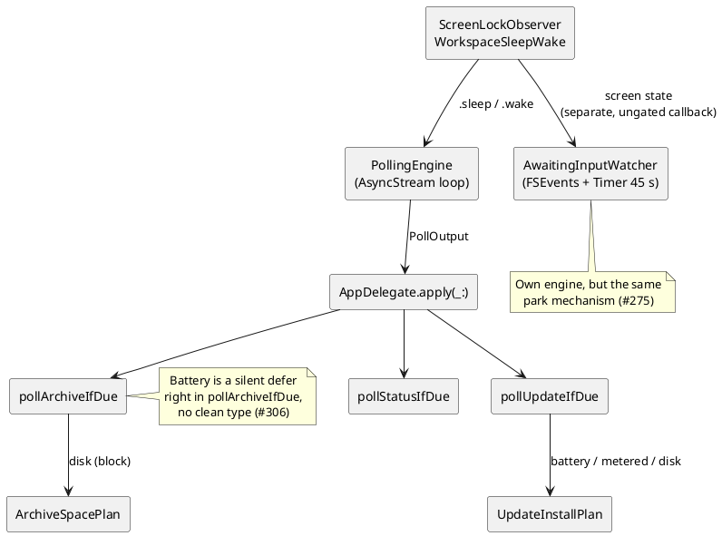

# Performance — periodic-task gates

TokenPace runs five periodic tasks. This document is one summary table: **exactly what stops, slows
down, or plain doesn't notice each of them**. It answers "does the app wake up on a locked Mac,"
"will it eat bandwidth on a metered connection," "will it drain the battery" — without reading five
different files.

This is a reference to the **actual state of the code**, not the intent. Where the code diverges from
the design docs, that's called out explicitly.

Related documents: cadences and data flow — [architecture/data-flow.md](architecture/data-flow.md);
the update system — [architecture/update-system.md](architecture/update-system.md); service status
and the archiver — [architecture/services-and-config.md](architecture/services-and-config.md).

## Summary table

| Gate | Usage API | Service statuses | Awaiting-input | Backup | Auto-install updates |
|---|---|---|---|---|---|
| **Screen lock / screensaver / display sleep** | ✅ full stop, gated by `pausePollingWhenScreenLocked` (default on) | ✅ indirect | ✅ **unconditional** — the stream and the timer are torn down ([#275](https://github.com/artem-from-ua/tokenpace/issues/275)) | ✅ indirect | ✅ indirect |
| **System sleep / wake** | ✅ unconditional | ✅ indirect | ✅ unconditional (backstop behind the screen gate) | ✅ indirect | ✅ indirect |
| **On-battery** | ❌ | ❌ | ❌ | ✅ **defer** until plugged in ([#306](https://github.com/artem-from-ua/tokenpace/issues/306)) | ✅ **defer** until plugged in |
| **Low Power Mode** | ❌ | ❌ | ❌ | ❌ | ❌ |
| **Metered network** | ❌ | ❌ | ❌ (doesn't touch the network) | ❌ (writes locally) | ✅ **defer** until an unmetered connection |
| **Free disk space** | ❌ | ❌ | ❌ | ✅ **block** with a warning if less than 5 GB would remain after copying ([#306](https://github.com/artem-from-ua/tokenpace/issues/306)) | ✅ **defer** if less than 5 GB would remain after downloading |
| **claude CLI running** | ✅ as cadence: 180 s → 15 min | ✅ indirect (stretches along with it) | ❌ **deliberately** (#275) — with no `claude` in the process tree nothing is writing, so FSEvents is already silent; instead of a gate, the scanner filters out dead sessions by pid | ❌ | ❌ |
| **429 / `Retry-After`** | ✅ hold until the given time | ✅ indirect + its own 5-minute floor | n/a | n/a | n/a |
| **Feature toggle** | n/a (always on) | n/a | `awaitingInputEnabled` (default **off**) | `archiveEnabled` + a set `archiveDestination` | `automaticUpdateChecks` + `installUpdatesAutomatically` (both default **on**, opt-out) |
| **Own cadence** | 180 s; 15 min when `claude` isn't running; 60 s floor | `max(5 min, usageInterval)`; 60 s floor on trouble | FSEvents 0.75 s + 45 s safety timer | once per 24 h | check once per 12 h |

Legend: ✅ — the gate is active; ✅ indirect — no timer of its own, the task inherits the pause from
the usage cycle; ❌ — no gate in the code; **defer** — not a skip but a postponement to the next
heartbeat, once conditions improve; **block** — the same postponement, but the user **is shown the
reason** (the condition won't clear on its own).

## Why half the columns say "indirect"

Only two tasks have their own engine: the usage poll (the `AsyncStream` loop) and awaiting-input
(FSEvents + `Timer`). The other three — statuses, backup, update checks — **have no timers of their
own**. They hang off the usage heartbeat: every successful `apply(_:)` tick asks them in turn "is it
time?"

Consequence: everything that parks the usage cycle automatically parks three more tasks. And the
reverse — if statuses or the archiver were ever detached onto their own timer, every park gate they
currently inherit for free would disappear along with it.

**Awaiting-input has its own triggers, but the same park mechanism** (#275). It doesn't depend on the
usage heartbeat — FSEvents and a 45-second safety timer wake it — yet screen state tears down both
the stream and the timer. It's wired up not through `.sleep`/`.wake` (that signal is itself gated by
the `pausePollingWhenScreenLocked` option), but through a separate **ungated** `ScreenLockObserver`
callback, so the pause applies regardless of that checkbox. Details —
[awaiting-input-refresh.md](../design/awaiting-input-refresh.md).

## Gates one by one

### Screen lock / screensaver / display sleep

`ScreenLockObserver` ([`PollingShell.swift:105-170`](../../Sources/TokenPace/PollingShell.swift))
listens for three pairs of events: `com.apple.screenIsLocked` / `screenIsUnlocked`,
`screensaver.didstart` / `willstop`, `NSWorkspace.screensDidSleep` / `screensDidWake`. Any of them
emits `.sleep` or `.wake` on `SignalHub`; the loop goes into `waitWhileAsleep()` on `.sleep` — no
network request at all.

Gated by the `pausePollingWhenScreenLocked` option (default **on**), which is read **at the moment of
the event**, not cached — so the toggle in Settings → General takes effect immediately. See
[ADR-0032](../adr/0032-simplified-polling-cadence.md), decision D5.

### System sleep / wake

`WorkspaceSleepWake` ([`PollingShell.swift:54-80`](../../Sources/TokenPace/PollingShell.swift)) — the
same park path, but **unconditional**: the option doesn't disable it. The logic is simple: while the
machine is asleep, there's no network either way.

Waking up **doesn't guarantee an immediate poll**. `wakeRearmInterval` only fetches if the cache has
gone stale (a full interval has passed since the last success) — otherwise a short sleep doesn't
trigger an extra request.

### On-battery, metered network, free disk space

The gates on environment conditions belong to **auto-install updates** (all three) and **backup**
(two of the three — battery and free space; it doesn't touch the network, since it writes locally).

#### Updates

Three gates live in the pure
[`UpdateInstallPlan.decide`](../../Sources/TokenPaceKit/UpdateInstallPlan.swift) and apply in this
order (the first one triggered wins):

1. free space — at least 5 GB must remain after downloading, otherwise `deferInsufficientSpace`;
2. AC power — on battery, `deferOnBattery`;
3. unmetered network — on a metered connection, `deferMeteredNetwork`.

The order is deliberate: a full disk is the hardest physical blocker, so there's no point deferring
"until plugged in" if the download won't fit anyway.

This is **defer, not skip**: the state isn't persisted, the decision is re-evaluated on every
heartbeat, so the update installs the moment conditions improve. The reason is shown to the user in
the sentence "Update pending because …" — and **all** closed gates at once, not just the first one,
so the user isn't sent to turn on power first and then discover the metered network separately.

Sources of truth: `PowerSource.isOnACPower` (IOKit,
[`SystemConditions.swift:19`](../../Sources/TokenPace/SystemConditions.swift)),
`NetworkMonitor.isMetered` (`NWPath.isExpensive || isConstrained`,
[`PollingShell.swift:191-204`](../../Sources/TokenPace/PollingShell.swift)),
`DiskSpace.availableBytes` (`volumeAvailableCapacityForImportantUsage`).

**Important:** these two monitors live in the polling layer, but polling itself is **not** gated by
them — they only feed the installer's decision. A comment in the code states this directly: "Used
only to *defer* an auto-install download onto an unmetered link, never to gate…"

A manual "Install now" bypasses power/metered (the user asked explicitly), but **not** free space —
no amount of intent makes filling up the disk safe.

#### Backup ([#306](https://github.com/artem-from-ua/tokenpace/issues/306))

Two gates with different semantics — and that's the main thing worth knowing about them.

**Battery is a silent defer.** `guard PowerSource.isOnACPower` in `pollArchiveIfDue`
([`App.swift`](../../Sources/TokenPace/App.swift)), **after** the cadence check: otherwise an
unplugged Mac would write to the log on every poll (180 s), not only when a sync was actually due.
The `lastArchiveSync` marker doesn't move, the state isn't persisted — the moment the cord is back,
the next heartbeat syncs on its own. The reasoning is the same as for updates, only stronger: an
update downloads ~10 MB, while the first archive sync copies the **entire** sessions folder (hundreds
of MB or more).

**Free space is a block with a warning.** Lives in the pure
[`ArchiveSpacePlan.verdict`](../../Sources/TokenPaceKit/ArchiveSpacePlan.swift): if less than 5 GB
would remain after copying (the same threshold as
`UpdateInstallPlan.minFreeBytesAfterDownload` — one promise instead of two numbers),
`LogArchiver.sync` throws `insufficientSpace` **before writing anything**. Unlike the battery case,
this isn't silent: a full disk won't resolve itself, so a warning line appears in Settings.

For the gate to judge the **whole run**, `sync` first scans all three roots into a combined plan and
only then weighs it — otherwise it could copy two roots and fail on the third, leaving the archive
half-updated. A plan for **zero** bytes always passes: nothing to copy means nothing to fill the disk
with.

Free space is measured **on the destination volume** (`forVolumeContaining:` of the archive folder),
not the system one: the archive is usually on an external disk. An unreadable volume reads as `.max`
— fail-open, same as `?? .max` in updates: a diagnostic failure shouldn't disable backup forever.

A manual "Archive Now" bypasses **battery** (the user asked explicitly), but **not** space — the same
limit as in updates.

### Claude Code active

`TranscriptActivityProbe` ([`TranscriptActivity.swift`](../../Sources/TokenPaceKit/TranscriptActivity.swift),
ADR-0117) checks whether anything under `history.jsonl`, `jobs/` or `projects/` in the Claude Code
home was written in the last 5 minutes. Nothing recent → the usage cadence becomes 15 min instead of
180 s. Metadata only — the walk never opens a file — and it stops at the first fresh root, so the
active case costs ~0.01 ms; an idle machine pays a full walk (~74 ms) once per 15-minute interval. This is **not a stop**: limits keep
ticking regardless of whether you're actively working, so data still updates, just less often.

### 429 / `Retry-After`

The server asked us to wait — we wait exactly that long, with no escalation of our own. A manual
refresh clears the hold. The status poll is protected by its own separate 5-minute floor, so
429-thrash on usage doesn't hit the third-party status page.

## Missing gates

Deliberately absent, or not yet implemented, in any of the five tasks:

- **Low Power Mode** — `ProcessInfo.isLowPowerModeEnabled` is entirely absent from the code. The most
  obvious candidate: in this mode the user is explicitly asking to save power, and a usage poll every
  3 min is a noticeable constant background presence.
- **Thermal pressure** — `ProcessInfo.thermalState` isn't used.
- **User-idle (HID)** — time without input isn't measured anywhere. The only proxy for "user isn't
  there" is screen state (and, for the usage-poll cadence, whether a `claude` process exists).
- **On-battery / metered for polling** — the data is already collected (see above), but isn't wired
  into the cadence. A cheap lever if bandwidth economy on a metered connection ever becomes a
  question.

## Where the code diverges from the docs

Minor: the docstring on [`UpdateInstallPlan`](../../Sources/TokenPaceKit/UpdateInstallPlan.swift)
calls `autoInstallEnabled` "default-OFF via `PersistedConfig`," even though the
`installUpdatesAutomatically` key is actually read as `?? true` — i.e., **opt-out**, not opt-in. The
comment is stale; the behavior is correct, only the description is wrong.
