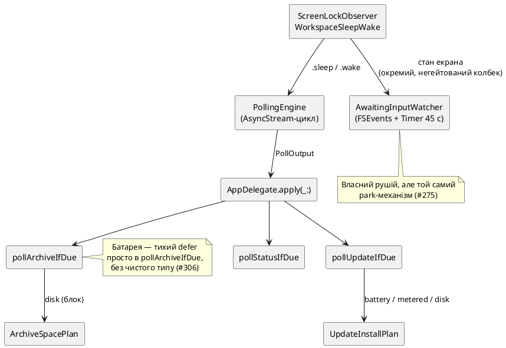

# Performance — гейти періодичних завдань

TokenPace крутить п'ять періодичних завдань. Цей документ — одна зведена таблиця: **що саме кожне з
них зупиняє, сповільнює або взагалі не помічає**. Він відповідає на питання «чи прокидається
застосунок на замкненому Mac», «чи зжере він трафік на роздачі», «чи розрядить батарею» — без читання
п'яти різних файлів.

Це довідка про **фактичний стан коду**, не про задум. Де код розходиться з проєктним документом, це
позначено явно.

Суміжні документи: каденції й потік даних — [architecture/data-flow.md](architecture/data-flow.md);
система оновлень — [architecture/update-system.md](architecture/update-system.md); статус сервісів
і архіватор — [architecture/services-and-config.md](architecture/services-and-config.md).

## Зведена таблиця

| Гейт | Usage API | Статуси сервісів | Awaiting-input | Резервне копіювання | Авто-інсталяція оновлень |
|---|---|---|---|---|---|
| **Screen lock / скрінсейвер / display sleep** | ✅ повна зупинка, gated `pausePollingWhenScreenLocked` (default on) | ✅ непрямо | ✅ **безумовно** — стрім і таймер знімаються ([#275](https://github.com/artem-from-ua/tokenpace/issues/275)) | ✅ непрямо | ✅ непрямо |
| **System sleep / wake** | ✅ безумовно | ✅ непрямо | ✅ безумовно (backstop за екранним гейтом) | ✅ непрямо | ✅ непрямо |
| **On-battery** | ❌ | ❌ | ❌ | ✅ **defer** до підключення до мережі ([#306](https://github.com/artem-from-ua/tokenpace/issues/306)) | ✅ **defer** до підключення до мережі |
| **Low Power Mode** | ❌ | ❌ | ❌ | ❌ | ❌ |
| **Metered network** | ❌ | ❌ | ❌ (мережі не торкається) | ❌ (пише локально) | ✅ **defer** до безлімітного зʼєднання |
| **Вільне місце на диску** | ❌ | ❌ | ❌ | ✅ **блок** із попередженням, якщо після копіювання лишиться < 5 ГБ ([#306](https://github.com/artem-from-ua/tokenpace/issues/306)) | ✅ **defer**, якщо після завантаження лишиться < 5 ГБ |
| **claude CLI running** | ✅ як каденція: 180 с → 15 хв | ✅ непрямо (розтягується разом) | ❌ **свідомо** (#275) — без `claude` у деревах ніхто не пише, FSEvents і так мовчить; замість гейта сканер відсіює мертві сесії за pid | ❌ | ❌ |
| **429 / `Retry-After`** | ✅ hold до вказаного часу | ✅ непрямо + власний floor 5 хв | н/д | н/д | н/д |
| **Feature toggle** | н/д (завжди ввімкнено) | н/д | `awaitingInputEnabled` (default **off**) | `archiveEnabled` + заданий `archiveDestination` | `automaticUpdateChecks` + `installUpdatesAutomatically` (обидва default **on**, opt-out) |
| **Власна каденція** | 180 с; 15 хв коли `claude` не запущено; floor 60 с | `max(5 хв, usageInterval)`; при проблемі floor 60 с | FSEvents 0.75 с + safety timer 45 с | раз на 24 год | перевірка раз на 12 год |

Позначки: ✅ — гейт діє; ✅ непрямо — власного таймера немає, завдання успадковує паузу від
usage-циклу; ❌ — гейт відсутній у коді; **defer** — не пропуск, а відкладення до наступного
heartbeat, коли умови покращаться; **блок** — те саме відкладення, але користувачеві **показують
причину** (умова сама не мине).

## Чому половина колонок каже «непрямо»

Лише два завдання мають власний рушій: usage-полл (`AsyncStream`-цикл) і awaiting-input (FSEvents +
`Timer`). Решта три — статуси, резервне копіювання, перевірка оновлень — **не мають своїх таймерів**.
Вони висять на usage-heartbeat: кожен успішний тік `apply(_:)` по черзі питає їх «чи час?».

Наслідок: усе, що паркує usage-цикл, автоматично паркує ще три завдання. І навпаки — якщо колись
відвʼязати статуси або архіватор у власний таймер, разом зникнуть усі park-гейти, які вони зараз
успадковують безкоштовно.

**Awaiting-input має власні тригери, але той самий park-механізм** (#275). Він не залежить від
usage-heartbeat — його будять FSEvents і 45-секундний safety-таймер — проте стан екрана знімає і
стрім, і таймер. Підключений він не через `.sleep`/`.wake` (той сигнал сам гейтований опцією
`pausePollingWhenScreenLocked`), а через окремий **негейтований** колбек `ScreenLockObserver`, тож
пауза діє незалежно від того чекбокса. Деталі — [awaiting-input-refresh.md](../design/awaiting-input-refresh.md).

## Гейти по одному

### Screen lock / скрінсейвер / display sleep

`ScreenLockObserver` ([`PollingShell.swift:105-170`](../../Sources/TokenPace/PollingShell.swift))
слухає три пари подій: `com.apple.screenIsLocked` / `screenIsUnlocked`, `screensaver.didstart` /
`willstop`, `NSWorkspace.screensDidSleep` / `screensDidWake`. Будь-яка з них емітить `.sleep` або
`.wake` у `SignalHub`; цикл на `.sleep` іде в `waitWhileAsleep()` — жодного мережевого запиту.

Gated опцією `pausePollingWhenScreenLocked` (default **on**), яка читається **у мить події**, не
кешується — тож перемикач у Settings → General діє негайно. Див. [ADR-0032](../adr/0032-simplified-polling-cadence.md), рішення D5.

### System sleep / wake

`WorkspaceSleepWake` ([`PollingShell.swift:54-80`](../../Sources/TokenPace/PollingShell.swift)) —
той самий park-шлях, але **безумовний**: опція його не вимикає. Логіка проста: під час сну машини
мережі однаково немає.

Прокидання **не гарантує негайний полл**. `wakeRearmInterval` фетчить лише якщо кеш устиг застаріти
(минув повний інтервал з останнього успіху) — інакше короткий сон не спричиняє зайвий запит.

### On-battery, metered network, вільне місце

Гейти середовища має **авто-інсталяція оновлень** (усі три) і **резервне копіювання** (два з трьох —
батарея й вільне місце; мережі воно не торкається, бо пише локально).

#### Оновлення

Три гейти живуть у чистому
[`UpdateInstallPlan.decide`](../../Sources/TokenPaceKit/UpdateInstallPlan.swift) і застосовуються в
такому порядку (перший спрацьований виграє):

1. вільне місце — після завантаження має лишитись ≥ 5 ГБ, інакше `deferInsufficientSpace`;
2. AC power — на батареї `deferOnBattery`;
3. безлімітна мережа — на metered-зʼєднанні `deferMeteredNetwork`.

Порядок навмисний: повний диск — найтвердіший фізичний блокер, немає сенсу відкладати «до розетки»,
якщо завантаження однаково не влізе.

Це **defer, не skip**: стан не персиститься, рішення переоцінюється на кожному heartbeat, тож
оновлення встановиться саме щойно умови покращаться. Користувачу причина показується реченням
«Update pending because …» — і одразу **всі** закриті гейти, а не лише перший, щоб людину не посилали
спершу ввімкнути живлення, а потім окремо виявляти metered-мережу.

Джерела фактів: `PowerSource.isOnACPower` (IOKit,
[`SystemConditions.swift:19`](../../Sources/TokenPace/SystemConditions.swift)),
`NetworkMonitor.isMetered` (`NWPath.isExpensive || isConstrained`,
[`PollingShell.swift:191-204`](../../Sources/TokenPace/PollingShell.swift)),
`DiskSpace.availableBytes` (`volumeAvailableCapacityForImportantUsage`).

**Важливо:** ці два монітори живуть у polling-шарі, але поллінг ними **не** гейтиться — вони лише
живлять рішення інсталятора. Коментар у коді фіксує це прямо: «Used only to *defer* an auto-install
download onto an unmetered link, never to gate…».

Ручний «Install now» обходить power/metered (користувач попросив явно), але **не** free-space —
жоден намір не робить безпечним заповнення диска.

#### Резервне копіювання ([#306](https://github.com/artem-from-ua/tokenpace/issues/306))

Два гейти з різною семантикою — і це головне, що варто про них знати.

**Батарея — тихий defer.** `guard PowerSource.isOnACPower` у `pollArchiveIfDue`
([`App.swift`](../../Sources/TokenPace/App.swift)), **після** перевірки каденції: інакше відʼєднаний
Mac писав би в лог щополу (180 с), а не лише коли синк реально настав. Маркер `lastArchiveSync` не
рухається, стан не персиститься — щойно шнур на місці, наступний heartbeat синкає сам. Обґрунтування
те саме, що й для оновлень, лише сильніше: оновлення качає ~10 МБ, а перший синк архіву копіює **всю**
теку сесій (сотні МБ і більше).

**Вільне місце — блок із попередженням.** Живе в чистому
[`ArchiveSpacePlan.verdict`](../../Sources/TokenPaceKit/ArchiveSpacePlan.swift): якщо після копіювання
лишиться < 5 ГБ (той самий поріг, що й `UpdateInstallPlan.minFreeBytesAfterDownload` — одна обіцянка
замість двох чисел), `LogArchiver.sync` кидає `insufficientSpace` **до того, як щось записати**. На
відміну від батареї це не тихо: повний диск сам не розсмокчеться, тож у Settings зʼявляється ⚠-рядок.

Щоб гейт судив **прогін цілком**, `sync` спершу сканує всі три корені в сукупний план і аж тоді
важить — інакше він міг би скопіювати два корені й відмовити на третьому, лишивши архів
напівоновленим. План на **нуль** байтів завжди проходить: нічого копіювати — нічим і заповнити диск.

Вільне місце міряється **на томі призначення** (`forVolumeContaining:` архівної теки), а не на
системному: архів зазвичай на зовнішньому диску. Нечитабельний том читається як `.max` — fail-open,
як `?? .max` в оновленнях: збій діагностики не має вимикати бекап назавжди.

Ручний «Archive Now» обходить **батарею** (користувач попросив явно), але **не** місце — та сама межа,
що й в оновленнях.

### claude CLI running

`ProcessClaudeActivityProbe` ([`PollingShell.swift:237-271`](../../Sources/TokenPace/PollingShell.swift))
через `sysctl(KERN_PROC_ALL)` шукає процес з точним іменем `claude` (CLI, не Desktop). Немає
процесу → usage-каденція 15 хв замість 180 с. Це **не зупинка**: ліміти тікають незалежно від того,
чи ти зараз працюєш, тож дані все одно оновлюються, просто рідше.

### 429 / `Retry-After`

Сервер попросив зачекати — чекаємо рівно стільки, без власної ескалації. Ручний refresh скидає hold.
Статус-полл захищений окремим floor'ом 5 хв, тож 429-thrash на usage не б'є сторонню status-сторінку.

## Відсутні гейти

Свідомо або поки що не реалізовані — жодним із пʼяти завдань:

- **Low Power Mode** — `ProcessInfo.isLowPowerModeEnabled` у коді відсутній повністю. Найочевидніший
  кандидат: у цьому режимі користувач прямо просить економити, а usage-полл кожні 3 хв — помітний
  постійний фон.
- **Thermal pressure** — `ProcessInfo.thermalState` не використовується.
- **User-idle (HID)** — часу без вводу ніде не міряємо. Єдиний проксі «користувача немає» — стан
  екрана (і, для каденції usage-полла, наявність процесу `claude`).
- **On-battery / metered для поллінгу** — дані вже зібрані (див. вище), але до каденції не
  підключені. Дешевий важіль, якщо колись постане питання економії трафіку на роздачі.

## Розходження коду з документацією

Дрібніше: docstring [`UpdateInstallPlan`](../../Sources/TokenPaceKit/UpdateInstallPlan.swift) називає
`autoInstallEnabled` «default-OFF via `PersistedConfig`», хоча фактично ключ
`installUpdatesAutomatically` читається як `?? true` — тобто **opt-out**, а не opt-in. Коментар
застарів; поведінка правильна, помилковий лише опис.
